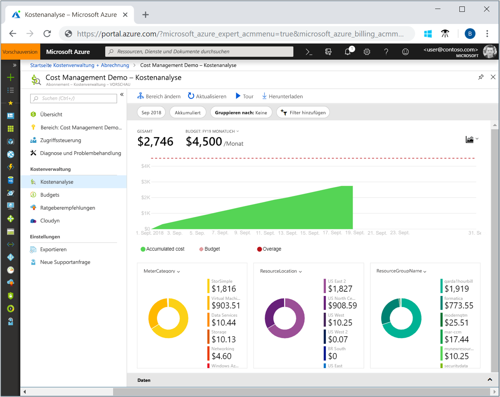
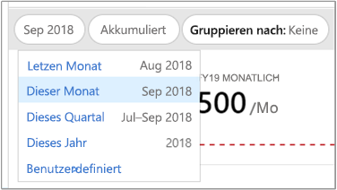
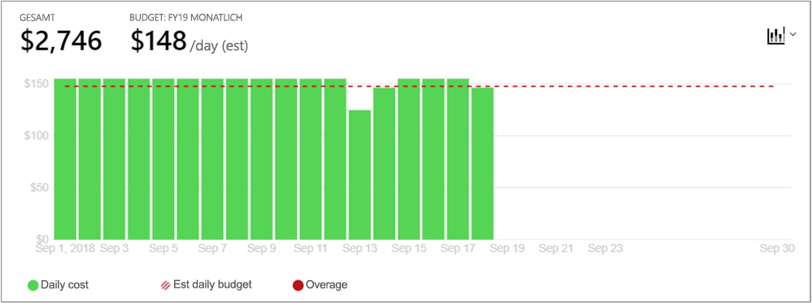
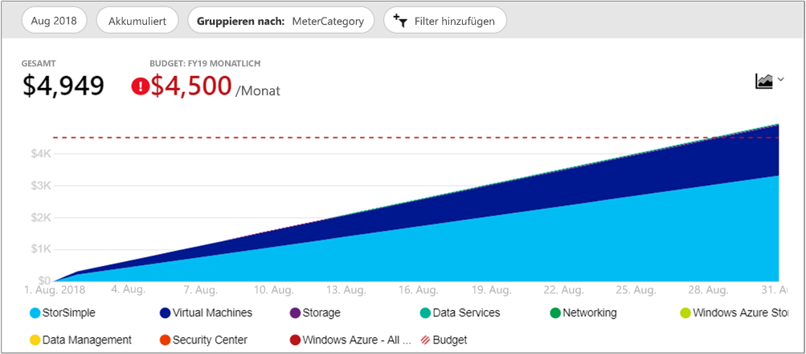
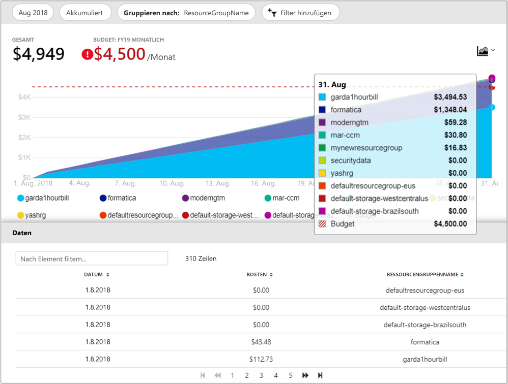

# Schnellstart: Ermitteln und Analysieren von Kosten mit der Kostenanalyse

Voraussetzung für die Kontrolle und Optimierung von Azure-Kosten sind Kenntnisse über die Kostenstellen in Ihrer Organisation. Außerdem sollte bekannt sein, wie hoch die Kosten für Ihre Dienste sind und für welche Umgebungen und Systeme diese Aufwendungen genutzt werden. Der Überblick über sämtliche Kosten ist entscheidend, um Ausgabestrukturen Ihrer Organisation genau nachvollziehen zu können. Ausgabestrukturen können verwendet werden, um Kontrollmechanismen wie Budgets zu erzwingen.

In diesem Schnellstart ermitteln Sie mithilfe der Kostenanalyse Azure-Kosten, die für Ihre Organisation anfallen, und analysieren diese. Durch die Anzeige aggregierter Kosten nach Organisationen können Sie ermitteln, wo Kosten im Zeitverlauf anfallen, und Ausgabentrends nachvollziehen. Mithilfe der akkumulierten Kosten können Sie unter Berücksichtigung von Budgets Kostenschätzungen für monatliche, vierteljährliche oder jährliche Zeiträume erstellen. Ein Budget trägt zur Einhaltung finanzieller Vorgaben bei. Mithilfe eines Budgets können Sie zudem die täglichen oder monatlichen Kosten anzeigen, um Ausgabenunregelmäßigkeiten zu vermeiden. Des Weiteren können Sie die Daten des aktuellen Berichts herunterladen, um diese noch genauer zu analysieren oder sie in externen Systemen zu verwenden.

In dieser Schnellstartanleitung wird Folgendes vermittelt:

- Überprüfen von Kosten mithilfe der Kostenanalyse
- Anpassen von Kostenansichten
- Herunterladen von Kostenanalysedaten

## Voraussetzungen

Die Kostenanalyse unterstützt verschiedene Arten von Azure-Kontotypen. Die vollständige Liste der unterstützten Kontotypen finden Sie unter [Grundlegendes zu Cost Management-Daten](understand-cost-mgt-data.md). Um Kostendaten anzeigen zu können, müssen Sie mindestens über Lesezugriff auf Ihr Azure-Konto verfügen.

Bei [EA](https://azure.microsoft.com/pricing/enterprise-agreement/)-Kunden (Enterprise Agreement) benötigen Sie mindestens Lesezugriff auf einen oder mehrere der folgenden Bereiche, um Kostendaten anzeigen zu können.

- Abrechnungskonto
- Department
- Registrierungskonto
- Verwaltungsgruppe
- Abonnement
- Ressourcengruppe

Weitere Informationen zum Zuweisen des Zugriffs auf Cost Management-Daten finden Sie unter [Assign access to Cost Management data](assign-access-acm-data.md) (Zuweisen des Zugriffs auf Cost Management-Daten).

## Anmelden bei Azure

- Melden Sie sich unter https://portal.azure.com beim Azure-Portal an.

## Überprüfen von Kosten mithilfe der Kostenanalyse

Um Ihre Kosten in der Kostenanalyse zu überprüfen, öffnen Sie den Bereich im Azure-Portal und wählen Sie im Menü **Kostenanalyse** aus. Navigieren Sie beispielsweise zu **Abonnements**, und wählen Sie dann ein Abonnement in der Liste und **Kostenanalyse** im Menü aus. Verwenden Sie **Bereich**, um in einen anderen Bereich der Kostenanalyse zu wechseln. Weitere Informationen zu Bereichen finden Sie unter [Verstehen von und Arbeiten mit Bereichen](understand-work-scopes.md).

Der von Ihnen ausgewählte Bereich wird in der gesamten Kostenverwaltung verwendet, um Daten zu konsolidieren und den Zugriff auf Kosteninformationen zu steuern. Wenn Sie Bereiche verwenden, wählen Sie diese nicht mehrfach aus. Wählen Sie stattdessen einen größeren Bereich aus, in dem andere zusammengefasst werden, und filtern Sie diesen dann bis zu den benötigten verschachtelten Bereichen. Es ist wichtig, dieses Vorgehen zu verstehen, da möglicherweise nicht alle Benutzer Zugriff auf einen einzelnen übergeordneten Bereich haben, der mehrere verschachtelte Bereiche abdeckt.

Die Kostenanalyseansicht umfasst anfänglich die folgenden Bereiche:

**Gesamt:** Gesamtkosten im aktuellen Monat.

**Budget:** geplantes Ausgabenlimit für den ausgewählten Bereich (falls verfügbar).

**Akkumulierte Kosten:** : Zeigt die aggregierten Gesamtausgaben auf Tagesbasis ab Monatsbeginn. Nachdem Sie für Ihr Abrechnungskonto oder Abonnement [ein Budget erstellt haben](tutorial-acm-create-budgets.md), können Sie sich Ausgabentrends für Ihr Budget anzeigen lassen. Zeigen Sie auf ein Datum, um die akkumulierten Kosten bis zu einem bestimmten Tag anzuzeigen.

**Pivot-/Ringdiagramme** – Stellen Sie dynamische Pivotdiagramme bereit, die die Gesamtkosten nach einem gemeinsamen Satz von Standardeigenschaften aufschlüsseln. Darin sind die Kosten für den aktuellen Monat absteigend sortiert. Sie können die Pivotdiagramme jederzeit anpassen, indem Sie einen anderen Pivotbereich auswählen. Die Kosten werden standardmäßig nach Dienst (Kategorie der Verbrauchseinheit), Standort (Region) und untergeordnetem Bereich kategorisiert. Beispielsweise Registrierungskonten unter Abrechnungskonten, Ressourcengruppen unter Abonnements und Ressourcen unter Ressourcengruppen.

## Anpassen von Kostenansichten

Die Kostenanalyse weist vier integrierte Ansichten auf, die für die häufigsten Ziele optimiert sind:

Sicht | Beantworten von Fragen wie...
--- | ---
Akkumulierte Kosten | Wie viel habe ich bisher in diesem Monat ausgegeben? Wird mein Budget überschritten?
Kosten pro Tag | Gab es in den letzten 30 Tagen einen Anstieg in den täglichen Kosten?
Kosten nach Dienst | Wie hat meine monatliche Nutzung über die letzten 3 Rechnungen variiert?
Kosten nach Ressource | Welche Ressourcen kosten diesen Monat bisher am meisten?

Es gibt jedoch viele Fälle, in denen eine ausführlichere Analyse erforderlich ist. Wählen Sie zur Anpassung der Ansicht oben auf der Seite den Datumsbereich aus.

In der Kostenanalyse werden standardmäßig die Daten für den aktuellen Monat angezeigt. Verwenden Sie die Datumsauswahl, um schnell zu gängigen Datumsbereichen zu wechseln. Beispiele sind die letzten 7 Tage, der letzte Monat, das laufende Jahr oder ein benutzerdefinierter Datumsbereich. Abonnements mit nutzungsbasierter Bezahlung enthalten außerdem Datumsbereiche auf der Grundlage Ihres Abrechnungszeitraums, der nicht an den Kalendermonat gebunden ist, wie der laufende Abrechnungszeitraum oder die letzte Rechnung. Verwenden Sie die Links **<VORHERIGER** und **NÄCHSTER>** oben im Menü, um zum vorherigen bzw. nächsten Zeitraum zu wechseln. Beispielsweise wechselt **<VORHERIGER** von den letzten 7 Tagen zum Zeitraum vor 8–14 Tagen und dann weiter zu vor 15–21 Tagen.

Standardmäßig werden in der Kostenanalyse **akkumulierte** Kosten angezeigt. Diese umfassen die Kosten pro Tag und die summierten Kosten der Vortage. Dadurch wird der Anstieg der aggregierten Kosten pro Tag visualisiert. In dieser Ansicht wird besonders gut dargestellt, in welchem Verhältnis Ausgabentrends und Budget innerhalb eines festgelegten Zeitbereichs stehen.

Es gibt auch die **Tagesansicht**, die die Kosten für jeden Tag anzeigt. Die Tagesansicht zeigt keinen Wachstumstrend an. Die Ansicht ist so konzipiert, dass Unregelmäßigkeiten als Kostenspitzen oder -einbrüche von Tag zu Tag dargestellt werden. Wenn Sie ein Budget ausgewählt haben, wird in der Tagesansicht auch das geschätzte Tagesbudget angezeigt. Wenn die täglichen Kosten dauerhaft über dem Tagesbudget liegen, ist davon auszugehen, dass Ihr Monatsbudget überschritten wird. Das geschätzte Tagesbudget ist lediglich ein Hilfsmittel, mit dem Sie Ihr Budget auf einer granulareren Ebene visualisieren können. Wenn bei täglichen Kosten Schwankungen auftreten, ist der Vergleich von geschätztem Tagesbudget und Monatsbudget ungenauer.

Im Allgemeinen können Sie erwarten, dass Daten oder Benachrichtigungen zu verbrauchten Ressourcen innerhalb von 8–12 Stunden angezeigt werden.

**Gruppieren nach** allgemeinen Eigenschaften, um Kosten aufzuschlüsseln und die größten Verursacher zu ermitteln. Um beispielsweise nach Ressourcentags zu gruppieren, wählen Sie den Tagschlüssel aus, nach dem Sie gruppieren möchten. Die Kosten werden nach jedem Tagwert aufgeschlüsselt, mit einem Zusatzsegment für Ressourcen, auf die das betreffende Tag nicht angewendet wurde.

Die meisten [Azure-Ressourcen unterstützen das Tagging](../azure-resource-manager/tag-support.md), aber einige Tags sind in Cost Management und für die Abrechnung nicht verfügbar. Darüber hinaus werden Ressourcengruppentags nicht unterstützt. Cost Management unterstützt nur Ressourcentags ab dem Datum, an dem die Tags direkt auf die Ressource angewendet werden. Sehen Sie sich das Video [How to review tag policies with Azure Cost Management](https://www.youtube.com/watch?v=nHQYcYGKuyw) (Überprüfen von Tagrichtlinien mithilfe von Azure Cost Management) an, um mehr zur Verwendung von Azure-Tagrichtlinen zum Verbessern der Sichtbarkeit von Kosten zu erfahren.

Auf der folgenden Abbildung werden Azure-Kosten visualisiert, die im letzten Monat angefallen sind.

Pivotdiagramme unterhalb des Hauptdiagramms enthalten verschiedene Gruppierungen und bieten damit einen allgemeinen Überblick über die Gesamtkosten für den ausgewählten Zeitraum und die ausgewählten Filter. Wählen Sie eine Eigenschaft oder ein Tag aus, um aggregierte Kosten anhand beliebiger Dimensionen anzuzeigen.

Das vorhergehende Bild zeigt die Namen der Ressourcengruppen. Sie können zum Anzeigen der Gesamtkosten pro Tag nach Tag gruppieren. Es gibt jedoch in keiner der Kostenanalyseansichten ein Option zum Anzeigen aller Tags pro Ressource oder Ressourcengruppe.

Beim Gruppieren von Kosten nach einem bestimmten Attribut wird die Top-10-Liste der Kostenverursacher angezeigt (von den höchsten zu den niedrigsten Kosten). Bei mehr als 10 werden die obersten 9 Kostenverursacher mit einer Gruppe **Others** (Weitere) angezeigt, die alle verbleibenden Gruppen gemeinsam abdeckt. Beim Gruppieren nach Tags wird unter Umständen eine Gruppe vom Typ **Ohne Markierungen** für Kosten angezeigt, auf die der Tagschlüssel nicht angewendet wurde. **Keine Markierungen** wird immer zuletzt angezeigt, selbst wenn die Kosten ohne Markierungen die Kosten mit Markierungen übersteigen. Kosten ohne Markierungen werden unter **Weitere** angezeigt, wenn 10 oder mehr Tagwerte vorhanden sind.

Für *klassische* virtuelle Computer, Netzwerke und Speicherressourcen werden keine ausführlichen Abrechnungsdaten bereitgestellt. Sie werden beim Gruppieren der Kosten als **Classic services** (Klassische Dienste) gruppiert.

Sie können das vollständige Dataset für eine beliebige Ansicht anzeigen. Auswahlaktionen und angewendete Filter betreffen jeweils die angezeigten Daten. Wenn Sie das gesamte Dataset anzeigen möchten, klicken Sie auf die Liste **Diagrammtyp** und anschließend auf die Ansicht **Tabelle**.

## Herunterladen von Kostenanalysedaten

Sie können Kostenanalysedaten **herunterladen**, um eine CSV-Datei für alle Daten zu erstellen, die derzeit im Azure-Portal angezeigt werden. Alle Filter oder Gruppierungen, die Sie anwenden, sind in der Datei enthalten. Die der Ansicht „Gesamt“ im oberen Bereich zugrunde liegenden Daten, die nicht aktiv angezeigt werden, sind in der CSV-Datei enthalten.

## Nächste Schritte

Im ersten Tutorial erfahren Sie, wie Sie Budgets erstellen und verwalten.

> [!div class="nextstepaction"]
> [Erstellen und Verwalten von Budgets](tutorial-acm-create-budgets.md)
