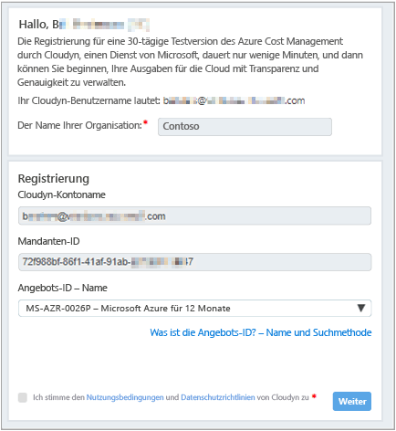
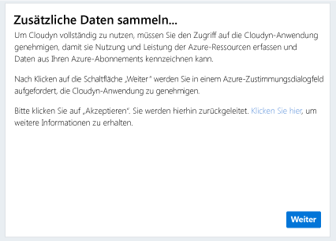
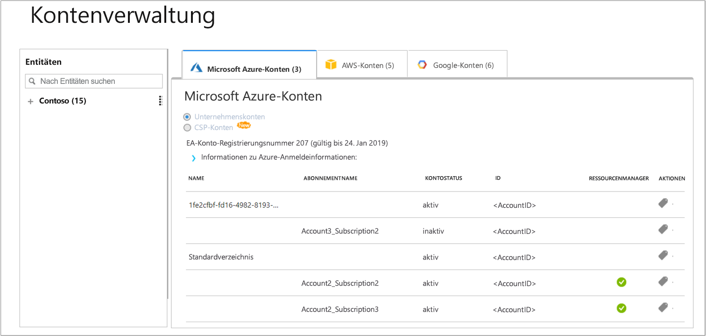

# Registrieren eines einzelnen Azure-Abonnements und Anzeigen von Kostendaten

Sie verwenden Ihr Azure-Abonnement, um sich bei Cloudyn zu registrieren. Durch die Registrierung erhalten Sie Zugriff auf das Cloudyn-Portal. In diesem Schnellstart wird der Registrierungsvorgang ausführlich erläutert, der zum Erstellen eines Cloudyn-Testabonnements und zum Anmelden beim Cloudyn-Portal erforderlich ist. Es wird auch gezeigt, wie die Anzeige von Kostendaten sofort gestartet werden kann.

## Anmelden bei Azure

- Melden Sie sich unter https://portal.azure.com beim Azure-Portal an.

## Registrieren bei Cloudyn

1. Klicken Sie im Azure-Portal in der Liste der Dienste auf **Kostenverwaltung und Abrechnung**.
2. Klicken Sie unter **Übersicht** auf **Cloudyn**.  
    
3. Klicken Sie auf der Seite **Cost Management** auf **Zu Cloudyn wechseln**, um die Cloudyn-Registrierungsseite in einem neuen Fenster zu öffnen.
4. Geben Sie im Cloudyn-Portal auf der Registrierungsseite für die Testversion den Namen Ihres Unternehmens ein, und wählen Sie dann **Einzelner Azure-Abonnementbesitzer** aus. Klicken Sie anschließend auf **Weiter**. Ihr Kontoname und die Mandanten-ID werden automatisch zum Formular hinzugefügt.  
    
5. Wählen Sie die **Angebots-ID – Name** aus, die Ihrem Abonnement zugeordnet ist. Wenn Sie nicht genau wissen, wie Ihre Kosten-ID für Ihr Abonnement lautet, können Sie in Ihrer Azure-Rechnung nach **Angebots-ID** suchen.
6. Stimmen Sie den Nutzungsbedingungen zu, und überprüfen Sie dann Ihre Informationen. Klicken Sie anschließend auf **Weiter**.
7. Klicken Sie auf der Seite **Weitere Daten sammeln** auf **Weiter**, um Cloudyn für das Erfassen von Azure-Ressourcendaten zu autorisieren. Die erfassten Daten beziehen sich auf Nutzungs-, Leistungs- und Abrechnungs- sowie Tagdaten aus Ihren Abonnements.  
    
8. Sie werden über Ihren Browser zur Anmeldeseite von Cloudyn weitergeleitet. Melden Sie sich mit Ihren Azure-Anmeldeinformationen an.
9. Klicken Sie auf **Zu Cloudyn wechseln**, um das Cloudyn-Portal zu öffnen. Auf der Seite **Kontenverwaltung** sollten die Kontoinformationen Ihres Azure-Abonnements angezeigt werden.  
    

Ein Videotutorial zur Registrierung Ihres Azure-Abonnements finden Sie unter [Finding your Directory GUID and Rate ID for use in Cloudyn](https://youtu.be/PaRjnyaNGMI) (Ermitteln Ihrer Verzeichnis-GUID und Rate-ID zur Verwendung in Cloudyn).

[!INCLUDE [cost-management-create-account-view-data](../../includes/cost-management-create-account-view-data.md)]

## Nächste Schritte

In diesem Schnellstart haben Sie Ihre Azure-Abonnementinformationen verwendet, um sich bei Cloudyn zu registrieren. Außerdem haben Sie sich beim Cloudyn-Portal angemeldet und die Anzeige von Kostendaten gestartet. Weitere Informationen zu Cloudyn finden Sie im Tutorial für Cloudyn.

> [!div class="nextstepaction"]
> [Überprüfen der Nutzung und der Kosten](./tutorial-review-usage.md)
