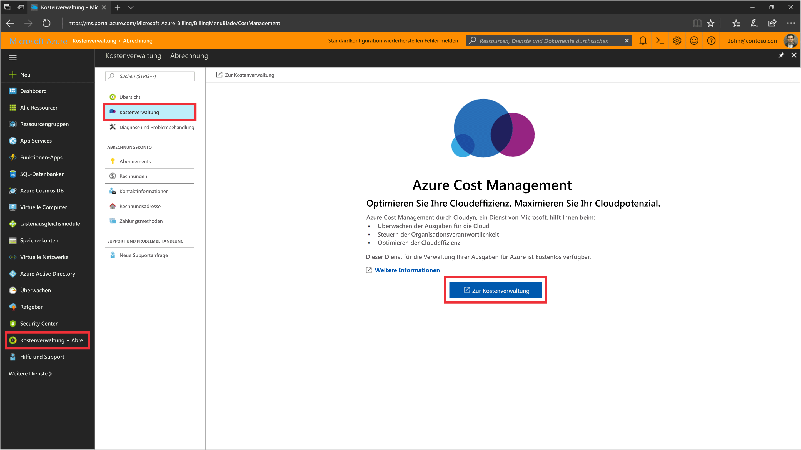
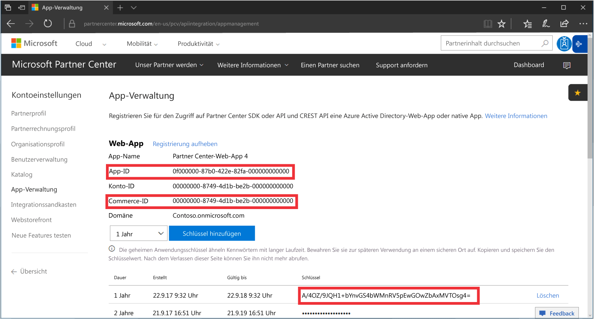

# Registrieren beim CSP-Partnerprogramm und Anzeigen von Kostendaten

Als CSP-Partner können Sie sich bei der Azure-Kostenverwaltung von Cloudyn registrieren. Durch die Registrierung erhalten Sie Zugriff auf das Cloudyn-Portal. In diesem Schnellstart wird der Registrierungsvorgang ausführlich erläutert, der zum Erstellen eines Cloudyn-Testabonnements und zum Anmelden beim Cloudyn-Portal erforderlich ist. Es wird auch gezeigt, wie die Anzeige von Kostendaten sofort gestartet werden kann.

Sie müssen ein Administrator des Partnerprogramms mit Zugriff auf die Partner Center-API sein, um die Registrierung abzuschließen. Die Konfiguration der Partner Center-API ist für die Authentifizierung und den Datenzugriff erforderlich. Weitere Informationen finden Sie unter „Herstellen einer Verbindung mit der Partner Center-API“.

## Anmelden an Azure

- Melden Sie sich unter „http://portal.azure.com“ beim Azure-Portal an.

## Erstellen einer Registrierung für die Testversion

1. Klicken Sie im Azure-Portal in der Liste der Dienste auf **Kostenverwaltung und Abrechnung**.
2. Klicken Sie unter **Übersicht** auf **Kostenverwaltung**.  
    
3. Klicken Sie auf der Seite **Kostenverwaltung** auf **Zur Kostenverwaltung wechseln**, um die Cloudyn-Registrierungsseite in einem neuen Fenster zu öffnen.
4. Geben Sie im Cloudyn-Portal auf der Registrierungsseite für die Testversion den Namen Ihres Unternehmens ein, wählen Sie **Microsoft CSP Partner Program Administrator** (Administrator des Microsoft CSP-Partnerprogramms) aus, und klicken Sie dann auf **Weiter**.  
5. Geben Sie eine **Anwendungs-ID**, **Commerce-ID** und den **geheimen Anwendungsschlüssel** ein, und wählen Sie den **Default Pricing Plan** (Standardpreisplan) aus. Wenn Ihnen diese Informationen nicht vorliegen, melden Sie sich beim Partner Center-Portal unter [https://partnercenter.microsoft.com](https://partnercenter.microsoft.com) mit Ihrem primären Administratorkonto an, und führen Sie folgende Schritte aus:
  1. Navigieren Sie zu **Dashboard** > **Kontoeinstellungen** > **App-Verwaltung**.
  2. Wenn Sie zuvor eine Web-App erstellt haben, überspringen Sie diesen Schritt. Klicken Sie andernfalls auf **Add new web app** (Neue Web-App hinzufügen) im Abschnitt **Web-App**.
  3. Kopieren Sie die GUID Ihrer **App-ID** aus Ihrer Webanwendung.
  4. Kopieren Sie die GUID Ihrer **Commerce-ID** aus Ihrer Webanwendung.
  5. Legen Sie die Gültigkeitsdauer des Schlüssels bei Bedarf auf ein oder zwei Jahre fest. Klicken Sie auf **Schlüssel hinzufügen**, und kopieren und speichern Sie den geheimen Schlüsselwert anschließend.  
    
  6. Navigieren Sie zurück zur Registrierungsseite, und fügen Sie die Informationen ein.  
      
6. Stimmen Sie den Nutzungsbedingungen zu, und überprüfen Sie dann Ihre Informationen. Klicken Sie auf **Weiter**, um Cloudyn für das Erfassen von Azure-Ressourcendaten zu autorisieren. Die erfassten Daten beziehen sich auf Nutzungs-, Leistungs- und Abrechnungs- sowie Tagdaten aus Ihren Abonnements.  
7. Unter **Invite other stakeholders** (Andere Beteiligte einladen) können Sie Benutzer hinzufügen, indem Sie ihre E-Mail-Adressen eingeben. Klicken Sie auf **Weiter**, wenn Sie fertig sind. Es dauert ungefähr zwei Stunden, bis alle Ihre Abrechnungsdaten Cloudyn hinzugefügt wurden.
8. Klicken Sie auf **Zu Cloudyn wechseln**, um das Cloudyn-Portal zu öffnen. Auf der Seite **Cloudkontenverwaltung** sollten Ihre registrierten CSP-Kontoinformationen angezeigt werden.

[!INCLUDE [cost-management-create-account-view-data](../../includes/cost-management-create-account-view-data.md)]

## Nächste Schritte

In diesem Schnellstart haben Sie Ihre CSP-Informationen verwendet, um sich bei der Kostenverwaltung zu registrieren. Außerdem haben Sie sich beim Cloudyn-Portal angemeldet und die Anzeige von Kostendaten gestartet. Weitere Informationen zur Azure-Kostenverwaltung von Cloudyn finden Sie im Tutorial zur Kostenverwaltung.

> [!div class="nextstepaction"]
> [Anzeigen von Kostendaten](./tutorial-review-usage.md)
