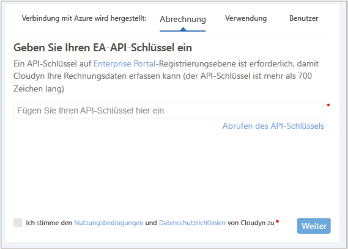
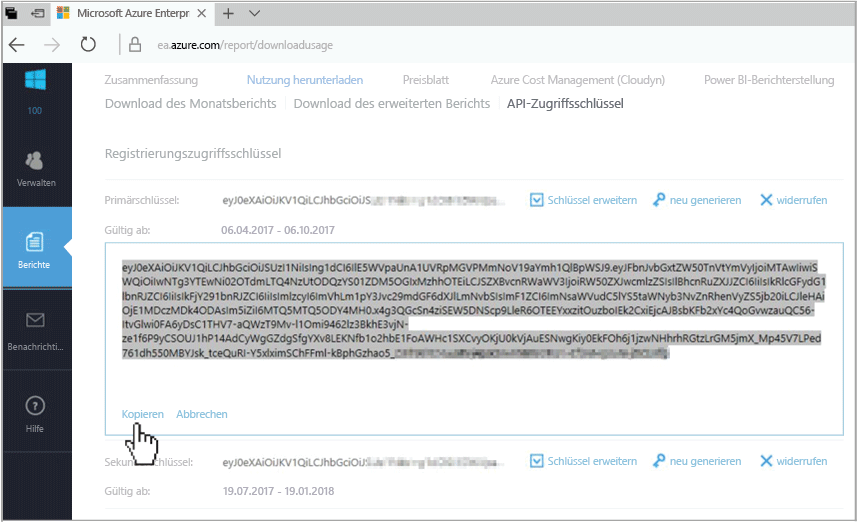

# Registrieren eines Azure Enterprise Agreements und Anzeigen von Kostendaten

Sie verwenden Ihr Enterprise Agreement, um sich bei der Azure-Kostenverwaltung von Cloudyn zu registrieren. Ihre Registrierung stellt den Zugriff auf das Cloudyn-Portal bereit. In diesem Schnellstart wird der Registrierungsvorgang ausführlich erläutert, der zum Erstellen eines Cloudyn-Testabonnements und Anmelden am Cloudyn-Portal erforderlich ist. Es wird auch gezeigt, wie die Anzeige von Kostendaten sofort gestartet werden kann.

## Anmelden bei Azure

- Melden Sie sich unter „http://portal.azure.com“ am Azure-Portal an.

## Erstellen einer Testregistrierung

1. Klicken Sie im Azure-Portal in der Liste der Dienste auf **Kostenverwaltung und Abrechnung**.
2. Klicken Sie unter **Übersicht** auf **Kostenverwaltung**.  
    
3. Navigieren Sie auf der Seite **Kostenverwaltung** zu **Zur Kostenverwaltung wechseln**, um die Cloudyn-Registrierungsseite in einem neuen Fenster zu öffnen.
4. Geben Sie im Cloudyn-Portal auf der Registrierungsseite für die Testversion den Namen Ihres Unternehmens ein, und wählen Sie dann **Azure Enterprise Enrollment Administrator** aus.  
    
5. Geben Sie Ihren Enterprise Portal-API-Registrierungsschlüssel ein. Wenn Ihr Schlüssel zurzeit nicht griffbereit ist, klicken Sie auf den Link [Enterprise Portal](https://ea.azure.com), und führen Sie dann die folgenden Schritte aus:
  1. Melden Sie sich auf der Azure Enterprise-Website an, und klicken Sie auf **Berichte**. Klicken Sie auf **API-Zugriffsschlüssel**, und kopieren Sie dann Ihren Primärschlüssel.  
    
  3. Navigieren Sie zurück zur Registrierungsseite, und fügen Sie Ihren API-Schlüssel ein.
6. Stimmen Sie den Nutzungsbedingungen zu, und überprüfen Sie dann Ihren Schlüssel. Klicken Sie auf **Weiter**, um Cloudyn für das Erfassen von Azure-Ressourcendaten zu autorisieren. Die erfassten Daten beziehen sich auf Nutzung, Leistung, Abrechnung sowie Tagdaten aus Ihren Abonnements.  
    
7. Unter **Andere Beteiligte einladen** können Sie Benutzer hinzufügen, indem Sie ihre E-Mail-Adressen eingeben. Klicken Sie auf **Weiter**, wenn Sie fertig sind. Es dauert ungefähr zwei Stunden, bis alle Ihre Abrechnungsdaten Cloudyn hinzugefügt wurden.
8. Klicken Sie auf **Zu Cloudyn wechseln**, um das Cloudyn-Portal zu öffnen. Auf der Seite **Cloudkontenverwaltung** sollten Ihre registrierten EA-Kontoinformationen angezeigt werden.

[!INCLUDE [cost-management-create-account-view-data](../../includes/cost-management-create-account-view-data.md)]

## Nächste Schritte

In diesem Schnellstart haben Sie Ihre Azure Enterprise Agreement-Informationen verwendet, um sich bei der Kostenverwaltung zu registrieren. Außerdem haben Sie sich am Cloudyn-Portal angemeldet und die Anzeige von Kostendaten gestartet. Weitere Informationen zur Azure-Kostenverwaltung von Cloudyn finden Sie im Tutorial zur Kostenverwaltung.

> [!div class="nextstepaction"]
> [Anzeigen von Kostendaten](./tutorial-review-usage.md)

