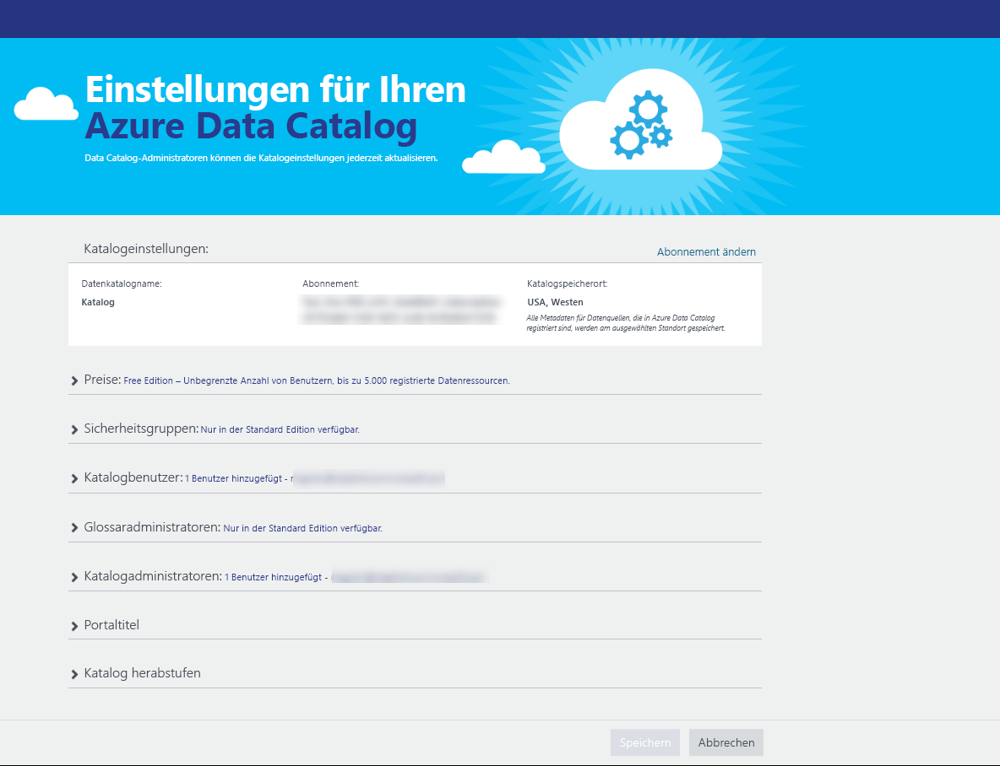
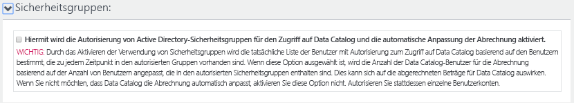
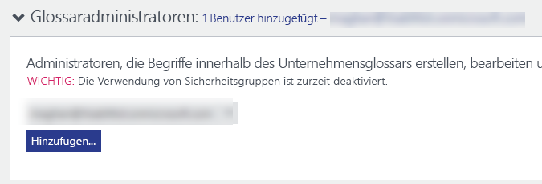
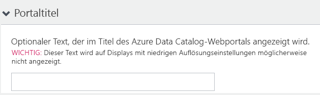
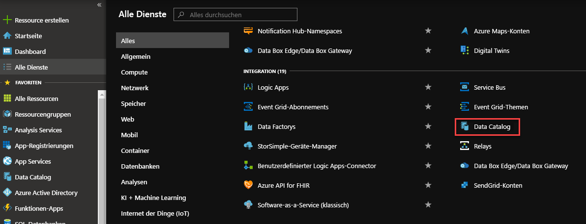
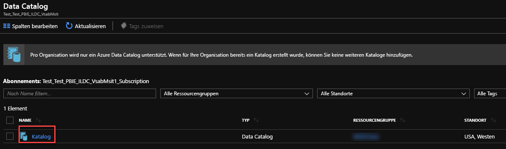
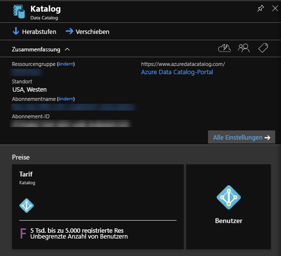
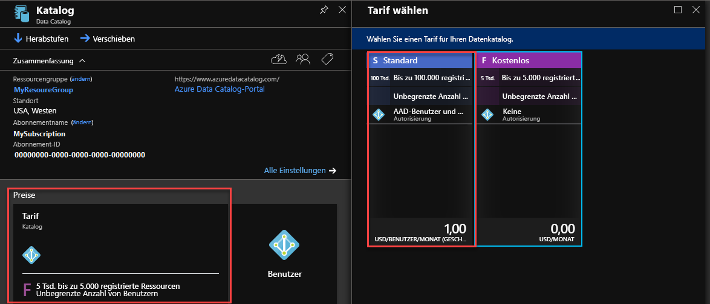

# Schnellstart: Erstellen einer Azure Data Catalog-Instanz

Azure Data Catalog ist ein vollständig verwalteter Clouddienst, der als Registrierungs- und Ermittlungssystem für Datenassets von Unternehmen dient. Eine ausführliche Übersicht finden Sie unter [Was ist Azure Data Catalog?](overview.md).

Diese Schnellstartanleitung unterstützt Sie bei den ersten Schritten zur Erstellung einer Azure Data Catalog-Instanz.

Wenn Sie kein Azure-Abonnement besitzen, können Sie ein [kostenloses Konto](https://azure.microsoft.com/free/?WT.mc_id=A261C142F) erstellen, bevor Sie beginnen.

## Voraussetzungen

Für Ihre ersten Schritte benötigen Sie Folgendes:

* Ein [Microsoft Azure](https://azure.microsoft.com/)-Abonnement
* Sie müssen über einen eigenen [Azure Active Directory-Mandanten](../active-directory/fundamentals/active-directory-access-create-new-tenant.md) verfügen.

Um Data Catalog einzurichten, müssen Sie Besitzer oder Mitbesitzer eines Azure-Abonnements sein.

## Erstellen eines Datenkatalogs

Sie können nur einen Datenkatalog pro Organisation (Azure Active Directory-Domäne) bereitstellen. Falls der Besitzer oder Mitbesitzer eines Azure-Abonnements, der dieser Azure Active Directory-Domäne angehört, bereits einen Katalog erstellt hat, können Sie nicht erneut einen Katalog erstellen, auch wenn Sie über mehrere Azure-Abonnements verfügen. Um festzustellen, ob von einem Benutzer in Ihrer Azure Active Directory-Domäne ein Datenkatalog erstellt wurde, navigieren Sie zur [Azure Data Catalog-Startseite](http://azuredatacatalog.com) und überprüfen, ob ein Katalog angezeigt wird. Wenn bereits ein Katalog für Sie erstellt wurde, überspringen Sie das folgende Verfahren, und fahren Sie mit dem nächsten Abschnitt fort.

1. Navigieren Sie im [Azure-Portal](https://portal.azure.com) >  zu **Ressource erstellen**, und wählen Sie **Data Catalog** aus.

    

2. Geben Sie unter **Name** einen Namen für den Datenkatalog, unter **Abonnement** das gewünschte Abonnement, unter **Speicherort** den Speicherort für den Katalog und unter **Tarif** den Tarif an. Klicken Sie anschließend auf **Erstellen**.

3. Navigieren Sie zur [Azure Data Catalog-Startseite](http://azuredatacatalog.com) , und klicken Sie auf **Daten veröffentlichen**.

   

   Alternativ können Sie auch auf der [Seite des Data Catalog-Diensts](https://azure.microsoft.com/services/data-catalog) die Option **Erste Schritte** auswählen, um zur Azure Data Catalog-Startseite zu gelangen.

   

4. Navigieren Sie zur Seite **Einstellungen**.

    

5. Erweitern Sie **Preise**, und überprüfen Sie Ihre **Edition** von Azure Data Catalog (Free oder Standard).

    

6. Bei Verwendung der Edition *Standard* können Sie **Sicherheitsgruppen** erweitern und die Autorisierung von Active Directory-Sicherheitsgruppen für den Zugriff auf Data Catalog und die automatische Anpassung der Abrechnung aktivieren.

    

7. Erweitern Sie **Katalogbenutzer**, und klicken Sie auf **Hinzufügen**, um Benutzer für den Datenkatalog hinzuzufügen. Sie werden dieser Gruppe automatisch hinzugefügt.

    

8. Bei Verwendung der Edition *Standard* können Sie **Glossaradministratoren** erweitern und auf **Hinzufügen** klicken, um Glossaradministratorbenutzer hinzuzufügen. Sie werden dieser Gruppe automatisch hinzugefügt.

    

9. Erweitern Sie **Katalogadministratoren**, und klicken Sie auf **Hinzufügen**, um weitere Administratoren für den Datenkatalog hinzuzufügen. Sie werden dieser Gruppe automatisch hinzugefügt.

    

10. Erweitern Sie **Portaltitel**, und fügen Sie zusätzlichen Text hinzu, der im Portaltitel angezeigt werden soll.

    

11. Wenn Sie mit der Bearbeitung der Seite **Einstellungen** fertig sind, navigieren Sie zur Seite **Veröffentlichen**.

    

## Suchen nach einem Datenkatalog im Azure-Portal

1. Navigieren Sie auf einer separaten Registerkarte im Webbrowser oder in einem separaten Webbrowserfenster zum [Azure-Portal](https://portal.azure.com) , und melden Sie sich mit dem Konto an, das Sie im vorherigen Schritt zum Erstellen des Datenkatalogs verwendet haben.

2. Klicken Sie auf **Alle Dienste** und dann auf **Data Catalog**.

    

     Der von Ihnen erstellte Datenkatalog wird angezeigt.

    

3. Klicken Sie auf den Katalog, den Sie erstellt haben. Im Portal wird das Blatt **Datenkatalog** angezeigt.

   

4. Sie können die Eigenschaften des Datenkatalogs anzeigen und aktualisieren. Klicken Sie beispielsweise auf **Tarif** , und ändern Sie die Edition.

    

## Nächste Schritte

In dieser Schnellstartanleitung haben Sie gelernt, wie Sie eine Azure Data Catalog-Instanz für Ihre Organisation erstellen. Als Nächstes können Sie Datenquellen in Ihrem Datenkatalog registrieren.

> [!div class="nextstepaction"]
> [Registrieren von Datenquellen in Azure Data Catalog](data-catalog-how-to-register.md)
