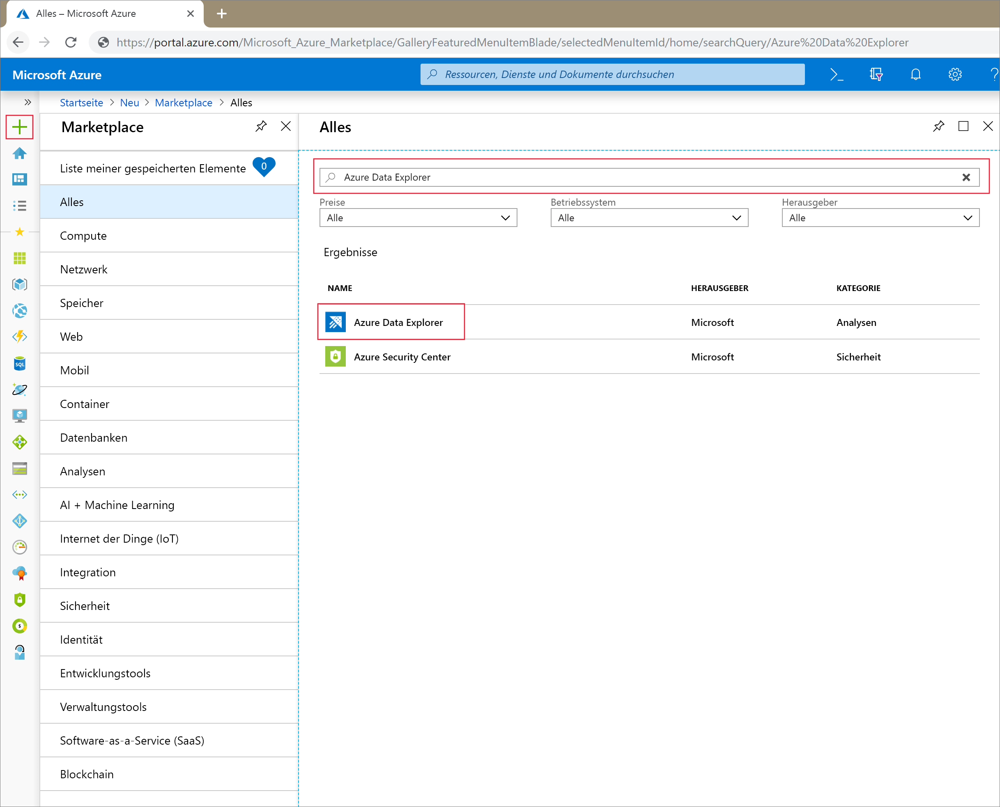
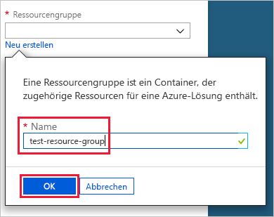
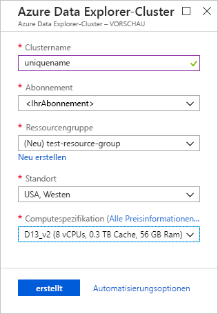
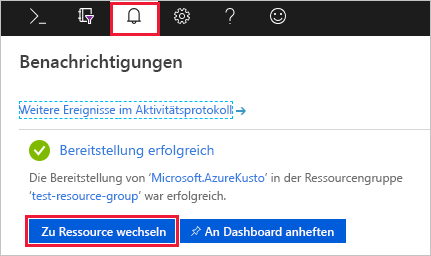
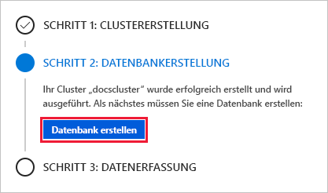
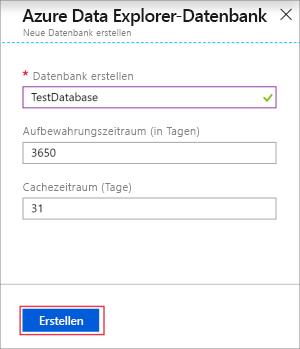
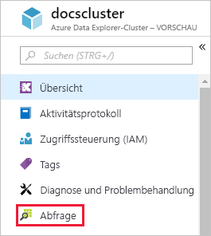
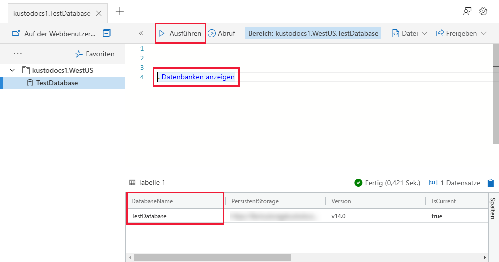
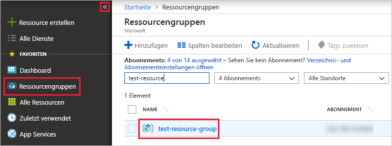

# Schnellstart: Erstellen eines Azure-Daten-Explorer-Clusters und einer Datenbank

Azure-Daten-Explorer ist ein schneller und hochgradig skalierbarer Dienst zur Untersuchung von Daten (Protokoll- und Telemetriedaten). Um den Azure-Daten-Explorer zu verwenden, erstellen Sie zuerst einen *Cluster* und anschließend eine oder mehrere *Datenbanken* in diesem Cluster. Anschließend *erfassen* (laden) Sie Daten in eine Datenbank, damit Sie diese abfragen können. In diesem Schnellstart erstellen Sie einen Cluster und eine Datenbank. In nachfolgenden Artikeln erfahren Sie, wie Daten erfasst werden.

Wenn Sie über kein Azure-Abonnement verfügen, können Sie ein [kostenloses Azure-Konto](https://azure.microsoft.com/free/) erstellen, bevor Sie beginnen.

## Melden Sie sich auf dem Azure-Portal an.

Melden Sie sich beim [Azure-Portal](https://portal.azure.com/) an.

## Erstellen eines Clusters

Sie erstellen einen Azure-Daten-Explorer-Cluster in einer Azure-Ressourcengruppe mit einem definierten Satz von Compute- und Speicherressourcen.

1. Klicken Sie in der linken oberen Ecke des Portals auf die Schaltfläche **Ressource erstellen** (+).

1. Suchen Sie nach *Azure-Daten-Explorer*, und wählen Sie dann **Azure-Daten-Explorer** aus.

   

1. Wählen Sie in der rechten unteren Ecke **Erstellen** aus.

1. Geben Sie einen eindeutigen Namen für den Cluster ein, wählen Sie Ihr Abonnement aus, und erstellen Sie die Ressourcengruppe *test-resource-group*.

    

1. Füllen Sie das Formular mit den folgenden Informationen aus.

   

    **Einstellung** | **Empfohlener Wert** | **Feldbeschreibung**
    |---|---|---|
    | Clustername | Ein eindeutiger Clustername | Wählen Sie einen eindeutigen Namen aus, der Ihren Cluster identifiziert. Beispiel: *mytestcluster*. Der Domänenname *[Region].kusto.windows.net* wird an den angegebenen Namen angefügt. Der Name darf nur Kleinbuchstaben und Zahlen enthalten. Er muss zwischen 3 und 22 Zeichen lang sein.
    | Abonnement | Ihr Abonnement | Wählen Sie das Azure-Abonnement aus, das Sie für Ihren Cluster verwenden möchten.|
    | Ressourcengruppe | *test-resource-group* | Erstellen Sie eine neue Ressourcengruppe. |
    | Standort | *USA, Westen* | Wählen Sie für diesen Schnellstart die Option *USA, Westen* aus. Wählen Sie für ein Produktionssystem die Region aus, die Ihre Anforderungen am besten erfüllt.
    | Computespezifikation | *D13_v2* | Wählen Sie für diesen Schnellstart die Spezifikation mit dem niedrigsten Preis aus. Wählen Sie für ein Produktionssystem die Spezifikation aus, die Ihre Anforderungen am besten erfüllt.
    | | |

1. Wählen Sie **Erstellen** aus, um den Server bereitzustellen. Die Bereitstellung dauert in der Regel etwa zehn Minuten. Wählen Sie auf der Symbolleiste die Option **Benachrichtigungen** (das Glockensymbol) aus, um den Bereitstellungsvorgang zu überwachen.

1. Wenn der Prozess abgeschlossen ist, wählen Sie **Benachrichtigungen** und dann **Zu Ressource wechseln** aus.

    

## Erstellen einer Datenbank

Sie sind nun für den zweiten Schritt bereit: das Erstellen der Datenbank.

1. Wählen Sie auf der Registerkarte **Übersicht** die Option **Datenbank erstellen** aus.

    

1. Füllen Sie das Formular mit den folgenden Informationen aus.

    

    **Einstellung** | **Empfohlener Wert** | **Feldbeschreibung**
    |---|---|---|
    | Datenbankname | *TestDatabase* | Der Datenbankname muss innerhalb des Clusters eindeutig sein.
    | Aufbewahrungszeitraum | *3650* | Die Zeitspanne, für die garantiert wird, dass die Daten für Abfragen verfügbar bleiben. Die Zeitspanne wird ab dem Zeitpunkt gemessen, zu dem die Daten erfasst werden.
    | Zwischenspeicherungsdauer | *31* | Die Zeitspanne, für die häufig abgefragte Daten im SSD-Speicher oder RAM (und nicht im längerfristigen Speicher) verfügbar bleiben.
    | | | |

1. Wählen Sie **Speichern** aus, um die Datenbank zu erstellen. Die Erstellung dauert in der Regel weniger als eine Minute. Wenn der Vorgang abgeschlossen ist, gelangen Sie zurück zur Registerkarte **Übersicht** des Clusters.

## Ausführen von grundlegenden Befehlen in der Datenbank

Da Sie nun über einen Cluster und eine Datenbank verfügen, können Sie Abfragen und Befehle ausführen. Es sind noch keine Daten in der Datenbank vorhanden, aber Sie können bereits sehen, wie die Tools funktionieren.

1. Wählen Sie unter Ihrem Cluster **Abfrage** aus.

    

1. Fügen Sie den folgenden Befehl im Abfragefenster ein: `.show databases`. Wählen Sie dann **Ausführen** aus.

    

    Im Resultset wird **TestDatabase** angezeigt, die einzige Datenbank im Cluster.

1. Fügen Sie den folgenden Befehl im Abfragefenster ein: `.show tables`. Wählen Sie diesen Befehl dann im Fenster aus. Klicken Sie auf **Run** (Ausführen).

    Dieser Befehl gibt ein leeres Resultset zurück, da Sie noch nicht über Tabellen verfügen. Sie fügen im nächsten Artikel dieser Serie eine Tabelle hinzu.

## Beenden und Neustarten des Clusters

Sie können einen Cluster je nach Geschäftsanforderungen beenden und neu starten.

1. Um den Cluster zu beenden, wählen Sie am oberen Rand der Registerkarte **Übersicht** die Option **Beenden** aus.

    Wenn der Cluster beendet wurde, sind Daten nicht für Abfragen verfügbar, und Sie können keine neuen Daten erfassen.

1. Um den Cluster neu zu starten, wählen Sie am oberen Rand der Registerkarte **Übersicht** die Option **Starten** aus.

    Nach dem Neustarten des Clusters dauert es etwa zehn Minuten, bis er verfügbar ist (wie bei der ursprünglichen Bereitstellung). Es dauert zusätzliche Zeit, bis die Daten in den aktiven Cache geladen wurden.  

## Bereinigen von Ressourcen

Wenn Sie unsere anderen Schnellstarts und Tutorials durchgehen möchten, behalten Sie die erstellten Ressourcen bei. Andernfalls bereinigen Sie **test-resource-group**, damit keine Kosten entstehen.

1. Klicken Sie ganz links im Azure-Portal auf **Ressourcengruppen** und anschließend auf die erstellte Ressourcengruppe.  

    Wenn das linke Menü reduziert ist, wählen Sie  , um es zu erweitern.

   

1. Wählen Sie unter **test-resource-group** die Option **Ressourcengruppe löschen** aus.

1. Geben Sie im neuen Fenster den Namen der zu löschenden Ressourcengruppe (*test-resource-group*) ein, und wählen Sie dann **Löschen** aus.

## Nächste Schritte

> [!div class="nextstepaction"]
> [Schnellstart: Erfassen von Daten aus Event Hub in Azure-Daten-Explorer](ingest-data-event-hub.md)

