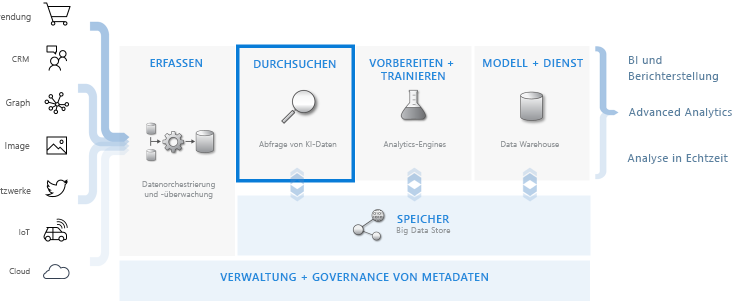
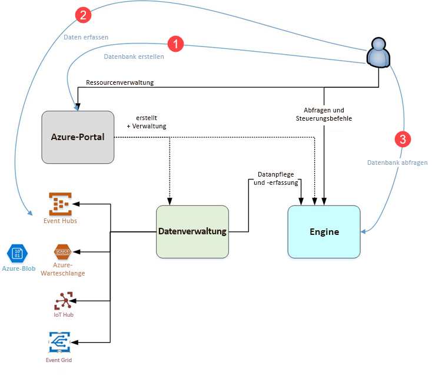

# Was ist der Azure-Daten-Explorer?

Azure-Daten-Explorer ist ein schneller und hochgradig skalierbarer Dienst zur Untersuchung von Daten (Protokoll- und Telemetriedaten). Hiermit können Sie die vielen Datenströme moderner Software verarbeiten, um die Daten zu sammeln, zu speichern und zu analysieren. Azure-Daten-Explorer ist ideal zum Analysieren von großen Mengen unterschiedlicher Daten aus beliebigen Datenquellen geeignet, z.B. Websites, Anwendungen, IoT-Geräte und mehr. Diese Daten werden für die Diagnose, Überwachung, Berichterstellung, Machine Learning und weitere Analysefunktionen verwendet. Azure Data Explorer ermöglicht das einfache Erfassen dieser Daten, und Sie können komplexe Ad-hoc-Abfragen der Daten innerhalb von Sekunden ausführen.

## Weshalb ist der Azure-Daten-Explorer so einzigartig?

- Er kann schnell innerhalb von Minuten auf Datenmengen mit Terabyte-Größe skaliert werden, und bei schnellen Iterationen der Datenuntersuchung können wichtige Erkenntnisse gewonnen werden.

- Er zeichnet sich durch eine innovative Abfragesprache aus, die für leistungsfähige Datenanalysen optimiert ist.

- Er unterstützt Analysen großer Volumen heterogener (sowohl strukturierter als auch unstrukturierter) Daten.

- Er bietet die Möglichkeit, zusammen mit anderen Diensten genau die Voraussetzungen zu erstellen und bereitzustellen, die für die Einrichtung einer umfassenden, leistungsfähigen und interaktiven Datenanalyse-Lösung benötigt werden.

## Data Warehousing-Workflow

Azure-Daten-Explorer ist mit anderen wichtigen Diensten integriert und stellt eine End-to-End-Lösung bereit, welche das Sammeln, Erfassen, Speichern, Indizieren, Abfragen und Visualisieren von Daten umfasst. Er spielt eine zentrale Rolle im Data Warehousing-Flow, indem der Schritt **DURCHSUCHEN** für Terabytes diverser Rohdaten ausgeführt wird.

Azure-Daten-Explorer unterstützt verschiedene Erfassungsmethoden, u.a. Connectors zu gängigen Diensten wie Event Hub, programmgesteuerte Erfassung mit SDKs wie .NET und Python sowie Direktzugriff auf das Modul für die Durchsuchung. Azure-Daten-Explorer ist für die weiterführende Analyse und Visualisierung von Daten mit Analyse- und Modellierungsdiensten integriert.

## Flow von Azure-Daten-Explorer

Die folgende Abbildung zeigt die verschiedenen Aspekte der Arbeit mit Azure-Daten-Explorer.

Die Arbeit im Azure-Daten-Explorer folgt im Allgemeinen diesem Muster:

1. **Datenbank erstellen:** Erstellen Sie einen *Cluster* und anschließend eine oder mehrere *Datenbanken* im Cluster. [Schnellstart: Erstellen eines Azure Data Explorer-Clusters und einer Datenbank](create-cluster-database-portal.md)

1. **Daten erfassen:** Laden Sie Daten in Datenbanktabellen, sodass Sie diese abfragen können. [Schnellstart: Erfassen von Daten aus Event Hub in Azure Data Explorer](ingest-data-event-hub.md)

1. **Datenbank abfragen:** Nutzen Sie unsere Webanwendung, um Abfragen auszuführen und um deren Abfrageergebnisse zu prüfen und zu teilen. Sie steht im Azure-Portal sowie als eigenständige Anwendung zur Verfügung. Darüber hinaus können Sie Abfragen programmgesteuert (mit einem SDK) oder an einen REST-API-Endpunkt senden. [Schnellstart: Abfragen von Daten in Azure Data Explorer](web-query-data.md)

## Abfrageverhalten

Eine Abfrage in Azure-Daten-Explorer ist eine schreibgeschützte Anforderung, Daten zu verarbeiten und die Ergebnisse dieser Daten zurückzugeben; die Daten und Metadaten werden dabei nicht geändert. Sie können Ihre Abfragen laufend optimieren, bis Sie die Analyse abgeschlossen haben. Azure Data Explorer erleichtert diesen Vorgang durch seine äußerst schnellen Ad-hoc-Abfragen.

Azure-Daten-Explorer eignet sich gleichermaßen gut für die Verarbeitung großer Mengen strukturierter, halbstrukturierter (geschachtelte JSON-Typen) und unstrukturierter Daten (Freitext). Er ermöglicht das Suchen nach bestimmten Textbegriffen, das Auffinden konkreter Ereignisse und das Durchführen metrischer Berechnungen für strukturierte Daten. Azure-Daten-Explorer schlägt eine Brücke zwischen Protokollen mit unstrukturiertem Text und strukturierten Zahlen und Dimensionen, indem Werte zur Laufzeit aus Freitextfeldern extrahiert werden. Das Durchsuchen der Daten wird durch eine Kombination aus schneller Textindizierung, ColumnStore- und Zeitreihenvorgängen erleichtert.

Die Funktionen von Azure Data Explorer werden durch andere Dienste erweitert, die auf seiner leistungsfähigen Abfragesprache aufbauen, u. a. durch [Azure Monitor-Protokolle](/azure/log-analytics/), [Application Insights](/azure/application-insights/), [Time Series Insights](/azure/time-series-insights/) und [Windows Defender Advanced Threat Protection](/windows/security/threat-protection/windows-defender-atp/windows-defender-advanced-threat-protection/).

## Feedback

Wir würden uns sehr über Ihr Feedback zu Azure-Daten-Explorer und seiner Abfragesprache freuen:

- Fragen stellen.
  - [Stack Overflow](https://stackoverflow.com/questions/tagged/azure-data-explorer)
  - [Microsoft Tech Community](https://techcommunity.microsoft.com/t5/Azure-Data-Explorer/bd-p/Kusto)
  - [MSDN](https://social.msdn.microsoft.com/Forums/en-US/home?forum=AzureKusto)
- [Unterbreiten Sie Produktvorschläge in User Voice](https://aka.ms/AzureDataExplorer.UserVoice)

## Nächste Schritte

[Schnellstart: Erstellen eines Azure Data Explorer-Clusters und einer Datenbank](create-cluster-database-portal.md)

[Schnellstart: Erfassen von Daten aus Event Hub in Azure Data Explorer](ingest-data-event-hub.md)

[Schnellstart: Abfragen von Daten in Azure Data Explorer](web-query-data.md)
