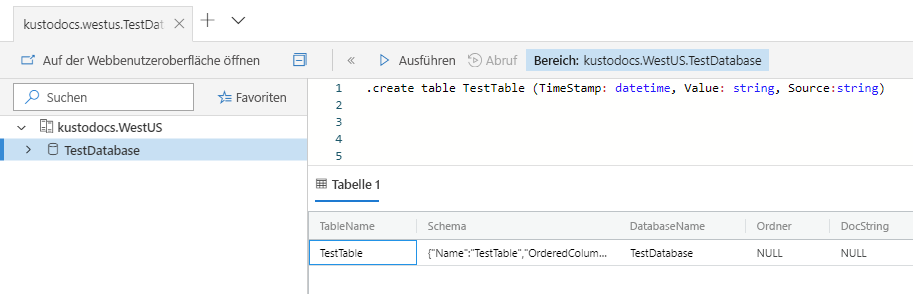
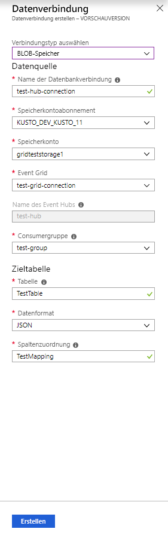
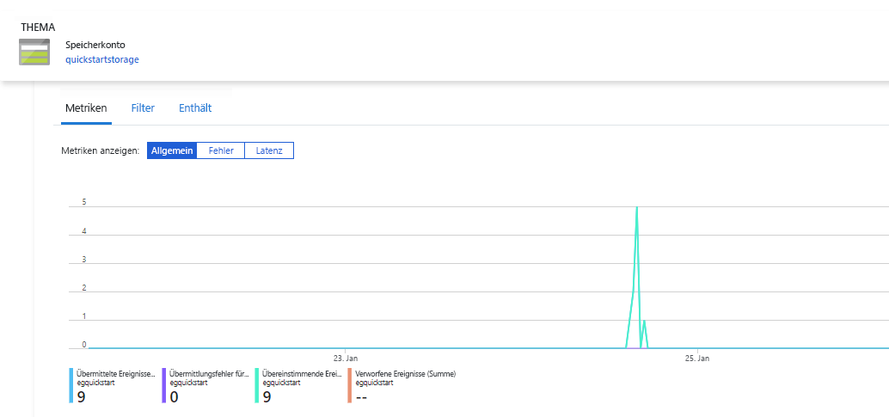
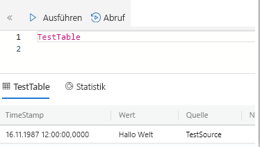

# <a name="quickstart-ingest-azure-blobs-into-azure-data-explorer-by-subscribing-to-event-grid-notifications"></a>Schnellstart: Erfassen von Azure-Blobs in Azure Data Explorer durch Abonnieren von Event Grid-Benachrichtigungen

Azure-Daten-Explorer ist ein schneller und hochgradig skalierbarer Dienst zur Untersuchung von Daten (Protokoll- und Telemetriedaten). Azure Data Explorer bietet eine kontinuierliche Erfassung (Laden von Daten) aus Blobs, die in Blobcontainer geschrieben werden. Hierzu wird ein [Azure Event Grid](/azure/event-grid/overview)-Abonnement für Bloberstellungsereignisse festgelegt, und diese Ereignisse werden über einen Event Hub an Kusto weitergeleitet. Für diese Schnellstartanleitung benötigen Sie ein Speicherkonto mit einem Event Grid-Abonnement, das seine Benachrichtigungen an Event Hub sendet. Anschließend können Sie eine Event Grid-Datenverbindung erstellen und den Datenfluss im gesamten System betrachten.

## <a name="prerequisites"></a>Voraussetzungen

1. Sollten Sie über kein Azure-Abonnement verfügen, erstellen Sie ein [kostenloses Azure-Konto](https://azure.microsoft.com/free/).
1. [Ein Cluster und eine Datenbank](create-cluster-database-portal.md)
1. [Ein Speicherkonto](https://docs.microsoft.com/azure/storage/common/storage-quickstart-create-account?tabs=azure-portal)
1. [Ein Event Hub](https://docs.microsoft.com/azure/event-hubs/event-hubs-create)

## <a name="create-an-event-grid-subscription-in-your-storage-account"></a>Erstellen eines Event Grid-Abonnements in Ihrem Speicherkonto

1. Navigieren Sie im Azure-Portal zu Ihrem Speicherkonto.
1. Klicken Sie auf die Registerkarte **Ereignisse** und anschließend auf **Ereignisabonnement**.

    

1. Geben Sie im Fenster **Ereignisabonnement erstellen** auf der Registerkarte **Einfach** die folgenden Werte an:

    **Einstellung** | **Empfohlener Wert** | **Feldbeschreibung**
    |---|---|---|
    | Name | *test-grid-connection* | Der Name der zu erstellenden Event Grid-Instanz.|
    | Ereignisschema | *Event Grid-Schema* | Das gewünschte Schema für die Event Grid-Instanz. |
    | Thementyp | *Speicherkonto* | Die Art des Event Grid-Themas. |
    | Themenressource | *gridteststorage* | Der Name Ihres Speicherkontos. |
    | Alle Ereignistypen abonnieren | *Deaktiviert* | Keine Benachrichtigungen für alle Ereignisse. |
    | Definierte Ereignistypen | *Blob erstellt* | Gibt an, bei welchen spezifischen Ereignissen eine Benachrichtigung erfolgen soll. |
    | Endpunkttyp | *Event Hubs* | Die Art des Endpunkts, an den Sie die Ereignisse senden. |
    | Endpunkt | *test-hub* | Der von Ihnen erstellte Event Hub. |
    | | |

1. Wählen Sie die Registerkarte **Zusätzliche Features** aus, wenn Sie Dateien aus einem bestimmten Container nachverfolgen möchten. Legen Sie die Filter für die Benachrichtigungen wie folgt fest:
    * Das Feld **Betreff beginnt mit** ist das *literale* Präfix des Blobcontainers. (Da das Muster *startswith* verwendet wird, kann es mehrere Container umfassen.) Platzhalter sind nicht zulässig.
     Das Feld *muss* wie folgt festgelegt werden: *`/blobServices/default/containers/`*[Containerpräfix]
    * Das Feld **Betreff endet auf** ist das *literale* Suffix des Blobs. Platzhalter sind nicht zulässig.

## <a name="create-a-target-table-in-azure-data-explorer"></a>Erstellen einer Zieltabelle im Azure-Daten-Explorer

Erstellen Sie in Azure Data Explorer eine Tabelle, an die Event Hubs Daten senden kann. Erstellen Sie die Tabelle in dem Cluster und der Datenbank, den bzw. die Sie unter **Voraussetzungen** vorbereitet haben.

1. Wählen Sie im Azure-Portal unter Ihrem Cluster die Option **Abfrage** aus.

    

1. Kopieren Sie den folgenden Befehl in das Fenster, und wählen Sie **Ausführen**, um die Tabelle (TestTable) zu erstellen, die die erfassten Daten erhalten soll.

    ```Kusto
    .create table TestTable (TimeStamp: datetime, Value: string, Source:string)
    ```

    

1. Kopieren Sie den folgenden Befehl in das Fenster, und wählen Sie **Ausführen**, um die eingehenden JSON-Daten den Spaltennamen und Datentypen der Tabelle (TestTable) zuzuordnen.

    ```Kusto
    .create table TestTable ingestion json mapping 'TestMapping' '[{"column":"TimeStamp","path":"$.TimeStamp"},{"column":"Value","path":"$.Value"},{"column":"Source","path":"$.Source"}]'
    ```

## <a name="create-an-event-grid-data-connection-in-azure-data-explorer"></a>Erstellen einer Event Grid-Datenverbindung in Azure Data Explorer

Stellen Sie nun über Azure Data Explorer eine Verbindung mit der Event Grid-Instanz her, damit im Blobcontainer eingehende Daten an die Testtabelle gestreamt werden.

1. Wählen Sie auf der Symbolleiste die Option **Benachrichtigungen** aus, um zu überprüfen, ob die Bereitstellung des Event Hubs erfolgreich verlaufen ist.

1. Wählen Sie unter dem von Ihnen erstellten Cluster zuerst **Datenbanken** und dann **TestDatabase** aus.

    

1. Wählen Sie **Datenerfassung** und dann **Datenverbindung hinzufügen** aus.

    

1. Wählen Sie als Verbindungstyp Folgendes aus: **Blobspeicher**.

1. Füllen Sie das Formular mit den folgenden Informationen aus, und klicken Sie anschließend auf **Erstellen**:

    

     Datenquelle:

    **Einstellung** | **Empfohlener Wert** | **Feldbeschreibung**
    |---|---|---|
    | Name der Datenverbindung | *test-hub-connection* | Der Name der Verbindung, die Sie im Azure-Daten-Explorer erstellen möchten.|
    | Speicherkontoabonnement | Ihre Abonnement-ID | Die Abonnement-ID, unter der sich Ihr Speicherkonto befindet.|
    | Speicherkonto | *gridteststorage* | Der Name des zuvor erstellten Speicherkontos.|
    | Event Grid | *test-grid-connection* | Der Name der erstellten Event Grid-Instanz. |
    | Event Hub-Name | *test-hub* | Der von Ihnen erstellte Event Hub. Dieser Wert wird automatisch ausgefüllt, wenn Sie eine Event Grid-Instanz auswählen. |
    | Consumergruppe | *test-group* | Die Consumergruppe, die in dem von Ihnen erstellten Event Hub definiert ist. |
    | | |

    Zieltabelle:

     **Einstellung** | **Empfohlener Wert** | **Feldbeschreibung**
    |---|---|---|
    | Table | *TestTable* | Die Tabelle, die Sie unter **TestDatabase** erstellt haben. |
    | Datenformat | *JSON* | Die Formate JSON und CSV werden unterstützt. |
    | Spaltenzuordnung | *TestMapping* | Die Zuordnung, die Sie in **TestDatabase** erstellt haben, um eingehende JSON-Daten den Spaltennamen und Datentypen von **TestTable** zuzuordnen.|
    | | |

## <a name="generate-sample-data"></a>Generieren von Beispieldaten

Nachdem nun eine Verbindung zwischen Azure Data Explorer und dem Speicherkonto besteht, können Sie Beispieldaten erstellen und in den Blobspeicher hochladen.

Wir verwenden ein kleines Shellskript, das einige grundlegenden Azure CLI-Befehle für die Interaktion mit Azure Storage-Ressourcen aufruft. Das Skript erstellt zuerst einen neuen Container in Ihrem Speicherkonto und lädt dann eine vorhandene Datei (als Blob) in diesen Container hoch. Danach listet es alle Blobs im Container auf. Das Skript kann per [Cloud Shell](https://docs.microsoft.com/azure/cloud-shell/overview) direkt im Portal ausgeführt werden.

Speichern Sie die folgenden Daten in einer Datei, und verwenden Sie sie zusammen mit dem weiter unten angegebenen Skript:

```Json
{"TimeStamp": "1987-11-16 12:00","Value": "Hello World","Source": "TestSource"}
```

```bash
#!/bin/bash
### A simple Azure Storage example script

    export AZURE_STORAGE_ACCOUNT=<storage_account_name>
    export AZURE_STORAGE_KEY=<storage_account_key>

    export container_name=<container_name>
    export blob_name=<blob_name>
    export file_to_upload=<file_to_upload>
    export destination_file=<destination_file>

    echo "Creating the container..."
    az storage container create --name $container_name

    echo "Uploading the file..."
    az storage blob upload --container-name $container_name --file $file_to_upload --name $blob_name

    echo "Listing the blobs..."
    az storage blob list --container-name $container_name --output table

    echo "Done"
```

## <a name="review-the-data-flow"></a>Überprüfen des Datenflusses

> [!NOTE]
> ADX verfügt über eine Aggregationsrichtlinie (Batchingrichtlinie) für die Datenerfassung, die für die Optimierung des Erfassungsprozesses konzipiert ist.
Die Richtlinie ist standardmäßig auf fünf Minuten festgelegt.
Sie kann bei Bedarf zu einem späteren Zeitpunkt geändert werden. In dieser Schnellstartanleitung ist mit einer Wartezeit von wenigen Minuten zu rechnen.

1. Im Azure-Portal sehen Sie unter Ihrer Event Grid-Instanz den Anstieg der Aktivität während der App-Ausführung.

    

1. Führen Sie in Ihrer Testdatenbank die folgende Abfrage aus, um zu überprüfen, wie viele Nachrichten bisher an die Datenbank gesendet wurden:

    ```Kusto
    TestTable
    | count
    ```

1. Führen Sie in Ihrer Testdatenbank die folgende Abfrage aus, um den Inhalt der Nachrichten anzuzeigen:

    ```Kusto
    TestTable
    ```

    Das Resultset sollte wie folgt aussehen.

    

## <a name="clean-up-resources"></a>Bereinigen von Ressourcen

Wenn Sie Ihre Event Grid-Instanz nicht mehr benötigen, bereinigen Sie **test-hub-rg**, um Kosten zu vermeiden.

1. Klicken Sie ganz links im Azure-Portal auf **Ressourcengruppen** und anschließend auf die erstellte Ressourcengruppe.  

    Wenn das linke Menü reduziert ist, wählen Sie  , um es zu erweitern.

   

1. Wählen Sie unter **test-resource-group** die Option **Ressourcengruppe löschen** aus.

1. Geben Sie im neuen Fenster den Namen der zu löschenden Ressourcengruppe (*test-hub-rg*) ein, und wählen Sie dann **Löschen** aus.

## <a name="next-steps"></a>Nächste Schritte

> [!div class="nextstepaction"]
> [Schnellstart: Abfragen von Daten in Azure Data Explorer](web-query-data.md)