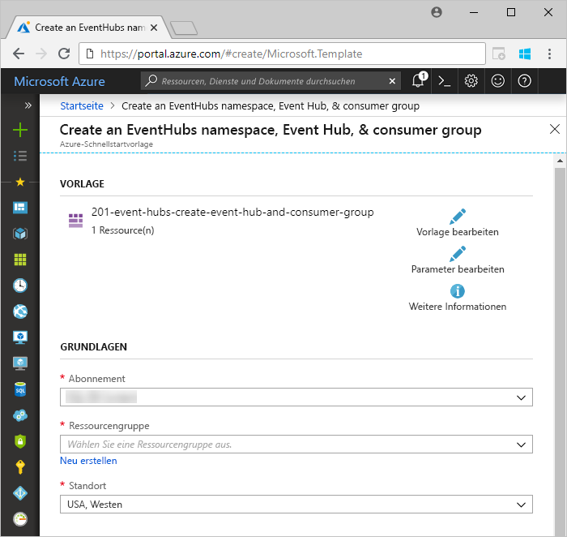
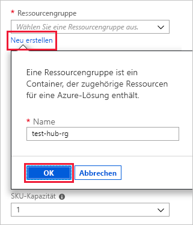
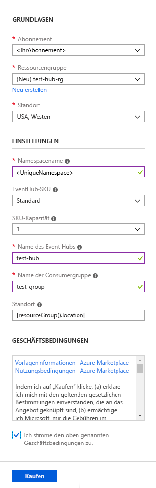
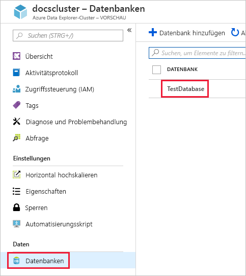
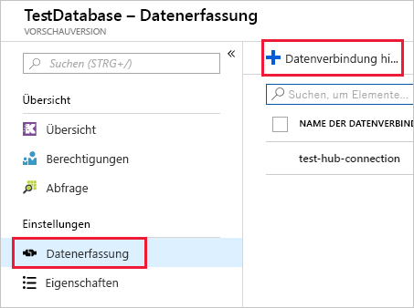
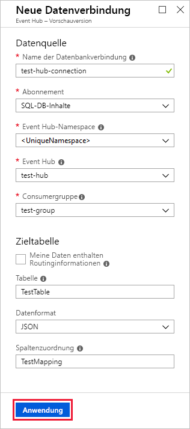
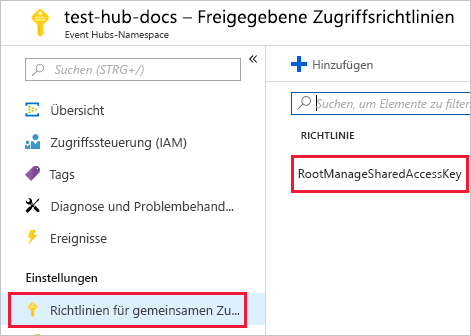
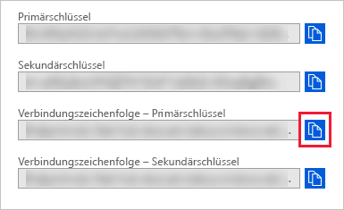
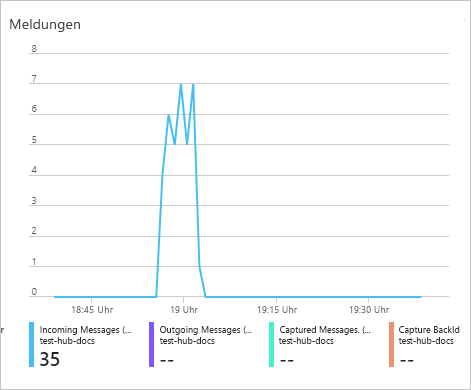
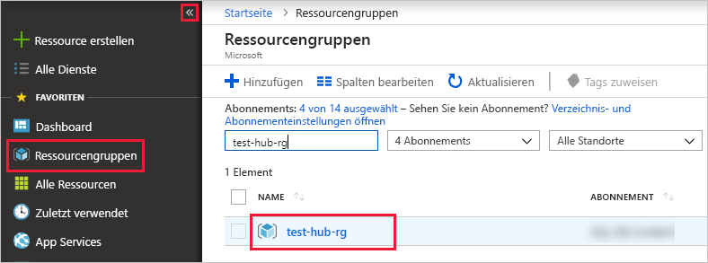

# <a name="quickstart-ingest-data-from-event-hub-into-azure-data-explorer"></a>Schnellstart: Erfassen von Daten aus Event Hub im Azure-Daten-Explorer

Azure-Daten-Explorer ist ein schneller und hochgradig skalierbarer Dienst zur Untersuchung von Daten (Protokoll- und Telemetriedaten). Azure-Daten-Explorer ermöglicht die Datenerfassung (das Laden von Daten) aus Event Hubs. Dabei handelt es sich um eine Big Data-Streamingplattform und einen Ereigniserfassungsdienst. Event Hubs kann Millionen von Ereignissen pro Sekunde nahezu in Echtzeit verarbeiten. In diesem Schnellstart erstellen Sie einen Event Hub, stellen eine Verbindung über Azure-Daten-Explorer damit her und zeigen den Datenfluss durch das System an.

Wenn Sie über kein Azure-Abonnement verfügen, können Sie ein [kostenloses Azure-Konto](https://azure.microsoft.com/free/) erstellen, bevor Sie beginnen.

## <a name="prerequisites"></a>Voraussetzungen

Zusätzlich zu einem Azure-Abonnement benötigen Sie zur Ausführung dieses Schnellstarts Folgendes:

* [Einen Testcluster und eine Testdatenbank](create-cluster-database-portal.md)

* [Eine Beispiel-App](https://github.com/Azure-Samples/event-hubs-dotnet-ingest), die Daten generiert

* [Visual Studio 2017, Version 15.3.2 oder höher](https://www.visualstudio.com/vs/) zum Ausführen der Beispiel-App

## <a name="sign-in-to-the-azure-portal"></a>Melden Sie sich auf dem Azure-Portal an.

Melden Sie sich beim [Azure-Portal](https://portal.azure.com/) an.

## <a name="create-an-event-hub"></a>Erstellen eines Ereignis-Hubs

In diesem Schnellstart generieren Sie Beispieldaten und senden diese an einen Event Hub. Der erste Schritt besteht im Erstellen eines Event Hubs. Dazu verwenden Sie im Azure-Portal eine Vorlage von Azure Resource Manager (ARM).

1. Wählen Sie die folgende Schaltfläche aus, um die Bereitstellung zu starten.

    [](https://portal.azure.com/#create/Microsoft.Template/uri/https%3A%2F%2Fraw.githubusercontent.com%2FAzure%2Fazure-quickstart-templates%2Fmaster%2F201-event-hubs-create-event-hub-and-consumer-group%2Fazuredeploy.json)

    Über die Schaltfläche **In Azure bereitstellen** gelangen Sie zum Azure-Portal, um ein Bereitstellungsformular auszufüllen.

    

1. Wählen Sie das Abonnement aus, in dem Sie den Event Hub erstellen möchten, und erstellen Sie eine Ressourcengruppe mit dem Namen *test-hub-rg*.

    

1. Füllen Sie das Formular mit den folgenden Informationen aus.

    

    Verwenden Sie für alle nicht in der folgenden Tabelle aufgeführten Einstellungen die jeweiligen Standardwerte.

    **Einstellung** | **Empfohlener Wert** | **Feldbeschreibung**
    |---|---|---|
    | Abonnement | Ihr Abonnement | Wählen Sie das Azure-Abonnement aus, das Sie für Ihren Event Hub verwenden möchten.|
    | Ressourcengruppe | *test-hub-rg* | Erstellen Sie eine neue Ressourcengruppe. |
    | Standort | *USA, Westen* | Wählen Sie für diesen Schnellstart die Option *USA, Westen* aus. Wählen Sie für ein Produktionssystem die Region aus, die Ihre Anforderungen am besten erfüllt.
    | Namespacename | Ein eindeutiger Namespacename | Wählen Sie einen eindeutigen Namen, der Ihren Namespace identifiziert, beispielsweise *mytestnamespace*. For example, <bpt id="p1">*</bpt>mytestnamespace<ept id="p1">*</ept>. Der Domänenname *servicebus.windows.net* wird an den von Ihnen angegebenen Namen angefügt. Der Name darf nur Buchstaben, Zahlen und Bindestriche enthalten. Der Name muss mit einem Buchstaben beginnen und mit einem Buchstaben oder einer Zahl enden. Der Wert muss zwischen 6 und 50 Zeichen umfassen.
    | Event Hub-Name | *test-hub* | Der Event Hub befindet sich unter dem Namespace, der einen eindeutigen Bereichscontainer bereitstellt. Der Name des Event Hubs muss innerhalb des Namespaces eindeutig sein. |
    | Name der Consumergruppe | *test-group* | Durch Consumergruppen können mehrere verarbeitende Anwendungen jeweils über eine separate Ansicht des Ereignisdatenstroms verfügen. |
    | | |

1. Wählen Sie **Kauf** aus, wodurch bestätigt wird, dass Sie Ressourcen in Ihrem Abonnement erstellen.

1. Wählen Sie auf der Symbolleiste die Option **Benachrichtigungen** (das Glockensymbol) aus, um den Bereitstellungsprozess zu überwachen. Es kann einige Minuten dauern, bis die Bereitstellung erfolgreich abgeschlossen ist, aber Sie können jetzt mit dem nächsten Schritt fortfahren.

## <a name="create-a-target-table-in-azure-data-explorer"></a>Erstellen einer Zieltabelle im Azure-Daten-Explorer

Sie können jetzt eine Tabelle im Azure-Daten-Explorer erstellen, an die Event Hubs Daten sendet. Erstellen Sie die Tabelle in dem Cluster und der Datenbank, den/die Sie unter **Voraussetzungen** bereitgestellt haben.

1. Wählen Sie im Azure-Portal unter Ihrem Cluster die Option **Abfrage** aus.

    

1. Kopieren Sie den folgenden Befehl in das Fenster, und wählen Sie **Ausführen** aus.

    ```Kusto
    .create table TestTable (TimeStamp: datetime, Name: string, Metric: int, Source:string)
    ```

    

1. Kopieren Sie den folgenden Befehl in das Fenster, und wählen Sie **Ausführen** aus.

    ```Kusto
    .create table TestTable ingestion json mapping 'TestMapping' '[{"column":"TimeStamp","path":"$.timeStamp","datatype":"datetime"},{"column":"Name","path":"$.name","datatype":"string"},{"column":"Metric","path":"$.metric","datatype":"int"},{"column":"Source","path":"$.source","datatype":"string"}]'
    ```
    Mit diesem Befehl werden eingehende JSON-Daten den beim Erstellen der Tabelle verwendeten Spaltennamen und Datentypen zugeordnet.

## <a name="connect-to-the-event-hub"></a>Herstellen einer Verbindung mit dem Event Hub

Sie können jetzt über Azure-Daten-Explorer eine Verbindung mit dem Event Hub herstellen, damit Daten, die in den Event Hub fließen, in die Testtabelle gestreamt werden.

1. Wählen Sie auf der Symbolleiste die Option **Benachrichtigungen** aus, um zu überprüfen, ob die Bereitstellung des Event Hubs erfolgreich verlaufen ist.

1. Wählen Sie unter dem von Ihnen erstellten Cluster zuerst **Datenbanken** und dann **TestDatabase** aus.

    

1. Wählen Sie **Datenerfassung** und dann **Datenverbindung hinzufügen** aus.

    

1. Füllen Sie das Formular mit den folgenden Informationen aus, und wählen Sie dann **Erstellen** aus.

    

    **Einstellung** | **Empfohlener Wert** | **Feldbeschreibung**
    |---|---|---|
    | Name der Datenverbindung | *test-hub-connection* | Der Name der Verbindung, die Sie im Azure-Daten-Explorer erstellen möchten.|
    | Event Hub-Namespace | Ein eindeutiger Namespacename | Der von Ihnen zuvor ausgewählte Name, der Ihren Namespace identifiziert. |
    | Event Hub | *test-hub* | Der von Ihnen erstellte Event Hub. |
    | Consumergruppe | *test-group* | Die Consumergruppe, die in dem von Ihnen erstellten Event Hub definiert ist. |
    | Table | *TestTable* | Die Tabelle, die Sie unter **TestDatabase** erstellt haben. |
    | Datenformat | *JSON* | Die Formate JSON und CSV werden unterstützt. |
    | Spaltenzuordnung | *TestMapping* | Die Zuordnung, die Sie unter **TestDatabase** erstellt haben. |

    In diesem Schnellstart verwenden Sie *statisches Routing* von dem Event Hub, in dem Sie den Tabellennamen, das Dateiformat und die Zuordnung angeben. Sie können auch dynamisches Routing verwenden, bei dem diese Eigenschaften von Ihrer Anwendung festlegt werden.

## <a name="copy-the-connection-string"></a>Verbindungszeichenfolge kopieren

Wenn Sie die App zum Generieren von Beispieldaten ausführen, benötigen Sie die Verbindungszeichenfolge für den Event Hub-Namespace.

1. Wählen Sie unter dem von Ihnen erstellten Event Hub-Namespace zuerst **Freigegebene Zugriffsrichtlinien** und dann **RootManageSharedAccessKey** aus.

    

1. Kopieren Sie den Wert für **Verbindungszeichenfolge – Primärschlüssel**.

    

## <a name="generate-sample-data"></a>Generieren von Beispieldaten

Da Azure-Daten-Explorer und der Event Hub jetzt miteinander verbunden sind, können Sie die Beispiel-App verwenden, die Sie heruntergeladen haben, um Daten zu generieren.

1. Öffnen Sie die Beispiel-App-Projektmappe in Visual Studio.

1. Ändern Sie in der Datei *program.cs* die Konstante `connectionString` in die Verbindungszeichenfolge, die Sie aus dem Event Hub-Namespace kopiert haben.

    ```csharp
    const string eventHubName = "test-hub";
    // Copy the connection string ("Connection string-primary key") from your Event Hub namespace.
    const string connectionString = @"<YourConnectionString>";
    ```

1. Erstellen Sie die App, und führen Sie sie aus. Die App sendet Nachrichten an den Event Hub, und alle zehn Sekunden wird der Status ausgegeben.

1. Nachdem die App ein paar Nachrichten gesendet hat, fahren Sie mit dem nächsten Schritt fort: Überprüfen Sie die in den Event Hub und in die Testtabelle fließenden Daten.

## <a name="review-the-data-flow"></a>Überprüfen des Datenflusses

1. Im Azure-Portal sehen Sie unter Ihrem Event Hub den Anstieg der Aktivität während der App-Ausführung.

    

1. Wechseln Sie zurück zur App, und beenden Sie die App, nachdem sie Nachricht 99 erreicht.

1. Führen Sie in Ihrer Testdatenbank die folgende Abfrage aus, um zu überprüfen, wie viele Nachrichten bisher an die Datenbank gesendet wurden.

    ```Kusto
    TestTable
    | count
    ```

1. Führen Sie die folgende Abfrage aus, um den Inhalt der Nachrichten anzuzeigen.

    ```Kusto
    TestTable
    ```

    Das Resultset sollte wie folgt aussehen.

    

## <a name="clean-up-resources"></a>Bereinigen von Ressourcen

Wenn Sie nicht vorhaben, Ihren Event Hub erneut zu verwenden, bereinigen Sie **test-hub-rg**, um Kosten zu vermeiden.

1. Klicken Sie ganz links im Azure-Portal auf **Ressourcengruppen** und anschließend auf die erstellte Ressourcengruppe.  

    Wenn das linke Menü reduziert ist, wählen Sie  , um es zu erweitern.

   

1. Wählen Sie unter **test-resource-group** die Option **Ressourcengruppe löschen** aus.

1. Geben Sie im neuen Fenster den Namen der zu löschenden Ressourcengruppe (*test-hub-rg*) ein, und wählen Sie dann **Löschen** aus.

## <a name="next-steps"></a>Nächste Schritte

> [!div class="nextstepaction"]
> [Schnellstart: Abfragen von Daten im Azure-Daten-Explorer](web-query-data.md)
