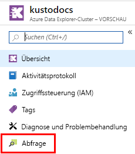
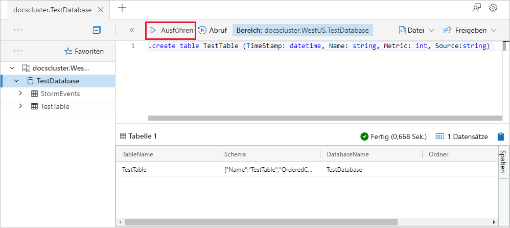
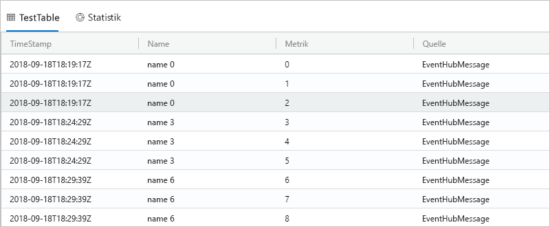

# <a name="quickstart-ingest-data-from-kafka-into-azure-data-explorer"></a>Schnellstart: Erfassen von Daten aus Kafka in Azure Data Explorer
 
Azure-Daten-Explorer ist ein schneller und hochgradig skalierbarer Dienst zur Untersuchung von Daten (Protokoll- und Telemetriedaten). Azure Data Explorer ermöglicht die Erfassung (Laden von Daten) aus Kafka. Bei Kafka handelt es sich um eine verteilte Streamingplattform zum Erstellen von Echzeitstreaming-Datenpipelines, mit denen Daten auf zuverlässige Weise zwischen Systemen oder Anwendungen verschoben werden. 
 
## <a name="prerequisites"></a>Voraussetzungen
 
* Wenn Sie über kein Azure-Abonnement verfügen, können Sie ein [kostenloses Azure-Konto](https://azure.microsoft.com/free/) erstellen, bevor Sie beginnen. 
 
* [Einen Testcluster und eine Testdatenbank](create-cluster-database-portal.md)
 
* [Eine Beispiel-App](https://github.com/Azure/azure-kusto-samples-dotnet/tree/master/kafka), die Daten generiert und an Kafka sendet

* [Visual Studio 2017, Version 15.3.2 oder höher](https://www.visualstudio.com/vs/) zum Ausführen der Beispiel-App
 
## <a name="kafka-connector-setup"></a>Einrichtung des Kafka-Connectors
Kafka Connect ist ein Tool zum skalierbaren und zuverlässigen Streamen von Daten zwischen Apache Kafka und anderen Systemen. Es ist einfach, schnell Connectors zu definieren, mit denen umfangreiche Datensammlungen in und aus Kafka verschoben werden. Die Azure Data Explorer-Kafka-Senke dient als Kafka-Connector.
 
### <a name="bundle"></a>Paket 
Für Kafka kann ein `.jar`-Element als Plug-In geladen werden, das als benutzerdefinierter Connector fungiert. Um ein `.jar`-Element dieser Art zu erstellen, klonen wir den Code lokal und verwenden Maven für die Erstellung. 

#### <a name="clone"></a>Klonen

```bash
git clone git://github.com:Azure/kafka-sink-azure-kusto.git
cd ./kafka-sink-azure-kusto/kafka/
```
 
#### <a name="build"></a>Entwickeln

Führen Sie Erstellung lokal mit Maven durch, um ein `.jar`-Element mit Abhängigkeiten zu erstellen.

* JDK >= 1.8: [Download](https://www.oracle.com/technetwork/java/javase/downloads/index.html)
* Maven: [Download](https://maven.apache.org/install.html)
 

Führen Sie im Stammverzeichnis *kafka-sink-azure-kusto* Folgendes aus:

```bash
mvn clean compile assembly:single
```
 
### <a name="deploy"></a>Bereitstellen 
 
Laden Sie das Plug-In in Kafka. Ein Bereitstellungsbeispiel mit Docker finden Sie unter [kafka-sink-azure-kusto](https://github.com/Azure/kafka-sink-azure-kusto#deploy).
 

Eine ausführliche Dokumentation zu Kafka-Connectors und deren Bereitstellung finden Sie unter [Kafka Connect](https://kafka.apache.org/documentation/#connect). 

### <a name="example-configuration"></a>Beispielkonfiguration 
 
```config
name=KustoSinkConnector 
connector.class=com.microsoft.azure.kusto.kafka.connect.sink.KustoSinkConnector 
kusto.sink.flush_interval_ms=300000 
key.converter=org.apache.kafka.connect.storage.StringConverter 
value.converter=org.apache.kafka.connect.storage.StringConverter 
tasks.max=1 
topics=testing1 
kusto.tables.topics_mapping=[{'topic': 'testing1','db': 'daniel', 'table': 'TestTable','format': 'json', 'mapping':'TestMapping'}] 
kusto.auth.authority=XXX 
kusto.url=https://ingest-{mycluster}.kusto.windows.net/ 
kusto.auth.appid=XXX 
kusto.auth.appkey=XXX 
kusto.sink.tempdir=/var/tmp/ 
kusto.sink.flush_size=1000
```
 
## <a name="create-a-target-table-in-adx"></a>Erstellen einer Zieltabelle in Azure Data Explorer
 
Erstellen Sie eine Tabelle in Azure Data Explorer, an die Kafka Daten senden kann. Erstellen Sie die Tabelle in dem Cluster und der Datenbank, den bzw. die Sie unter **Voraussetzungen** bereitgestellt haben.
 
1. Navigieren Sie im Azure-Portal zu Ihrem Cluster, und wählen Sie **Abfrage**.
 
    
 
1. Kopieren Sie den folgenden Befehl in das Fenster, und wählen Sie **Ausführen** aus.
 
    ```Kusto
    .create table TestTable (TimeStamp: datetime, Name: string, Metric: int, Source:string)
    ```
 
    
 
1. Kopieren Sie den folgenden Befehl in das Fenster, und wählen Sie **Ausführen** aus.
 
    ```Kusto
    .create table TestTable ingestion json mapping 'TestMapping' '[{"column":"TimeStamp","path":"$.timeStamp","datatype":"datetime"},{"column":"Name","path":"$.name","datatype":"string"},{"column":"Metric","path":"$.metric","datatype":"int"},{"column":"Source","path":"$.source","datatype":"string"}]'
    ```

    Mit diesem Befehl werden eingehende JSON-Daten den Spaltennamen und Datentypen der Tabelle (TestTable) zugeordnet.


## <a name="generate-sample-data"></a>Generieren von Beispieldaten

Nachdem für den Kafka-Cluster die Verbindung mit Azure Data Explorer hergestellt wurde, können Sie die [Beispiel-App](https://github.com/Azure-Samples/event-hubs-dotnet-ingest) verwenden, die Sie zum Generieren von Daten heruntergeladen haben.

### <a name="clone"></a>Klonen
Klonen Sie die Beispiel-App lokal:

```cmd
git clone git://github.com:Azure/azure-kusto-samples-dotnet.git
cd ./azure-kusto-samples-dotnet/kafka/
```
### <a name="run-the-app"></a>Ausführen der App
1. Öffnen Sie die Beispiel-App-Projektmappe in Visual Studio.

1. Aktualisieren Sie in der Datei `Program.cs` die Konstante `connectionString` auf Ihre Kafka-Verbindungszeichenfolge.

    ```csharp    
    const string connectionString = @"<YourConnectionString>";
    ```

1. Erstellen Sie die App, und führen Sie sie aus. Die App sendet Nachrichten an den Kafka-Cluster, und alle zehn Sekunden wird der Status ausgegeben.

1. Nachdem die App einige Nachrichten gesendet hat, können Sie mit dem nächsten Schritt fortfahren.
 
## <a name="query-and-review-the-data"></a>Abfragen und Überprüfen der Daten 

1. Stellen Sie wie folgt sicher, dass während der Erfassung keine Fehler aufgetreten sind:

    ```Kusto
    .show ingestion failures
    ```

1. Zeigen Sie die neu erfassten Daten wie folgt an:

    ```Kusto
    TestTable 
    | count
    ```

1. Zeigen Sie den Inhalt der Nachrichten wie folgt an:
 
    ```Kusto
    TestTable
    ```
 
    Das Resultset sollte wie folgt aussehen:
 
    
 
## <a name="next-steps"></a>Nächste Schritte
 
> [!div class="nextstepaction"]
> [Schnellstart: Abfragen von Daten in Azure Data Explorer](web-query-data.md)
