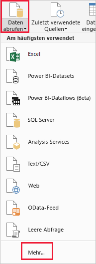
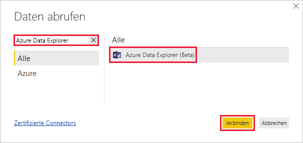
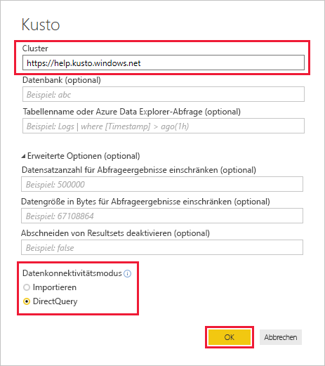
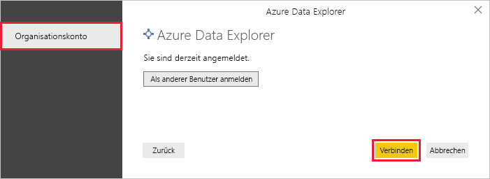
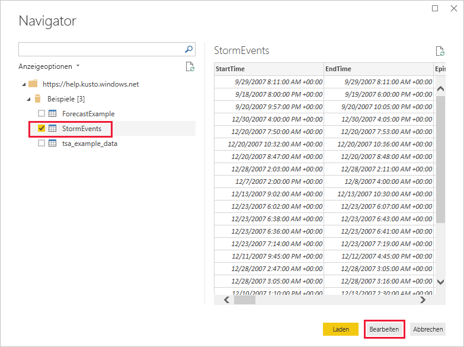
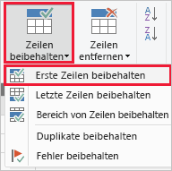
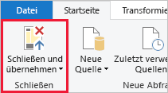

# Schnellstart: Visualisieren von Daten mithilfe des Azure Data Explorer-Connectors für Power BI

Azure-Daten-Explorer ist ein schneller und hochgradig skalierbarer Dienst zur Untersuchung von Daten (Protokoll- und Telemetriedaten). Power BI ist eine Business Analytics-Lösung, mit der Sie Ihre Daten visualisieren und die Ergebnisse in Ihrer Organisation teilen können.

Azure Data Explorer bietet drei Optionen für die Verbindungsherstellung mit Daten in Power BI: Verwenden des integrierten Connectors, Importieren einer Abfrage aus Azure Data Explorer oder Verwenden einer SQL-Abfrage. In dieser Schnellstartanleitung wird der integrierte Connector verwendet, um Daten abzurufen und in einem Power BI-Bericht zu visualisieren.

Wenn Sie über kein Azure-Abonnement verfügen, können Sie ein [kostenloses Azure-Konto](https://azure.microsoft.com/free/) erstellen, bevor Sie beginnen.

## Voraussetzungen

Für diesen Schnellstart benötigen Sie Folgendes:

* Ein Organisations-E-Mail-Konto, das Azure Active Directory angehört, um eine Verbindung mit dem [Azure Data Explorer-Hilfecluster](https://dataexplorer.azure.com/clusters/help/databases/samples) herstellen zu können.

* [Power BI Desktop](https://powerbi.microsoft.com/get-started/) (wählen Sie **KOSTENLOS HERUNTERLADEN** aus)

## Abrufen von Daten aus Azure Data Explorer

Sie stellen zunächst eine Verbindung mit dem Azure Data Explorer-Hilfecluster her und fügen dann eine Teilmenge der Daten aus der Tabelle *StormEvents* ein. [!INCLUDE [data-explorer-storm-events](../../includes/data-explorer-storm-events.md)]

1. Wählen Sie in Power BI Desktop auf der Registerkarte **Start** die Option **Daten abrufen** und anschließend **Mehr** aus.

    

1. Suchen Sie nach *Azure Data Explorer*, und wählen Sie dann **Azure Data Explorer (Beta)** und anschließend **Verbinden** aus.

    

1. Klicken Sie auf dem Bildschirm **Connector (Vorschau)** auf **Fortfahren**.

1. Füllen Sie das Formular im nächsten Bildschirm mit den folgenden Informationen aus:

    

    **Einstellung** | **Wert** | **Feldbeschreibung**
    |---|---|---|
    | Cluster | *https://help.kusto.windows.net* | Die URL für den Hilfecluster. Für andere Cluster hat die URL das Format *https://\<Clustername\>.\<Region\>.kusto.windows.net*. |
    | Datenbank | Nicht ausfüllen | Eine Datenbank, die in dem Cluster gehostet wird, mit dem Sie eine Verbindung herstellen. Wird in einem späteren Schritt ausgewählt. |
    | Tabellenname | Nicht ausfüllen | Eine der Tabellen in der Datenbank oder eine Abfrage wie <code>StormEvents \| take 1000</code> Wird in einem späteren Schritt ausgewählt. |
    | Erweiterte Optionen | Nicht ausfüllen | Optionen für Ihre Abfragen (etwa die Größe des Resultsets). |
    | Datenkonnektivitätsmodus | *DirectQuery* | Bestimmt, ob Power BI die Daten importiert oder direkt eine Verbindung mit der Datenquelle herstellt. Für diesen Connector sind beide Optionen geeignet. |
    | | | |

1. Falls Sie noch nicht über eine Verbindung mit dem Hilfecluster verfügen, melden Sie sich an. Melden Sie sich mit einem Organisationskonto an, und wählen Sie dann **Verbinden** aus.

    

1. Erweitern Sie im Bildschirm **Navigator** die Datenbank **Samples**, und wählen Sie **StormEvents** > **Bearbeiten** aus.

    

    Die Tabelle wird im Power Query-Editor geöffnet. Dort können Sie die Zeilen und Spalten bearbeiten, bevor die Daten importiert werden.

1. Wählen Sie im Power Query-Editor den Pfeil neben der Spalte **DamageCrops** und anschließend **Absteigend sortieren** aus.

    

1. Wählen Sie auf der Registerkarte **Start** die Option **Zeilen beibehalten** und anschließend **Erste Zeilen beibehalten** aus. Geben Sie den Wert *1.000* ein, um die ersten 1.000 Zeilen der sortierten Tabelle zu importieren.

    

1. Klicken Sie auf der Registerkarte **Start** auf **Schließen und übernehmen**.

    

## Visualisieren von Daten in einem Bericht

[!INCLUDE [data-explorer-power-bi-visualize-basic](../../includes/data-explorer-power-bi-visualize-basic.md)]

## Bereinigen von Ressourcen

Wenn Sie den Bericht, den Sie für diesen Schnellstart erstellt haben, nicht mehr benötigen, löschen Sie die Power BI Desktop-Datei (PBIX-Datei).

## Nächste Schritte

> [!div class="nextstepaction"]
> [Schnellstart: Visualisieren von Daten mithilfe einer importierten Abfrage in Power BI](power-bi-imported-query.md)
