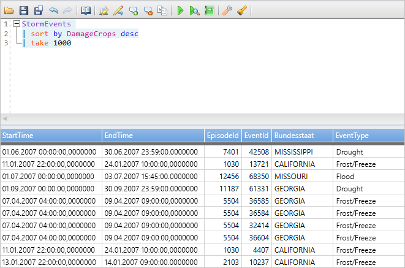
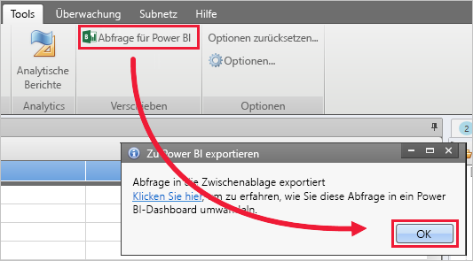
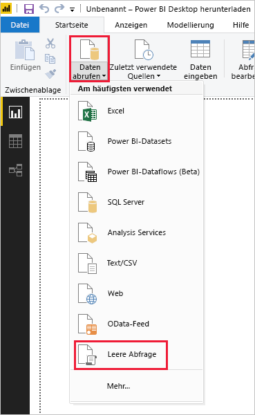
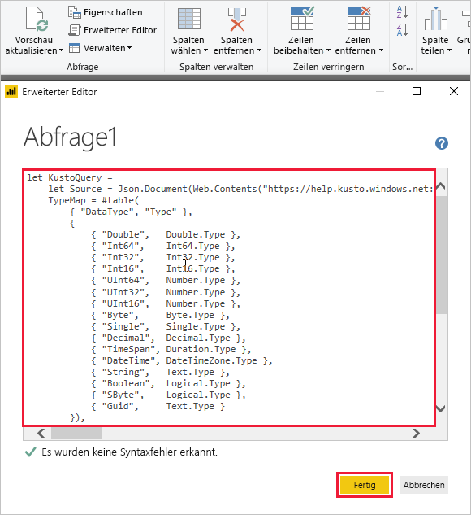
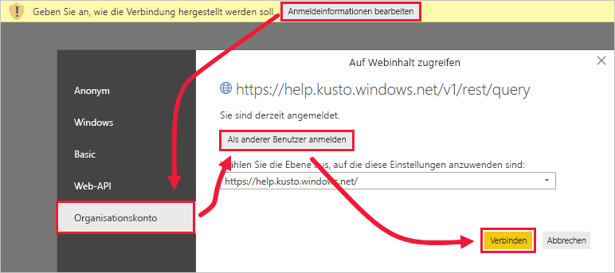
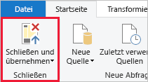

# <a name="quickstart-visualize-data-using-a-query-imported-into-power-bi"></a>Schnellstart: Visualisieren von Daten mithilfe einer in Power BI importierten Abfrage

Azure-Daten-Explorer ist ein schneller und hochgradig skalierbarer Dienst zur Untersuchung von Daten (Protokoll- und Telemetriedaten). Power BI ist eine Business Analytics-Lösung, mit der Sie Ihre Daten visualisieren und die Ergebnisse in Ihrer Organisation teilen können.

Azure Data Explorer bietet drei Optionen für die Verbindungsherstellung mit Daten in Power BI: Verwenden des integrierten Connectors, Importieren einer Abfrage aus Azure Data Explorer oder Verwenden einer SQL-Abfrage. In diesem Schnellstart wird erläutert, wie Sie eine Abfrage importieren, um Daten abzurufen und in einem Power BI-Bericht zu visualisieren.

Wenn Sie über kein Azure-Abonnement verfügen, können Sie ein [kostenloses Azure-Konto](https://azure.microsoft.com/free/) erstellen, bevor Sie beginnen.

## <a name="prerequisites"></a>Voraussetzungen

Für diesen Schnellstart benötigen Sie Folgendes:

* Ein Organisations-E-Mail-Konto, das Azure Active Directory angehört, um eine Verbindung mit dem [Azure Data Explorer-Hilfecluster](https://dataexplorer.azure.com/clusters/help/databases/samples) herstellen zu können.

* [Power BI Desktop](https://powerbi.microsoft.com/get-started/) (wählen Sie **KOSTENLOS HERUNTERLADEN** aus)

* [Azure Data Explorer-Desktop-App](/azure/kusto/tools/kusto-explorer)

## <a name="get-data-from-azure-data-explorer"></a>Abrufen von Daten aus Azure Data Explorer

Sie erstellen zunächst in der Azure Data Explorer-Desktop-App eine Abfrage, die Sie zur Verwendung in Power BI exportieren. Anschließend stellen Sie eine Verbindung mit dem Azure Data Explorer-Hilfecluster her, und Sie fügen eine Teilmenge der Daten aus der Tabelle *StormEvents* ein. [!INCLUDE [data-explorer-storm-events](../../includes/data-explorer-storm-events.md)]

1. Navigieren Sie in einem Browser zu [https://help.kusto.windows.net/](https://help.kusto.windows.net/), um die Azure Data Explorer-Desktop-App zu starten.

1. Kopieren Sie in der Desktop-App die folgende Abfrage in das obere rechte Abfragefenster, und führen Sie sie aus.

    ```Kusto
    StormEvents
    | sort by DamageCrops desc
    | take 1000
    ```

    Die ersten Zeilen des Resultsets sollten in etwa wie die Zeilen in der folgenden Abbildung aussehen.

    

1. Klicken Sie auf der Registerkarte **Tools** auf **Query to Power BI** (Abfrage in Power BI) und dann auf **OK**.

    

1. Wählen Sie in Power BI Desktop auf der Registerkarte **Start** die Option **Daten abrufen** und anschließend **Leere Abfrage** aus.

    

1. Wählen Sie im Power Query-Editor auf der Registerkarte **Start** die Option **Erweiterter Editor** aus.

1. Fügen Sie im Fenster **Erweiterter Editor** die Abfrage ein, die Sie exportiert haben, und klicken Sie dann auf **Fertig**.

    

1. Wählen Sie im Hauptfenster des Power Query-Editors **Anmeldeinformationen bearbeiten** aus. Wählen Sie **Organisationskonto** aus, melden Sie sich an, und klicken Sie dann auf **Verbinden**.

    

1. Klicken Sie auf der Registerkarte **Start** auf **Schließen und übernehmen**.

    

## <a name="visualize-data-in-a-report"></a>Visualisieren von Daten in einem Bericht

[!INCLUDE [data-explorer-power-bi-visualize-basic](../../includes/data-explorer-power-bi-visualize-basic.md)]

## <a name="clean-up-resources"></a>Bereinigen von Ressourcen

Wenn Sie den Bericht, den Sie für diesen Schnellstart erstellt haben, nicht mehr benötigen, löschen Sie die Power BI Desktop-Datei (PBIX-Datei).

## <a name="next-steps"></a>Nächste Schritte

> [!div class="nextstepaction"]
> [Schnellstart: Visualisieren von Daten mithilfe einer importierten Abfrage in Power BI](power-bi-sql-query.md)