# <a name="quickstart-query-data-in-azure-data-explorer"></a>Schnellstart: Abfragen von Daten im Azure-Daten-Explorer

Azure-Daten-Explorer ist ein schneller und hochgradig skalierbarer Dienst zur Untersuchung von Daten (Protokoll- und Telemetriedaten). Der Azure-Daten-Explorer bietet eine Webanwendung, mit der Sie Abfragen ausführen und freigeben können. Die Anwendung steht im Azure-Portal sowie als eigenständige Webanwendung zur Verfügung. In diesem Artikel arbeiten Sie in der eigenständigen Version, mit der Sie Verbindungen mit mehreren Clustern herstellen und Deep-Links zu Ihren Abfragen freigeben können.

Wenn Sie über kein Azure-Abonnement verfügen, können Sie ein [kostenloses Azure-Konto](https://azure.microsoft.com/free/) erstellen, bevor Sie beginnen.

## <a name="prerequisites"></a>Voraussetzungen

Zusätzlich zu einem Azure-Abonnement benötigen Sie zum Abschließen dieses Schnellstarts [einen Testcluster und eine Testdatenbank](create-cluster-database-portal.md).

## <a name="sign-in-to-the-application"></a>Anmelden bei der Anwendung

Melden Sie sich bei der [Anwendung](https://dataexplorer.azure.com/) an.

## <a name="add-clusters"></a>Hinzufügen von Clustern

Wenn Sie die Anwendung zum ersten Mal öffnen, sind keine Verbindungen vorhanden.


Sie müssen eine Verbindung mit mindestens einem Cluster hinzufügen, bevor Sie Abfragen ausführen können. In diesem Abschnitt fügen Sie Verbindungen mit dem *Hilfecluster* des Azure-Daten-Explorers, den wir als Hilfestellung beim Lernen eingerichtet haben, und mit dem Testcluster, den Sie in einem früheren Schnellstart erstellt haben, hinzu.

1. Wählen Sie in der oberen linken Ecke der Anwendung **Add cluster** (Cluster hinzufügen) aus.

1. Geben Sie im Dialogfeld **Cluster hinzufügen** die Adresse `https://help.kusto.windows.net` ein, und wählen Sie dann **Hinzufügen** aus.

1. Im linken Bereich sollten jetzt der **Hilfecluster** angezeigt werden. Erweitern Sie die Datenbank **Samples**, damit Sie die Beispieltabellen sehen können, auf die Sie zugreifen können.

    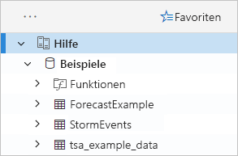

    Wir verwenden die Tabelle **StormEvents** weiter unten in diesem Schnellstart und in anderen Artikeln zum Azure-Daten-Explorer.

Fügen Sie nun den erstellten Testcluster hinzu.

1. Wählen Sie **Cluster hinzufügen** aus.

1. Geben Sie im Dialogfeld **Cluster hinzufügen** die URL Ihres Testclusters im Format `https://<ClusterName>.<Region>.kusto.windows.net/` ein, und wählen Sie dann **Hinzufügen** aus.

    Das Beispiel unten enthält den **Hilfecluster** und einen neuen Cluster, **docscluster.westus** (vollständige URL: `https://docscluster.westus.kusto.windows.net/`).

    

## <a name="run-queries"></a>Ausführen von Abfragen

Sie können jetzt Abfragen für alle Cluster ausführen, mit denen Sie verbunden sind (vorausgesetzt, in Ihrem Testcluster sind Daten vorhanden). Wir konzentrieren uns auf den **Hilfecluster**.

1. Wählen Sie im linken Bereich unter dem **Hilfecluster** die Datenbank **Samples** aus.

1. Kopieren Sie die folgende Abfrage, und fügen Sie sie im Abfragefenster ein. Wählen Sie oben im Fenster **Ausführen**aus.

    ```Kusto
    StormEvents
    | sort by StartTime desc
    | take 10
    ```
    Diese Abfrage gibt die zehn neuesten Datensätze in der Tabelle **StormEvents** zurück. Die linke Seite des Ergebnisses sollte der folgenden Tabelle ähneln.

    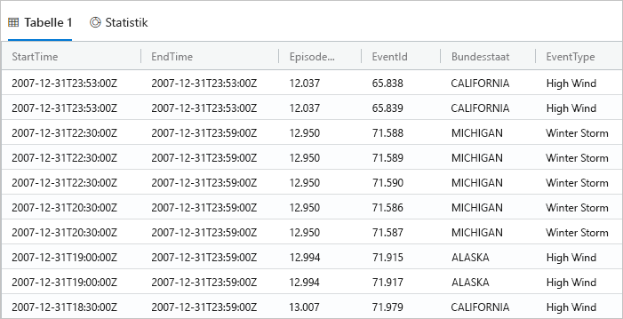

    Die folgende Abbildung zeigt den Zustand, den die Anwendung nun aufweisen sollte, zusammen mit hinzugefügten Clustern und einer Abfrage mit Ergebnissen.

    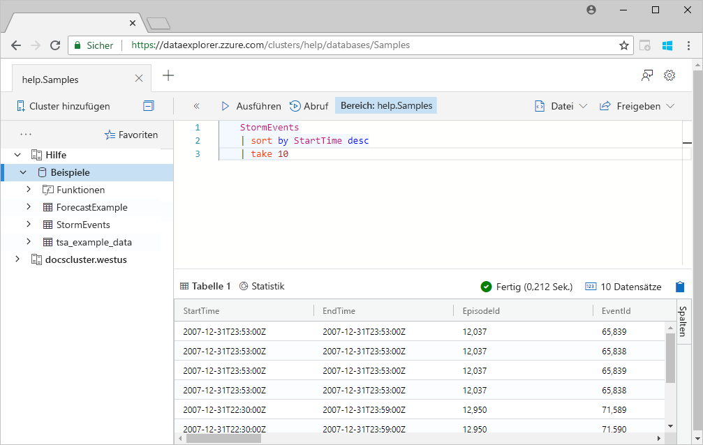

1. Kopieren Sie die folgende Abfrage, und fügen Sie sie im Abfragefenster unter der ersten Abfrage ein. Beachten Sie, dass sie nicht in separaten Zeilen formatiert wird wie die erste Abfrage.

    ```Kusto
    StormEvents | sort by StartTime desc | project StartTime, EndTime, State, EventType, DamageProperty, EpisodeNarrative | take 10
    ```

1. Klicken Sie auf die neue Abfrage im Fenster, um sie auszuwählen. Drücken Sie UMSCHALT+ALT+F, um die Abfrage zu formatieren, sodass sie wie folgt aussieht.

    

1. Drücken Sie UMSCHALT+EINGABE. Dies ist eine Tastenkombination zum Ausführen einer Abfrage.

   Diese Abfrage gibt dieselben Datensätze wie die erste zurück, schließt aber nur die in der `project`-Anweisung angegebenen Spalten ein. Das Ergebnis sollte der folgenden Tabelle ähneln.

    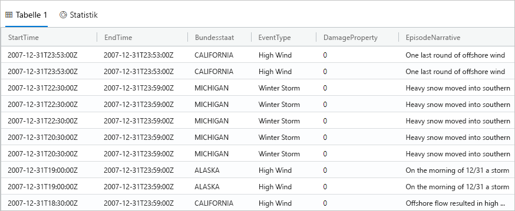

1. Wählen Sie oben im Abfragefenster **Abruf** aus.

    Im Abfragefenster werden nun die Ergebnisse der ersten Abfrage angezeigt, ohne dass die Abfrage erneut ausgeführt werden muss. Häufig führen Sie bei der Analyse mehrere Abfragen aus. Mit **Abruf** können Sie die Ergebnisse der vorherigen Abfragen erneut abrufen.

1. Führen Sie nun eine weitere Abfrage aus, um eine andere Art von Ausgabe zu sehen.

    ```Kusto
    StormEvents
    | summarize event_count=count(), mid = avg(BeginLat) by State
    | sort by mid
    | where event_count > 1800
    | project State, event_count
    | render columnchart
    ```
    Das Ergebnis sollte dem folgenden Diagramm ähneln.

    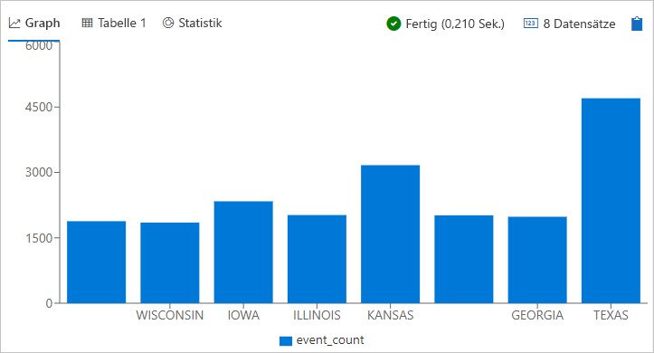

## <a name="work-with-the-table-grid"></a>Arbeiten mit dem Tabellenraster

Nun, da Sie wissen, wie grundlegende Abfragen funktionieren, sehen wir uns an, wie Sie mit dem Tabellenraster Ergebnisse anpassen und weitere Analysen ausführen können.

1. Führen Sie die erste Abfrage erneut aus. Zeigen Sie mit der Maus auf die Spalte **State** (Bundesstaat), und wählen Sie das Menü und dann **Group by State** (Nach Bundesstaat gruppieren) aus.

    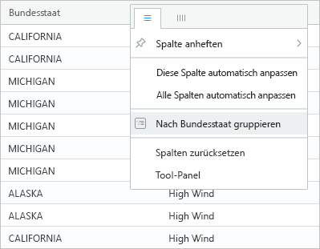

1. Erweitern Sie im Raster **California** (Kalifornien), um Datensätze für diesen Bundesstaat anzuzeigen.

    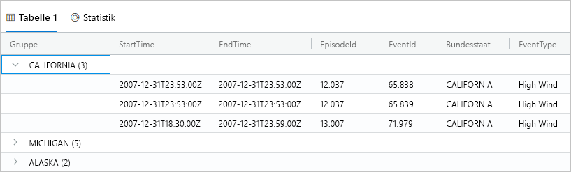

    Diese Art der Gruppierung kann hilfreich sein, wenn Sie explorative Analysen durchführen.

1. Zeigen Sie mit der Maus auf die Spalte **Group** (Gruppe), und wählen Sie dann **Spalten zurücksetzen** aus.

    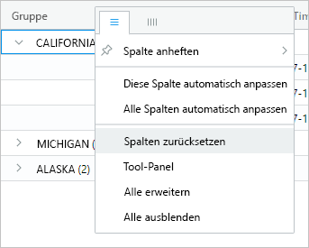

    Dadurch wird das Raster auf den ursprünglichen Zustand zurückgesetzt.

1. Führen Sie die folgende Abfrage aus.

    ```Kutso
    StormEvents
    | sort by StartTime desc
    | where DamageProperty > 5000
    | project StartTime, State, EventType, DamageProperty, Source
    | take 10
    ```

1. Wählen Sie auf der rechten Seite des Rasters **Spalten** aus, um den Toolbereich anzuzeigen.

    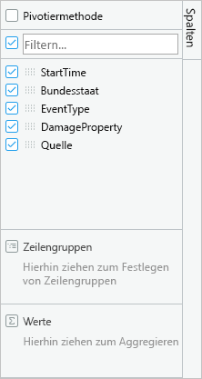

    Dieser Bereich funktioniert ähnlich wie die PivotTable-Feldliste in Excel, da Sie hier weitere Analysen im Raster selbst durchführen können.

1. Wählen Sie **Pivot-Modus** aus, und ziehen Sie die Spalten wie folgt: **State** (Bundesstaat) nach **Row groups** (Zeilengruppen), **DamageProperty** nach **Values** (Werte) und **EventType** nach **Column labels** (Spaltenbezeichnungen).  

    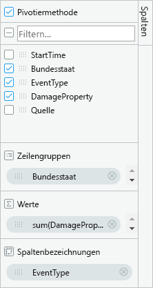

    Das Ergebnis sollte der folgenden PivotTable ähneln.

    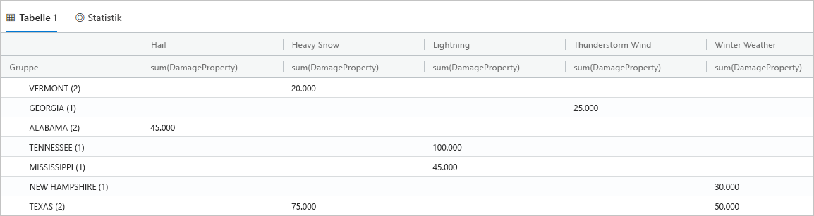

    Beachten Sie, dass Vermont und Alabama jeweils zwei Ereignisse in derselben Kategorie aufweisen, während Texas zwei Ereignisse in verschiedenen Kategorien aufweist. PivotTables ermöglichen Ihnen, solche Elemente schnell zu erkennen, und sie stellen ein großartiges Tool für die schnelle Analyse dar.

## <a name="share-queries"></a>Freigeben von Abfragen

Häufig möchten Sie die erstellten Abfragen freigeben. Sie können einen Deep-Link angeben, damit andere Benutzer mit Zugriff auf den Cluster die Abfragen ausführen können.

1. Wählen Sie im Abfragefenster die erste Abfrage aus, die Sie hineinkopiert haben.

1. Wählen Sie oben im Abfragefenster **Freigeben** aus.

1. Wählen Sie **Link, query to clipboard** (Link und Abfrage in Clipboard kopieren) aus.

1. Kopieren Sie den Link und die Abfrage in eine Textdatei.

1. Fügen Sie den Link in einem neuen Browserfenster ein. Das Ergebnis sollte nach dem Ausführen der Abfrage dem folgenden ähneln.

    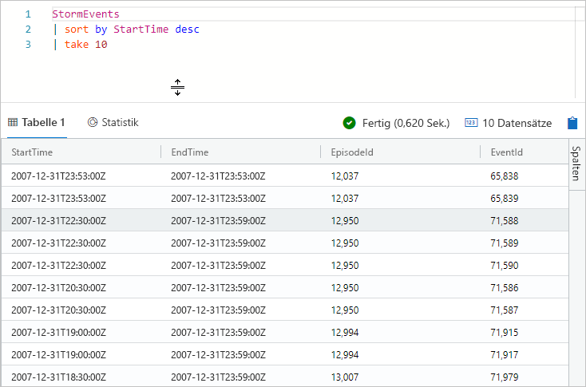

## <a name="provide-feedback"></a>Feedback geben

Der Daten-Explorer befindet sich derzeit in der Vorschauphase, und wir freuen uns über Feedback zu Ihren Erfahrungen. Sie können uns dies nun mitteilen oder warten, bis Sie mehr Zeit damit verbracht haben.

1. Wählen Sie rechts oben in der Anwendung das Feedbacksymbol aus: .

1. Geben Sie Ihr Feedback ein, und wählen Sie dann **Senden** aus.

## <a name="clean-up-resources"></a>Bereinigen von Ressourcen

In diesem Schnellstart haben Sie keine Ressourcen erstellt, aber wenn Sie einen oder beide Cluster aus der Anwendung entfernen möchten, klicken Sie mit der rechten Maustaste auf den Cluster, und wählen Sie **Verbindung entfernen** aus.

## <a name="next-steps"></a>Nächste Schritte

> [!div class="nextstepaction"]
> [Schreiben von Abfragen für den Azure-Daten-Explorer](write-queries.md)