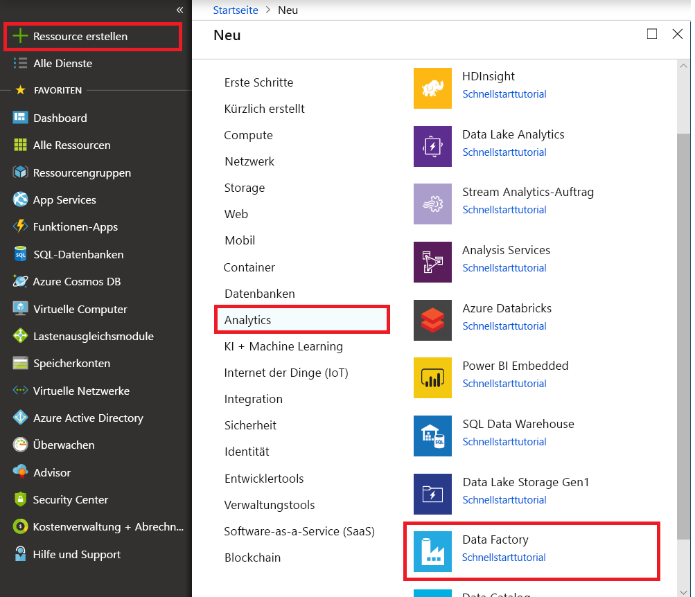
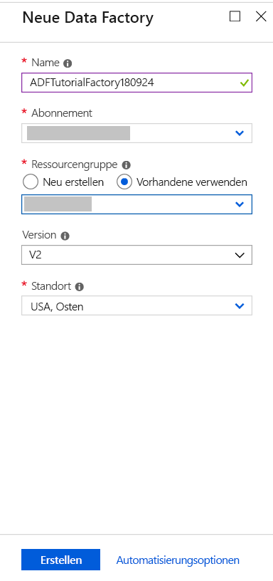

# Erstellen einer Data Factory über das Azure-Portal
Azure Data Factory ist ein cloudbasierter Datenintegrationsdienst, mit dem Sie datengesteuerte Workflows in der Cloud erstellen können, um Datenverschiebungen und Datentransformationen zu orchestrieren und zu automatisieren. Mit Azure Data Factory können Sie datengesteuerte Workflows (sogenannte Pipelines) erstellen und planen, die Daten aus unterschiedlichen Datenspeichern erfassen, diese Daten mithilfe von Compute Services wie Azure HDInsight Hadoop, Spark, Azure Data Lake Analytics und Azure Machine Learning verarbeiten/transformieren und die Ausgabedaten für Datenspeicher wie Azure SQL Data Warehouse veröffentlichen, damit diese von Business Intelligence (BI)-Anwendungen genutzt werden können. 

In dieser Schnellstartanleitung verwenden Sie das Azure-Portal, um eine Data Factory zu erstellen. Nach dem Erstellen der Data Factory müssen Sie – wie in anderen Schnellstartanleitungen auch – PowerShell, das .NET SDK, das Python SDK oder die REST-API als Datenpipeline verwenden, um Daten aus einem Quelldatenspeicher in einen Zieldatenspeicher zu kopieren. Zurzeit können Sie Pipelines in einer Data Factory nicht über das Azure-Portal erstellen.

Wenn Sie kein Azure-Abonnement besitzen, können Sie ein [kostenloses Konto](https://azure.microsoft.com/free/) erstellen, bevor Sie beginnen.

## Anmelden beim Azure-Portal
Melden Sie sich beim [Azure-Portal](https://portal.azure.com/)an.

## Erstellen einer Data Factory
Die folgenden Schritte führen Sie im Rahmen dieser Schnellstartanleitung aus:
1. Klicken Sie im Menü auf der linken Seite nacheinander auf **Neu**, **Data + Analytics** und **Data Factory**. 
   
   
2. Geben Sie auf dem Blatt **Neue Data Factory** unter **Name** die Zeichenfolge **ADFTutorialDataFactory** ein. 
      
     
 
   Der Name der Azure Data Factory muss **global eindeutig**sein. Sollte der folgende Fehler auftreten, ändern Sie den Namen der Data Factory (beispielsweise in „<IhrName>ADFTutorialDataFactory“), und wiederholen Sie den Vorgang. Benennungsregeln für Data Factory-Artefakte finden Sie im Thema [Data Factory – Benennungsregeln](naming-rules.md) .
  
       `Data factory name “ADFTutorialDataFactory” is not available`
3. Wählen Sie Ihr **Azure-Abonnement** aus, in dem die Data Factory erstellt werden soll. 
4. Führen Sie für die **Ressourcengruppe** einen der folgenden Schritte aus:
     
      - Wählen Sie die Option **Use existing**(Vorhandene verwenden) und dann in der Dropdownliste eine vorhandene Ressourcengruppe. 
      - Wählen Sie **Neu erstellen**, und geben Sie den Namen einer Ressourcengruppe ein.   
         
      Bei einigen Schritten dieses Tutorials wird davon ausgegangen, dass Sie die Ressourcengruppe namens **ADFTutorialResourceGroup** verwenden. Weitere Informationen über Ressourcengruppen finden Sie unter [Verwenden von Ressourcengruppen zum Verwalten von Azure-Ressourcen](../azure-resource-manager/resource-group-overview.md).  
4. Wählen Sie **V2 (Vorschau)** als **Version** aus.
5. Wählen Sie den **Standort** für die Data Factory aus. Zurzeit können Sie Data Factorys der Version „V2“ nur in der Region **USA, Osten** erstellen. Die in Data Factorys verwendeten Computingressourcen und Datenspeicher können sich in anderen Regionen befinden. 
6. Wählen Sie die Option **An Dashboard anheften** aus.     
7. Klicken Sie auf **Erstellen**.
      
      > [!IMPORTANT]
      > Zum Erstellen von Data Factory-Instanzen müssen Sie Mitglied der Rolle [Data Factory-Mitwirkender](../active-directory/role-based-access-built-in-roles.md#data-factory-contributor) auf Abonnement- bzw. Ressourcengruppenebene sein.
      > 
      > Der Name der Data Factory kann in Zukunft als DNS-Name registriert und so öffentlich sichtbar werden.             
3. Auf dem Dashboard sehen Sie die folgende Kachel mit dem Status: **Die Data Factory wird bereitgestellt**. 

    
1. Nach Abschluss der Erstellung wird das Blatt **Data Factory** wie in dieser Abbildung angezeigt:
   
   

## Nächste Schritte
Die Pipeline in diesem Beispiel kopiert Daten in einem Azure Blob Storage von einem Speicherort in einen anderen. Arbeiten Sie die [Tutorials](tutorial-copy-data-dot-net.md) durch, um zu erfahren, wie Sie Data Factory in anderen Szenarien verwenden können. 
