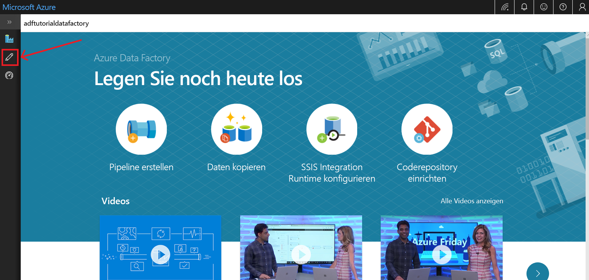
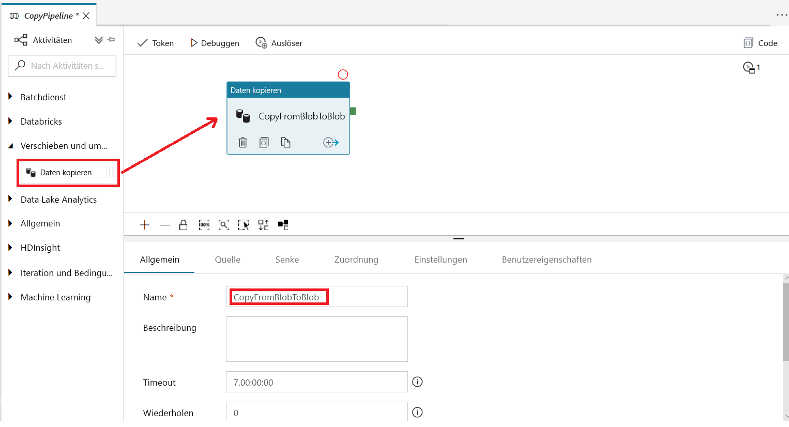
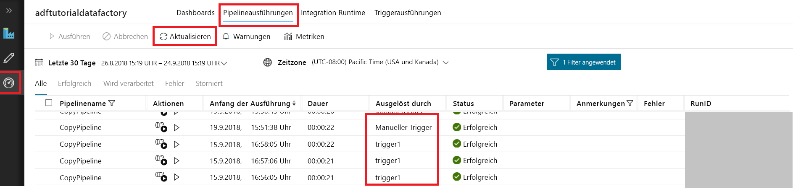
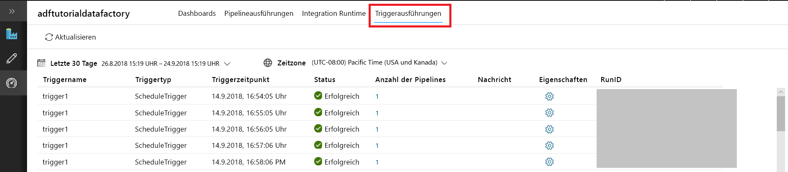

# Erstellen einer Data Factory über die Azure Data Factory-Benutzeroberfläche
> [!div class="op_single_selector" title1="Select the version of Data Factory service that you are using:"]
> * [Version 1: allgemein verfügbar](v1/data-factory-copy-data-from-azure-blob-storage-to-sql-database.md)
> * [Version 2 – Vorschauversion](quickstart-create-data-factory-portal.md)

Diese Schnellstartanleitung beschreibt, wie Sie mithilfe der Azure Data Factory-Benutzeroberfläche eine Data Factory erstellen und überwachen. Die in dieser Data Factory erstellte Pipeline *kopiert* Daten aus einem Ordner in einen anderen Ordner in Azure Blob Storage. Ein Tutorial zum *Transformieren* von Daten mithilfe von Azure Data Factory finden Sie im Tutorial [Transformieren von Daten in der Cloud mithilfe einer Spark-Aktivität in Azure Data Factory](tutorial-transform-data-spark-portal.md). 

> [!NOTE]
> Wenn Sie mit Azure Data Factory nicht vertraut sind, lesen Sie vor der Durchführung dieses Schnellstarts die Informationen unter [Einführung in Azure Data Factory](data-factory-introduction.md). 
>
> Dieser Artikel bezieht sich auf Version 2 von Data Factory, die zurzeit als Vorschau verfügbar ist. Wenn Sie die allgemein verfügbare Version 1 des Diensts verwenden, hilft Ihnen das [Tutorial zu Data Factory Version 1](v1/data-factory-copy-data-from-azure-blob-storage-to-sql-database.md) weiter.

[!INCLUDE [data-factory-quickstart-prerequisites](../../includes/data-factory-quickstart-prerequisites.md)] 

### Video 
Dieses Video enthält Informationen zur Data Factory-Benutzeroberfläche: 
>[!VIDEO https://channel9.msdn.com/Shows/Azure-Friday/Visually-build-pipelines-for-Azure-Data-Factory-v2/Player]

## Erstellen einer Data Factory

1. Starten Sie den Webbrowser **Microsoft Edge** oder **Google Chrome**. Die Data Factory-Benutzeroberfläche wird zurzeit nur in den Webbrowsern Microsoft Edge und Google Chrome unterstützt.
2. Öffnen Sie das [Azure-Portal](https://portal.azure.com). 
3. Klicken Sie im linken Menü auf **Neu** und anschließend auf **Daten + Analysen** und **Data Factory**. 
   
   
2. Geben Sie auf der Seite **Neue Data Factory** unter **Name** den Namen **ADFTutorialDataFactory** ein. 
      
   
 
   Der Name der Azure Data Factory muss *global eindeutig*sein. Sollte der folgende Fehler auftreten, ändern Sie den Namen der Data Factory (beispielsweise in **&lt;IhrName&gt;ADFTutorialDataFactory**), und wiederholen Sie den Vorgang. Benennungsregeln für Data Factory-Artefakte finden Sie im Artikel [Azure Data Factory – Benennungsregeln](naming-rules.md).
  
   
3. Wählen Sie unter **Abonnement** Ihr Azure-Abonnement aus, in dem die Data Factory erstellt werden soll. 
4. Führen Sie unter **Ressourcengruppe** einen der folgenden Schritte aus:
     
   - Wählen Sie die Option **Use existing** (Vorhandene verwenden) und dann in der Dropdownliste eine vorhandene Ressourcengruppe. 
   - Wählen Sie **Neu erstellen**, und geben Sie den Namen einer Ressourcengruppe ein.   
         
   Weitere Informationen über Ressourcengruppen finden Sie unter [Verwenden von Ressourcengruppen zum Verwalten von Azure-Ressourcen](../azure-resource-manager/resource-group-overview.md).  
4. Wählen Sie **V2 (Vorschau)** als **Version** aus.
5. Wählen Sie unter **Standort** den Standort für die Data Factory aus.

   Die Liste enthält nur von Data Factory unterstützte Standorte. Die von Data Factory verwendeten Datenspeicher (etwa Azure Storage und Azure SQL-Datenbank) und Computedienste (etwa Azure HDInsight) können sich an anderen Standorten befinden.
6. Wählen Sie die Option **An Dashboard anheften** aus.     
7. Klicken Sie auf **Erstellen**.
8. Auf dem Dashboard sehen Sie die folgende Kachel mit dem Status **Deploying Data Factory** (Data Factory wird bereitgestellt...): 

   
9. Nach Abschluss der Erstellung wird die Seite **Data Factory** angezeigt. Klicken Sie auf die Kachel **Erstellen und überwachen**, um die Anwendung für die Azure Data Factory-Benutzeroberfläche (User Interface, UI) auf einer separaten Registerkarte zu starten.
   
   
10. Wechseln Sie auf der Seite **Erste Schritte** im linken Bereich zur Registerkarte **Bearbeiten**. 

    

## Erstellen eines verknüpften Diensts
In diesem Verfahren erstellen Sie einen verknüpften Dienst, der Ihr Azure-Speicherkonto mit der Data Factory verbindet. Der verknüpfte Dienste enthält die Verbindungsinformationen, die der Data Factory-Dienst zur Laufzeit zur Verbindungsherstellung verwendet.

1. Klicken Sie auf **Verbindungen** und dann auf der Symbolleiste auf die Schaltfläche **Neu**. 

       
2. Wählen Sie auf der Seite **Neuer verknüpfter Dienst** die Option **Azure Blob Storage**, und klicken Sie dann auf **Weiter**. 

   
3. Führen Sie die folgenden Schritte aus: 

   a. Geben Sie unter **Name** den Namen **AzureStorageLinkedService** ein.

   b. Wählen Sie unter **Speicherkontoname** den Namen Ihres Azure-Speicherkontos aus.

   c. Klicken Sie auf **Verbindung testen**, um zu überprüfen, ob der Data Factory-Dienst eine Verbindung mit dem Speicherkonto herstellen kann. 

   d. Klicken Sie auf **Speichern**, um den verknüpften Dienst zu speichern. 

    
4. Vergewissern Sie sich, dass **AzureStorageLinkedService** in der Liste der verknüpften Dienste angezeigt wird. 

   

## Erstellen von Datasets
In diesem Verfahren erstellen Sie zwei Datasets: **InputDataset** und **OutputDataset**. Diese Datasets sind vom Typ **AzureBlob**. Sie verweisen auf den mit Azure Storage verknüpften Dienst, den Sie im vorherigen Abschnitt erstellt haben. 

Das Eingabedataset stellt die Quelldaten im Eingabeordner dar. In der Definition des Eingabedatasets geben Sie den Blobcontainer (**adftutorial**), den Ordner (**input**) und die Datei (**emp.txt**) mit den Quelldaten an. 

Das Ausgabedataset stellt die Daten dar, die zum Ziel kopiert werden. In der Definition des Ausgabedatasets geben Sie den Blobcontainer (**adftutorial**), den Ordner (**output**) und die Datei an, in die die Daten kopiert werden. Jeder Ausführung einer Pipeline wird eine eindeutige ID zugeordnet. Sie können auf diese ID mithilfe der Systemvariablen **RunId** zugreifen. Der Name der Ausgabedatei wird basierend auf der Ausführungs-ID der Pipeline dynamisch ausgewertet.   

In den Einstellungen des verknüpften Diensts haben Sie das Azure-Speicherkonto angegeben, das die Quelldaten enthält. In den Einstellungen des Quelldatasets geben Sie an, wo genau sich die Quelldaten befinden (Blobcontainer, Order und Datei). In den Einstellungen des Senkendatasets geben Sie an, wohin die Daten kopiert werden (Blobcontainer, Order und Datei). 
 
1. Klicken Sie auf die Schaltfläche **+** (Plus) und dann auf **Dataset**.

   
2. Wählen Sie auf der Seite **Neues Dataset** die Option **Azure Blob Storage**, und klicken Sie dann auf **Fertig stellen**. 

   
3. Geben Sie im Fenster **Eigenschaften** für das Dataset als **Name** den Namen **InputDataset** ein. 

   
4. Wechseln Sie zur Registerkarte **Verbindung**, und führen Sie die folgenden Schritte aus: 

   a. Wählen Sie unter **Verknüpfter Dienst** die Option **AzureStorageLinkedService**.

   b. Klicken Sie neben **Dateipfad** auf die Schaltfläche **Durchsuchen**.

       c. Navigieren Sie im Fenster **Choose a file or folder** (Datei oder Ordner auswählen) zum Ordner **input** im Container **adftutorial**, wählen Sie die Datei **emp.txt** aus, und klicken Sie auf **Fertig stellen**.

      
    
   d. (optional) Klicken Sie auf **Datenvorschau**, um eine Vorschau der Daten in der Datei „emp.txt“ anzuzeigen.     
5. Wiederholen Sie die Schritte zum Erstellen des Ausgabedatasets:  

   a. Klicken Sie auf die Schaltfläche **+** (Plus) und dann auf **Dataset**.

   b. Wählen Sie auf der Seite **Neues Dataset** die Option **Azure Blob Storage**, und klicken Sie dann auf **Fertig stellen**.

   c. Geben Sie als Name **OutputDataset** an.

   d. Geben Sie für den Ordner **adftutorial/output** an. Wenn der Ordner **output** nicht vorhanden ist, wird er von der Copy-Aktivität zur Laufzeit erstellt.

   e. Geben Sie `@CONCAT(pipeline().RunId, '.txt')` als Dateiname ein. 
   
      Bei jeder Ausführung einer Pipeline wird der Pipelineausführung eine eindeutige ID zugewiesen. Der Ausdruck verkettet die Ausführungs-ID der Pipeline mit **.txt**, um den Namen der Ausgabedatei zu bewerten. Eine Liste der unterstützten Systemvariablen und Ausdrücke finden Sie unter [Von Azure Data Factory unterstützte Systemvariablen](control-flow-system-variables.md) und [Ausdrücke und Funktionen in Azure Data Factory](control-flow-expression-language-functions.md).

   

## Erstellen einer Pipeline 
In diesem Schritt erstellen und überprüfen Sie eine Pipeline mit einer Copy-Aktivität, die das Eingabe- und Ausgabedataset verwendet. Die Copy-Aktivität kopiert Daten aus der in den Einstellungen des Eingabedatasets angegebenen Datei in die Datei, die in den Einstellungen des Ausgabedatasets angegeben ist. Wenn das Eingabedataset nur einen Ordner (nicht den Dateinamen) angibt, kopiert die Copy-Aktivität alle Dateien im Quellordner ans Ziel. 

1. Klicken Sie auf die Schaltfläche **+** (Plus) und dann auf **Pipeline**. 

   
2. Geben Sie im Fenster **Eigenschaften** für **Name** den Namen **CopyPipeline** ein. 

   
3. Erweitern Sie in der Toolbox **Aktivitäten** den Eintrag **Datenfluss**. Ziehen Sie die **Copy**-Aktivität aus der Toolbox **Aktivitäten** auf die Oberfläche des Pipeline-Designers. Sie können in der Toolbox **Aktivitäten** auch nach Aktivitäten suchen. Geben Sie unter **Name** den Namen **CopyFromBlobToBlob** ein.

   
4. Wechseln Sie in den Einstellungen der Copy-Aktivität zur Registerkarte **Quelle**, und wählen Sie für **Quelldataset** die Option **InputDataset** aus.

       
5. Wechseln Sie in den Einstellungen der Copy-Aktivität zur Registerkarte **Senke**, und wählen Sie für **Senkendataset** die Option **OutputDataset** aus.

       
7. Klicken Sie auf **Überprüfen**, um die Einstellungen der Pipeline zu überprüfen. Vergewissern Sie sich, dass die Pipeline überprüft wurde. Klicken Sie auf die Schaltfläche **>>** (Pfeil nach rechts), um die Ausgabe der Überprüfung zu schließen. 

   

## Ausführen eines Testlaufs für die Pipeline
In diesem Schritt führen Sie einen Testlauf für die Pipeline aus, bevor Sie sie in Data Factory bereitstellen. 

1. Klicken Sie auf der Symbolleiste für die Pipeline auf **Testlauf**. 
    
   
2. Überprüfen Sie, ob der Status der Pipelineausführung auf der Registerkarte **Ausgabe** der Pipelineeinstellungen angezeigt wird. 

       
3. Vergewissern Sie sich, dass im Ordner **output** des Containers **adftutorial** eine Ausgabedatei angezeigt wird. Ist der Ausgabeordner nicht vorhanden, wird er vom Data Factory-Dienst automatisch erstellt. 
    
   

## Manuelles Auslösen der Pipeline
In diesem Verfahren stellen Sie Entitäten (verknüpfte Dienste, Datasets, Pipelines) in Azure Data Factory bereit. Anschließend lösen Sie manuell eine Pipelineausführung aus. Sie können Entitäten auch in Ihrem eigenen Visual Studio Team Services-Git-Repository veröffentlichen. Die erforderlichen Schritte werden in einem [anderen Tutorial](tutorial-copy-data-portal.md?#configure-code-repository) behandelt.

1. Vor dem Auslösen einer Pipeline müssen Sie Entitäten in Data Factory veröffentlichen. Klicken Sie zum Veröffentlichen im linken Bereich auf **Alle veröffentlichen**. 

   
2. Klicken Sie zum manuellen Auslösen der Pipeline auf der Symbolleiste auf **Trigger** und dann auf **Trigger Now** (Jetzt auslösen). 
    
   

## Überwachen der Pipeline

1. Wechseln Sie im linken Bereich zur Registerkarte **Überwachen**. Aktualisieren Sie die Liste mithilfe der Schaltfläche **Aktualisieren**.

   
2. Klicken Sie unter **Aktionen** auf den Link **View Activity Runs** (Aktivitätsausführungen anzeigen). Auf dieser Seite wird der Status der Ausführung der Copy-Aktivität angezeigt. 

   
3. Wenn Sie Details zum Kopiervorgang anzeigen möchten, klicken Sie in der Spalte **Aktionen** auf den Link **Details** (Brillensymbol). Einzelheiten zu den Eigenschaften finden Sie unter [Kopieraktivität in Azure Data Factory](copy-activity-overview.md). 

   
4. Vergewissern Sie sich, dass im Ordner **output** eine neue Datei enthalten ist. 
5. Wenn Sie von der Ansicht **Aktivitätsausführungen** zurück zur Ansicht **Pipelineausführungen** wechseln möchten, klicken Sie auf den Link **Pipelines**. 

## Auslösen der Pipeline nach einem Zeitplan
Dieser Schritt ist in diesem Tutorial optional. Sie können einen *Planer-Trigger* erstellen, um eine regelmäßige Ausführung der Pipeline (stündlich, täglich usw.) festzulegen. In diesem Schritt erstellen Sie einen Trigger, der bis zur angegebenen Endzeit (Datum und Uhrzeit) minütlich ausgeführt wird. 

1. Wechseln Sie zur Registerkarte **Bearbeiten**. 

   
1. Klicken Sie im Menü auf **Trigger** und dann auf **Neu/Bearbeiten**. 

   
2. Klicken Sie auf der Seite **Add Triggers** (Trigger hinzufügen) auf **Choose trigger** (Trigger auswählen) und dann auf **Neu**. 

   
3. Aktivieren Sie auf der Seite **Neuer Trigger** unter **Ende** die Option **On Date** (Am), geben Sie eine Endzeit an, die einige Minuten nach der aktuellen Zeit liegt, und klicken Sie auf **Übernehmen**. 

   Da für jede Pipelineausführung Gebühren anfallen, sollten zwischen Endzeit und Startzeit nur wenige Minuten liegen. Vergewissern Sie sich, dass der gleiche Tag festgelegt ist. Stellen Sie jedoch sicher, dass zwischen Veröffentlichungszeit und Endzeit ausreichend Zeit für die Pipelineausführung bleibt. Der Trigger wird erst wirksam, nachdem Sie die Lösung in Data Factory veröffentlicht haben, nicht beim Speichern des Triggers auf der Benutzeroberfläche. 

   
4. Aktivieren Sie auf der Seite **Neuer Trigger** das Kontrollkästchen **Aktiviert**, und klicken Sie dann auf **Weiter**. 

   
5. Überprüfen Sie die Warnmeldung, und wählen Sie **Fertig stellen**.

   
6. Klicken Sie auf **Alle veröffentlichen**, um die Änderungen in Data Factory zu veröffentlichen. 

   
8. Wechseln Sie im linken Bereich zur Registerkarte **Überwachen**. Klicken Sie zum Aktualisieren der Liste auf **Aktualisieren**. Sie sehen, dass die Pipeline zwischen Veröffentlichungszeit und Endzeit minütlich ausgeführt wird. 

   Beachten Sie die Werte in der Spalte **Ausgelöst durch**. Die manuelle Triggerausführung stammt aus dem zuvor ausgeführten Schritt (**Trigger Now** (Jetzt auslösen)). 

   
9. Klicken Sie neben **Pipelineausführungen** auf den Pfeil nach unten, um zur Ansicht **Triggerausführungen** zu wechseln. 

       
10. Vergewissern Sie sich, dass für jede Pipelineausführung bis zur angegebenen Endzeit eine Ausgabedatei im Ordner **output** erstellt wird. 

## Nächste Schritte
Die Pipeline in diesem Beispiel kopiert Daten in Azure Blob Storage von einem Speicherort in einen anderen. Arbeiten Sie die [Tutorials](tutorial-copy-data-portal.md) durch, um zu erfahren, wie Sie Data Factory in anderen Szenarien verwenden können. 