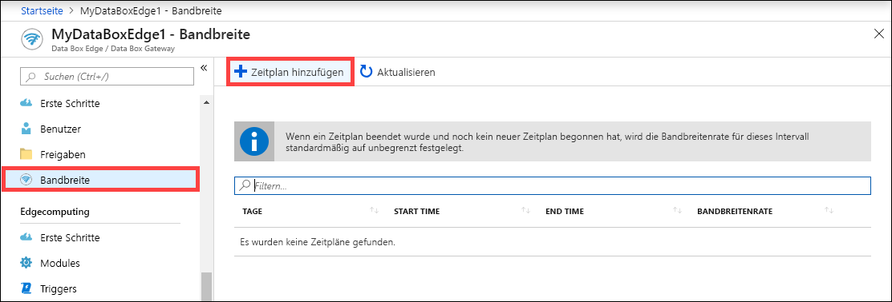
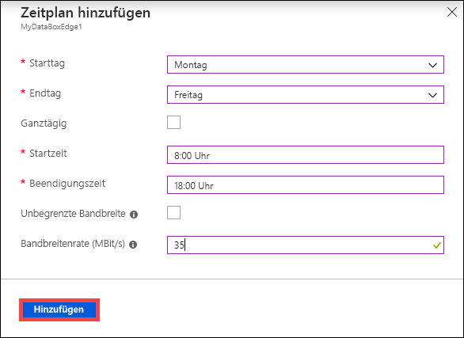
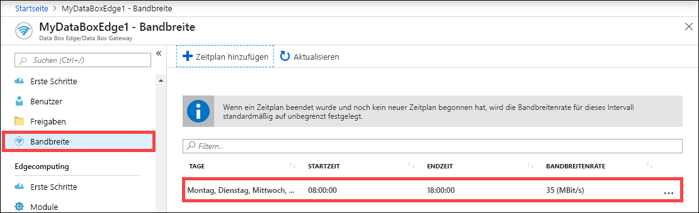
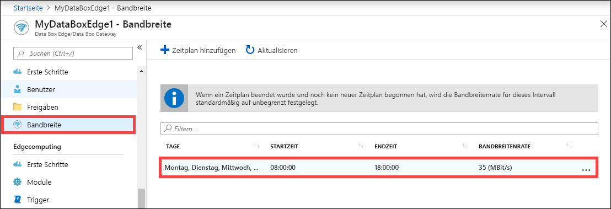
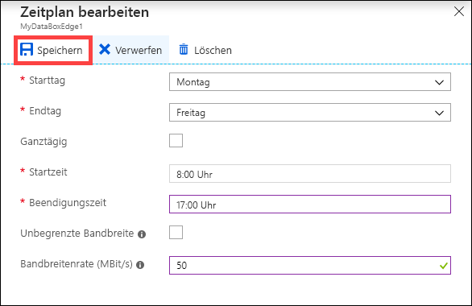
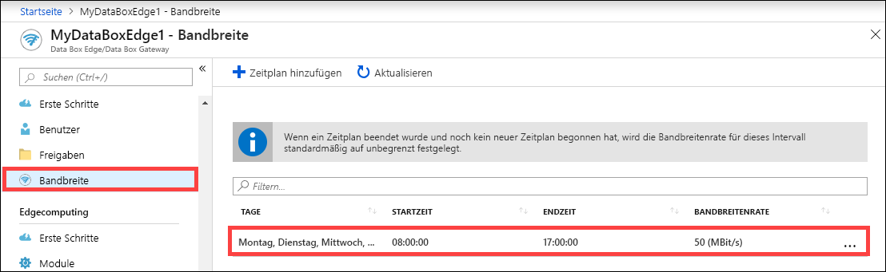
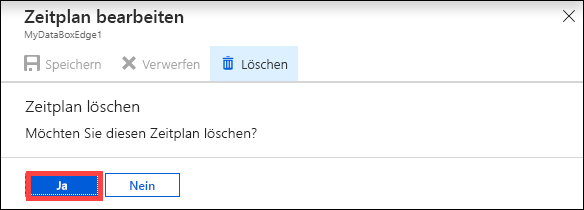

# Verwalten von Bandbreitenzeitplänen für Ihre Azure Data Box Edge-Ressource über das Azure-Portal  

In diesem Artikel erfahren Sie, wie Sie Benutzer für Ihre Azure Data Box Edge-Ressource verwalten. Mithilfe von Bandbreitenzeitplänen können Sie die Nutzung der Netzwerkbandbreite durch mehrere tageszeitbasierte Zeitpläne konfigurieren. Diese Zeitpläne können auf die Upload- und Downloadvorgänge zwischen Ihrem Gerät und der Cloud angewendet werden.

Sie können die Bandbreitenzeitpläne für Data Box Edge über das Azure-Portal hinzufügen, ändern oder löschen.

In diesem Artikel werden folgende Vorgehensweisen behandelt:

> [!div class="checklist"]
> * Hinzufügen eines Zeitplans
> * Ändern eines Zeitplans
> * Löschen eines Zeitplans

## Hinzufügen eines Zeitplans

Gehen Sie im Azure-Portal wie folgt vor, um einen Zeitplan hinzuzufügen:

1. Navigieren Sie im Azure-Portal für Ihre Data Box Edge-Ressource zu **Bandbreite**.
2. Wählen Sie im rechten Bereich die Option **+ Zeitplan hinzufügen**.

    

3. Gehen Sie unter **Zeitplan hinzufügen** wie folgt vor: 

   1. Geben Sie den **Starttag**, den **Endtag**, die **Startzeit** und die **Endzeit** des Zeitplans an.
   2. Aktivieren Sie die Option **Ganztägig**, wenn dieser Zeitplan den ganzen Tag lang ausgeführt werden soll.
   3. **Bandbreitenrate** ist die Bandbreite in Megabit pro Sekunde (MBit/s), die Ihr Gerät bei Cloudvorgängen (Uploads und Downloads) verwendet. Geben Sie eine Zahl zwischen 20 und 1.000.000.007 in dieses Feld ein.
   4. Aktivieren Sie die Option **Unbegrenzt**, wenn Sie Uploads und Downloads nicht drosseln möchten.
   5. Wählen Sie **Hinzufügen**.

      

3. Ein Zeitplan mit den angegebenen Parametern wird erstellt. Dieser Zeitplan wird dann im Portal in der Liste mit den Bandbreitenzeitplänen angezeigt.

    

## Bearbeiten des Zeitplans

Führen Sie die folgenden Schritte aus, um einen Bandbreitenzeitplan zu bearbeiten:

1. Navigieren Sie im Azure-Portal zu Ihrer Data Box Edge-Ressource und anschließend zu **Bandbreite**. 
2. Wählen Sie in der Liste mit den Bandbreitenzeitplänen einen Zeitplan aus, den Sie ändern möchten.
    

3. Nehmen Sie die gewünschten Änderungen vor, und speichern Sie sie.

    

4. Nach der Änderung des Zeitplans wird die Liste mit den Zeitplänen aktualisiert, um den geänderten Zeitplan widerzuspiegeln.

    

## Löschen eines Zeitplans

Führen Sie die folgenden Schritte aus, um einen mit Ihrem Data Box Edge-Gerät verknüpften Bandbreitenzeitplan zu löschen:

1. Navigieren Sie im Azure-Portal zu Ihrer Data Box Edge-Ressource und anschließend zu **Bandbreite**.  

2. Wählen Sie in der Liste mit den Bandbreitenzeitplänen einen Zeitplan aus, den Sie löschen möchten. Wählen Sie im Dialogfeld **Zeitplan bearbeiten** die Option **Löschen** aus. Wählen Sie **Ja** aus, wenn Sie zur Bestätigung aufgefordert werden.

   

3. Nach der Löschung des Zeitplans wird die Liste mit den Zeitplänen aktualisiert.

## Nächste Schritte

- Erfahren Sie mehr über die [Verwaltung von Freigaben](data-box-edge-manage-shares.md).
