# Verwalten der Computekonfiguration Ihres Azure Data Box Edge-Geräts

In diesem Artikel erfahren Sie, wie Sie die Computekonfiguration Ihres Azure Data Box Edge-Geräts verwalten. Die Computekonfiguration kann über das Azure-Portal oder über die lokale Webbenutzeroberfläche verwaltet werden. Verwenden Sie das Azure-Portal, um Module, Trigger und die Computekonfiguration zu verwalten, und die lokale Webbenutzeroberfläche, um Computeeinstellungen zu verwalten.

> [!IMPORTANT]
> Data Box Edge befindet sich in der Vorschauphase. Lesen Sie die [Azure-Vertragsbedingungen für Vorschauversionen](https://azure.microsoft.com/support/legal/preview-supplemental-terms/), bevor Sie diese Lösung bestellen und bereitstellen.

In diesem Artikel werden folgende Vorgehensweisen behandelt:

> [!div class="checklist"]
> * Verwalten von Triggern
> * Verwalten der Computekonfiguration

## Verwalten von Triggern

Ein Ereignis ist etwas, das in Ihrer Cloudumgebung oder auf Ihrem Gerät passiert und ggf. eine Aktion erfordert. Die Erstellung einer Datei in einer Freigabe ist beispielsweise ein Ereignis. Die Ereignisse werden von Triggern ausgelöst. Im Zusammenhang mit Ihrem Data Box Edge-Gerät können Trigger verwendet werden, um auf Dateiereignisse zu reagieren oder einem Zeitplan zu folgen.

- **Datei:** Mit diesen Triggern kann auf Dateiereignisse reagiert werden (etwa auf die Erstellung oder Änderung einer Datei).
- **Scheduled**: Mit diesen Triggern kann ein Zeitplan mit Startzeit (Datum/Uhrzeit) und Wiederholungsintervall implementiert werden.

### Hinzufügen eines Triggers

Gehen Sie im Azure-Portal wie folgt vor, um einen Trigger zu erstellen:

1. Navigieren Sie im Azure-Portal zu Ihrer Data Box Edge-Ressource und anschließend zu **Edgecomputing > Trigger**. Wählen Sie auf der Befehlsleiste die Option **+ Trigger hinzufügen** aus.

    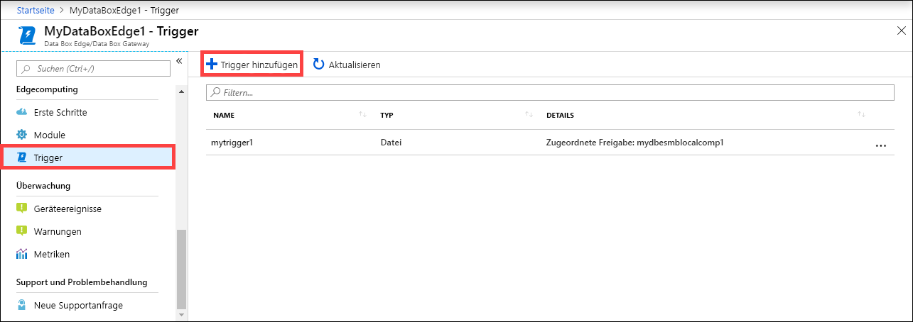

2. Geben Sie auf dem Blatt **Trigger hinzufügen** einen eindeutigen Namen für den Trigger an.
    
    <!--Trigger names can only contain numbers, lowercase letters, and hyphens. The share name must be between 3 and 63 characters long and begin with a letter or a number. Each hyphen must be preceded and followed by a non-hyphen character.-->

3. Wählen Sie unter **Typ** einen Typ für den Trigger aus. Wenn der Trigger als Reaktion auf ein Dateiereignis verwendet werden soll, wählen Sie **Datei** aus. Wenn der Trigger zu einer bestimmten Zeit gestartet und mit einem bestimmten Wiederholungsintervall ausgeführt werden soll, wählen Sie **Geplant** aus. Die daraufhin angezeigten Optionen hängen von der getroffenen Auswahl ab.

    - **Dateitrigger:** Wählen Sie in der Dropdownliste eine eingebundene Freigabe aus. Wird in dieser Freigabe ein Ereignis ausgelöst, ruft der Trigger eine Azure-Funktion auf.

        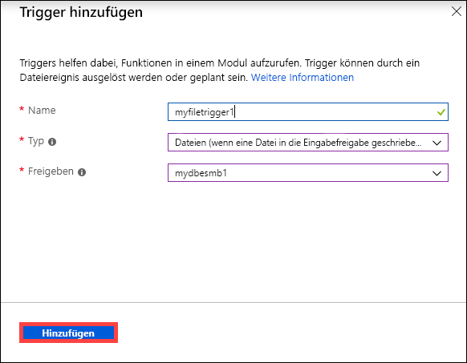

    - **Geplanter Trigger:** Geben Sie die Startzeit (Datum/Uhrzeit) und das Wiederholungsintervall in Stunden, Minuten oder Sekunden an. Geben Sie außerdem den Namen für ein Thema ein. Mit einem Thema können Sie den Trigger flexibel an ein auf dem Gerät bereitgestelltes Modul weiterleiten.

        Beispiel für eine Routenzeichenfolge: `"route3": "FROM /* WHERE topic = 'topicname' INTO BrokeredEndpoint("modules/modulename/inputs/input1")"`.

        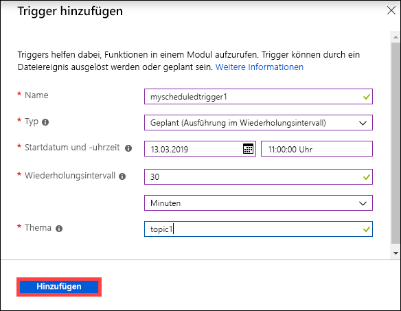

4. Wählen Sie **Hinzufügen** aus, um den Trigger zu erstellen. Eine Benachrichtigung informiert darüber, dass der Trigger erstellt wird. Nach Abschluss der Triggererstellung wird das Blatt mit dem neuen Trigger aktualisiert.
 
    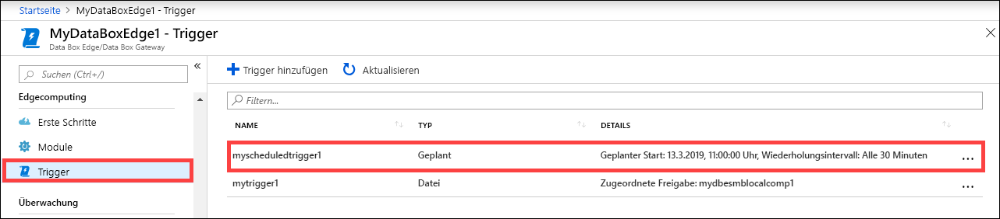

### Löschen eines Triggers

Gehen Sie im Azure-Portal wie folgt vor, um einen Trigger zu löschen:

1. Wählen Sie in der Triggerliste den zu löschenden Trigger aus.

    

2. Klicken Sie mit der rechten Maustaste darauf, und wählen Sie **Löschen** aus.

    

3. Wenn Sie zur Bestätigung aufgefordert werden, klicken Sie auf **Ja**.

    

Die Triggerliste wird nach dem Löschvorgang entsprechend aktualisiert.

## Verwalten der Computekonfiguration

Über das Azure-Portal können Sie die Computekonfiguration anzeigen, eine vorhandene Computekonfiguration entfernen oder die Computekonfiguration aktualisieren, um Zugriffsschlüssel für das IoT-Gerät und das IoT Edge-Gerät für Data Box Edge zu aktualisieren.

### Anzeigen der Computekonfiguration

Gehen Sie im Azure-Portal wie folgt vor, um die Computekonfiguration für Ihr Gerät anzuzeigen:

1. Navigieren Sie im Azure-Portal zu Ihrer Data Box Edge-Ressource und anschließend zu **Edgecomputing > Module**. Wählen Sie auf der Befehlsleiste die Option **View compute** (Compute anzeigen) aus.

    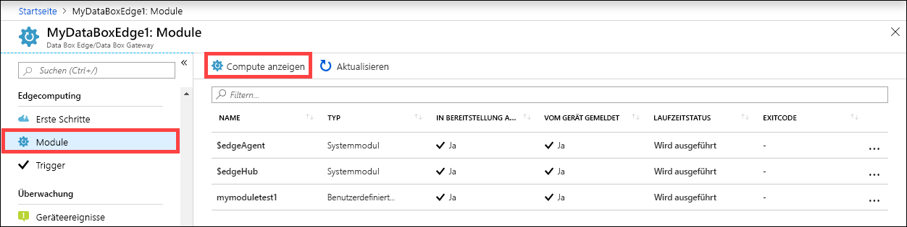

2. Notieren Sie sich die Computekonfiguration auf Ihrem Gerät. Wenn Sie Computeeinstellungen konfiguriert haben, haben Sie eine IoT Hub-Ressource erstellt. Unter dieser IoT Hub-Ressource sind ein IoT-Gerät und ein IoT Edge-Gerät konfiguriert. Auf dem IoT Edge-Gerät wird nur die Ausführung der Linux-Module unterstützt.

    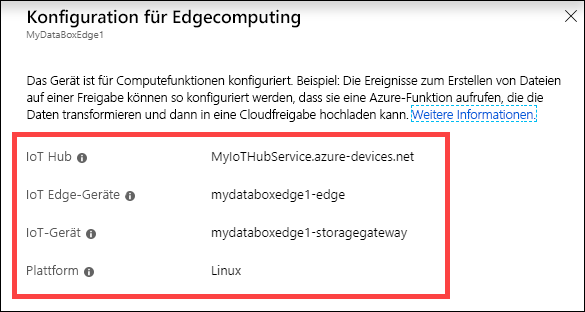

### Entfernen der Computekonfiguration

Gehen Sie im Azure-Portal wie folgt vor, um die vorhandene Edgecomputingkonfiguration für Ihr Gerät zu entfernen:

1. Navigieren Sie im Azure-Portal zu Ihrer Data Box Edge-Ressource und anschließend zu **Edgecomputing > Erste Schritte**. Wählen Sie auf der Befehlsleiste die Option **Compute entfernen** aus.

    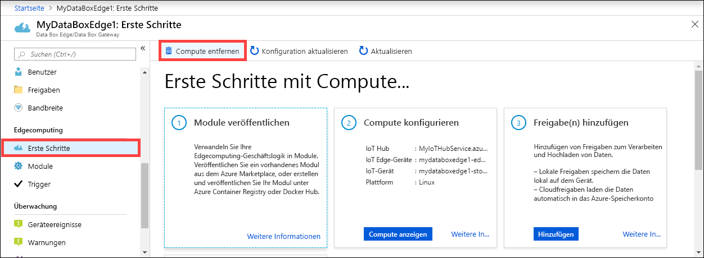

2. Wenn Sie die Computekonfiguration entfernen, müssen Sie Ihr Gerät neu konfigurieren, um Compute wieder verwenden zu können. Wählen Sie **Ja** aus, wenn Sie zur Bestätigung aufgefordert werden.

    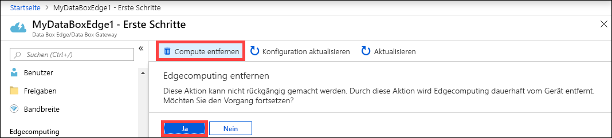

### Synchronisieren der Zugriffsschlüssel von IoT-Gerät und IoT Edge-Gerät

Wenn Sie Compute auf Ihrem Data Box Edge-Gerät konfigurieren, werden ein IoT-Gerät und ein IoT Edge-Gerät erstellt. Diesen Geräten werden automatisch symmetrische Zugriffsschlüssel zugewiesen. Diese Schlüssel werden aus Sicherheitsgründen regelmäßig über den IoT Hub-Dienst rotiert.

Um die Schlüssel zu rotieren, können Sie zu dem IoT Hub-Dienst wechseln, den Sie erstellt haben, und das IoT-Gerät oder das IoT Edge-Gerät auswählen. Jedes Gerät verfügt über einen primären und einen sekundären Zugriffsschlüssel. Weisen Sie den primären Zugriffsschlüssel dem sekundären Zugriffsschlüssel zu, und generieren Sie dann den primären Zugriffsschlüssel neu.

Nachdem die Schlüssel Ihres IoT-Geräts und Ihres IoT Edge-Geräts rotiert wurden, müssen Sie die Konfiguration auf Ihrem Data Box Edge-Gerät aktualisieren, um die neuesten Zugriffsschlüssel zu erhalten. Durch die Synchronisierung wird sichergestellt, dass Ihr Gerät über die neuesten Schlüssel für Ihr IoT-Gerät und Ihr IoT Edge-Gerät verfügt. Data Box Edge verwendet nur die primären Zugriffsschlüssel.

Gehen Sie im Azure-Portal wie folgt vor, um die Zugriffsschlüssel für Ihr Gerät zu synchronisieren:

1. Navigieren Sie im Azure-Portal zu Ihrer Data Box Edge-Ressource und anschließend zu **Edgecomputing > Erste Schritte**. Wählen Sie auf der Befehlsleiste die Option **Konfiguration aktualisieren** aus.

    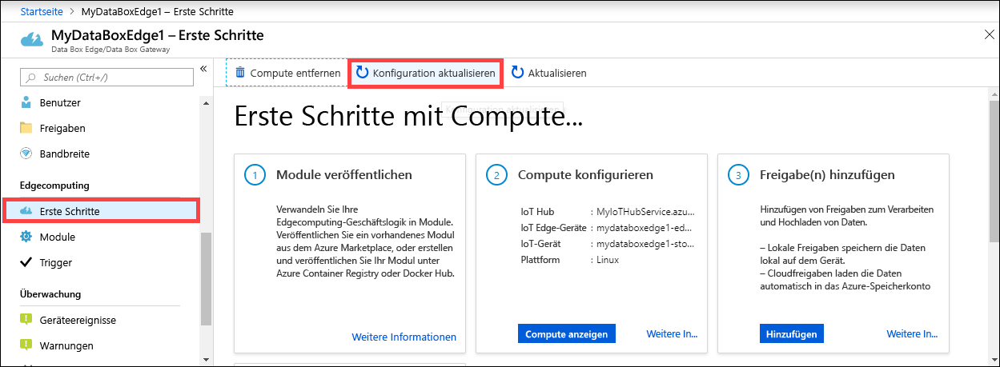

2. Wählen Sie **Ja** aus, wenn Sie zur Bestätigung aufgefordert werden.

     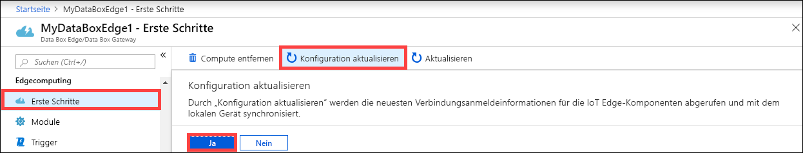

3. Schließen Sie das Dialogfeld, wenn die Synchronisierung abgeschlossen ist.

## Aktivieren einer Netzwerkschnittstelle für Computeeinstellungen

Unter Umständen müssen Sie auf ein Modul zugreifen, das auf dem Data Box Edge-Gerät ausgeführt wird. Für den externen Zugriff auf das Modul müssen Sie einer Netzwerkschnittstelle auf Ihrem Gerät eine IP-Adresse zuweisen. Sie können diese Computeeinstellungen über Ihre lokale Webbenutzeroberfläche verwalten.

Führen Sie zum Konfigurieren von Computeeinstellungen die folgenden Schritte auf der lokalen Webbenutzeroberfläche aus.

1. Navigieren Sie auf der lokalen Webbenutzeroberfläche zu **Konfiguration > Computeeinstellungen**.  

2. **Aktivieren** Sie die Netzwerkschnittstelle, über die Sie eine Verbindung mit den Computemodulen auf dem Gerät herstellen möchten. 

    - Geben Sie bei Verwendung von statischen IP-Adressen eine IP-Adresse für die Netzwerkschnittstelle ein.
    - Bei Verwendung von DHCP werden die IP-Adressen automatisch zugewiesen.

3. Wählen Sie zum Anwenden der Einstellungen die Option **Übernehmen** aus.

    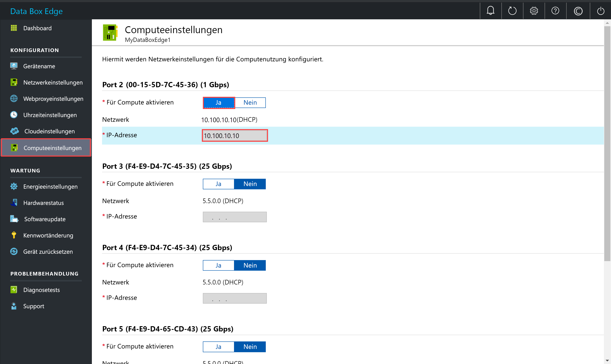

## Nächste Schritte

- Erfahren Sie, wie Sie [Benutzer über das Azure-Portal verwalten](data-box-edge-manage-users.md).
