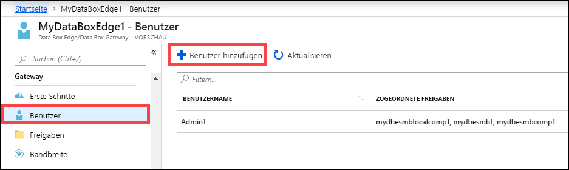
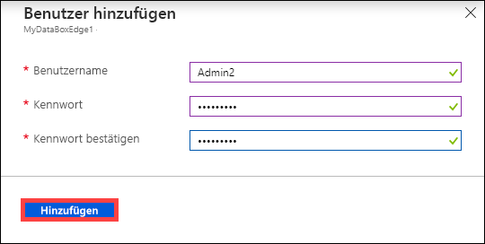
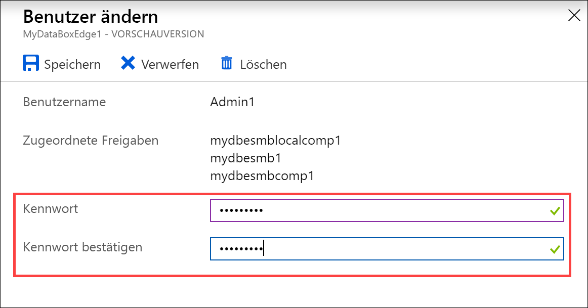
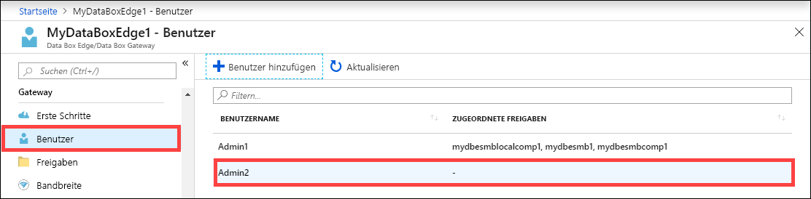
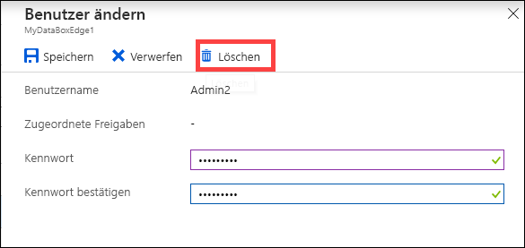
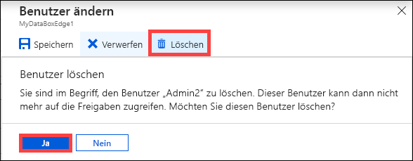
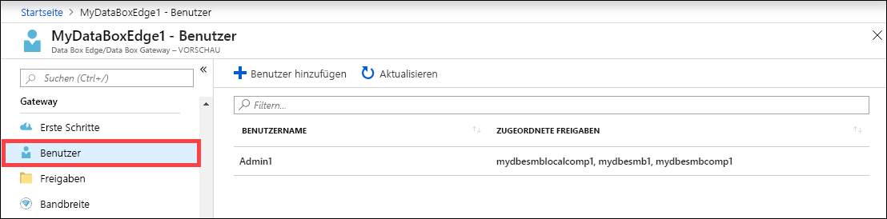

# Verwalten von Benutzern für Ihre Azure Data Box Edge-Ressource über das Azure-Portal

In diesem Artikel erfahren Sie, wie Sie Benutzer für Ihre Azure Data Box Edge-Ressource verwalten. Azure Data Box Edge kann über das Azure-Portal oder über die lokale Webbenutzeroberfläche verwaltet werden. Verwenden Sie das Azure-Portal, um Benutzer hinzuzufügen, zu ändern oder zu löschen.

In diesem Artikel werden folgende Vorgehensweisen behandelt:

> [!div class="checklist"]
> * Hinzufügen eines Benutzers
> * Ändern eines Benutzers
> * Löschen eines Benutzers

## Informationen zu Benutzern

Benutzer können über Lesezugriff oder über Vollzugriff verfügen. Wie der Name schon sagt, können Benutzer mit Lesezugriff die Freigabedaten nur anzeigen. Benutzer mit Vollzugriff können Freigabedaten lesen, Schreibvorgänge für diese Freigaben ausführen sowie Freigabedaten ändern oder löschen.

 - **Benutzer mit Vollzugriff:** Lokaler Benutzer mit Vollzugriff.
 - **Benutzer mit Lesezugriff:** Lokaler Benutzer, der nur über Lesezugriff verfügt. Diese Benutzer werden Freigaben zugeordnet, die schreibgeschützte Vorgänge zulassen.

Die Benutzerberechtigungen werden definiert, wenn der Benutzer im Rahmen der Freigabeerstellung erstellt wird. Nachdem die Berechtigungen für einen Benutzer definiert wurden, können sie über den Explorer geändert werden. 

## Hinzufügen eines Benutzers

Gehen Sie im Azure-Portal wie folgt vor, um einen Benutzer hinzuzufügen:

1. Navigieren Sie im Azure-Portal zu Ihrer Data Box Edge-Ressource und anschließend zu **Übersicht > Benutzer**. Wählen Sie auf der Befehlsleiste die Option **+ Benutzer hinzufügen** aus.

    

2. Geben Sie den Benutzernamen und das Kennwort für den Benutzer an, den Sie hinzufügen möchten. Bestätigen Sie das Kennwort, und wählen Sie **Hinzufügen** aus.

    

    > [!IMPORTANT] 
    > Folgende Benutzer sind für das System reserviert und dürfen nicht verwendet werden: Administrator, EdgeUser, EdgeSupport, HcsSetupUser, WDAGUtilityAccount, CLIUSR, DefaultAccount, Guest.  

3. Eine Benachrichtigung wird angezeigt, wenn die Benutzererstellung beginnt und wenn sie abgeschlossen ist. Wählen Sie nach Abschluss der Benutzererstellung auf der Befehlsleiste die Option **Aktualisieren** aus, um die aktualisierte Benutzerliste anzuzeigen.

## Ändern eines Benutzers

Das Kennwort für einen Benutzer kann nach der Benutzererstellung geändert werden. Wählen Sie in der Benutzerliste einen Benutzer aus. Geben Sie ein neues Kennwort ein, und bestätigen Sie es. Speichern Sie die Änderungen.
 

## Löschen eines Benutzers

Gehen Sie im Azure-Portal wie folgt vor, um einen Benutzer zu löschen:

1. Navigieren Sie im Azure-Portal zu Ihrer Data Box Edge-Ressource und anschließend zu **Übersicht > Benutzer**.

    

2. Wählen Sie in der Benutzerliste einen Benutzer und anschließend **Löschen** aus.  

   

3. Bestätigen Sie den Löschvorgang, wenn Sie dazu aufgefordert werden. 

   

Die Benutzerliste wird nach dem Löschen des Benutzers entsprechend aktualisiert.

## Nächste Schritte

- Erfahren Sie, wie Sie [Bandbreite verwalten](data-box-edge-manage-bandwidth-schedules.md).
