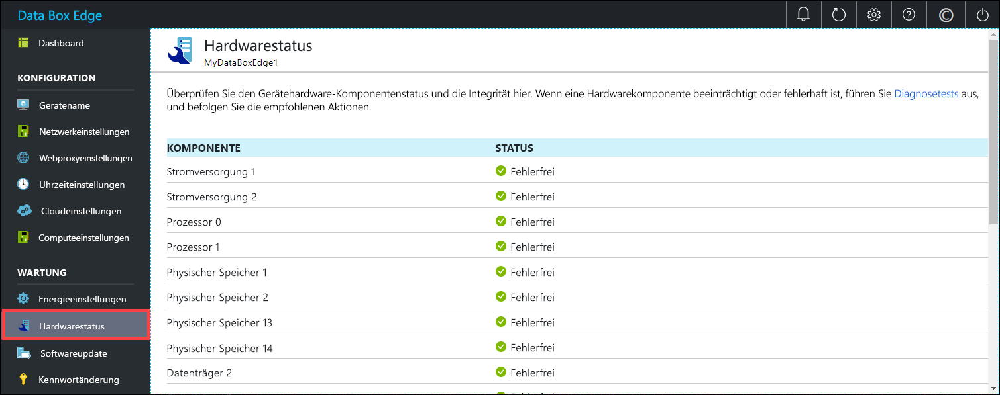

# Überwachen Ihres Azure Data Box Edge-Geräts

In diesem Artikel wird beschrieben, wie Sie Ihr Azure Data Box Edge-Gerät überwachen. Zum Überwachen Ihres Geräts können Sie das Azure-Portal oder die lokale Webbenutzeroberfläche verwenden. Verwenden Sie das Azure-Portal, um Geräteereignisse anzuzeigen, Warnungen zu konfigurieren und zu verwalten und Metriken anzuzeigen. Verwenden Sie die lokale Webbenutzeroberfläche auf Ihrem physischen Gerät, um den Hardwarestatus der verschiedenen Gerätekomponenten anzuzeigen.

In diesem Artikel werden folgende Vorgehensweisen behandelt:

> [!div class="checklist"]
> * Anzeigen von Geräteereignissen und den entsprechenden Warnungen
> * Anzeigen des Hardwarestatus von Gerätekomponenten
> * Anzeigen von Kapazitäts- und Transaktionsmetriken für Ihr Gerät
> * Konfigurieren und Verwalten von Warnungen

## Anzeigen von Geräteereignissen

[!INCLUDE [Supported OS for clients connected to device](../../includes/data-box-edge-gateway-view-device-events.md)]

## Anzeigen des Hardwarestatus

Führen Sie die folgenden Schritte auf der lokalen Webbenutzeroberfläche aus, um den Hardwarestatus Ihrer Gerätekomponenten anzuzeigen.

1. Stellen Sie eine Verbindung mit der lokalen Webbenutzeroberfläche Ihres Geräts her.
2. Navigieren Sie zu **Wartung > Hardwarestatus**. Sie können die Integrität der verschiedenen Gerätekomponenten anzeigen.

    

## Anzeigen von Metriken

[!INCLUDE [Supported OS for clients connected to device](../../includes/data-box-edge-gateway-view-metrics.md)]

## Warnungen verwalten

[!INCLUDE [Supported OS for clients connected to device](../../includes/data-box-edge-gateway-manage-alerts.md)]

## Nächste Schritte 

Erfahren Sie, wie Sie [Bandbreite verwalten](data-box-edge-manage-bandwidth-schedules.md).