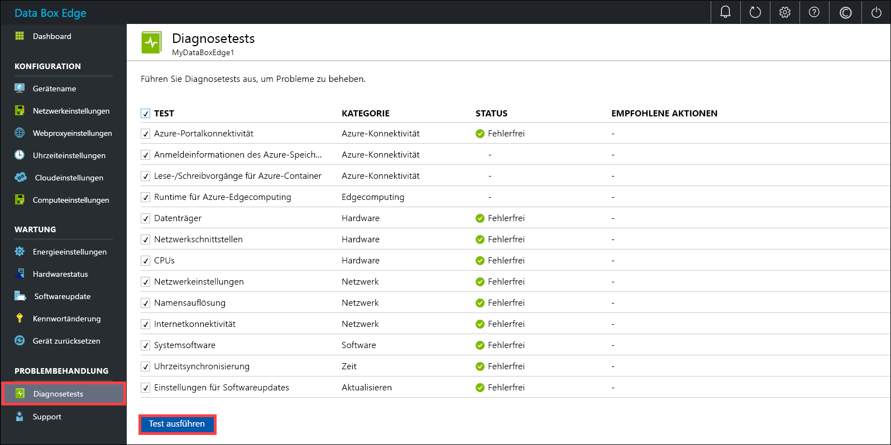
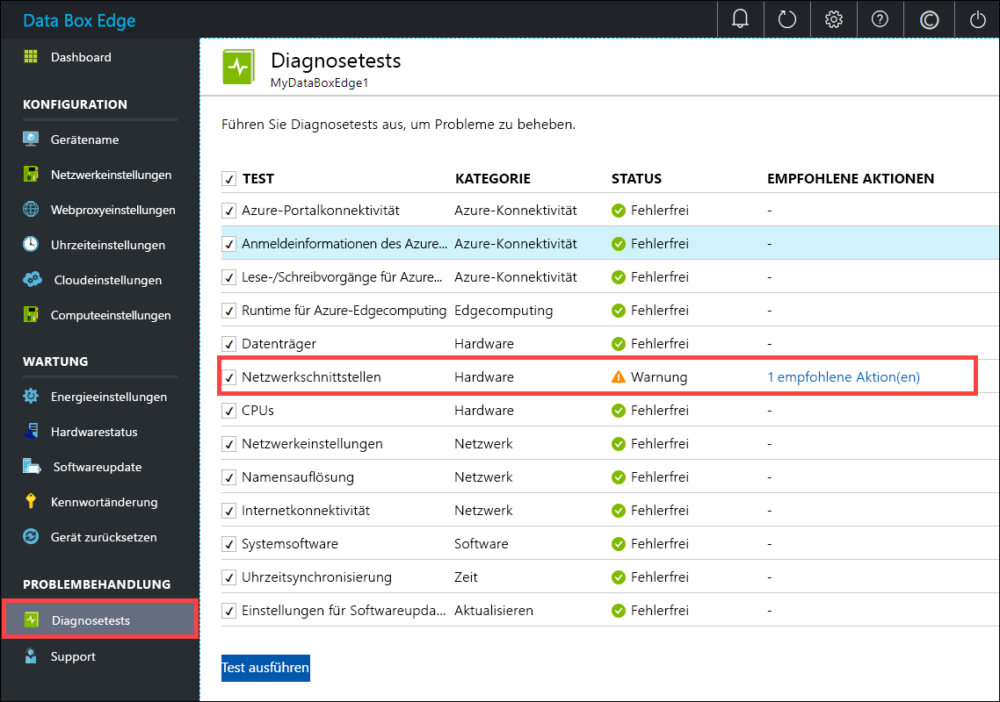
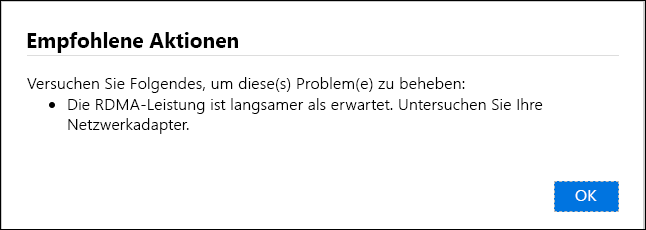
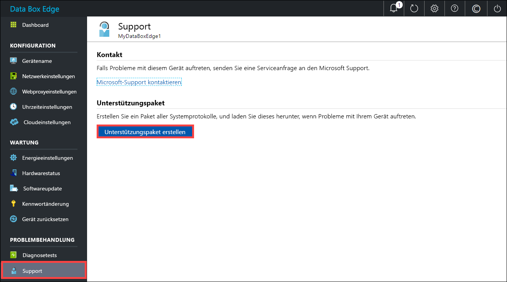
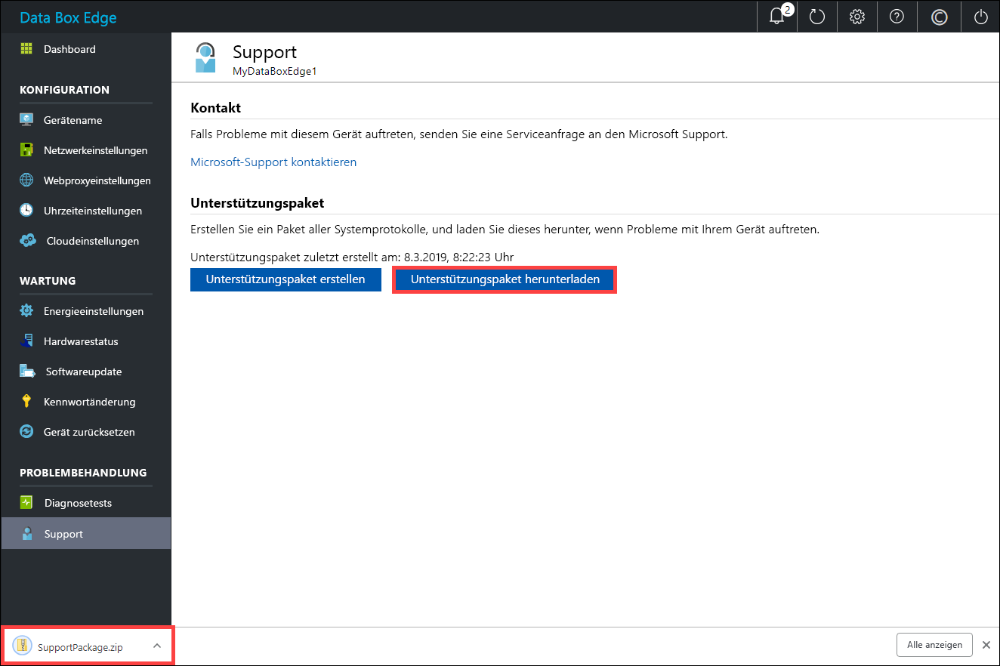
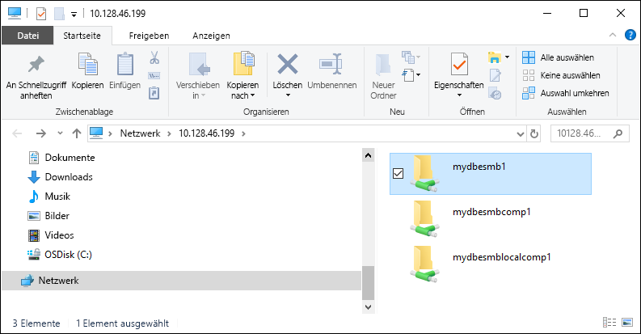

# <a name="troubleshoot-your-azure-data-box-edge-issues"></a>Behandeln von Problemen mit Azure Data Box Edge 

In diesem Artikel erfahren Sie, wie Sie Probleme mit Azure Data Box Edge behandeln. 

In diesem Artikel werden folgende Vorgehensweisen behandelt:

> [!div class="checklist"]
> * Ausführen von Diagnosen
> * Zusammenstellen des Unterstützungspaket
> * Behandeln von Problemen anhand von Protokollen


## <a name="run-diagnostics"></a>Ausführen von Diagnosen

Zum Diagnostizieren und Behandeln von Gerätefehlern können Sie die Diagnosetests ausführen. Gehen Sie auf der lokalen Webbenutzeroberfläche Ihres Geräts wie folgt vor, um Diagnosetests auszuführen:

1. Navigieren Sie auf der lokalen Webbenutzeroberfläche zu **Problembehandlung > Diagnosetests**. Wählen Sie den gewünschten Test aus, und klicken Sie auf **Test ausführen**. Daraufhin werden die Tests ausgeführt, um mögliche Probleme mit Ihren Netzwerk-, Geräte-, Webproxy-, Zeit- oder Cloudeinstellungen zu diagnostizieren. Sie werden benachrichtigt, dass auf dem Gerät Tests ausgeführt werden.

    
 
2. Nach Abschluss der Tests werden die Ergebnisse angezeigt. 

    

    Sollte ein Test nicht erfolgreich sein, wird eine URL für die empfohlene Maßnahme angezeigt. Sie können auf die URL klicken, um die empfohlene Maßnahme anzuzeigen.
 
    


## <a name="collect-support-package"></a>Zusammenstellen des Unterstützungspaket

Ein Protokollpaket enthält alle relevanten Protokolle, die das Supportteam von Microsoft bei der Behandlung von Geräteproblemen unterstützen. Sie können ein Unterstützungspaket über die lokale Webbenutzeroberfläche generieren.

Gehen Sie wie folgt vor, um ein Unterstützungspaket zusammenzustellen: 

1. Navigieren Sie auf der lokalen Webbenutzeroberfläche zu **Problembehandlung > Support**. Klicken Sie auf **Unterstützungspaket erstellen**. Daraufhin wird das Unterstützungspaket zusammengestellt. Dieser Vorgang kann mehrere Minuten dauern.

    
 
2. Klicken Sie nach Abschluss der Erstellung des Unterstützungspakets auf **Unterstützungspaket herunterladen**. Ein ZIP-Paket wird an den gewünschten Pfad heruntergeladen. Sie können das Paket entpacken und sich die Systemprotokolldateien ansehen.

    

## <a name="use-logs-to-troubleshoot"></a>Behandeln von Problemen anhand von Protokollen

Alle Fehler, die während der Upload- und Aktualisierungsprozesse aufgetreten sind, sind in den entsprechenden Fehlerdateien enthalten.

1. Navigieren Sie zum Anzeigen der Fehlerdateien zu Ihrer Freigabe, und klicken Sie auf die Freigabe, um den Inhalt anzuzeigen. 

      

2. Klicken Sie auf den Ordner _Microsoft Data Box Edge_. Dieser Ordner enthält zwei Unterordner:

    - Der Ordner „Upload“ enthält Protokolldateien für Uploadfehler.
    - Der Ordner „Refresh“ ist für Fehler bei der Aktualisierung vorgesehen.

    Hier sehen Sie eine exemplarische Protokolldatei für die Aktualisierung.

    ```
    <root container="test1" machine="VM15BS020663" timestamp="03/18/2019 00:11:10" />
    <file item="test.txt" local="False" remote="True" error="16001" />
    <summary runtime="00:00:00.0945320" errors="1" creates="2" deletes="0" insync="3" replaces="0" pending="9" />
    ``` 

3. Wenn diese Datei einen Fehler enthält (im Beispiel hervorgehoben), notieren Sie sich den Fehlercode (in diesem Fall: 16001). Suchen Sie anhand dieses Fehlercodes in der folgenden Fehlerreferenz nach der entsprechenden Fehlerbeschreibung.

    [!INCLUDE [data-box-edge-edge-upload-error-reference](../../includes/data-box-edge-gateway-upload-error-reference.md)]


## <a name="next-steps"></a>Nächste Schritte

- Erfahren Sie mehr über die [bekannten Probleme in dieser Version](data-box-gateway-release-notes.md).
