# Verwalten von Freigaben auf Ihrer Azure Data Box Gateway-Ressource über das Azure-Portal 

In diesem Artikel erfahren Sie, wie Sie Freigaben auf Ihrer Azure Data Box Gateway-Ressource verwalten. Azure Data Box Gateway kann über das Azure-Portal oder über die lokale Webbenutzeroberfläche verwaltet werden. Verwenden Sie das Azure-Portal, um Freigaben hinzuzufügen, zu löschen oder zu aktualisieren oder um Speicherschlüssel für das Speicherkonto zu synchronisieren, das den Freigaben zugeordnet ist.

## Informationen zu Freigaben

Für die Datenübertragung an Azure müssen Sie Freigaben auf Ihrer Azure Data Box Gateway-Ressource erstellen. Bei den Freigaben, die Sie auf dem Data Box Gateway-Gerät hinzufügen, handelt es sich um Cloudfreigaben. Die Daten aus diesen Freigaben werden automatisch in die Cloud hochgeladen. Alle Cloudfunktionen wie etwa „Aktualisieren“ und „Speicherkontoschlüssel synchronisieren“ werden auf diese Freigaben angewendet. Verwenden Sie die Cloudfreigaben, wenn die Gerätedaten automatisch in Ihr Speicherkonto in der Cloud gepusht werden sollen.

In diesem Artikel werden folgende Vorgehensweisen behandelt:

> [!div class="checklist"]
> * Hinzufügen einer Freigabe
> * Löschen einer Freigabe
> * Aktualisieren von Freigaben
> * Synchronisieren des Speicherschlüssels

## Hinzufügen einer Freigabe

Gehen Sie im Azure-Portal wie folgt vor, um eine Freigabe zu erstellen:

1. Navigieren Sie im Azure-Portal zu Ihrer Data Box Gateway-Ressource und anschließend zu **Übersicht**. Klicken Sie auf der Befehlsleiste auf **+ Freigabe hinzufügen**.
2. Geben Sie unter **Freigabe hinzufügen** die Freigabeeinstellungen an. Geben Sie einen eindeutigen Namen für die Freigabe an.

    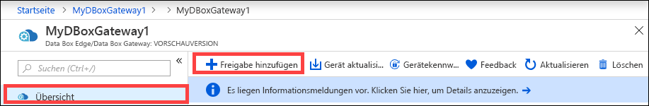

    Freigabenamen dürfen nur Zahlen, Kleinbuchstaben und Bindestriche enthalten. Der Name der Freigabe muss 3 bis 63 Zeichen lang sein und mit einem Buchstaben oder einer Zahl beginnen. Vor und nach jedem Bindestrich muss ein Zeichen stehen, das kein Bindestrich ist.

3. Wählen Sie einen **Typ** für die Freigabe aus. Zur Auswahl stehen **SMB** und **NFS** (Standardeinstellung: SMB). „SMB“ ist die Standardeinstellung für Windows-Clients, und „NFS“ wird für Linux-Clients verwendet. Die angezeigten Optionen für SMB- und NFS-Dateifreigaben unterscheiden sich geringfügig.

4. Geben Sie ein **Speicherkonto** an, in dem sich die Freigabe befindet. Im Speicherkonto wird ein Container mit dem Freigabenamen erstellt, sofern er noch nicht vorhanden ist. Wenn er bereits vorhanden ist, wird der vorhandene Container verwendet.

5. Wählen Sie für **Speicherdienst** die Option „Blockblob“, „Seitenblob“ oder „Dateien“ aus. Der ausgewählte Diensttyp hängt von dem Format ab, in dem die Daten in Azure gespeichert werden sollen. In diesem Fall sollen die Daten beispielsweise als Blobblöcke in Azure gespeichert werden. Daher wählen wir **Blockblob** aus. Wenn Sie **Seitenblob** auswählen, müssen Ihre Daten ganzzahlige Vielfache von 512 Bytes sein. VHDX-Daten sind beispielsweise immer ganzzahlige Vielfache von 512 Bytes.

6. Dieser Schritt hängt davon ab, ob Sie eine SMB- oder NFS-Freigabe erstellen.
    - **Wenn Sie eine SMB-Freigabe erstellen:** Wählen Sie im Feld **Lokaler Benutzer (alle Berechtigungen)** die Option **Neu erstellen** oder **Vorhandene verwenden** aus. Wenn Sie einen neuen lokalen Benutzer erstellen, füllen Sie die Felder **Benutzername** und **Kennwort** aus, und bestätigen Sie anschließend das Kennwort. Dadurch werden die Berechtigungen dem lokalen Benutzer zugewiesen. Nachdem Sie hier die Berechtigungen zugewiesen haben, können Sie den Datei-Explorer verwenden, um diese Berechtigungen zu ändern.

        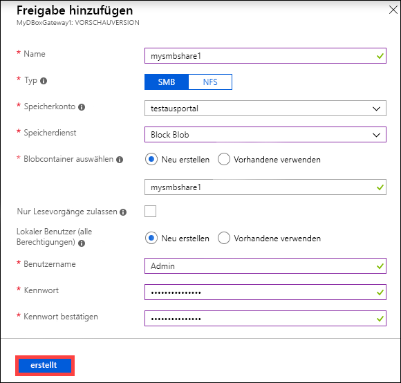

        Wenn Sie für diese Freigabedaten das Kontrollkästchen „Allow only read operations“ (Nur Lesevorgänge zulassen) aktivieren, können Sie Benutzer angeben, die nur über Lesezugriff verfügen.
    - **Wenn Sie eine NFS-Freigabe erstellen:** Geben Sie die **IP-Adressen der zulässigen Clients** an, die auf die Freigabe zugreifen können.

        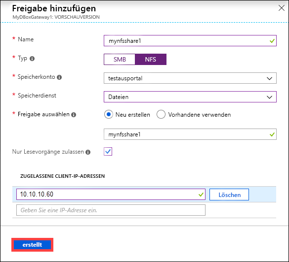

7. Klicken Sie auf **Erstellen**, um die Freigabe zu erstellen. Sie werden benachrichtigt, wenn die Freigabe erstellt wird. Nachdem die Freigabe mit den angegebenen Einstellungen erstellt wurde, wird das Blatt **Freigaben** aktualisiert und zeigt die neue Freigabe.
 
## Löschen einer Freigabe

Gehen Sie im Azure-Portal wie folgt vor, um eine Freigabe zu löschen:

1. Klicken Sie in der Liste mit den Freigaben auf die Freigabe, die Sie löschen möchten.

    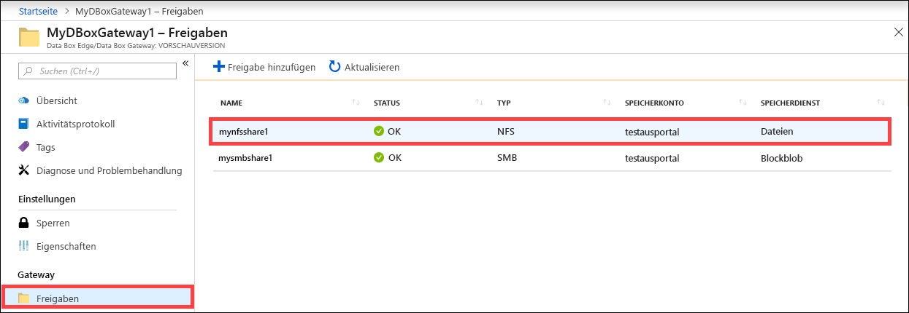

2. Klicken Sie auf **Löschen**. 

    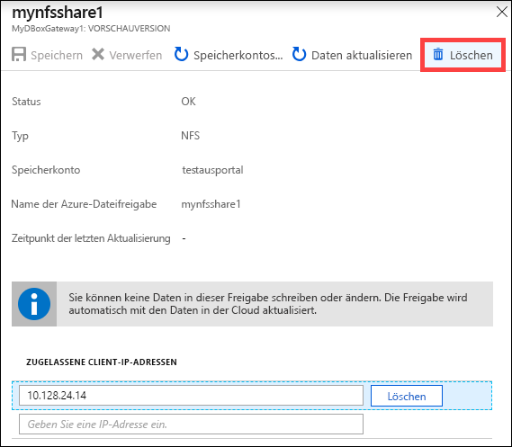

3. Wenn Sie zur Bestätigung aufgefordert werden, klicken Sie auf **Ja**.

    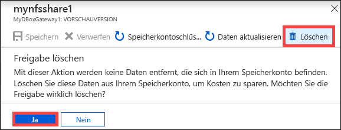

Die Liste mit den Freigaben wird nach dem Löschen entsprechend aktualisiert.

## Aktualisieren von Freigaben

Mithilfe des Aktualisierungsfeatures können Sie den Inhalt einer lokalen Freigabe aktualisieren. Wenn Sie eine Freigabe aktualisieren, wird eine Suche nach allen Azure-Objekten mit Blobs und Dateien initiiert, die der Cloud seit der letzten Aktualisierung hinzugefügt wurden. Diese zusätzlichen Dateien werden dann verwendet, um den Inhalt der lokalen Freigabe auf dem Gerät zu aktualisieren. 

> [!NOTE]
> Berechtigungen und Zugriffssteuerungslisten (ACLs) werden über einen Aktualisierungsvorgang hinaus nicht beibehalten. 

Gehen Sie im Azure-Portal wie folgt vor, um eine Freigabe zu aktualisieren:

1.  Navigieren Sie im Azure-Portal zu **Freigaben**. Klicken Sie auf die Freigabe, die Sie aktualisieren möchten.

    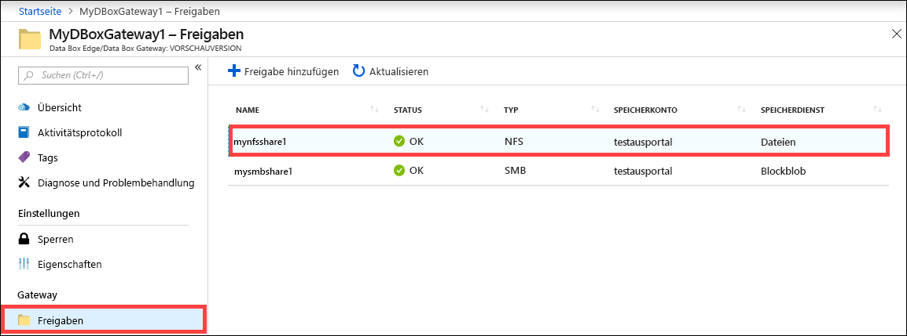

2.  Klicken Sie auf **Aktualisieren**. 

    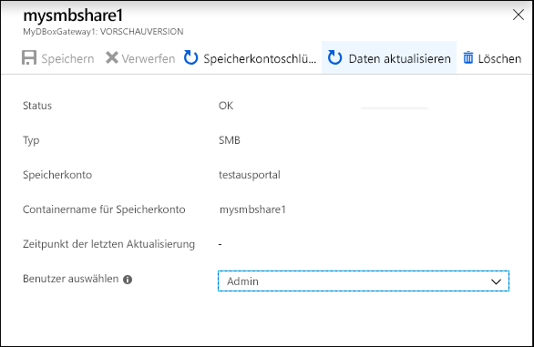
 
3.  Wenn Sie zur Bestätigung aufgefordert werden, klicken Sie auf **Ja**. Daraufhin wird ein Auftrag gestartet, um den Inhalt der lokalen Freigabe zu aktualisieren. 

    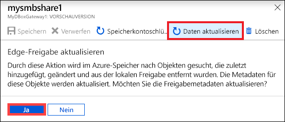
 
4.  Während der Ausführung des Aktualisierungsvorgangs ist die Aktualisierungsoption im Kontextmenü ausgegraut. Klicken Sie auf die Auftragsbenachrichtigung, um den Status des Aktualisierungsauftrags anzuzeigen.

5.  Die Dauer des Aktualisierungsvorgangs hängt davon ab, wie viele Dateien sich im Azure-Container und auf dem Gerät befinden. Nach erfolgreichem Abschluss der Aktualisierung wird der Zeitstempel der Freigabe aktualisiert. Der Zeitstempel wird auch aktualisiert, wenn der Vorgang nur teilweise erfolgreich war. 

    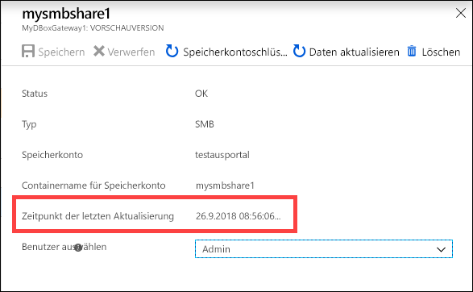
 
Im Falle eines Fehlers wird eine Warnung ausgelöst. Die Warnung enthält Informationen zur Ursache sowie Empfehlungen für die Problembehebung. Darüber hinaus enthält die Warnung einen Link zu einer Datei mit einer vollständigen Zusammenfassung der Fehler für die Dateien, die nicht aktualisiert oder gelöscht werden konnten.

>[!IMPORTANT]
> In diesem Release darf immer nur eine einzelne Freigabe aktualisiert werden.

## Synchronisieren von Speicherschlüsseln

Speicherkontoschlüssel müssen nach der Rotation synchronisiert werden. Die Synchronisierung stellt sicher, dass das Gerät über die neuesten Schlüssel für Ihr Speicherkonto verfügt.

Gehen Sie im Azure-Portal wie folgt vor, um Ihren Speicherzugriffsschlüssel zu synchronisieren:

1. Navigieren Sie in Ihrer Ressource zu **Übersicht**. 
2. Klicken Sie in der Liste mit den Freigaben auf eine Freigabe, die dem Speicherkonto zugeordnet ist, das Sie synchronisieren möchten. Klicken Sie auf **Speicherkontoschlüssel synchronisieren**. 

     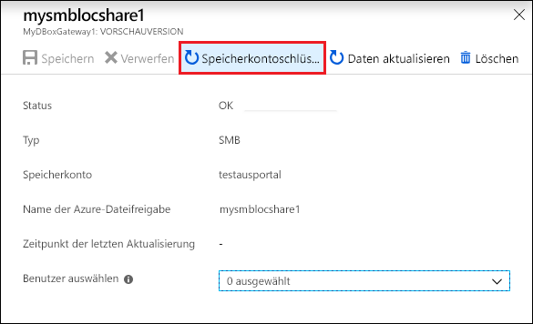

3. Klicken Sie am unteren Rand der Seite auf **Ja** , wenn Sie zur Bestätigung aufgefordert werden. Schließen Sie das Dialogfeld, wenn die Synchronisierung abgeschlossen ist.

     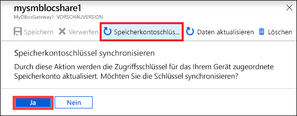

>[!NOTE]
> Dieser Vorgang muss nur einmal pro Speicherkonto ausgeführt werden. Er muss nicht für alle Freigaben wiederholt werden, die dem gleichen Speicherkonto zugeordnet sind.

## Nächste Schritte

- Erfahren Sie, wie Sie [Benutzer über das Azure-Portal verwalten](data-box-gateway-manage-users.md).
