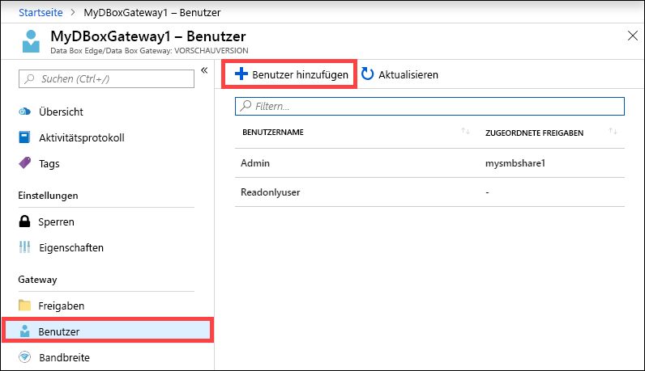
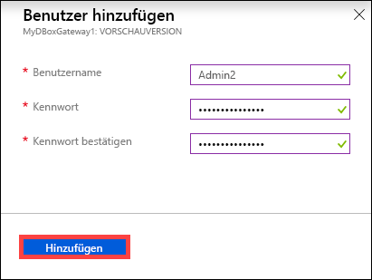
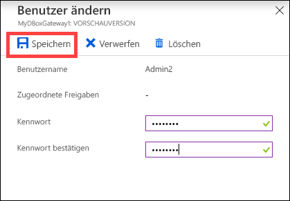
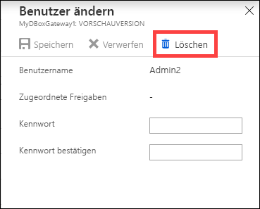
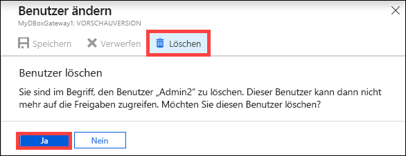
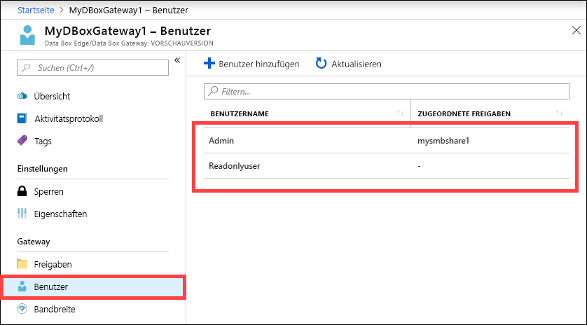

# Verwalten von Benutzern auf Ihrer Azure Data Box Gateway-Ressource über das Azure-Portal 

In diesem Artikel erfahren Sie, wie Sie Benutzer auf Ihrer Azure Data Box Gateway-Ressource verwalten. Azure Data Box Gateway kann über das Azure-Portal oder über die lokale Webbenutzeroberfläche verwaltet werden. Verwenden Sie das Azure-Portal, um Benutzer hinzuzufügen, zu ändern oder zu löschen.

> [!IMPORTANT]
> - Data Box Gateway ist in der Vorschauphase. Lesen Sie die [Azure-Vertragsbedingungen für Vorschauversionen](https://azure.microsoft.com/support/legal/preview-supplemental-terms/), bevor Sie diese Lösung bestellen und bereitstellen.

In diesem Artikel werden folgende Vorgehensweisen behandelt:

> [!div class="checklist"]
> * Hinzufügen eines Benutzers
> * Ändern eines Benutzers
> * Löschen eines Benutzers 

## Informationen zu Benutzern

Benutzer können über Lesezugriff oder über Vollzugriff verfügen. Wie der Name schon sagt, können Benutzer mit Lesezugriff die Freigabedaten nur anzeigen. Benutzer mit Vollzugriff können Freigabedaten lesen, Schreibvorgänge für diese Freigaben ausführen sowie Freigabedaten ändern oder löschen. 

 - **Benutzer mit Vollzugriff:** Lokaler Benutzer mit Vollzugriff. 
 - **Benutzer mit Lesezugriff:** Lokaler Benutzer, der nur über Lesezugriff verfügt. Diese Benutzer werden Freigaben zugeordnet, die schreibgeschützte Vorgänge zulassen.

Die Benutzerberechtigungen werden definiert, wenn der Benutzer im Rahmen der Freigabeerstellung erstellt wird. Nachdem die Berechtigungen für einen Benutzer definiert wurden, können sie über den Explorer geändert werden. 

## Hinzufügen eines Benutzers

Gehen Sie im Azure-Portal wie folgt vor, um einen Benutzer hinzuzufügen:

1. Navigieren Sie im Azure-Portal zu Ihrer Data Box Gateway-Ressource und anschließend zu **Übersicht**. Klicken Sie auf der Befehlsleiste auf **+ Benutzer hinzufügen**.

    

2. Geben Sie den Benutzernamen und das Kennwort für den Benutzer an, den Sie hinzufügen möchten. Bestätigen Sie das Kennwort, und klicken Sie auf **Hinzufügen**.

    

    > [!IMPORTANT] 
    > Folgende Benutzer sind für das System reserviert und dürfen nicht verwendet werden: Administrator, EdgeUser, EdgeSupport, HcsSetupUser, WDAGUtilityAccount, CLIUSR, DefaultAccount, Gast.  

3. Sie werden benachrichtigt, wenn die Benutzererstellung beginnt und abgeschlossen ist. Klicken Sie nach Abschluss der Benutzererstellung auf der Befehlsleiste auf **Aktualisieren**, um die aktualisierte Benutzerliste anzuzeigen.

## Ändern eines Benutzers

Das Kennwort für einen Benutzer kann nach der Benutzererstellung geändert werden. Klicken Sie in der Benutzerliste auf einen Benutzer. Geben Sie ein neues Kennwort an, und bestätigen Sie es. Speichern Sie die Änderungen.
 

## Löschen eines Benutzers

Gehen Sie im Azure-Portal wie folgt vor, um einen Benutzer zu löschen:

1. Klicken Sie in der Benutzerliste auf einen Benutzer und anschließend auf **Löschen**.  

   

2. Bestätigen Sie den Löschvorgang, wenn Sie dazu aufgefordert werden. 

   

Die Benutzerliste wird nach dem Löschen des Benutzers entsprechend aktualisiert.

## Nächste Schritte

- Erfahren Sie, wie Sie [Bandbreite verwalten](data-box-gateway-manage-bandwidth-schedules.md).
