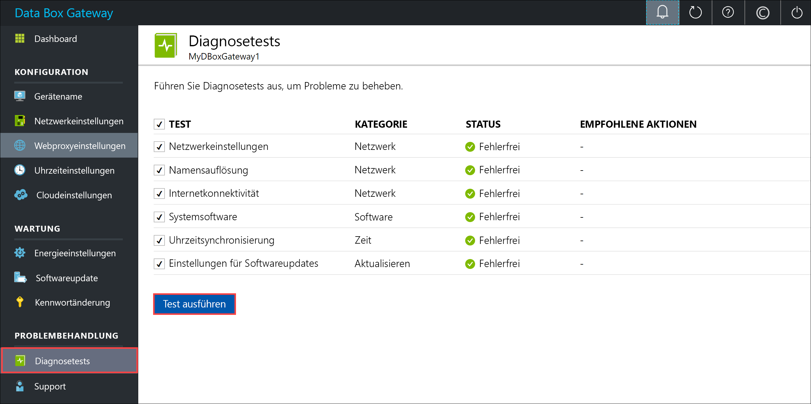
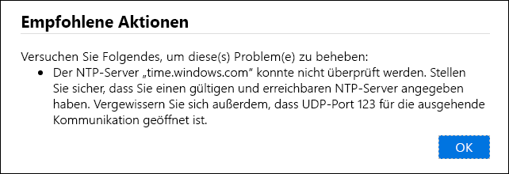
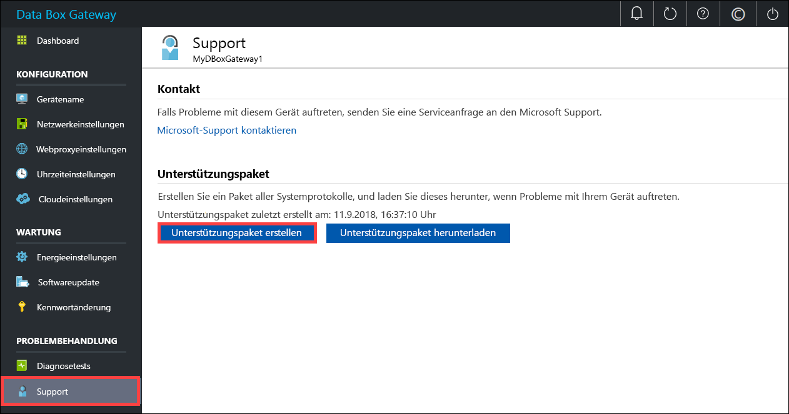
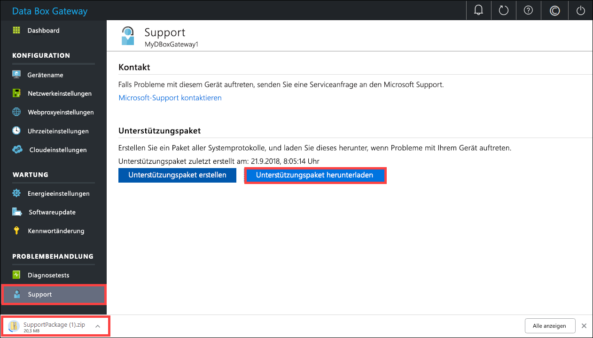
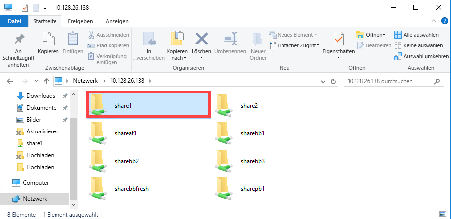

# <a name="troubleshoot-your-azure-data-box-gateway-issues"></a>Behandeln von Problemen mit Azure Data Box Gateway 

In diesem Artikel erfahren Sie, wie Sie Probleme mit Azure Data Box Gateway behandeln. 

> [!IMPORTANT]
> - Data Box Gateway ist in der Vorschauphase. Lesen Sie die [Azure-Vertragsbedingungen für Vorschauversionen](https://azure.microsoft.com/support/legal/preview-supplemental-terms/), bevor Sie diese Lösung bestellen und bereitstellen.

In diesem Artikel werden folgende Vorgehensweisen behandelt:

> [!div class="checklist"]
> * Ausführen von Diagnosen
> * Zusammenstellen des Unterstützungspaket
> * Behandeln von Problemen anhand von Protokollen


## <a name="run-diagnostics"></a>Ausführen von Diagnosen

Zum Diagnostizieren und Behandeln von Gerätefehlern können Sie die Diagnosetests ausführen. Gehen Sie auf der lokalen Webbenutzeroberfläche Ihres Geräts wie folgt vor, um Diagnosetests auszuführen:

1. Navigieren Sie auf der lokalen Webbenutzeroberfläche zu **Problembehandlung > Diagnosetests**. Wählen Sie den gewünschten Test aus, und klicken Sie auf **Test ausführen**. Daraufhin werden die Tests ausgeführt, um mögliche Probleme mit Ihren Netzwerk-, Geräte-, Webproxy-, Zeit- oder Cloudeinstellungen zu diagnostizieren. Sie werden benachrichtigt, dass auf dem Gerät Tests ausgeführt werden.

    
 
2. Nach Abschluss der Tests werden die Ergebnisse angezeigt. Sollte ein Test nicht erfolgreich sein, wird eine URL für die empfohlene Maßnahme angezeigt. Sie können auf die URL klicken, um die empfohlene Maßnahme anzuzeigen. 
 
    


## <a name="collect-support-package"></a>Zusammenstellen des Unterstützungspaket

Ein Protokollpaket enthält alle relevanten Protokolle, die das Supportteam von Microsoft bei der Behandlung von Geräteproblemen unterstützen. Sie können ein Unterstützungspaket über die lokale Webbenutzeroberfläche generieren.

Gehen Sie wie folgt vor, um ein Unterstützungspaket zusammenzustellen: 

1. Navigieren Sie auf der lokalen Webbenutzeroberfläche zu **Problembehandlung > Support**. Klicken Sie auf **Unterstützungspaket erstellen**. Daraufhin wird das Unterstützungspaket zusammengestellt. Dieser Vorgang kann mehrere Minuten dauern.

    
 
2. Klicken Sie nach Abschluss der Erstellung des Unterstützungspakets auf **Unterstützungspaket herunterladen**. Ein ZIP-Paket wird an den gewünschten Pfad heruntergeladen. Sie können das Paket entpacken und sich die Systemprotokolldateien ansehen.

    

## <a name="use-logs-to-troubleshoot"></a>Behandeln von Problemen anhand von Protokollen

Alle Fehler, die während der Upload- und Aktualisierungsprozesse aufgetreten sind, sind in den entsprechenden Fehlerdateien enthalten.

1. Navigieren Sie zum Anzeigen der Fehlerdateien zu Ihrer Freigabe, und klicken Sie auf die Freigabe, um den Inhalt anzuzeigen. 

      

2. Klicken Sie auf den Ordner _Microsoft Data Box Gateway_. Dieser Ordner enthält zwei Unterordner:

    - Der Ordner „Upload“ enthält Protokolldateien für Uploadfehler.
    - Der Ordner „Refresh“ ist für Fehler bei der Aktualisierung vorgesehen.

    Hier sehen Sie eine exemplarische Protokolldatei für die Aktualisierung.

    ```
    <root container="brownbag1" machine="VM15BS020663" timestamp="07/18/2018 00:11:10" />
    <file item="test.txt" local="False" remote="True" error="16001" />
    <summary runtime="00:00:00.0945320" errors="1" creates="2" deletes="0" insync="3" replaces="0" pending="9" />
    ``` 

3. Wenn diese Datei einen Fehler enthält (im Beispiel hervorgehoben), notieren Sie sich den Fehlercode (in diesem Fall: 16001). Suchen Sie anhand dieses Fehlercodes in der folgenden Fehlerreferenz nach der entsprechenden Fehlerbeschreibung.

    |     Fehlercode     |     Name der Ausnahme                                         |     Fehlerbeschreibung                                                                                                                                                                                                                     |
    |--------------------|------------------------------------------------------------|-------------------------------------------------------------------------------------------------------------------------------------------------------------------------------------------------------------------------------------------|
    |    100             |    ERROR_CONTAINER_OR_SHARE_NAME_LENGTH                    |    Der Name des Containers oder der Freigabe muss zwischen 3 und 63 Zeichen umfassen.                                                                                                                                                                     |
    |    101             |    ERROR_CONTAINER_OR_SHARE_NAME_ALPHA_NUMERIC_DASH        |    Der Name des Containers oder der Freigabe darf nur Buchstaben, Zahlen oder Bindestriche enthalten.                                                                                                                                                       |
    |    102             |    ERROR_CONTAINER_OR_SHARE_NAME_IMPROPER_DASH             |    Der Name des Containers oder der Freigabe darf nur Buchstaben, Zahlen oder Bindestriche enthalten.                                                                                                                                                       |
    |    103             |    ERROR_BLOB_OR_FILE_NAME_CHARACTER_CONTROL               |    Der Blob- oder Dateiname enthält nicht unterstützte Steuerzeichen.                                                                                                                                                                       |
    |    104             |    ERROR_BLOB_OR_FILE_NAME_CHARACTER_ILLEGAL               |    Der Blob- oder Dateiname enthält unzulässige Zeichen.                                                                                                                                                                                   |
    |    105             |    ERROR_BLOB_OR_FILE_NAME_SEGMENT_COUNT                   |    Der Blob- oder Dateiname enthält zu viele Segmente. Segmente werden jeweils durch einen Schrägstrich (/) getrennt.                                                                                                                                              |
    |    106             |    ERROR_BLOB_OR_FILE_NAME_AGGREGATE_LENGTH                |    Der Blob- oder Dateiname ist zu lang.                                                                                                                                                                                                     |
    |    107             |    ERROR_BLOB_OR_FILE_NAME_COMPONENT_LENGTH                |    Eines der Segmente des Blob- oder Dateinamens ist zu lang.                                                                                                                                                                            |
    |    108             |    ERROR_BLOB_OR_FILE_SIZE_LIMIT                           |    Die Datei ist zu groß zum Hochladen.                                                                                                                                                                              |
    |    109             |    ERROR_BLOB_OR_FILE_SIZE_ALIGNMENT                       |    Der Blob- oder Dateiname ist nicht ordnungsgemäß ausgerichtet.                                                                                                                                                                                               |
    |    110             |    ERROR_NAME_NOT_VALID_UNICODE                            |    Der Blob- oder Dateiname im Unicodeformat ist ungültig.                                                                                                                                                                                  |
    |    111             |    ERROR_RESERVED_NAME_NOT_ALLOWED                         |    Der Name oder das Präfix der Datei oder des Blobs ist ein nicht unterstützter reservierter Name (beispielsweise COM1).                                                                                                                             |
    |    2000            |    ERROR_ETAG_MISMATCH                                     |    Ein ETag-Konflikt deutet auf einen Konflikt zwischen einem Blockblob in der Cloud und auf dem Gerät hin. Löschen Sie zur Behebung dieses Konflikts eine dieser Dateien (entweder die Version in der Cloud oder die Version auf dem Gerät).    |
    |    2001            |    ERROR_UNEXPECTED_FINALIZE_FAILURE                       |    Bei der Verarbeitung einer hochgeladenen Datei ist ein unerwartetes Problem aufgetreten.    Sollte dieser Fehler auftreten und länger als 24 Stunden bestehen bleiben, wenden Sie sich an den Support.                                                      |
    |    2002            |    ERROR_ALREADY_OPEN                                      |    Die Datei ist bereits in einem anderen Prozess geöffnet und kann erst hochgeladen werden, wenn das Handle geschlossen wurde.                                                                                                                                       |
    |    2003            |    ERROR_UNABLE_TO_OPEN                                    |    Die hochzuladende Datei konnte nicht geöffnet werden. Sollte dieser Fehler auftreten, wenden Sie sich an den Microsoft-Support.                                                                                                                                                |
    |    2004            |    ERROR_UNABLE_TO_CONNECT                                 |    Mit dem Zielcontainer für die hochzuladenden Daten konnte keine Verbindung hergestellt werden.                                                                                                                                                                             |
    |    2005            |    ERROR_INVALID_CLOUD_CREDENTIALS                         |    Mit dem Container konnte keine Verbindung hergestellt werden, da die Kontoberechtigungen entweder nicht korrekt oder nicht mehr aktuell sind. Überprüfen Sie Ihren Zugriff.                                                                                                               |
    |    2006            |    ERROR_CLOUD_ACCOUNT_DISABLED                            |    In das Konto konnten keine Daten hochgeladen werden, da das Konto oder die Freigabe deaktiviert ist.                                                                                                                                                            |
    |    2007            |    ERROR_CLOUD_ACCOUNT_PERMISSIONS                         |    Mit dem Container konnte keine Verbindung hergestellt werden, da die Kontoberechtigungen entweder nicht korrekt oder nicht mehr aktuell sind. Überprüfen Sie Ihren Zugriff.                                                                                                               |
    |    2008            |    ERROR_CLOUD_CONTAINER_SIZE_LIMIT_REACHED                |    Es konnten keine neuen Daten hinzugefügt werden, da der Container voll ist. Überprüfen Sie die Azure-Spezifikationen für unterstützte Containergrößen unter Berücksichtigung des Typs. Azure Files unterstützt beispielsweise nur eine maximale Dateigröße von 5 TB.                                     |
    |    2998            |    ERROR_UNMAPPED_FAILURE                                  |    Ein unerwarteter Fehler ist aufgetreten. Der Fehler behebt sich unter Umständen von selbst. Sollte er jedoch länger als 24 Stunden bestehen bleiben, wenden Sie sich an den Microsoft-Support.                                                                                                     |
    |    16000           |    RefreshException                                        |    Diese Datei konnte nicht abgerufen werden.                                                                                                                                                                                                        |
    |    16001           |    RefreshAlreadyExistsException                           |    Diese Datei konnte nicht abgerufen werden, da sie auf Ihrem lokalen System bereits vorhanden ist.                                                                                                                                                         |
    |    16002           |    RefreshWorkNeededException                              |    Diese Datei konnte nicht aktualisiert werden, da sie nicht vollständig hochgeladen wurde.                                                                                                                                                                          | 


## <a name="next-steps"></a>Nächste Schritte

- Erfahren Sie mehr über die [bekannten Probleme in dieser Version](data-box-gateway-release-notes.md).
