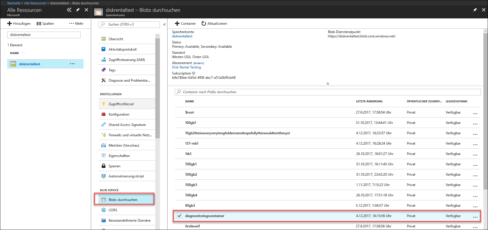
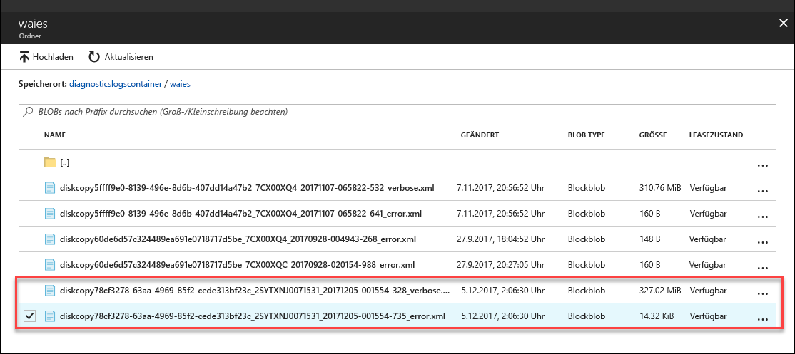

# Behandeln von Problemen mit Azure Data Box Disk

Dieser Artikel gilt für Microsoft Azure Data Box Disk. Er beschreibt die Workflows zum Beheben von Problemen, die beim Bereitstellen dieser Lösung auftreten können. 

Dieser Artikel enthält die folgenden Abschnitte:

- Herunterladen von Diagnoseprotokollen
- Abfragen von Aktivitätsprotokollen
- Fehler des Data Box Disk-Tools zum Entsperren
- Fehler des Data Box Disk-Tools zum Aufteilen/Kopieren

## Herunterladen von Diagnoseprotokollen

Wenn während des Datenkopiervorgangs Fehler auftreten, zeigt das Portal einen Pfad zu dem Ordner an, in dem sich die Diagnoseprotokolle befinden. 

Folgende Diagnoseprotokolle sind möglich:
- Fehlerprotokolle
- Ausführliche Protokolle  

Um zum Pfad zum Kopieren der Protokolle zu navigieren, navigieren Sie zu dem Speicherkonto, das Ihrer Data Box-Bestellung zugeordnet ist. 

1.  Navigieren Sie zu **Allgemein > Bestelldetails**, und notieren Sie sich das Speicherkonto, das Ihrer Bestellung zugeordnet ist.
 

2.  Navigieren Sie zu **Alle Ressourcen**, und suchen Sie nach dem Speicherkonto, das Sie im vorherigen Schritt identifiziert haben. Wählen Sie das Speicherkonto aus, und klicken Sie darauf.

    

3.  Navigieren Sie zu **Blob-Dienst > Blobs durchsuchen**, und suchen Sie nach dem Blob, das dem Speicherkonto entspricht. Navigieren Sie zu **diagnosticslogcontainer > waies**. 

    

    Sowohl die Fehlerprotokolle als auch die ausführlichen Protokolle sollten zum Kopieren von Daten angezeigt werden. Wählen Sie jede Datei aus, und klicken Sie darauf, und laden Sie dann eine lokale Kopie herunter.

## Abfragen von Aktivitätsprotokollen

Verwenden Sie die Aktivitätsprotokolle zum Ermitteln eines Fehlers oder zum Nachverfolgen, welche Änderungen an einer Ressource ein Benutzer in Ihrer Organisation vorgenommen hat. Mithilfe von Aktivitätsprotokollen können Sie Folgendes ermitteln:

- Welche Vorgänge in den Ressourcen in Ihrem Abonnement ausgeführt wurden.
- Der Benutzer oder das System, von dem der Vorgang initiiert wurde. 
- Wann der Vorgang ausgeführt wurde.
- Der Status des Vorgangs.
- Werte anderer Eigenschaften, mit denen Sie den Vorgang ggf. untersuchen können.

Das Aktivitätsprotokoll enthält alle Schreibvorgänge (z.B. PUT, POST, DELETE) für Ihre Ressourcen, nicht aber die Lesevorgänge (z.B. GET). 

Aktivitätsprotokolle werden 90 Tage lang aufbewahrt. Sie können beliebige Datumsbereiche abfragen, das Startdatum darf jedoch maximal 90 Tage zurückliegen. Sie können auch mit einer der integrierten Abfragen in Insights filtern. Klicken Sie z.B. auf „Fehler“, und klicken Sie dann auf bestimmte Fehler, um die Grundursache zu verstehen.

## Fehler des Data Box Disk-Tools zum Entsperren

| Fehlermeldung/Toolverhalten      | Empfehlungen                                                                                               |
|-------------------------------------------------------------------------------------------------------------------------------------|------------------------------------------------------------------------------------------------------|
| Keine  Das Tool zum Entsperren von Data Box-Datenträgern stürzt ab.                                                                            | BitLocker ist nicht installiert. Stellen Sie sicher, dass auf dem Hostcomputer, der das Tool zum Entsperren des Data Box-Datenträgers ausführt, BitLocker installiert ist.                                                                            |
| Die aktuelle .NET Framework-Version wird nicht unterstützt. Die unterstützten Versionen sind 4.5 oder höher.  Das Tool wird mit einer Meldung beendet.  | .NET 4.5 ist nicht installiert. Installieren Sie .NET 4.5 oder höher auf dem Hostcomputer, der das Tool zum Entsperren des Data Box-Datenträgers ausführt.                                                                            |
| Volumes konnten nicht entsperrt oder überprüft werden. Wenden Sie sich an den Microsoft Support.    Das Tool entsperrt bzw. überprüft keine gesperrten Laufwerke. | Das Tool konnte keines der entsperrten Laufwerke mit dem angegebenen Hauptschlüssel entsperren. Erkundigen Sie sich beim Support von Microsoft nach den weiteren Schritten.                                                |
| Folgende Volumes sind entsperrt und überprüft.  Volumelaufwerkbuchstaben: E: Es konnten keine Volumes mit den folgenden Hauptschlüsseln entsperrt werden: werwerqomnf, qwerwerqwdfda   Das Tool entsperrt einige Laufwerke und zeigt die erfolgreichen und fehlerhaften Laufwerkbuchstaben an.| Teilweise erfolgreich. Einige der Laufwerke konnten mit dem angegebenen Hauptschlüssel nicht entsperrt werden. Erkundigen Sie sich beim Support von Microsoft nach den weiteren Schritten. |
| Es wurden keine gesperrten Laufwerke gefunden. Stellen Sie sicher, dass der von Microsoft erhaltene Datenträger ordnungsgemäß verbunden ist und einen gesperrten Zustand aufweist.          | Das Tool findet keine gesperrten Laufwerke. Die Laufwerke sind bereits entsperrt, oder sie werden nicht erkannt. Stellen Sie sicher, dass die Laufwerke verbunden und gesperrt sind.                                                           |
| Schwerwiegender Fehler: Ungültiger Parameter Parametername: invalid_arg SYNTAX: DataBoxDiskUnlock /PassKeys:<Durch_Semicolons_getrennte_Liste_der_Hauptschlüssel>  Beispiel: DataBoxDiskUnlock /PassKeys:Hauptschlüssel1;Hauptschlüssel2;Hauptschlüssel3 Beispiel: DataBoxDiskUnlock /SystemCheck Beispiel: DataBoxDiskUnlock /Help  /PassKeys:       Abrufen dieses Schlüssels aus dem Azure Data Box Disk-Auftrag. Der Hauptschlüssel entsperrt Ihre Datenträger. /Help:           Diese Option bietet Hilfe und Beispiele für die Cmdlet-Verwendung. /SystemCheck:    Diese Option überprüft, ob Ihr System die Anforderungen zum Ausführen des Tools erfüllt.  Drücken Sie zum Beenden eine beliebige Taste. | Ungültige Parametereingabe. Der einzigen zulässigen Parameter sind /SystemCheck, /PassKey und /Help.                                                                            |

## Fehler des Data Box Disk-Tools zum Aufteilen/Kopieren

|Fehlermeldung/Warnungen  |Empfehlungen |
|---------|---------|
|[Info] Retrieving bitlocker password for volume: m  [Error] Exception caught while retrieving bitlocker key for volume m:  Sequence contains no elements. ([Information] BitLocker-Kennwort für folgendes Volume wird abgerufen: M.[Fehler] Ausnahme beim Abrufen des BitLocker-Schlüssels für das Volume M abgefangen:Die Sequenz enthält keine Elemente.)|Dieser Fehler tritt auf, wenn das Data Box Disk-Ziel offline ist.   Verwenden Sie das Tool `diskmgmt.msc`, um Datenträger online zu schalten.|
|[Error] Exception thrown: WMI operation failed:  Method=UnlockWithNumericalPassword, ReturnValue=2150694965,  Win32Message=The format of the recovery password provided is invalid.  BitLocker recovery passwords are 48 digits.  Verify that the recovery password is in the correct format and then try again.([Fehler] Eine Ausnahme wurde ausgelöst: Fehler beim WMI-Vorgang: Methode: UnlockWithNumericalPassword, Rückgabewert: 2150694965, Win32-Meldung: Das Format des angegebenen Wiederherstellungskennworts ist ungültig. BitLocker-Wiederherstellungskennwörter müssen 48-stellig sein. Vergewissern Sie sich, dass das Wiederherstellungskennwort das richtige Format hat, und wiederholen Sie den Vorgang.)|Entsperren Sie die Datenträger zunächst mit dem Data Box Disk-Tool zum Entsperren, und führen Sie den Befehl anschließend erneut aus. Weitere Informationen finden Sie unter: <li> [Entsperren von Datenträgern auf Windows-Client](data-box-disk-deploy-set-up.md#unlock-disks-on-windows-client) </li><li> [Entsperren von Datenträgern auf Linux-Client](data-box-disk-deploy-set-up.md#unlock-disks-on-linux-client) </li>|
|[Error] Exception thrown: A DriveManifest.xml file exists on the target drive.   This indicates the target drive may have been prepared with a different journal file.  To add more data to the same drive, use the previous journal file. To delete existing data and reuse target drive for a new import job, delete the DriveManifest.xml on the drive. Rerun this command with a new journal file. ([Fehler] Eine Ausnahme wurde ausgelöst: Auf dem Ziellaufwerk befindet sich eine Datei vom Typ „DriveManifest.xml“. Das Ziellaufwerk wurde möglicherweise mit einer anderen Journaldatei vorbereitet. Wenn Sie dem gleichen Laufwerk weitere Daten hinzufügen möchten, verwenden Sie die vorherige Journaldatei. Wenn Sie die vorhandenen Daten löschen und das Ziellaufwerk für einen neuen Importauftrag verwenden möchten, löschen Sie die Datei „DriveManifest.xml“ auf dem Laufwerk, und führen Sie diesen Befehl mit einer neuen Journaldatei aus.)| Dieser Fehler tritt auf, wenn Sie versuchen, die gleiche Gruppe von Laufwerken für mehrere Importsitzungen zu verwenden.   Verwenden Sie pro Aufteilungs-/Kopiersitzung immer nur eine Gruppe von Laufwerken.|
|[Error] Exception thrown: CopySessionId importdata-sept-test-1 refers to a previous copy session and cannot be reused for a new copy session. ([Fehler] Eine Ausnahme wurde ausgelöst: „CopySessionId importdata-sept-test-1“ bezieht sich auf eine vorherige Kopiersitzung und kann nicht für diese neue Kopiersitzung wiederverwendet werden.)|Dieser Fehler tritt auf, wenn Sie versuchen, den Auftragsnamen eines bereits erfolgreich abgeschlossenen Auftrags für einen neuen Auftrag zu verwenden.  Weisen Sie Ihrem neuen Auftrag einen eindeutigen Namen zu.|
|[Info] Destination file or directory name exceeds the NTFS length limit. ([Information] Der Name der Zieldatei oder des Zielverzeichnisses übersteigt die NTFS-Längenbeschränkung.) |Diese Meldung wird zurückgegeben, wenn die Zieldatei aufgrund eines langen Dateipfads umbenannt wurde.  Ändern Sie die Dispositionsoption in der Datei `config.json`, um dieses Verhalten zu steuern.|
|[Error] Exception thrown: Bad JSON escape sequence. ([Fehler] Eine Ausnahme wurde ausgelöst: fehlerhafte JSON-Escapesequenz.) |Diese Meldung wird zurückgegeben, wenn das Format von „config.json“ ungültig ist.   Überprüfen Sie die Datei `config.json` vor dem Speichern mithilfe von [JSONLint](https://jsonlint.com/).|

## Bereitstellungsprobleme unter Linux

In diesem Abschnitt werden einige der wichtigsten Probleme bei der Bereitstellung von Data Box Disk unter Verwendung eines Linux-Clients zum Kopieren von Daten beschrieben.

### Problem: Das Laufwerk wird schreibgeschützt eingebunden.
 
**Ursache** 

Dies kann auf ein fehlerhaftes Dateisystem zurückzuführen sein. 

Das erneute Einbinden eines Laufwerks mit Lese-/Schreibzugriff funktioniert nicht mit Data Box Disk-Datenträgern. Dieses Szenario wird mit Laufwerken, die mit dislocker entschlüsselt werden, nicht unterstützt. Möglicherweise haben Sie das Gerät mithilfe des folgenden Befehls erfolgreich erneut eingebunden: 

    `# mount -o remount, rw /mnt/DataBoxDisk/mountVol1`

Das erneute Einbinden war zwar erfolgreich, die Daten werden jedoch nicht beibehalten.

**Lösung**

Wenn der oben angegebene Fehler angezeigt wird, können Sie eine der folgenden Lösungen ausprobieren:

- Installieren Sie [`ntfsfix`](https://linux.die.net/man/8/ntfsfix) (verfügbar im Paket `ntfsprogs`), und führen Sie es für die entsprechende Partition aus.

- Bei Zugriff auf ein Windows-System

    - Laden Sie das Laufwerk in das Windows-System.
    - Öffnen Sie eine Eingabeaufforderung mit Administratorberechtigungen. Führen Sie `chkdsk` auf dem Volume aus.
    - Entfernen Sie das Volume sicher, und versuchen Sie es erneut.
 
### Problem: Fehler mit Daten, die nach dem Kopieren nicht beibehalten werden
 
**Ursache** 

Wenn Sie feststellen, dass nach dem Aufheben der Einbindung auf dem Laufwerk keine Daten mehr vorhanden sind (obwohl Daten darauf kopiert wurden), ist es möglich, dass Sie das Laufwerk mit Lese-/ Schreibzugriff eingebunden haben, nachdem es schreibgeschützt eingebunden wurde.

**Lösung**
 
Wenn dies der Fall ist, finden Sie weitere Informationen in der Lösung für Probleme durch [schreibgeschützt eingebundene Laufwerke](#issue-drive-getting-mounted-as-read-only).

Wenn dies nicht der Fall war, kopieren Sie die Protokolle aus dem Ordner, in dem sich das Data Box Disk-Tool zum Entsperren befindet, und [wenden Sie sich an den Microsoft-Support](data-box-disk-contact-microsoft-support.md).

## Bereitstellungsprobleme unter Windows

In diesem Abschnitt werden einige der wichtigsten Probleme beschrieben, die bei der Bereitstellung von Data Box Disk auftreten können, wenn ein Windows-Client zum Kopieren von Daten verwendet wird.

### Problem: Laufwerk von BitLocker konnte nicht entsperrt werden.
 
**Ursache** 

Sie haben das Kennwort im BitLocker-Dialogfeld verwendet und versuchen, den Datenträger über das BitLocker-Dialogfeld zum Entsperren von Laufwerken zu entsperren. Dies funktioniert nicht. 

**Lösung**

Um die Data Box Disk-Datenträger zu entsperren, müssen Sie das Data Box Disk-Entsperrtool verwenden und das Kennwort aus dem Azure-Portal angeben. Weitere Informationen finden Sie unter [Tutorial: Entpacken, Verbinden und Entsperren von Azure Data Box Disk](data-box-disk-deploy-set-up.md#connect-to-disks-and-get-the-passkey).
 
### Problem: Einige Volumes konnten nicht entsperrt oder überprüft werden. Wenden Sie sich an den Microsoft Support.
 
**Ursache** 

Möglicherweise ist der folgende Fehler im Fehlerprotokoll aufgeführt, und Sie können einige Volumes nicht entsperren oder überprüfen.

`Exception System.IO.FileNotFoundException: Could not load file or assembly 'Microsoft.Management.Infrastructure, Version=1.0.0.0, Culture=neutral, PublicKeyToken=31bf3856ad364e35' or one of its dependencies. The system cannot find the file specified.`
 
Dies deutet darauf hin, dass wahrscheinlich die geeignete Version von Windows PowerShell auf Ihrem Windows-Client fehlt.

**Lösung**

Sie können [Windows PowerShell v5.0](https://www.microsoft.com/download/details.aspx?id=54616) installieren und den Vorgang wiederholen.
 
Wenn es Ihnen weiterhin nicht möglich ist, die Volumes zu entsperren, kopieren Sie die Protokolle aus dem Ordner, in dem sich das Data Box Disk-Tool zum Entsperren befindet, und [wenden Sie sich an den Microsoft-Support](data-box-disk-contact-microsoft-support.md).

## Nächste Schritte

- Weitere Informationen zum [Verwalten des Data Box-Datenträgers über das Azure-Portal](data-box-portal-ui-admin.md).
