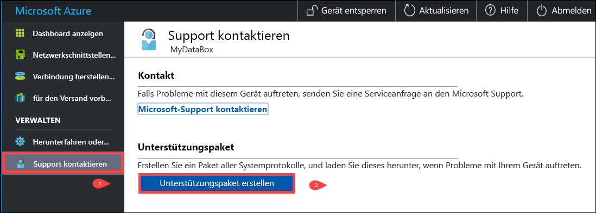
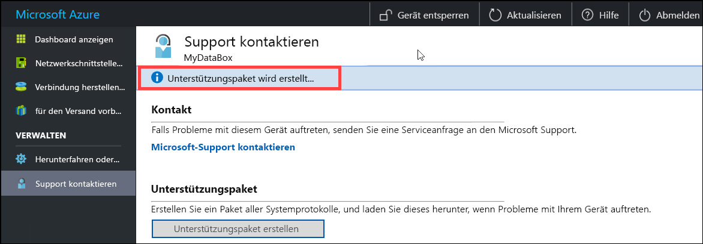
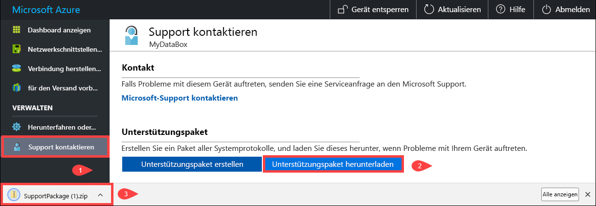
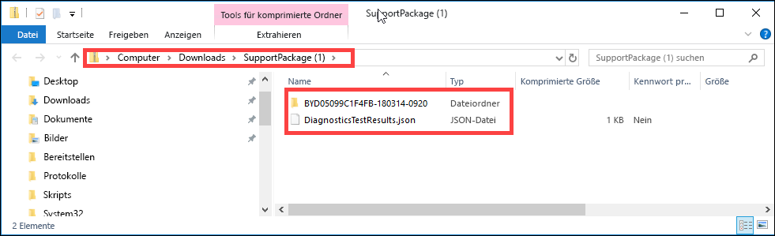
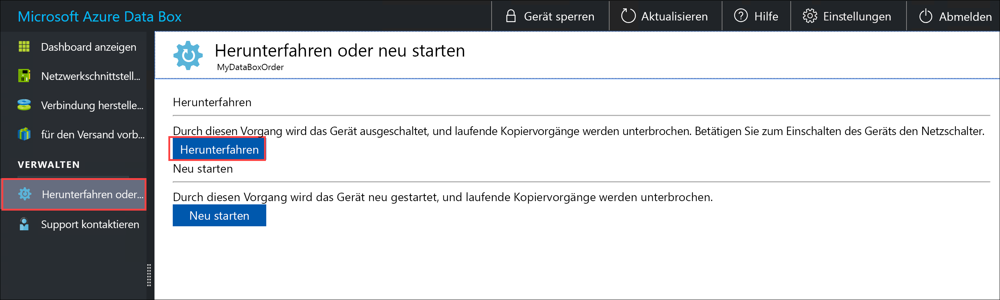
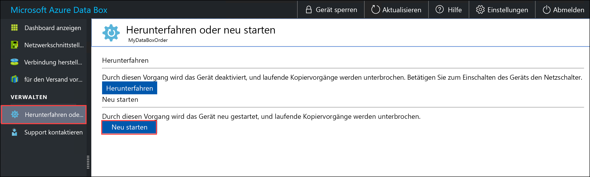

# Verwalten von Data Box auf der lokalen Webbenutzeroberfläche

In diesem Artikel werden einige der Konfigurations- und Verwaltungsaufgaben beschrieben, die auf der Data Box ausgeführt werden können. Sie können die Data Box im Azure-Portal oder auf der lokalen Webbenutzeroberfläche des Geräts verwalten. Der Schwerpunkt dieses Artikels liegt auf den Aufgaben, die auf der lokalen Webbenutzeroberfläche ausgeführt werden können.

Die lokale Webbenutzeroberfläche für das Data Box-Gerät dient zur Erstkonfiguration des Geräts. Sie können die lokale Webbenutzeroberfläche auch verwenden, um das Data Box-Gerät herunterzufahren oder neu zu starten, Diagnosetests durchzuführen, Software zu aktualisieren, Kopierprotokolle anzuzeigen und ein Protokollpaket für den Microsoft-Support zu erstellen.

Dieser Artikel enthält folgende Lernprogramme:

- Erstellen eines Unterstützungspakets
- Herunterfahren oder Neustarten des Geräts
- Sicheres Löschen von Daten vom Gerät
- Überwachen der verfügbaren Kapazität des Geräts
- Überspringen der Überprüfung der Prüfsumme 

## Erstellen eines Unterstützungspakets

Wenn Sie Geräteprobleme haben, können Sie anhand der Systemprotokolle ein Unterstützungspaket erstellen. Der Microsoft-Support verwendet dieses Paket, um das Problem zu beheben. Führen Sie die folgenden Schritte aus, um ein Unterstützungspaket zu erstellen:

1. Wechseln Sie auf der lokalen Webbenutzeroberfläche zu **Support kontaktieren**, und klicken Sie auf **Unterstützungspaket erstellen**.

    

2. Ein Unterstützungspaket wird zusammengestellt. Dieser Vorgang dauert einige Minuten.

    

3. Sobald die Erstellung des Unterstützungspakets abgeschlossen ist, klicken Sie auf **Unterstützungspaket herunterladen**. 

    

4. Navigieren Sie zum Speicherort des Downloads. Öffnen Sie den Ordner, um den Inhalt anzuzeigen.

    

## Herunterfahren oder Neustarten des Geräts

Sie können Ihre Data Box auf der lokalen Webbenutzeroberfläche herunterfahren oder neu starten. Wir empfehlen, vor dem Neustart die Freigaben auf dem Host und dann auf dem Gerät offline zu schalten. Dadurch wird das Risiko einer Datenbeschädigung minimiert. Vergewissern Sie sich, dass beim Herunterfahren des Geräts kein Datenkopiervorgang durchgeführt wird.

Führen Sie zum Herunterfahren Ihres Data Box-Geräts die folgenden Schritte aus.

1. Wechseln Sie auf der lokalen Webbenutzeroberfläche zu **Herunterfahren oder neu starten**.
2. Klicken Sie auf **Herunterfahren**.

    

3. Wenn Sie zur Bestätigung aufgefordert werden, klicken Sie auf **OK**, um fortzufahren.

    

Sobald das Gerät heruntergefahren ist, schalten Sie es über den Netzschalter auf der Vorderseite ein.

Führen Sie zum Neustarten Ihres Data Box-Geräts die folgenden Schritte aus.

1. Wechseln Sie auf der lokalen Webbenutzeroberfläche zu **Herunterfahren oder neu starten**.
2. Klicken Sie auf **Restart**.

    

3. Wenn Sie zur Bestätigung aufgefordert werden, klicken Sie auf **OK**, um fortzufahren.

   Das Gerät wird heruntergefahren und anschließend neu gestartet.

## Anzeigen der verfügbaren Kapazität des Geräts

Sie können auf dem Dashboard des Geräts die verfügbare und belegte Kapazität des Geräts anzeigen. 

1. Wechseln Sie auf der lokalen Webbenutzeroberfläche zu **Dashboard anzeigen**.
2. Unter **Verbindung herstellen und Daten kopieren** wird der freie und belegte Speicherplatz auf dem Gerät angezeigt.

    

## Überspringen der Überprüfung der Prüfsumme

Prüfsummen werden standardmäßig für Ihre Daten generiert, wenn Sie den Versand vorbereiten. In bestimmten seltenen Fällen kann die Leistung je nach Datentyp (kleine Dateigrößen) sehr langsam sein. In solchen Fällen können Sie die Prüfsumme überspringen. 

Es wird dringend empfohlen, die Prüfsumme nicht zu deaktivieren, es sei denn, die Leistung wird erheblich beeinträchtigt.

1. Wechseln Sie rechts oben auf der lokalen Webbenutzeroberfläche Ihres Geräts zu „Einstellungen“.

    

2. **Deaktivieren** Sie die Überprüfung der Prüfsumme.
3. Klicken Sie auf **Anwenden**.

## Nächste Schritte

- Erfahren Sie mehr zum [Verwalten der Data Box im Azure-Portal](data-box-portal-admin.md).

