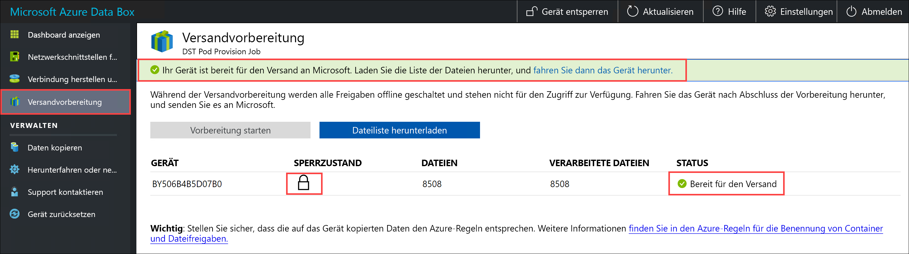
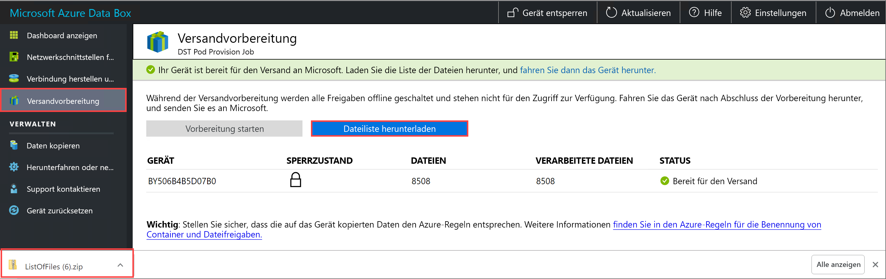
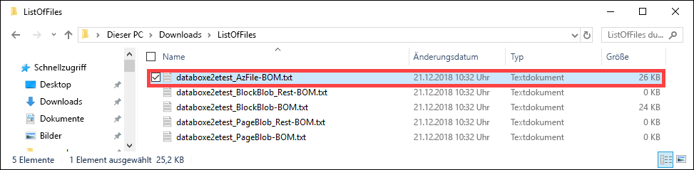

# <a name="use-the-local-web-ui-to-administer-your-data-box"></a>Verwalten von Data Box auf der lokalen Webbenutzeroberfläche

In diesem Artikel werden einige der Konfigurations- und Verwaltungsaufgaben beschrieben, die auf der Data Box ausgeführt werden können. Sie können die Data Box im Azure-Portal oder auf der lokalen Webbenutzeroberfläche des Geräts verwalten. Der Schwerpunkt dieses Artikels liegt auf den Aufgaben, die auf der lokalen Webbenutzeroberfläche ausgeführt werden können.

Die lokale Webbenutzeroberfläche für das Data Box-Gerät dient zur Erstkonfiguration des Geräts. Sie können die lokale Webbenutzeroberfläche auch verwenden, um das Data Box-Gerät herunterzufahren oder neu zu starten, Diagnosetests durchzuführen, Software zu aktualisieren, Kopierprotokolle anzuzeigen und ein Protokollpaket für den Microsoft-Support zu erstellen.

Dieser Artikel enthält folgende Lernprogramme:

- Erstellen eines Unterstützungspakets
- Herunterfahren oder Neustarten des Geräts
- Herunterladen von BOM- oder Manifestdateien
- Anzeigen der verfügbaren Kapazität des Geräts
- Überspringen der Überprüfung der Prüfsumme 

## <a name="generate-support-package"></a>Erstellen eines Unterstützungspakets

Wenn Sie Geräteprobleme haben, können Sie anhand der Systemprotokolle ein Unterstützungspaket erstellen. Der Microsoft-Support verwendet dieses Paket, um das Problem zu beheben. Führen Sie die folgenden Schritte aus, um ein Unterstützungspaket zu erstellen:

1. Wechseln Sie auf der lokalen Webbenutzeroberfläche zu **Support kontaktieren**, und klicken Sie auf **Unterstützungspaket erstellen**.

    

2. Ein Unterstützungspaket wird zusammengestellt. Dieser Vorgang dauert einige Minuten.

    

3. Sobald die Erstellung des Unterstützungspakets abgeschlossen ist, klicken Sie auf **Unterstützungspaket herunterladen**. 

    

4. Navigieren Sie zum Speicherort des Downloads. Öffnen Sie den Ordner, um den Inhalt anzuzeigen.

    


## <a name="shut-down-or-restart-your-device"></a>Herunterfahren oder Neustarten des Geräts

Sie können Ihre Data Box auf der lokalen Webbenutzeroberfläche herunterfahren oder neu starten. Wir empfehlen, vor dem Neustart die Freigaben auf dem Host und dann auf dem Gerät offline zu schalten. Dadurch wird das Risiko einer Datenbeschädigung minimiert. Vergewissern Sie sich, dass beim Herunterfahren des Geräts kein Datenkopiervorgang durchgeführt wird.

Führen Sie zum Herunterfahren Ihres Data Box-Geräts die folgenden Schritte aus.

1. Wechseln Sie auf der lokalen Webbenutzeroberfläche zu **Herunterfahren oder neu starten**.
2. Klicken Sie auf **Herunterfahren**.

    

3. Wenn Sie zur Bestätigung aufgefordert werden, klicken Sie auf **OK**, um fortzufahren.

    

Sobald das Gerät heruntergefahren ist, schalten Sie es über den Netzschalter auf der Vorderseite ein.

Führen Sie zum Neustarten Ihres Data Box-Geräts die folgenden Schritte aus.

1. Wechseln Sie auf der lokalen Webbenutzeroberfläche zu **Herunterfahren oder neu starten**.
2. Klicken Sie auf **Restart**.

    

3. Wenn Sie zur Bestätigung aufgefordert werden, klicken Sie auf **OK**, um fortzufahren.

   Das Gerät wird heruntergefahren und anschließend neu gestartet.

## <a name="download-bom-or-manifest-files"></a>Herunterladen von BOM- oder Manifestdateien

Die BOM- oder Manifestdateien (Bill of Material, Stückliste) enthalten die Liste der Dateien, die auf die Data Box kopiert werden. Diese Dateien werden beim Vorbereiten der Data Box für den Versand generiert.

Stellen Sie zunächst sicher, dass für Ihre Data Box der Schritt **Versandvorbereitung** ausgeführt wurde. Führen Sie zum Herunterladen der BOM- oder Manifestdateien die folgenden Schritte aus:

1. Rufen Sie die lokale Webbenutzeroberfläche für Ihre Data Box auf. Dort sehen Sie, dass für die Data Box der Schritt „Versandvorbereitung“ abgeschlossen wurde. Wenn die Vorbereitung des Geräts abgeschlossen ist, ändert sich der Gerätestatus in **Bereit für den Versand**.

    

2. Klicken Sie auf **Dateiliste herunterladen**, um die Liste der Dateien herunterzuladen, die auf Ihre Data Box kopiert wurden.

    

3. Sie sehen im Datei-Explorer, dass eine separate Dateiliste generiert wird. Ausschlaggebend hierfür sind das Protokoll, das für die Verbindungsherstellung mit dem Gerät verwendet wird, und der verwendete Azure Storage-Typ.

    

   In der folgenden Tabelle sind die Dateinamen dem verwendeten Azure Storage-Typ und dem verwendeten Verbindungsprotokoll zugeordnet.

    |Dateiname  |Azure Storage-Typ  |Verwendetes Verbindungsprotokoll |
    |---------|---------|---------|
    |databoxe2etest_BlockBlob.txt     |Blockblobs         |SMB/NFS         |
    |databoxe2etest_PageBlob.txt     |Seitenblobs         |SMB/NFS         |
    |databoxe2etest_AzFile-BOM.txt    |Azure Files         |SMB/NFS         |
    |databoxe2etest_PageBlock_Rest-BOM.txt     |Seitenblobs         |REST        |
    |databoxe2etest_BlockBlock_Rest-BOM.txt    |Blockblobs         |REST         |
    |mydbmdrg1_MDisk-BOM.txt    |Verwalteter Datenträger         |SMB/NFS         |
    |mydbmdrg2_MDisk-BOM.txt     |Verwalteter Datenträger         |SMB/NFS         |

Nach dem Zurücksenden der Data Box an das Azure-Datencenter können Sie anhand dieser Liste die in das Azure Storage-Konto hochgeladenen Dateien überprüfen. Nachfolgend sehen Sie eine Beispielmanifestdatei:

```xml
<file size="52689" crc64="0x95a62e3f2095181e">\databox\media\data-box-deploy-copy-data\prepare-to-ship2.png</file>
<file size="22117" crc64="0x9b160c2c43ab6869">\databox\media\data-box-deploy-copy-data\connect-shares-file-explorer2.png</file>
<file size="57159" crc64="0x1caa82004e0053a4">\databox\media\data-box-deploy-copy-data\verify-used-space-dashboard.png</file>
<file size="24777" crc64="0x3e0db0cd1ad438e0">\databox\media\data-box-deploy-copy-data\prepare-to-ship5.png</file>
<file size="162006" crc64="0x9ceacb612ecb59d6">\databox\media\data-box-cable-options\cabling-dhcp-data-only.png</file>
<file size="155066" crc64="0x051a08d36980f5bc">\databox\media\data-box-cable-options\cabling-2-port-setup.png</file>
<file size="150399" crc64="0x66c5894ff328c0b1">\databox\media\data-box-cable-options\cabling-with-switch-static-ip.png</file>
<file size="158082" crc64="0xbd4b4c5103a783ea">\databox\media\data-box-cable-options\cabling-mgmt-only.png</file>
<file size="148456" crc64="0xa461ad24c8e4344a">\databox\media\data-box-cable-options\cabling-with-static-ip.png</file>
<file size="40417" crc64="0x637f59dd10d032b3">\databox\media\data-box-portal-admin\delete-order1.png</file>
<file size="33704" crc64="0x388546569ea9a29f">\databox\media\data-box-portal-admin\clone-order1.png</file>
<file size="5757" crc64="0x9979df75ee9be91e">\databox\media\data-box-safety\japan.png</file>
<file size="998" crc64="0xc10c5a1863c5f88f">\databox\media\data-box-safety\overload_tip_hazard_icon.png</file>
<file size="5870" crc64="0x4aec2377bb16136d">\databox\media\data-box-safety\south-korea.png</file>
<file size="16572" crc64="0x05b13500a1385a87">\databox\media\data-box-safety\taiwan.png</file>
<file size="999" crc64="0x3f3f1c5c596a4920">\databox\media\data-box-safety\warning_icon.png</file>
<file size="1054" crc64="0x24911140d7487311">\databox\media\data-box-safety\read_safety_and_health_information_icon.png</file>
<file size="1258" crc64="0xc00a2d5480f4fcec">\databox\media\data-box-safety\heavy_weight_hazard_icon.png</file>
<file size="1672" crc64="0x4ae5cfa67c0e895a">\databox\media\data-box-safety\no_user_serviceable_parts_icon.png</file>
<file size="3577" crc64="0x99e3d9df341b62eb">\databox\media\data-box-safety\battery_disposal_icon.png</file>
<file size="993" crc64="0x5a1a78a399840a17">\databox\media\data-box-safety\tip_hazard_icon.png</file>
<file size="1028" crc64="0xffe332400278f013">\databox\media\data-box-safety\electrical_shock_hazard_icon.png</file>
<file size="58699" crc64="0x2c411d5202c78a95">\databox\media\data-box-deploy-ordered\data-box-ordered.png</file>
<file size="46816" crc64="0x31e48aa9ca76bd05">\databox\media\data-box-deploy-ordered\search-azure-data-box1.png</file>
<file size="24160" crc64="0x978fc0c6e0c4c16d">\databox\media\data-box-deploy-ordered\select-data-box-option1.png</file>
<file size="115954" crc64="0x0b42449312086227">\databox\media\data-box-disk-deploy-copy-data\data-box-disk-validation-tool-output.png</file>
<file size="6093" crc64="0xadb61d0d7c6d4deb">\databox\data-box-cable-options.md</file>
<file size="6499" crc64="0x080add29add367d9">\databox\data-box-deploy-copy-data-via-nfs.md</file>
<file size="11089" crc64="0xc3ce6b13a4fe3001">\databox\data-box-deploy-copy-data-via-rest.md</file>
<file size="9126" crc64="0x820856b5a54321ad">\databox\data-box-overview.md</file>
<file size="10963" crc64="0x5e9a14f9f4784fd8">\databox\data-box-safety.md</file>
<file size="5941" crc64="0x8631d62fbc038760">\databox\data-box-security.md</file>
<file size="12536" crc64="0x8c8ff93e73d665ec">\databox\data-box-system-requirements-rest.md</file>
<file size="3220" crc64="0x7257a263c434839a">\databox\data-box-system-requirements.md</file>
<file size="2823" crc64="0x63db1ada6fcdc672">\databox\index.yml</file>
<file size="4364" crc64="0x62b5710f58f00b8b">\databox\data-box-local-web-ui-admin.md</file>
<file size="3603" crc64="0x7e34c25d5606693f">\databox\TOC.yml</file>
```

Diese Datei enthält die Liste aller Dateien, die auf die Data Box kopiert wurden. In dieser Datei bezieht sich der Wert *crc64* auf die für die entsprechende Datei generierte Prüfsumme.

## <a name="view-available-capacity-of-the-device"></a>Anzeigen der verfügbaren Kapazität des Geräts

Sie können auf dem Dashboard des Geräts die verfügbare und belegte Kapazität des Geräts anzeigen. 

1. Wechseln Sie auf der lokalen Webbenutzeroberfläche zu **Dashboard anzeigen**.
2. Unter **Verbindung herstellen und Daten kopieren** wird der freie und belegte Speicherplatz auf dem Gerät angezeigt.

    


## <a name="skip-checksum-validation"></a>Überspringen der Überprüfung der Prüfsumme

Prüfsummen werden standardmäßig für Ihre Daten generiert, wenn Sie den Versand vorbereiten. In bestimmten seltenen Fällen kann die Leistung je nach Datentyp (kleine Dateigrößen) schlecht sein. In solchen Fällen können Sie die Prüfsumme überspringen. 

Es wird dringend empfohlen, die Prüfsumme nicht zu deaktivieren, es sei denn, die Leistung wird erheblich beeinträchtigt.

1. Wechseln Sie rechts oben auf der lokalen Webbenutzeroberfläche Ihres Geräts zu „Einstellungen“.

    

2. **Deaktivieren** Sie die Überprüfung der Prüfsumme.
3. Klicken Sie auf **Anwenden**.

## <a name="next-steps"></a>Nächste Schritte

- Erfahren Sie mehr zum [Verwalten der Data Box im Azure-Portal](data-box-portal-admin.md).

