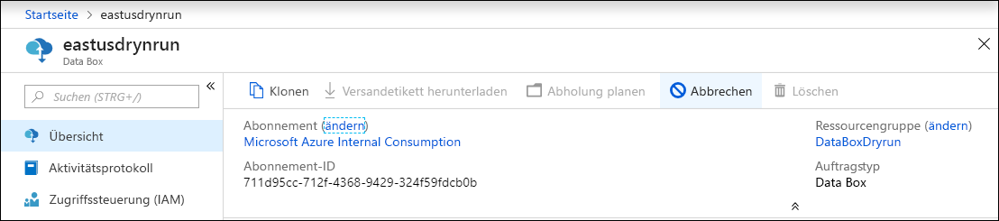
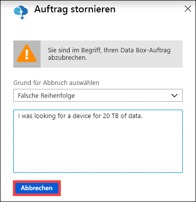
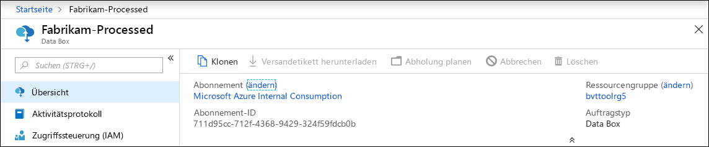
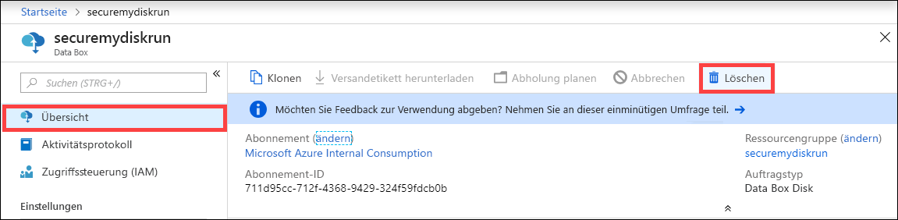
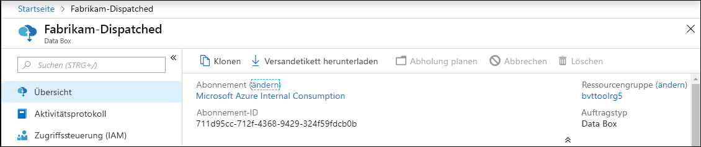
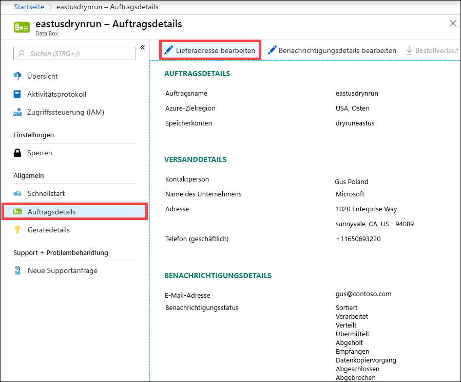
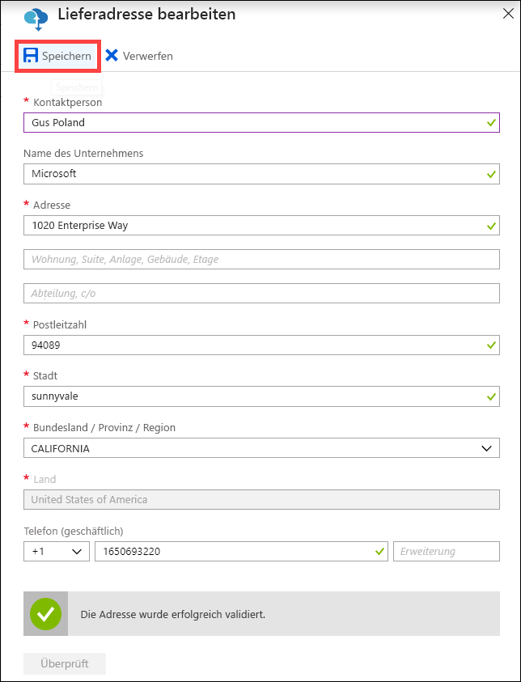
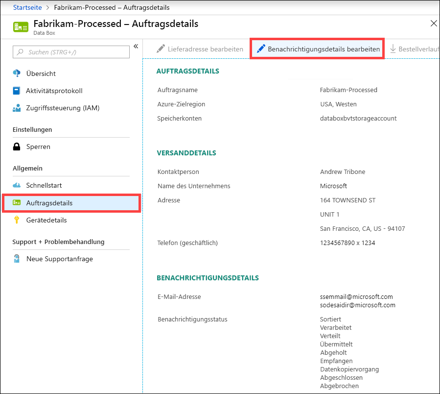
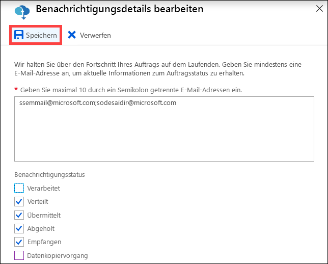

# Verwalten Ihrer Data Box im Azure-Portal

Dieser Artikel beschreibt einige der komplexen Workflows und Verwaltungsaufgaben, die auf der Data Box ausgeführt werden können. Sie können die Data Box im Azure-Portal oder auf der lokalen Webbenutzeroberfläche verwalten. 

Der Schwerpunkt dieses Artikels liegt auf den Aufgaben, die mithilfe des Azure-Portals ausgeführt werden können. Verwenden Sie das Azure-Portal, um Aufträge und die Data Box zu verwalten sowie den Auftragsstatus bis zum Abschluss nachzuverfolgen.

## Abbrechen eines Auftrags

Das Abbrechen eines erteilten Auftrags kann aus verschiedenen Gründen erforderlich sein. Sie können den Auftrag nur stornieren, bevor er bearbeitet wird. Sobald der Auftrag bearbeitet und die Data Box vorbereitet ist, ist es nicht mehr möglich, den Auftrag zu stornieren. 

Führen Sie die folgenden Schritte aus, um einen Auftrag zu stornieren.

1.  Navigieren Sie zu **Übersicht > Abbrechen**. 

    

2.  Geben Sie einen Grund für den Abbruch an.  

    

3.  Nach Stornierung des Auftrags aktualisiert das Portal den Status des Auftrags und zeigt **Abgebrochen** an. 

## Klonen eines Auftrags

Klonen kann in bestimmten Situationen hilfreich sein. Angenommen, ein Benutzer hat mithilfe von Data Box einige Daten übertragen. Bei zunehmender Datenmenge ist eine weitere Data Box erforderlich, um die Daten in Azure zu übertragen. In diesem Fall kann der gleiche Auftrag einfach geklont werden.

Führen Sie die folgenden Schritte aus, um einen Auftrag zu klonen.

1.  Navigieren Sie zu **Übersicht > Klonen**. 

    

2.  Die Auftragsdetails bleiben unverändert. Als Auftragsname wird der Name des ursprünglichen Auftrags mit dem Zusatz *-Clone* verwendet. Aktivieren Sie das Kontrollkästchen, um zu bestätigen, dass Sie die Datenschutzinformationen gelesen haben. Klicken Sie auf **Create**.    

Der Klon wird in wenigen Minuten erstellt und im Portal angezeigt.

## Löschen eines Auftrags

Abgeschlossene Aufträge können bei Bedarf gelöscht werden. Der Auftrag enthält Ihre persönlichen Informationen wie Name, Adresse und Kontaktinformationen. Diese persönlichen Informationen werden zusammen mit dem Auftrag gelöscht.

Sie können nur Aufträge löschen, die abgeschlossen sind oder abgebrochen wurden. Führen Sie die folgenden Schritte aus, um einen Auftrag zu löschen.

1. Wechseln Sie zu **All resources** (Alle Ressourcen). Suchen Sie nach Ihrem Auftrag.

2. Klicken Sie auf den Auftrag, den Sie löschen möchten, und navigieren zu **Übersicht**. Klicken Sie auf der Befehlsleiste auf **Löschen**.

    

3. Geben Sie bei entsprechender Aufforderung den Namen des Auftrags ein, um die Auftragslöschung zu bestätigen. Klicken Sie auf **Löschen**.

## Versandetikett herunterladen

Möglicherweise müssen Sie das Adressetikett herunterladen, wenn das E-Ink-Display Ihrer Data Box nicht funktioniert und das Rücksendeetikett nicht angezeigt wird. 

Führen Sie die folgenden Schritte aus, um ein Adressetikett herunterzuladen.
1.  Navigieren Sie zu **Übersicht > Versandetikett herunterladen**. Diese Option steht erst zur Verfügung, nachdem das Gerät versendet wurde. 

    

2.  Dadurch wird das folgende Rücksendeetikett heruntergeladen. Speichern Sie das Etikett, und drucken Sie es aus. Falten Sie das Etikett, und stecken Sie es in die Klarsichthülle am Gerät. Vergewissern Sie sich, dass das Etikett sichtbar ist. Entfernen Sie alle Etiketten, die vom vorherigen Versand noch auf dem Gerät vorhanden sind.

    

## Bearbeiten der Lieferadresse

Unter Umständen müssen Sie nach Erteilung des Auftrags die Lieferadresse bearbeiten. Dies ist nur bis zum Versand des Geräts möglich. Nach dem Versand des Geräts ist diese Option nicht mehr verfügbar.

Führen Sie die folgenden Schritte aus, um den Auftrag zu bearbeiten.

1. Navigieren Sie zu **Auftragsdetails > Lieferadresse bearbeiten**.

    

2. Bearbeiten und bestätigen Sie die Lieferadresse, und speichern Sie die Änderungen.

    

## Bearbeiten der Benachrichtigungsdetails

Unter Umständen müssen Sie die Benutzer ändern, die die E-Mails zum Auftragsstatus erhalten sollen. So muss beispielsweise ein Benutzer informiert werden, wenn das Gerät geliefert oder abgeholt wird. Ein anderer Benutzer muss ggf. informiert werden, wenn der Datenkopiervorgang abgeschlossen ist, damit er sich vor dem Löschen aus der Quelle vergewissern kann, dass sich die Daten im Azure-Speicherkonto befinden. In diesen Fällen können Sie die Benachrichtigungsdetails bearbeiten.

Führen Sie die folgenden Schritte aus, um die Benachrichtigungsdetails zu bearbeiten.

1. Navigieren Sie zu **Auftragsdetails > Benachrichtigungsdetails bearbeiten**.

    

2. Nun können Sie die Benachrichtigungsdetails bearbeiten und die Änderungen speichern.
 
    

## Anzeigen des Auftragsstatus

Sobald sich der Gerätestatus im Portal ändert, werden Sie per E-Mail benachrichtigt.

|Auftragsstatus |BESCHREIBUNG |
|---------|---------|
|Bestellt     | Der Auftrag wurde erfolgreich erteilt.  Wenn das Gerät verfügbar ist, bestimmt Microsoft das Gerät für den Versand und bereitet es darauf vor.   Wenn das Gerät nicht sofort verfügbar ist, wird der Auftrag bearbeitet, sobald das Gerät verfügbar ist. Die Auftragsbearbeitung kann von mehreren Tagen bis zu einigen Monaten dauern. Wenn der Auftrag nicht binnen 90 Tagen erfüllt werden kann, wird er storniert, worüber Sie benachrichtigt werden.         |
|Verarbeitet     | Die Auftragsverarbeitung ist abgeschlossen. Gemäß Ihrem Auftrag wird das Gerät für den Versand im Rechenzentrum vorbereitet.         |
|Versandt     | Der Auftrag wurde versandt. Verwenden Sie die in Ihrem Auftrag im Portal angezeigte Sendungsverfolgungs-ID, um die Sendung zu verfolgen.        |
|Geliefert     | Der Auftrag wurde an die im Auftrag angegebene Adresse geliefert.        |
|Abgeholt     |Ihre Rücksendung wurde vom Zusteller abgeholt und gescannt.         |
|Empfangen     | Ihr Gerät wurde im Azure-Rechenzentrum empfangen und gescannt.   Nach Überprüfung der Sendung beginnt das Hochladen der Daten auf dem Gerät.      |
|Daten kopieren     | Die Daten werden gerade kopiert. Verfolgen Sie den Kopierfortschritt Ihres Auftrags im Azure-Portal.   Warten Sie, bis der Datenkopiervorgang abgeschlossen ist. |
|Abgeschlossen       |Der Auftrag wurde erfolgreich abgeschlossen.  Vergewissern Sie sich, dass sich Ihre Daten in Azure befinden, bevor Sie die lokalen Daten von Servern löschen.         |
|Mit Fehlern abgeschlossen| Die Datenkopie wurde abgeschlossen, aber es sind Fehler beim Kopiervorgang aufgetreten.   Überprüfen Sie im Azure-Portal im angegebenen Pfad die Kopierprotokolle.   |
|Abgebrochen            |Der Auftrag wurde storniert.   Entweder haben Sie den Auftrag storniert, oder es ist ein Fehler aufgetreten, und der Auftrag wurde durch den Dienst storniert. Wenn der Auftrag nicht binnen 90 Tagen erfüllt werden kann, wird er storniert, und Sie werden benachrichtigt.     |
|Bereinigen | Die Daten auf den Datenträgern des Geräts werden gelöscht. Die Gerätebereinigung gilt als abgeschlossen, wenn der Auftragsprotokollbericht im Azure-Portal verfügbar ist.|

## Nächste Schritte

- Informieren Sie sich über das [Behandeln von Data Box-Problemen](data-box-faq.md).
