# Verwalten von Data Box Disk über das Azure-Portal

Die Tutorials in diesem Artikel beziehen sich auf Microsoft Azure Data Box Disk während der Vorschauphase. Dieser Artikel beschreibt einige der komplexen Workflows und Verwaltungsaufgaben, die für die Data Box Disk-Instanz ausgeführt werden können. 

Die Data Box Disk-Instanz kann über das Azure-Portal verwaltet werden. Der Schwerpunkt dieses Artikels liegt auf den Aufgaben, die mithilfe des Azure-Portals ausgeführt werden können. Verwenden Sie das Azure-Portal, um Aufträge und Datenträger zu verwalten und den Status des Auftrags bis zur Auslieferung nachzuverfolgen.

## Abbrechen eines Auftrags

Das Abbrechen eines erteilten Auftrags kann aus verschiedenen Gründen erforderlich sein. Der Auftrag kann nur bis zum Beginn der Datenträgervorbereitung abgebrochen werden. Wenn die Datenträger vorbereitet wurden und der Auftrag verarbeitet wurde, kann er nicht mehr abgebrochen werden. 

Führen Sie die folgenden Schritte aus, um einen Auftrag zu stornieren.

1.  Navigieren Sie zu **Übersicht > Abbrechen**. 

    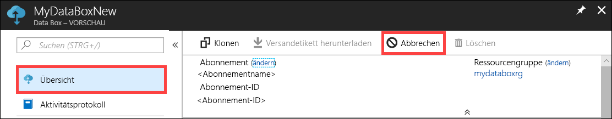

2.  Geben Sie einen Grund für den Abbruch an.  

    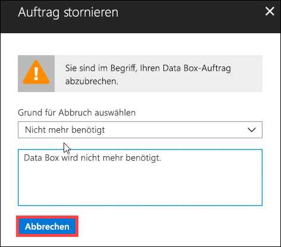

3.  Nach Abbruch des Auftrags aktualisiert das Portal den Status des Auftrags und zeigt **Abgebrochen** an.

    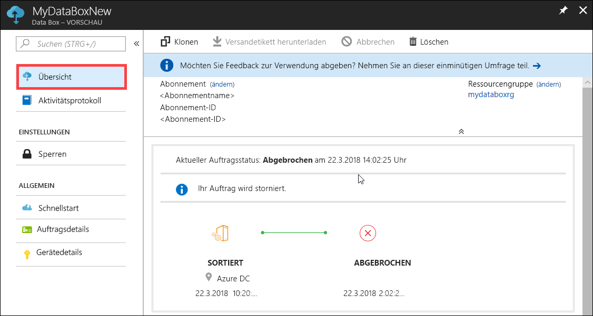

Sie erhalten keine E-Mail-Benachrichtigung, wenn der Auftrag abgebrochen wird.

## Klonen eines Auftrags

Klonen kann in bestimmten Situationen hilfreich sein. Ein Beispiel: Angenommen, ein Benutzer hat mithilfe von Data Box Disk einige Daten übertragen. Bei zunehmender Datenmenge sind weitere Datenträger erforderlich, um die Daten an Azure zu übertragen. In diesem Fall kann der gleiche Auftrag einfach geklont werden.

Führen Sie die folgenden Schritte aus, um einen Auftrag zu klonen.

1.  Navigieren Sie zu **Übersicht > Klonen**. 

    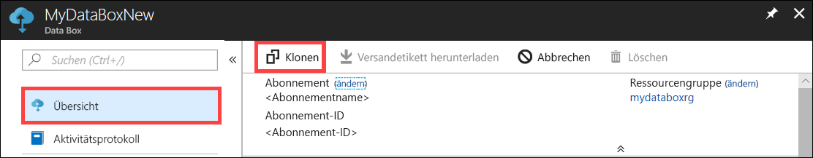

2.  Die Auftragsdetails bleiben unverändert. Als Auftragsname wird der Name des ursprünglichen Auftrags mit dem Zusatz *-Clone* verwendet. Aktivieren Sie das Kontrollkästchen, um zu bestätigen, dass Sie die Datenschutzinformationen gelesen haben. Klicken Sie auf **Create**.    

Der Klon wird in wenigen Minuten erstellt und im Portal angezeigt.

[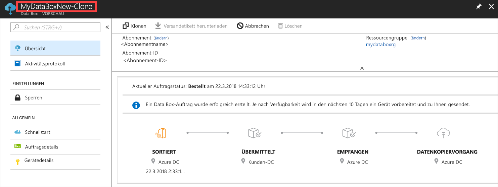](media/data-box-portal-ui-admin/clone-order3.png#lightbox) 

## Löschen eines Auftrags

Abgeschlossene Aufträge können bei Bedarf gelöscht werden. Der Auftrag enthält Ihre persönlichen Informationen wie Name, Adresse und Kontaktinformationen. Diese persönlichen Informationen werden zusammen mit dem Auftrag gelöscht.

Sie können nur Aufträge löschen, die abgeschlossen sind oder abgebrochen wurden. Führen Sie die folgenden Schritte aus, um einen Auftrag zu löschen.

1. Wechseln Sie zu **All resources** (Alle Ressourcen). Suchen Sie nach Ihrem Auftrag.

    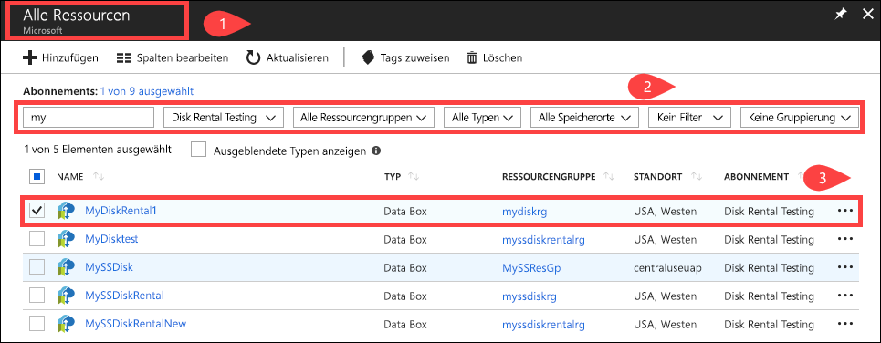

2. Klicken Sie auf den Auftrag, den Sie löschen möchten, und navigieren zu **Übersicht**. Klicken Sie auf der Befehlsleiste auf **Löschen**.

    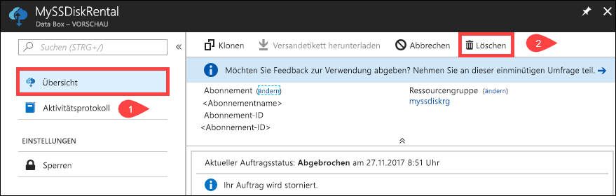

3. Geben Sie bei entsprechender Aufforderung den Namen des Auftrags ein, um die Auftragslöschung zu bestätigen. Klicken Sie auf **Löschen**.

     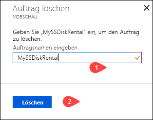

## Versandetikett herunterladen

Das Adressetikett muss unter Umständen heruntergeladen werden, wenn Sie das Rücksendeetikett, das Ihren Datenträgern beilag, verlegt oder verloren haben. 

Führen Sie die folgenden Schritte aus, um ein Adressetikett herunterzuladen.
1.  Navigieren Sie zu **Übersicht > Versandetikett herunterladen**. Diese Option steht erst zur Verfügung, wenn der Datenträger versendet wurde. 

    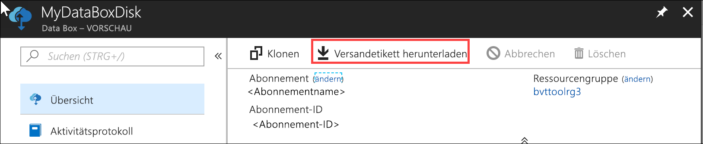

2.  Dadurch wird das folgende Rücksendeetikett heruntergeladen. Speichern Sie das Etikett, drucken Sie es aus, und bringen Sie es an der Rücklieferung an.

    

## Bearbeiten der Lieferadresse

Unter Umständen müssen Sie nach Erteilung des Auftrags die Lieferadresse bearbeiten. Diese Option ist nur verfügbar, solange der Datenträger noch nicht versandt wurde. Nach dem Versand des Datenträgers ist diese Option nicht mehr verfügbar.

Führen Sie die folgenden Schritte aus, um den Auftrag zu bearbeiten.

1. Navigieren Sie zu **Auftragsdetails > Lieferadresse bearbeiten**.

    

2. Nun können Sie die Lieferadresse bearbeiten und die Änderungen speichern.

    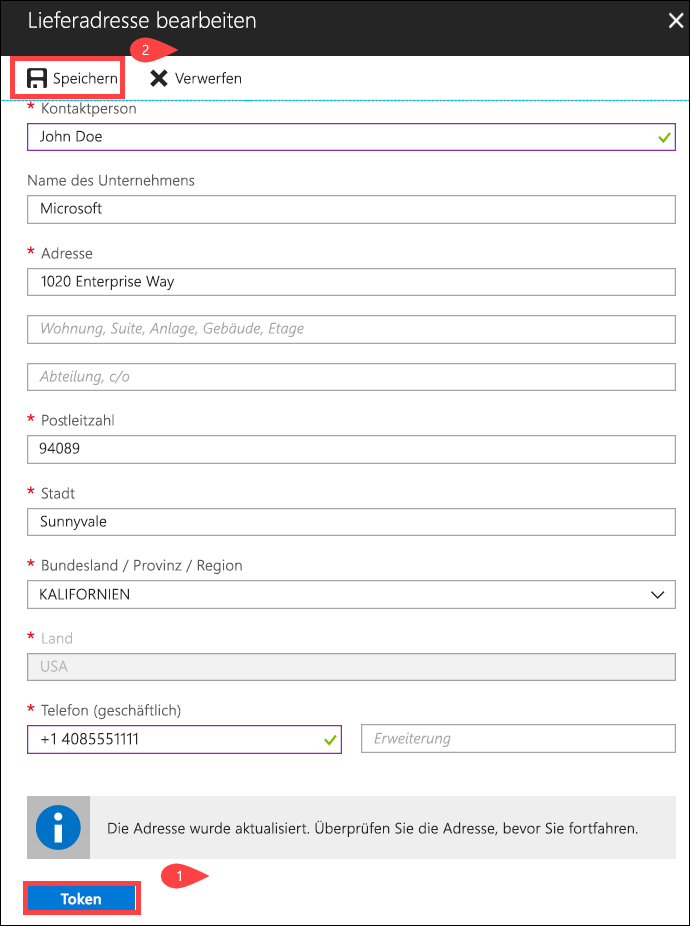

## Bearbeiten der Benachrichtigungsdetails

Unter Umständen müssen Sie die Benutzer ändern, die die E-Mails zum Auftragsstatus erhalten sollen. So kann es beispielsweise erforderlich sein, dass ein Benutzer informiert wird, wann der Datenträger geliefert oder abgeholt wird. Ein anderer Benutzer muss ggf. informiert werden, wenn der Datenkopiervorgang abgeschlossen ist, damit er sich vor dem Löschen aus der Quelle vergewissern kann, dass sich die Daten im Azure-Speicherkonto befinden. In diesen Fällen können Sie die Benachrichtigungsdetails bearbeiten.

Führen Sie die folgenden Schritte aus, um die Benachrichtigungsdetails zu bearbeiten.

1. Navigieren Sie zu **Auftragsdetails > Benachrichtigungsdetails bearbeiten**.

    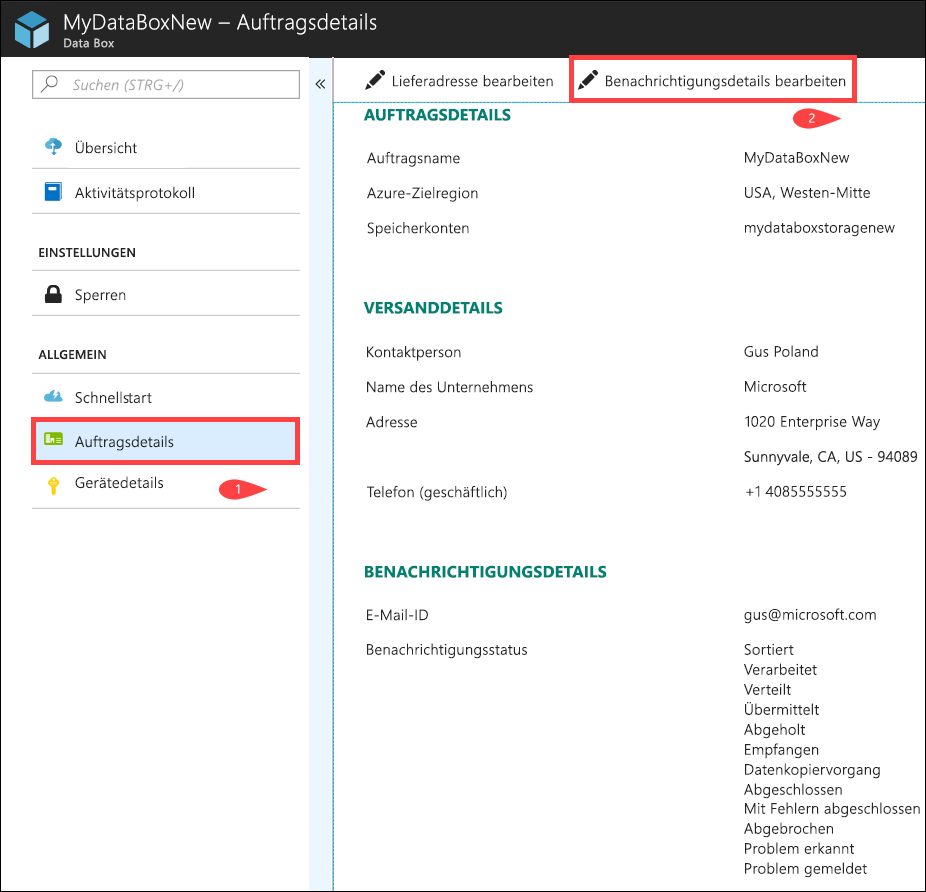

2. Nun können Sie die Benachrichtigungsdetails bearbeiten und die Änderungen speichern.
 
    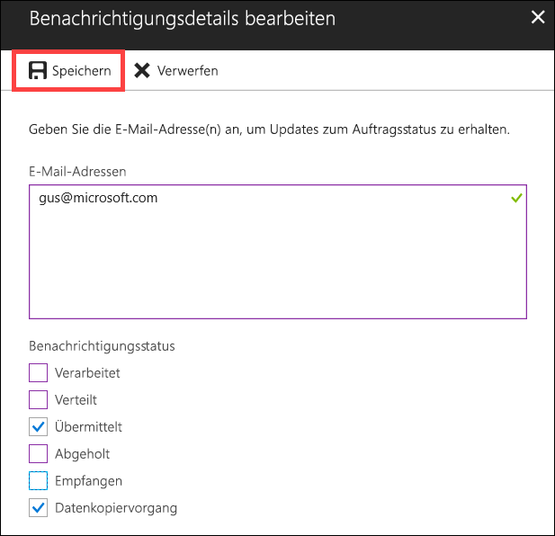

## Anzeigen des Auftragsstatus

|Auftragsstatus |BESCHREIBUNG |
|---------|---------|
|Bestellt     | Der Auftrag wurde erfolgreich erteilt.   Sollten die Datenträger nicht verfügbar sein, erhalten Sie eine entsprechende Benachrichtigung.  Sind die Datenträger verfügbar, identifiziert Microsoft einen Datenträger für den Versand und bereitet das Datenträgerpaket vor.        |
|Verarbeitet     | Die Auftragsverarbeitung ist abgeschlossen.   Während der Auftragsverarbeitung werden folgende Aktionen ausgeführt:<li>Die Datenträger werden mithilfe von AES-128-BitLocker-Verschlüsselung verschlüsselt. </li> <li>Die Data Box-Datenträger werden gesperrt, um nicht autorisierte Zugriffe zu verhindern.</li><li>Während dieses Vorgangs wird der Hauptschlüssel zum Entsperren der Datenträger generiert.</li>        |
|Versandt     | Der Auftrag wurde versandt. Die Lieferung sollte in ein bis zwei Tagen bei Ihnen eintreffen.        |
|Geliefert     | Der Auftrag wurde an die im Auftrag angegebene Adresse geliefert.        |
|Abgeholt     |Ihre Rücklieferung wurde abgeholt.   Nach Eingang Ihrer Lieferung im Azure-Datencenter werden die Daten automatisch in Azure hochgeladen.         |
|Empfangen     | Ihre Datenträger sind im Azure-Datencenter eingegangen. Der Datenkopiervorgang beginnt in Kürze.        |
|Daten kopiert     |Die Daten werden gerade kopiert.  Warten Sie, bis der Datenkopiervorgang abgeschlossen ist.         |
|Abgeschlossen       |Der Auftrag wurde erfolgreich abgeschlossen.  Vergewissern Sie sich, dass sich Ihre Daten in Azure befinden, bevor Sie die lokalen Daten von Servern löschen.         |
|Mit Fehlern abgeschlossen| Die Daten wurden kopiert, es sind jedoch Fehler aufgetreten.   Sehen Sie sich die Kopierprotokolle unter dem Pfad aus der **Übersicht** an. Weitere Informationen finden Sie unter [Herunterladen von Diagnoseprotokollen](data-box-disk-troubleshoot.md#download-diagnostic-logs).   |
|Canceled            |Der Auftrag wurde abgebrochen.   Entweder haben Sie den Auftrag abgebrochen, oder es ist ein Fehler aufgetreten, und der Auftrag wurde durch den Dienst abgebrochen.     |

## Nächste Schritte

- Informieren Sie sich über das [Behandeln von Data Box Disk-Problemen](data-box-disk-troubleshoot.md).
