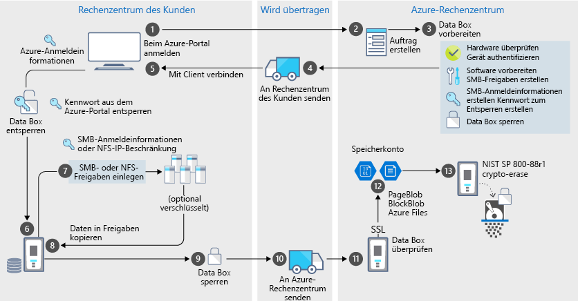

# Azure Data Box – Sicherheit und Schutz von Daten

Data Box ist eine sichere Lösung für den Schutz der Daten, indem dafür gesorgt wird, dass nur autorisierte Entitäten Ihre Daten anzeigen, ändern oder löschen können. In diesem Artikel werden die Sicherheitsmerkmale von Azure Data Box beschrieben, mit denen die einzelnen Komponenten der Data Box-Lösung und die darin gespeicherten Daten geschützt werden. 

[!INCLUDE [GDPR-related guidance](../../includes/gdpr-intro-sentence.md)]

## Datenfluss über Komponenten

Die Microsoft Azure Data Box-Lösung besteht aus vier Hauptkomponenten, die miteinander interagieren:

- **In Azure gehosteter Azure Data Box-Dienst**: Der Verwaltungsdienst, den Sie zum Erstellen des Geräteauftrags, Konfigurieren des Geräts und anschließenden Nachverfolgen des Auftrags bis zur Erfüllung verwenden.
- **Data Box-Gerät**: Das Übertragungsgerät, das an Sie gesendet werden, um Ihre lokalen Daten in Azure zu importieren. 
- **Mit dem Gerät verbundene Clients/Hosts**: Die Clients in Ihrer Infrastruktur, die mit dem Data Box-Gerät verbunden werden und zu schützende Daten enthalten.
- **Cloud-Speicher** – Der Speicherort in der Azure-Cloud, an dem die Daten gespeichert werden. Dies ist normalerweise das Speicherkonto, das mit der von Ihnen erstellten Azure Data Box-Ressource verknüpft ist.

Im folgenden Diagramm ist der Datenfluss durch die Azure Data Box-Lösung vom lokalen Standort nach Azure beschrieben.

Während die Daten diese Lösung durchlaufen, werden Ereignisse protokolliert und Protokolle erstellt. Weitere Informationen finden Sie unter [Tracking and event logging for your Azure Data Box](data-box-logs.md) (Nachverfolgung und Ereignisprotokollierung für Azure Data Box).

## Sicherheitsfeatures

Data Box ist eine sichere Lösung für den Schutz der Daten, indem dafür gesorgt wird, dass nur autorisierte Entitäten Ihre Daten anzeigen, ändern oder löschen können. Die Sicherheitsfunktionen für diese Lösung gelten für den Datenträger und den zugeordneten Dienst, um sicherzustellen, dass die darauf gespeicherten Daten geschützt sind. 

### Schutz des Data Box-Geräts

Das Data Box-Gerät wird mithilfe der folgenden Merkmale geschützt:

- Ein widerstandsfähiges Gerätegehäuse, das Erschütterungen, widrigen Transport- und Umweltbedingungen problemlos standhält. 
- Manipulationsgeschützte Siegel zur Erkennung von Manipulationen während des Transports.
- Erkennung von Manipulationen an Hardware und Software, die weitere Gerätevorgänge verhindern.
- Wird nur auf Data Box-spezifischer Software ausgeführt.
- Startet im gesperrten Zustand.
- Steuert den Gerätezugriff per Kennwort zum Entsperren des Geräts.
- Anmeldeinformationen für den Zugriff zum Kopieren von Daten auf das und vom Gerät. Alle Zugriffe auf die Seite **Geräteanmeldeinformationen** im Azure-Portal werden in den [Aktivitätsprotokollen](data-box-logs.md#query-activity-logs-during-setup) protokolliert.

### Schutz von Data Box-Daten

Die Daten, die in und aus Data Box übertragen werden, werden mithilfe der folgenden Merkmale geschützt:

- AES-256-Bit-Verschlüsselung für ruhende Daten.
- Während ihrer Übertragung können für Daten verschlüsselte Protokolle verwendet werden.
- Sicheres Löschen von Daten vom Gerät nach dem Upload in Azure. Das Löschen der Daten wird gemäß NIST-Standards (800-88r1) durchgeführt. Das Datenlöschereignis wird im [Auftragsverlauf](data-box-logs.md#download-order-history) aufgezeichnet.

### Schutz des Data Box-Diensts

Der Data Box-Dienst wird mithilfe der folgenden Features geschützt.

- Für den Zugriff auf den Data Box-Dienst muss Ihre Organisation über ein Azure-Abonnement verfügen, das Data Box umfasst. Ihr Abonnement bestimmt die Features, auf die Sie im Azure-Portal zugreifen können.
- Da der Data Box-Dienst in Azure gehostet wird, ist er durch die Azure-Sicherheitsfeatures geschützt. Weitere Informationen zu den Sicherheitsfeatures von Microsoft Azure finden Sie im [Microsoft Azure Trust Center](https://www.microsoft.com/TrustCenter/Security/default.aspx).
- Der Zugriff auf die Data Box-Bestellung kann mithilfe von RBAC-Rollen (Rollenbasierte Zugriffssteuerung) gesteuert werden. Weitere Informationen finden Sie unter [Einrichten der Zugriffssteuerung für Data Box-Bestellungen](data-box-logs.md#set-up-access-control-on-the-order)
- Der Data Box-Dienst speichert das Entsperrkennwort, mit dem das Gerät im Dienst entsperrt wird.
- Beim Data Box-Dienst werden Auftragsdetails und Status im Dienst gespeichert. Diese Informationen werden später dann zusammen mit dem Auftrag gelöscht.

## Verwalten von personenbezogenen Daten

Azure Data Box sammelt und zeigt personenbezogene Daten an den folgenden wichtigen Stellen des Diensts an:

- **Benachrichtigungseinstellungen**: Beim Erstellen eines Auftrags konfigurieren Sie die E-Mail-Adresse von Benutzern unter den Benachrichtigungseinstellungen. Diese Informationen können vom Administrator angezeigt werden. Diese Informationen werden vom Dienst gelöscht, wenn der Auftrag abgeschlossen wurde oder wenn er von Ihnen gelöscht wird.

- **Auftragsdetails**: Nach der Erstellung des Auftrags werden die Versandadresse, die E-Mail-Adresse und die Kontaktinformationen von Benutzern im Azure-Portal gespeichert. Zu den gespeicherten Informationen gehört Folgendes:

  - Kontaktname
  - Telefonnummer
  - E-Mail
  - Anschrift
  - City
  - Postleitzahl
  - Zustand
  - Land/Provinz/Region
  - Kontonummer des Versanddienstleisters
  - Nachverfolgungsnummer für den Versand

    Die Auftragsdetails werden vom Data Box-Dienst gelöscht, wenn der Auftrag abgeschlossen ist oder wenn er von Ihnen gelöscht wird.

- **Lieferanschrift**: Nach Auftragserteilung gibt der Data Box-Dienst die Lieferanschrift an externe Zustelldienste, z.B. UPS oder DHL, weiter. 

Weitere Informationen finden Sie im [Trust Center](https://www.microsoft.com/trustcenter) in der Microsoft-Datenschutzrichtlinie.

## Referenz zu den Sicherheitsrichtlinien

Die folgenden Sicherheitsrichtlinien sind in Data Box implementiert: 

|Vorgabe   |BESCHREIBUNG   |
|---------|---------|
|[IEC 60529 IP52](https://www.iec.ch/)    | Für Schutz vor Wasser und Staub         |
|[ISTA 2A](https://ista.org/docs/2Aoverview.pdf)     | Für Dauerhaftigkeit bei widrigen Transportbedingungen          |
|[NIST SP 800-147](https://nvlpubs.nist.gov/nistpubs/Legacy/SP/nistspecialpublication800-147.pdf)      | Für sichere Firmwareupdates         |
|[FIPS 140-2 Level 2](https://csrc.nist.gov/csrc/media/publications/fips/140/2/final/documents/fips1402.pdf)      | Für Datenschutz         |
|[NIST SP 800-88r1](https://nvlpubs.nist.gov/nistpubs/SpecialPublications/NIST.SP.800-88r1.pdf)      | Für Datenbereinigung         |

## Nächste Schritte

- Informieren Sie sich über die [Data Box-Anforderungen](data-box-system-requirements.md).
- Machen Sie sich mit den [Data Box-Einschränkungen](data-box-limits.md) vertraut.
- Erfahren Sie mehr zur schnellen Bereitstellung von [Azure Data Box](data-box-quickstart-portal.md) im Azure-Portal.
