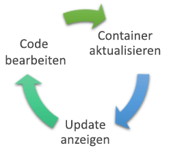
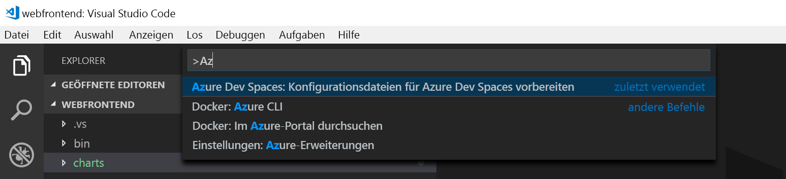
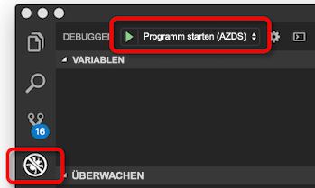
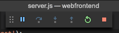

# <a name="get-started-on-azure-dev-spaces-with-nodejs"></a>Erste Schritte in Azure Dev Spaces mit Node.js

In diesem Leitfaden lernen Sie Folgendes:

- Erstellen einer für die Entwicklung optimierten, Kubernetes-basierten Umgebung in Azure (ein _Entwicklungsbereich_)
- Iteratives Entwickeln von Code in Containern mit VS Code und der Befehlszeile
- Produktives Entwickeln und Testen Ihres Codes in einer Teamumgebung

> [!Note]
> **Sollten Sie einmal nicht weiterkommen**, lesen Sie den Abschnitt [Problembehandlung](troubleshooting.md).

## <a name="install-the-azure-cli"></a>Installieren der Azure CLI
Bei Azure Dev Spaces ist der Einrichtungsaufwand für die lokalen Computer minimal. Der Großteil der Konfiguration Ihres Entwicklungsbereichs wird in der Cloud gespeichert und kann gemeinsam mit anderen Benutzern genutzt werden. Laden Sie zunächst die [Azure-Befehlszeilenschnittstelle](/cli/azure/install-azure-cli?view=azure-cli-latest) (Command-Line Interface, CLI) herunter, und führen Sie sie aus.

### <a name="sign-in-to-azure-cli"></a>Anmelden bei der Azure-Befehlszeilenschnittstelle
Melden Sie sich bei Azure an. Geben Sie in einem Terminalfenster den folgenden Befehl ein:

```cmd
az login
```

> [!Note]
> Falls Sie über kein Azure-Abonnement verfügen, können Sie ein [kostenloses Konto](https://azure.microsoft.com/free) erstellen.

#### <a name="if-you-have-multiple-azure-subscriptions"></a>Falls Sie über mehrere Azure-Abonnements verfügen...
Führen Sie zum Anzeigen Ihrer Abonnements Folgendes aus: 

```cmd
az account list
```
Suchen Sie nach dem Abonnement, dessen JSON-Ausgabe `isDefault: true` enthält.
Handelt es sich dabei nicht um das Abonnement, das Sie verwenden möchten, können Sie das Standardabonnement wie folgt ändern:

```cmd
az account set --subscription <subscription ID>
```

## <a name="create-a-kubernetes-cluster-enabled-for-azure-dev-spaces"></a>Erstellen eines Kubernetes-Clusters mit Aktivierung für Azure Dev Spaces

Erstellen Sie an der Eingabeaufforderung die Ressourcengruppe in einer [Region, die Azure Dev Spaces unterstützt](https://docs.microsoft.com/azure/dev-spaces/#a-rapid,-iterative-kubernetes-development-experience-for-teams).

```cmd
az group create --name MyResourceGroup --location <region>
```

Erstellen Sie mit dem folgenden Befehl einen Kubernetes-Cluster:

```cmd
az aks create -g MyResourceGroup -n MyAKS --location <region> --disable-rbac --generate-ssh-keys
```

Die Erstellung des Clusters dauert einige Minuten.

### <a name="configure-your-aks-cluster-to-use-azure-dev-spaces"></a>Konfigurieren des AKS-Clusters zur Verwendung von Azure Dev Spaces

Geben Sie den folgenden Azure CLI-Befehl ein. Verwenden Sie dabei die Ressourcengruppe, die Ihren AKS-Cluster enthält, und den Namen des AKS-Clusters. Der Befehl konfiguriert Ihren Cluster mit Unterstützung für Azure Dev Spaces.

   ```cmd
   az aks use-dev-spaces -g MyResourceGroup -n MyAKS
   ```

> [!IMPORTANT]
> Bei der Azure Dev Spaces-Konfiguration wird der Namespace `azds` im Cluster entfernt, sofern er vorhanden ist.

## <a name="get-kubernetes-debugging-for-vs-code"></a>Erhalten von Kubernetes-Debugging für VS Code
VS Code bietet .NET Core- und Node.js-Entwicklern umfangreiche Features wie etwa Kubernetes-Debugging.

1. Installieren Sie [VS Code](https://code.visualstudio.com/Download), falls Sie noch nicht darüber verfügen.
1. Laden Sie die [VS Azure Dev Spaces-Erweiterung](https://marketplace.visualstudio.com/items?itemName=azuredevspaces.azds) herunter, und installieren Sie sie. Klicken Sie auf „Installieren“, sobald Sie sich auf der Marketplace-Seite der Erweiterung befinden. Wiederholen Sie diesen Vorgang in VS Code. 

## <a name="create-a-nodejs-container-in-kubernetes"></a>Erstellen eines Node.js-Containers in Kubernetes

In diesem Abschnitt erstellen Sie eine Node.js-Web-App und bereiten sie für die Ausführung in einem Container in Kubernetes vor.

### <a name="create-a-nodejs-web-app"></a>Erstellen einer Node.js-Web-App
Laden Sie Beispielcode von GitHub herunter. Navigieren Sie dazu zu https://github.com/Azure/dev-spaces, und klicken Sie auf **Klonen oder herunterladen**, um das GitHub-Repository in Ihre lokale Umgebung herunterzuladen. Der Code für diese Anleitung befindet sich in `samples/nodejs/getting-started/webfrontend`.

## <a name="prepare-code-for-docker-and-kubernetes-development"></a>Vorbereiten von Code für die Entwicklung mit Docker und Kubernetes
Bisher verfügen Sie über eine einfache Web-App, die lokal ausgeführt werden kann. Jetzt werden Sie die App containerisieren, indem Sie Ressourcen erstellen, die den Container und die Bereitstellung der App für Kubernetes definieren. Diese Aufgabe kann ganz einfach mit Azure Dev Spaces ausgeführt werden: 

1. Starten Sie Visual Studio Code (VS Code), und öffnen Sie den Ordner `webfrontend`. (Sie können alle Standardaufforderungen zum Hinzufügen von Debugressourcen oder zum Wiederherstellen des Projekts ignorieren.)
1. Öffnen Sie in VS Code das integrierte Terminal (über das Menü **Ansicht > Integriertes Terminal**).
1. Führen Sie den folgenden Befehl aus (stellen Sie dabei sicher, dass **webfrontend** der aktuelle Ordner ist):

    ```cmd
    azds prep --public
    ```

Mit dem Azure CLI-Befehl `azds prep` werden Docker- und Kubernetes-Ressourcen mit Standardeinstellungen generiert:
* `./Dockerfile` beschreibt das Containerimage der App und wie der Quellcode erstellt und im Container ausgeführt wird.
* In einem [Helm-Diagramm](https://docs.helm.sh) unter `./charts/webfrontend` wird veranschaulicht, wie der Container für Kubernetes bereitgestellt wird.

Vorerst ist es nicht notwendig, den gesamten Inhalt dieser Dateien zu verstehen. Es ist jedoch erwähnenswert, dass **dieselben Konfiguration-als-Code-Ressourcen von Kubernetes und Docker von der Entwicklung bis zur Produktion verwendet werden können, wodurch eine bessere Konsistenz in verschiedenen Umgebungen erreicht wird.**
 
Außerdem wird mit dem `prep`-Befehl eine Datei namens `./azds.yaml` generiert. Das ist die Konfigurationsdatei für Azure Dev Spaces. Sie ergänzt die Docker- und Kubernetes-Artefakte durch eine zusätzliche Konfiguration, die eine iterative Entwicklungserfahrung in Azure ermöglicht.

## <a name="build-and-run-code-in-kubernetes"></a>Erstellen und Ausführen von Code in Kubernetes
Führen Sie Ihren Code jetzt aus! Führen Sie im Terminalfenster diesen Befehl aus dem **Codestammordner** des Web-Front-Ends aus:

```cmd
azds up
```

Achten Sie auf die Ausgabe des Befehls, Sie werden während der Ausführung verschiedene Punkte bemerken:
- Quellcode wird mit dem Entwicklungsbereich in Azure synchronisiert.
- In Azure wird ein Containerimage erstellt, wie von den Docker-Objekten in Ihrem Codeordner angegeben.
- Es werden Kubernetes-Objekte erstellt, die das Containerimage verwenden, wie vom Helm-Diagramm in Ihrem Codeordner angegeben.
- Es werden Informationen zu den Endpunkten des Containers angezeigt. In unserem Fall erwarten wir eine öffentliche HTTP-URL.
- Wenn die oben genannten Phasen erfolgreich abgeschlossen sind, sollten Sie die Ausgabe von `stdout` (und `stderr`) sehen, wenn der Container startet.

> [!Note]
> Bei der ersten Ausführung von `up` dauern diese Schritte etwas länger, spätere Ausführungen erfolgen dann aber schneller.

### <a name="test-the-web-app"></a>Testen der Web-App
Suchen Sie in der Konsolenausgabe nach Informationen zur öffentlichen URL, die vom Befehl `up` erstellt wurde. Sie weist folgendes Format auf: 

```
(pending registration) Service 'webfrontend' port 'http' will be available at <url>
Service 'webfrontend' port 80 (TCP) is available at 'http://localhost:<port>'
```

Öffnen Sie diese URL in einem Browserfenster. Dort sollten Sie sehen, dass die Web-App geladen wird. Wenn der Container ausgeführt wird, wird die Ausgabe von `stdout` und `stderr` an das Terminalfenster gestreamt.

> [!Note]
> Beim ersten Ausführen kann es mehrere Minuten dauern, bis das öffentliche DNS bereit ist. Wenn die öffentliche URL nicht aufgelöst wird, können Sie die alternative URL `http://localhost:<portnumber>` verwenden, die in der Konsolenausgabe angezeigt wird. Bei Verwendung der localhost-URL kann es so aussehen, als ob der Container lokal ausgeführt wird, während er stattdessen unter AKS ausgeführt wird. Um die Interaktion mit dem Dienst auf Ihrem lokalen Computer zu erleichtern, erstellt Azure Dev Spaces einen temporären SSH-Tunnel zu dem in Azure ausgeführten Container. Sie können später zurückkehren und versuchen, die öffentliche URL zu verwenden, wenn der DNS-Eintrag bereit ist.

### <a name="update-a-content-file"></a>Aktualisieren einer Inhaltsdatei
Bei Azure Dev Spaces geht es nicht nur um die Ausführung von Code in Kubernetes: Mit diesem Dienst sollen Codeänderungen in einer Kubernetes-Umgebung in der Cloud schnell und iterativ sichtbar gemacht werden.

1. Navigieren Sie zur Datei `./public/index.html`, und ändern Sie die HTML. Legen Sie beispielsweise als Hintergrundfarbe der Seite einen Blauton fest:

    ```html
    <body style="background-color: #95B9C7; margin-left:10px; margin-right:10px;">
    ```

2. Speichern Sie die Datei . Kurz darauf wird im Terminalfenster eine Nachricht mit dem Hinweis angezeigt, dass eine Datei im ausgeführten Container aktualisiert wurde.
1. Aktualisieren Sie die Anzeige im Browser. Daraufhin sollte die Farbaktualisierung angezeigt werden.

Was ist passiert? Für Änderungen an Inhaltsdateien (etwa HTML und CSS) ist kein Neustart des Node.js-Prozesses erforderlich. Ein aktiver `azds up`-Befehl synchronisiert daher automatisch alle geänderten Inhaltsdateien direkt im ausgeführten Container in Azure, sodass Inhaltsänderungen schnell sichtbar werden.

### <a name="test-from-a-mobile-device"></a>Testen auf einem mobilen Gerät
Öffnen Sie die Web-App auf einem mobilen Gerät, indem Sie die öffentliche URL für „webfrontend“ verwenden. Es kann hilfreich sein, die URL zu kopieren und von Ihrem Desktopcomputer an das mobile Gerät zu senden, damit Sie die lange Adresse nicht eingeben müssen. Wenn die Web-App auf Ihrem mobilen Gerät geladen wird, werden Sie feststellen, dass die Benutzeroberfläche auf einem kleinen Gerät nicht richtig angezeigt wird.

Um dieses Problem zu beheben, fügen Sie ein `viewport`-META-Tag hinzu:
1. Öffnen Sie die Datei `./public/index.html`.
1. Fügen Sie im vorhandenen `head`-Element ein `viewport`-META-Tag hinzu:

    ```html
    <head>
        <!-- Add this line -->
        <meta name="viewport" content="width=device-width, initial-scale=1">
    </head>
    ```

1. Speichern Sie die Datei .
1. Aktualisieren Sie den Browser auf dem Gerät. Die Web-App sollte nun ordnungsgemäß gerendert werden. 

In diesem Beispiel wird veranschaulicht, dass einige Probleme mit einer App erst erkannt werden, wenn die App auf den zu verwendenden Geräten getestet wird. Mit Azure Dev Spaces können Sie schnell Code iterieren und Änderungen auf Zielgeräten überprüfen.

### <a name="update-a-code-file"></a>Aktualisieren einer Codedatei
Die Aktualisierung von serverseitigen Codedateien ist etwas aufwendiger, da eine Node.js-App neu gestartet werden muss.

1. Drücken Sie im Terminalfenster `Ctrl+C` (zum Beenden von `azds up`).
1. Öffnen Sie die Codedatei mit dem Namen `server.js`, und bearbeiten Sie die Begrüßungsmeldung des Diensts: 

    ```javascript
    res.send('Hello from webfrontend running in Azure!');
    ```

3. Speichern Sie die Datei .
1. Führen Sie `azds up` im Terminalfenster aus. 

Mit diesem Befehl wird das Containerimage neu erstellt und das Helm-Diagramm erneut bereitgestellt. Laden Sie die Browserseite neu, um zu sehen, wie sich Ihre Codeänderungen auswirken.

Es gibt jedoch eine noch *schnellere Methode* für die Codeentwicklung. Sie wird im nächsten Abschnitt erläutert. 

## <a name="debug-a-container-in-kubernetes"></a>Debuggen eines Containers in Kubernetes

In diesem Abschnitt verwenden Sie VS Code zum direkten Debuggen des in Azure ausgeführten Containers. Außerdem erfahren Sie, wie Sie die Schleife zum Bearbeiten/Ausführen/Testen beschleunigen.



> [!Note]
> **Sollten Sie einmal nicht weiterkommen**, lesen Sie den Abschnitt [Problembehandlung](troubleshooting.md), oder hinterlassen Sie einen Kommentar auf dieser Seite.

### <a name="initialize-debug-assets-with-the-vs-code-extension"></a>Initialisieren von Debugressourcen mit der VS Code-Erweiterung
Sie müssen zunächst Ihr Codeprojekt konfigurieren, damit VS Code mit dem Entwicklungsbereich in Azure kommunizieren kann. Die VS Code-Erweiterung für Azure Dev Spaces enthält einen Befehl zum Einrichten der Debugkonfiguration. 

Öffnen Sie die **Befehlspalette** (über das Menü **Ansicht | Befehlspalette**), verwenden Sie die automatische Vervollständigung für die Eingabe, und wählen Sie den Befehl `Azure Dev Spaces: Prepare configuration files for Azure Dev Spaces` aus. 

Dadurch wird die Debugkonfiguration für Azure Dev Spaces unter dem `.vscode`-Ordner hinzugefügt. Dieser Befehl darf nicht mit dem Befehl `azds prep` verwechselt werden, der zum Konfigurieren des Projekts für die Bereitstellung dient.



### <a name="select-the-azds-debug-configuration"></a>Auswählen der AZDS-Debugkonfiguration
1. Klicken Sie zum Öffnen der Debugansicht auf der **Aktivitätsleiste** am Rand von VS Code auf das Symbol „Debuggen“.
1. Wählen Sie als aktive Debugkonfiguration **Launch Program (AZDS)** (Programm starten (AZDS)) aus.



> [!Note]
> Falls in der Befehlspalette keine Azure Dev Spaces-Befehle angezeigt werden, überprüfen Sie, ob die [VS Code-Erweiterung für Azure Dev Spaces](get-started-nodejs.md#get-kubernetes-debugging-for-vs-code) installiert wurde.

### <a name="debug-the-container-in-kubernetes"></a>Debuggen des Containers in Kubernetes
Drücken Sie **F5**, um Ihren Code in Kubernetes zu debuggen.

Wie beim Befehl `up` wird der Code mit der Entwicklungsumgebung synchronisiert, wenn Sie das Debuggen starten, und ein Container wird erstellt und in Kubernetes bereitgestellt. Dieses Mal ist der Debugger an den Remotecontainer angefügt.

> [!Tip]
> Auf der Statusleiste von VS Code wird eine klickbare URL angezeigt.


Legen Sie einen Breakpoint in einer serverseitigen Codedatei fest, beispielsweise in `app.get('/api'...` in `server.js`. Aktualisieren Sie die Browserseite, oder klicken Sie auf die Schaltfläche „Say It Again“ (Wiederholen). Dadurch sollte der Breakpoint erreicht werden, und Sie sollten den Code schrittweise durchlaufen können.

Sie besitzen wie bei der lokalen Ausführung des Codes Vollzugriff auf Debuginformationen, etwa Aufrufliste, lokale Variablen, Ausnahmeinformationen usw.

### <a name="edit-code-and-refresh-the-debug-session"></a>Bearbeiten von Code und Aktualisieren der Debugsitzung
Nehmen Sie bei aktivem Debugger eine Codeänderung vor. Ändern Sie beispielsweise erneut die Begrüßungsmeldung:

```javascript
app.get('/api', function (req, res) {
    res.send('**** Hello from webfrontend running in Azure! ****');
});
```

Speichern Sie die Datei, und klicken Sie im Bereich für **Debugaktionen** auf die Schaltfläche **Aktualisieren**. 



Das Neuerstellen und erneute Bereitstellen eines neuen Containerimages bei jeder vorgenommenen Codeänderung kann geraume Zeit in Anspruch nehmen. Daher startet Azure Dev Spaces den Node.js-Prozess zwischen den Debugsitzungen neu, um den Bearbeitungs-/Debugging-Kreislauf zu beschleunigen.

Aktualisieren Sie die Web-App im Browser, oder klicken Sie auf die Schaltfläche *Say It Again* (Wiederholen). Daraufhin sollte Ihre benutzerdefinierte Meldung auf der Benutzeroberfläche angezeigt werden.

### <a name="use-nodemon-to-develop-even-faster"></a>Noch schnellere Entwicklung mithilfe von Nodemon
*Nodemon* ist ein gängiges Tool, das Node.js-Entwickler für die schnelle Entwicklung nutzen. Statt bei jeder serverseitigen Codeänderung den Node-Prozess neu zu starten, konfigurieren Entwickler das Node-Projekt häufig so, dass *Nodemon* Dateiänderungen überwacht und den Serverprozess automatisch neu startet. Bei Verwendung dieser Methode aktualisiert der Entwickler nach einer Codeänderung lediglich den Browser.

Mit Azure Dev Spaces können Sie viele Entwicklungsworkflows nutzen, die auch bei der lokalen Entwicklung zum Einsatz kommen. Zur Veranschaulichung dieses Aspekts wurde das Beispielprojekt `webfrontend` für die Verwendung von *Nodemon* (Entwicklerabhängigkeit in `package.json`) konfiguriert.

Probieren Sie die folgenden Schritte aus:
1. Beenden Sie den VS Code-Debugger.
1. Klicken Sie auf der **Aktivitätsleiste** am Rand von VS Code auf das Symbol „Debuggen“. 
1. Wählen Sie als aktive Debugkonfiguration **Attach (AZDS)** (Anfügen (AZDS)) aus.
1. Drücken Sie F5.

In dieser Konfiguration ist der Container für das Starten von *Nodemon* konfiguriert. Bei Codeänderungen startet *Nodemon* genau wie bei der lokalen Entwicklung den Node-Prozess automatisch neu. 
1. Bearbeiten Sie die Begrüßungsmeldung in `server.js` erneut, und speichern Sie die Datei.
1. Aktualisieren Sie den Browser, oder klicken Sie auf die Schaltfläche *Say It Again* (Wiederholen), um Ihre Änderungen sichtbar zu machen.

**Sie kennen jetzt eine Methode für die schnelle Codeiteration und das direkte Debuggen in Kubernetes!** Als Nächstes erfahren Sie, wie Sie einen zweiten Container erstellen und aufrufen.

## <a name="next-steps"></a>Nächste Schritte

> [!div class="nextstepaction"]
> [Informationen zur Entwicklung mit mehreren Diensten](multi-service-nodejs.md)

