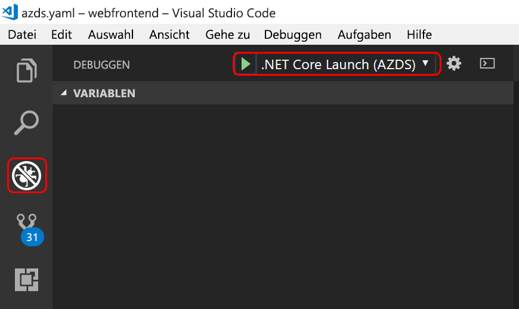

# <a name="quickstart-create-a-kubernetes-dev-space-with-azure-dev-spaces-net-core-and-vs-code"></a>Schnellstart: Erstellen eines Kubernetes-Entwicklungsbereichs mit Azure Dev Spaces (.NET Core und VS Code)

In diesem Leitfaden lernen Sie Folgendes:

- Einrichten von Azure Dev Spaces mit einem verwalteten Kubernetes-Cluster in Azure
- Iteratives Entwickeln von Code in Containern mit VS Code und der Befehlszeile
- Debuggen des Codes in Ihrem Entwicklungsbereich über VS Code

> [!Note]
> **Sollten Sie einmal nicht weiterkommen**, lesen Sie den Abschnitt [Problembehandlung](troubleshooting.md), oder hinterlassen Sie einen Kommentar auf dieser Seite. Ein ausführlicheres Tutorial finden Sie [hier](get-started-netcore.md).

## <a name="prerequisites"></a>Voraussetzungen

- Ein Azure-Abonnement. Falls Sie über keins verfügen, können Sie ein [kostenloses Konto](https://azure.microsoft.com/free) erstellen.
- Ein [Kubernetes-Cluster](https://ms.portal.azure.com/#create/microsoft.aks) mit Kubernetes 1.9.6 oder höher in der Region „USA, Osten“, „USA, Mitte“, „USA, Westen 2“, „Europa, Westen“, „Kanada, Mitte“ oder „Kanada, Osten“ mit aktiviertem **HTTP-Anwendungsrouting**.

  

- [Visual Studio Code](https://code.visualstudio.com/download).

## <a name="set-up-azure-dev-spaces"></a>Einrichten von Azure Dev Spaces

Die Azure CLI und die Azure Dev Spaces-Erweiterung können auf Windows-, Mac- oder Linux-Computern installiert und ausgeführt werden. Für Linux werden die folgenden Distributionen unterstützt: Ubuntu (18.04, 16.04 und 14.04), Debian 8 und 9, RHEL 7, Fedora 26 und höhere Versionen, CentOS 7, openSUSE 42.2 und SLES 12.

Gehen Sie folgendermaßen vor, um Azure Dev Spaces einzurichten:

1. Installieren Sie die [Azure CLI](/cli/azure/install-azure-cli?view=azure-cli-latest) (mindestens Version 2.0.43).
1. Richten Sie Dev Spaces in Ihrem AKS-Cluster ein: `az aks use-dev-spaces -g MyResourceGroup -n MyAKS`
1. Laden Sie die [Azure Dev Spaces-Erweiterung](https://marketplace.visualstudio.com/items?itemName=azuredevspaces.azds) für VS Code herunter. Klicken Sie auf „Installieren“, sobald Sie sich auf der Marketplace-Seite der Erweiterung befinden. Wiederholen Sie diesen Vorgang in VS Code.

## <a name="build-and-run-code-in-kubernetes"></a>Erstellen und Ausführen von Code in Kubernetes

1. Laden Sie den Beispielcode von GitHub herunter: [https://github.com/Azure/dev-spaces](https://github.com/Azure/dev-spaces) 
1. Wechseln zum Ordner „webfrontend“: `cd dev-spaces/samples/dotnetcore/getting-started/webfrontend`
1. Generieren Sie Diagrammressourcen für Docker und Helm: `azds prep --public`
1. Erstellen Sie Ihren Code in AKS, und führen Sie ihn aus. Führen Sie im Terminalfenster unter dem **webfrontend-Ordner** den folgenden Befehl aus: `azds up`.
1. Suchen Sie in der Konsolenausgabe nach Informationen zu der URL, die durch den Befehl `up` erstellt wurde. Sie weist folgendes Format auf: 

   `Service 'webfrontend' port 'http' is available at <url>` 

   Öffnen Sie diese URL in einem Browserfenster. Dort sollten Sie sehen, dass die Web-App geladen wird. 
   
   > [!Note]
   > Beim ersten Ausführen kann es mehrere Minuten dauern, bis das öffentliche DNS bereit ist. Wenn die öffentliche URL nicht aufgelöst wird, können Sie die alternative URL http://localhost:<portnumber> verwenden, die in der Konsolenausgabe angezeigt wird. Bei Verwendung der localhost-URL kann es so aussehen, als ob der Container lokal ausgeführt wird, während er stattdessen unter AKS ausgeführt wird. Um die Interaktion mit dem Dienst auf Ihrem lokalen Computer zu erleichtern, erstellt Azure Dev Spaces einen temporären SSH-Tunnel zu dem in Azure ausgeführten Container. Sie können später zurückkehren und versuchen, die öffentliche URL zu verwenden, wenn der DNS-Eintrag bereit ist.

### <a name="update-a-content-file"></a>Aktualisieren einer Inhaltsdatei

1. Suchen Sie nach einer Datei (beispielsweise `./Views/Home/Index.cshtml`), und ändern Sie den HTML-Code. Beispiel: Ändern Sie Zeile 70 (`<h2>Application uses</h2>`) ungefähr wie folgt: `<h2>Hello k8s in Azure!</h2>`
1. Speichern Sie die Datei . Kurz darauf wird im Terminalfenster eine Nachricht mit dem Hinweis angezeigt, dass eine Datei im ausgeführten Container aktualisiert wurde.
1. Aktualisieren Sie die Anzeige im Browser. Daraufhin sollte auf der Webseite die aktualisierte HTML angezeigt werden.

Was ist passiert? Für Änderungen an Inhaltsdateien (etwa HTML und CSS) ist keine erneute Kompilierung in einer .NET Core-Web-App erforderlich. Ein aktiver `azds up`-Befehl synchronisiert daher automatisch alle geänderten Inhaltsdateien im ausgeführten Container in Azure, sodass alle Inhaltsänderungen direkt angezeigt werden.

### <a name="update-a-code-file"></a>Aktualisieren einer Codedatei
Die Aktualisierung von Codedateien ist etwas aufwendiger, da eine .NET Core-App aktualisierte Anwendungsbinärdateien neu erstellen und generieren muss.

1. Drücken Sie im Terminalfenster `Ctrl+C` (zum Beenden von `azds up`).
1. Öffnen Sie die Codedatei mit dem Namen `Controllers/HomeController.cs`, und bearbeiten Sie die Nachricht, die auf der Seite „Info“ angezeigt wird: `ViewData["Message"] = "Your application description page.";`.
1. Speichern Sie die Datei .
1. Führen Sie `azds up` im Terminalfenster aus. 

Mit diesem Befehl wird das Containerimage neu erstellt und das Helm-Diagramm erneut bereitgestellt. Navigieren Sie in der Web-App zum Menü „Info“, um zu sehen, wie sich Ihre Codeänderungen in der ausgeführten Anwendung auswirken.

Es gibt jedoch eine noch *schnellere Methode* für die Codeentwicklung. Sie wird im nächsten Abschnitt erläutert. 

## <a name="debug-a-container-in-kubernetes"></a>Debuggen eines Containers in Kubernetes

In diesem Abschnitt verwenden Sie VS Code zum direkten Debuggen Ihres in Azure ausgeführten Containers. Außerdem erfahren Sie, wie Sie die Schleife zum Bearbeiten/Ausführen/Testen beschleunigen.


### <a name="initialize-debug-assets-with-the-vs-code-extension"></a>Initialisieren von Debugressourcen mit der VS Code-Erweiterung
Sie müssen zunächst Ihr Codeprojekt konfigurieren, damit VS Code mit dem Entwicklungsbereich in Azure kommunizieren kann. Die VS Code-Erweiterung für Azure Dev Spaces enthält einen Befehl zum Einrichten der Debugkonfiguration. 

Öffnen Sie die **Befehlspalette** (über das Menü **Ansicht | Befehlspalette**), verwenden Sie die automatische Vervollständigung für die Eingabe, und wählen Sie den Befehl `Azure Dev Spaces: Prepare configuration files for Azure Dev Spaces` aus. 

Dadurch wird die Debugkonfiguration für Azure Dev Spaces unter dem `.vscode`-Ordner hinzugefügt. Dieser Befehl darf nicht mit dem Befehl `azds prep` verwechselt werden, der zum Konfigurieren des Projekts für die Bereitstellung dient.


### <a name="select-the-azds-debug-configuration"></a>Auswählen der AZDS-Debugkonfiguration
1. Klicken Sie zum Öffnen der Debugansicht auf der **Aktivitätsleiste** am Rand von VS Code auf das Symbol „Debuggen“.
1. Wählen Sie als aktive Debugkonfiguration **.NET Core Launch (AZDS)** (.NET Core-Start (AZDS)) aus.



> [!Note]
> Falls in der Befehlspalette keine Azure Dev Spaces-Befehle angezeigt werden, überprüfen Sie, ob die VS Code-Erweiterung für Azure Dev Spaces installiert wurde. Achten Sie darauf, dass es sich bei dem in VS Code geöffneten Arbeitsbereich um den Ordner handelt, der „azds.yaml“ enthält.


### <a name="debug-the-container-in-kubernetes"></a>Debuggen des Containers in Kubernetes
Drücken Sie **F5**, um Ihren Code in Kubernetes zu debuggen.

Wie beim Befehl `up` wird der Code mit dem Entwicklungsbereich synchronisiert, und ein Container wird erstellt und in Kubernetes bereitgestellt. Dieses Mal ist der Debugger natürlich an den Remotecontainer angefügt.

> [!Tip]
> Auf der Statusleiste von VS Code wird eine klickbare URL angezeigt.

Legen Sie einen Breakpoint in einer serverseitigen Codedatei fest, beispielsweise in der `Index()`-Funktion in der Quelldatei `Controllers/HomeController.cs`. Durch Aktualisieren der Browserseite wird der Breakpoint erreicht.

Sie besitzen wie bei der lokalen Ausführung des Codes Vollzugriff auf Debuginformationen, etwa Aufrufliste, lokale Variablen, Ausnahmeinformationen usw.

### <a name="edit-code-and-refresh"></a>Bearbeiten des Codes und Aktualisieren
Nehmen Sie bei aktivem Debugger eine Codeänderung vor. Ändern Sie beispielsweise die Meldung der Seite „Info“ unter `Controllers/HomeController.cs`. 

```csharp
public IActionResult About()
{
    ViewData["Message"] = "My custom message in the About page.";
    return View();
}
```

Speichern Sie die Datei, und klicken Sie im Bereich für **Debugaktionen** auf die Schaltfläche **Aktualisieren**. 


Das Neuerstellen und erneute Bereitstellen eines neuen Containerimages bei jeder vorgenommenen Codeänderung kann geraume Zeit in Anspruch nehmen. Daher kompiliert Azure Dev Spaces Code im vorhandenen Container inkrementell, um den Bearbeitungs-/Debugging-Kreislauf zu beschleunigen.

Aktualisieren Sie die Web-App im Browser, und wechseln Sie zur Seite „Info“. Daraufhin sollte eine benutzerdefinierte Meldung auf der Benutzeroberfläche angezeigt werden.

**Sie kennen jetzt eine Methode für die schnelle Codeiteration und das direkte Debuggen in Kubernetes!**

## <a name="next-steps"></a>Nächste Schritte

Erfahren Sie, wie Azure Dev Spaces Sie bei der Entwicklung komplexerer, containerübergreifender Apps unterstützt und wie Sie die gemeinsame Entwicklung vereinfachen können, indem Sie in verschiedenen Bereichen mit verschiedenen Versionen oder Branches Ihres Codes arbeiten. 

> [!div class="nextstepaction"]
> [Arbeiten mit mehreren Containern und Teamentwicklung](team-development-netcore.md)
