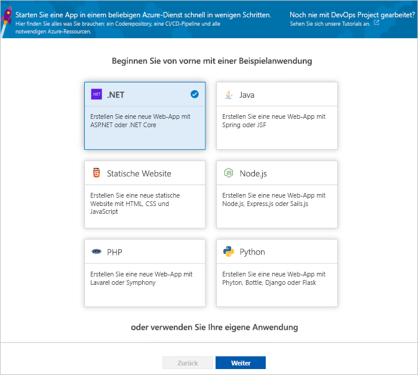
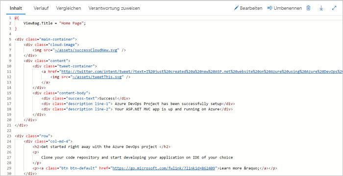
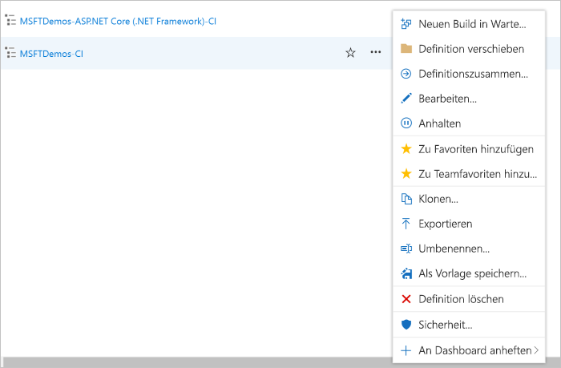

# Erstellen einer CI/CD-Pipeline für .NET mit Azure DevOps Projects

Konfigurieren Sie mit DevOps Projects Continuous Integration (CI) und Continuous Delivery (CD) für Ihre .NET Core- oder ASP.NET-Anwendung. DevOps Projects erleichtert die Erstkonfiguration einer Build- und Releasepipeline in Azure Pipelines.

Wenn Sie kein Azure-Abonnement haben, erhalten Sie über [Visual Studio Dev Essentials](https://visualstudio.microsoft.com/dev-essentials/) ein kostenloses Abonnement.

## Melden Sie sich auf dem Azure-Portal an.

Mit DevOps Projects wird eine CI/CD-Pipeline in Azure DevOps erstellt. Sie können eine neue Azure DevOps-Organisation erstellen oder eine bestehende Organisation verwenden. Ferner werden mit DevOps Projects Azure-Ressourcen im Azure-Abonnement Ihrer Wahl erstellt.

1. Melden Sie sich beim [Microsoft Azure-Portal](https://portal.azure.com)an.

1. Wählen Sie im linken Bereich auf der linken Navigationsleiste das Symbol **Ressource erstellen** aus, und suchen Sie anschließend nach **DevOps Projects**.  

3.  Klicken Sie auf **Erstellen**.

    

## Auswählen einer Beispielanwendung und eines Azure-Diensts

1. Wählen Sie die .NET-Beispielanwendung aus. Die Beispiele für .NET enthalten eine Auswahl von Anwendungen des ASP.NET Open Source-Frameworks oder des plattformübergreifenden .NET Core-Frameworks.

    

1. Wählen Sie das .NET Core-Anwendungsframework aus.  
    Bei diesem Beispiel handelt es sich um eine ASP.NET Core MVC-Anwendung.
    
2. Klicken Sie auf **Weiter**.  
    „Web-App unter Windows“ ist das Standardziel für die Bereitstellung.  Optional können Sie Azure Web App on Linux oder Web-App für Container auswählen.  Das Anwendungsframework, das Sie zuvor ausgewählt haben, bestimmt den Typ des hier verfügbaren Bereitstellungsziels für den Azure-Dienst.  
    
3. Übernehmen Sie den Standarddienst, und wählen Sie **Weiter** aus.

## Konfigurieren von Azure DevOps und eines Azure-Abonnements 

1. Sie können eine neue kostenlose Azure DevOps-Organisation erstellen oder eine bestehende Organisation auswählen.

    a. Wählen Sie einen Namen für Ihr Projekt aus. 

    b. Wählen Sie Ihr Azure-Abonnement und den Standort sowie einen Namen für Ihre Anwendung aus, und klicken Sie dann auf **Fertig**.  
    Nach wenigen Minuten wird das DevOps Projects-Dashboard im Azure-Portal angezeigt. Eine Beispielanwendung wird in einem Repository in Ihrer Azure DevOps-Organisation eingerichtet, ein Build wird ausgeführt, und Ihre Anwendung wird in Azure bereitgestellt. Dieses Dashboard bietet Einblick in Ihr Coderepository, in Ihre CI/CD-Pipeline und in Ihre Anwendung in Azure.
    

2. Wählen Sie auf der rechten Seite des Dashboards **Durchsuchen**, um Ihre aktive Anwendung anzuzeigen.

     

## Ausführen eines Commits für Codeänderungen und Ausführen von CI/CD

 Von DevOps Projects wurde ein Git-Repository in Azure Repos oder GitHub erstellt. Gehen Sie wie folgt vor, um das Repository anzuzeigen und Codeänderungen an Ihrer Anwendung vorzunehmen:

1. Wählen Sie auf der linken Seite des DevOps Projects-Dashboards den Link für Ihren **Masterbranch** aus.  
Über diesen Link wird die Ansicht des neu erstellten Git-Repositorys geöffnet.

1. Wählen Sie oben rechts im Browser die Option **Klonen** aus, um die Repository-Klon-URL anzuzeigen.  
Sie können Ihr Git-Repository in Ihrer bevorzugten IDE klonen.  Bei den nächsten Schritten können Sie den Webbrowser verwenden, um Codeänderungen direkt am Masterbranch vorzunehmen und für Codeänderungen einen Commit auszuführen.

1. Navigieren Sie auf der linken Seite des Browsers zur Datei **Views/Home/index.cshtml**.

1. Wählen Sie **Bearbeiten** aus, und ändern Sie die h2-Überschrift. Geben Sie beispielsweise **Get started right away with the Azure DevOps Projects** ein, oder nehmen Sie eine andere Änderung vor.

    

1. Wählen Sie **Commit** aus, und speichern Sie anschließend die Änderungen.

1. Navigieren Sie in Ihrem Browser zum Azure DevOps Projects-Dashboard.  Nun wird angezeigt, dass ein Build erstellt wird. Die von Ihnen vorgenommenen Änderungen werden automatisch erstellt und über eine CI/CD-Pipeline bereitgestellt.

## Überprüfen der CI/CD-Pipeline

Im vorherigen Schritt wurde von Azure DevOps Projects automatisch eine vollständige CI/CD-Pipeline konfiguriert. Untersuchen Sie die Pipeline, und passen Sie sie bei Bedarf an. Führen Sie die folgenden Schritte aus, um sich mit den Build- und Releasepipelines von Azure DevOps vertraut zu machen:

1. Wählen Sie oben auf dem DevOps Projects-Dashboard die Option **Buildpipelines** aus.  
Über diesen Link werden eine Browserregisterkarte und die Azure DevOps-Buildpipeline für Ihr neues Projekt geöffnet.

1. Wählen Sie die Auslassungspunkte (...) aus.  Mit dieser Aktion wird ein Menü geöffnet, über das Sie verschiedene Aktivitäten starten können. So können Sie beispielsweise einen neuen Build zur Warteschlange hinzufügen, einen Build anhalten und die Buildpipeline bearbeiten.

1. Wählen Sie **Bearbeiten** aus.

    

1. In diesem Bereich können Sie sich die verschiedenen Aufgaben ansehen, die Sie für Ihre Buildpipeline ausführen können.  
 Vom Build werden verschiedene Aufgaben durchgeführt. Beispielsweise werden Quellen aus dem Git-Repository abgerufen, Abhängigkeiten wiederhergestellt und für Bereitstellungen verwendete Ausgaben veröffentlicht.

1. Wählen Sie oben in der Buildpipeline den Buildpipelinenamen.

1. Ersetzen Sie den Namen Ihrer Buildpipeline durch einen aussagekräftigeren Namen, und wählen Sie **Speichern und in Warteschlange einreihen** und dann **Speichern** aus.

1. Wählen Sie unter dem Buildpipelinenamen **Verlauf** aus.   
Im Bereich **Verlauf** wird ein Überwachungsprotokoll mit den letzten Änderungen für den Build angezeigt.  An der Buildpipeline vorgenommene Änderungen werden von Azure Pipelines nachverfolgt, sodass Sie verschiedene Versionen vergleichen können.

1. Wählen Sie **Trigger** aus.  
Mit DevOps Projects wurde automatisch ein CI-Trigger erstellt, und mit jedem für das Repository ausgeführten Commit wird ein neuer Build gestartet.  Optional können Sie Branches aus dem CI-Prozess einbeziehen oder ausschließen.

1. Wählen Sie **Aufbewahrung** aus.  
Abhängig vom Szenario können Sie Richtlinien zum Aufbewahren oder Entfernen einer bestimmten Anzahl von Builds festlegen.

1. Wählen Sie **Build und Release** und anschließend **Releases** aus.  
DevOps Projects erstellt eine Releasepipeline zum Verwalten von Bereitstellungen in Azure.

1.  Wählen Sie auf der linken Seite neben Ihrer Releasepipeline die Auslassungspunkte (...) und anschließend **Bearbeiten** aus.  
Die Releasepipeline enthält eine Pipeline, die den Releaseprozess definiert.  

1. Wählen Sie unter **Artefakte** die Option **Ablegen** aus.  Die in den vorherigen Schritten untersuchte Buildpipeline erzeugt die für das Artefakt verwendete Ausgabe. 

1. Wählen Sie neben dem Symbol **Ablegen** die Option **Continuous Deployment-Trigger** aus.  
Diese Releasepipeline enthält einen aktivierten CD-Trigger. Jedes Mal, wenn ein neues Buildartefakt verfügbar ist, wird von diesem CD-Trigger eine Bereitstellung ausgeführt. Optional können Sie den Trigger deaktivieren, sodass Ihre Bereitstellungen manuell ausgeführt werden müssen.  

1. Wählen Sie auf der linken Seite **Aufgaben** aus.   
Bei den Aufgaben handelt es sich um die Aktivitäten, die beim Bereitstellungsprozess ausgeführt werden. In diesem Beispiel wurde eine Aufgabe für die Bereitstellung in Azure App Service erstellt.

1. Wählen Sie auf der rechten Seite **Releases anzeigen** aus. In dieser Ansicht wird der Verlauf von Releases angezeigt.

1. Wählen Sie neben einem Ihrer Releases die Auslassungspunkte (...) und dann die Option **Öffnen** aus.  
Sie können sich verschiedene Menüs ansehen, etwa eine Releasezusammenfassung, zugeordnete Arbeitsaufgaben und Tests.

1. Wählen Sie **Commits** aus.   
In dieser Ansicht werden die der jeweiligen Bereitstellung zugeordneten Codecommits angezeigt. 

1. Wählen Sie **Protokolle** aus.  
Die Protokolle enthalten nützliche Informationen zum Bereitstellungsprozess. Sie können während und nach Bereitstellungen angezeigt werden.

## Bereinigen von Ressourcen

Sie können die erstellte Azure App Service-Instanz und zugehörige Ressourcen löschen, wenn Sie sie nicht mehr benötigen. Verwenden Sie dazu die Funktion **Löschen** auf dem DevOps Projects-Dashboard.

## Nächste Schritte

Weitere Informationen zum Ändern der Build- und Releasepipelines zur Erfüllung der Anforderungen Ihres Teams finden Sie in folgendem Tutorial:

> [!div class="nextstepaction"]
> [Anpassen von CD-Prozessen](https://docs.microsoft.com/azure/devops/pipelines/release/define-multistage-release-process?view=vsts)

## Videos

> [!VIDEO https://www.youtube.com/embed/itwqMf9aR0w]
