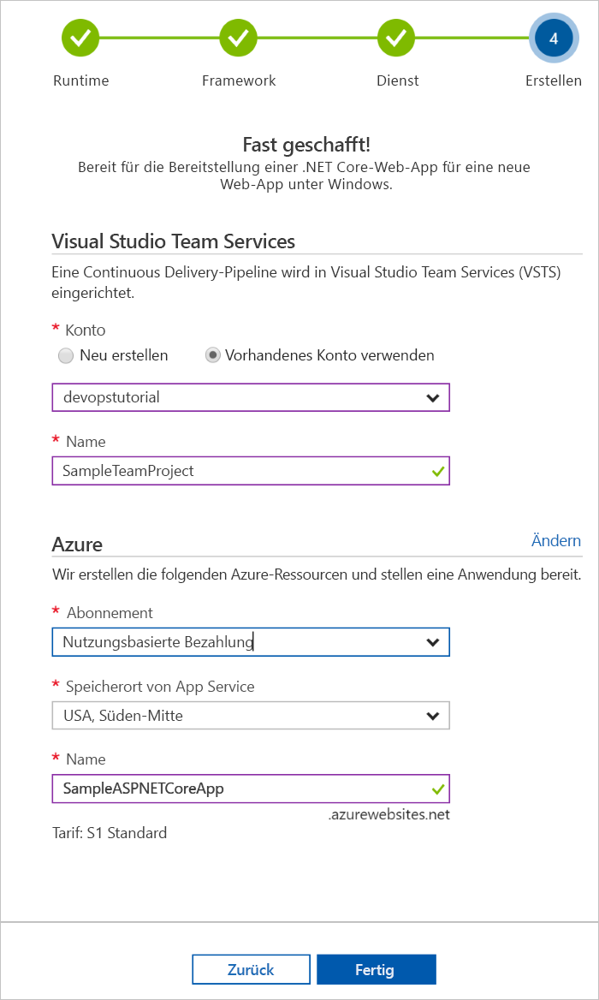

# Erstellen einer CI/CD-Pipeline für Ruby on Rails mit dem Azure DevOps-Projekt

Konfigurieren Sie mit dem **Azure DevOps-Projekt** für Ihre Ruby on Rails-Anwendung Continuous Integration (CI) und Continuous Delivery (CD).  Das Azure DevOps-Projekt erleichtert die Erstkonfiguration einer VSTS-Build- und -Releasepipeline.

Wenn Sie kein Azure-Abonnement haben, erhalten Sie über [Visual Studio Dev Essentials](https://visualstudio.microsoft.com/dev-essentials/) ein kostenloses Abonnement.

## Melden Sie sich auf dem Azure-Portal an.

Mit dem Azure DevOps-Projekt wird in VSTS eine CI/CD-Pipeline erstellt.  Sie können ein **neues VSTS-Konto** erstellen oder ein **vorhandenes Konto** verwenden.  Ferner werden mit dem Azure DevOps-Projekt **Azure-Ressourcen** im **Azure-Abonnement** Ihrer Wahl erstellt.

1. Melden Sie sich beim [Microsoft Azure-Portal](https://portal.azure.com) an.

1. Wählen Sie in der linken Navigationsleiste das Symbol **Ressource erstellen** aus, und suchen Sie anschließend nach **DevOps-Projekt**.  Wählen Sie **Erstellen**.

    

## Auswählen einer Beispielanwendung und eines Azure-Diensts

1. Wählen Sie die **Ruby**-Beispielanwendung aus.

1. Wählen Sie das **Ruby on Rails**-Anwendungsframework aus.  Wählen Sie **Weiter** aus, wenn Sie fertig sind.

1. **Web App on Linux** ist das Standardziel für die Bereitstellung.  Optional können Sie „Web-App für Container“ auswählen.  Das Anwendungsframework, das Sie im vorherigen Schritt ausgewählt haben, bestimmt den Typ des hier verfügbaren Bereitstellungsziels für den Azure-Dienst.  Wählen Sie den **Zieldienst** Ihrer Wahl aus.  Wählen Sie **Weiter** aus, wenn Sie fertig sind.

## Konfigurieren von VSTS und eines Azure-Abonnements 

1. Erstellen Sie ein **neues** kostenloses VSTS-Konto, oder wählen Sie ein **vorhandenes** Konto aus.  Wählen Sie für Ihr VSTS-Projekt einen **Namen** aus.  Wählen Sie Ihr **Azure-Abonnement**, den **Speicherort** und einen **Namen** für Ihre Anwendung aus.  Wählen Sie **Fertig** aus, wenn Sie fertig sind.

    

1. Das **Projektdashboard** wird in wenigen Minuten in das Azure-Portal geladen.  Eine Beispielanwendung wird in einem Repository in Ihrem VSTS-Konto eingerichtet. Ein Build wird ausgeführt, und Ihre Anwendung wird in Azure bereitgestellt.  Dieses Dashboard bietet Einblick in Ihr **Coderepository**, in Ihre **VSTS-CI/CD-Pipeline** und in Ihre **Anwendung in Azure**.  Wählen Sie auf der rechten Seite des Dashboards **Durchsuchen**, um Ihre aktive Anwendung anzuzeigen.

     

## Ausführen eines Commits für Codeänderungen und Ausführen von CI/CD

Mit dem Azure DevOps-Projekt wurde in Ihrem VSTS- oder GitHub-Konto ein Git-Repository erstellt.  Gehen Sie wie folgt vor, um das Repository anzuzeigen und Codeänderungen an Ihrer Anwendung vorzunehmen.

1. Wählen Sie auf der linken Seite des DevOps-Projektdashboards den Link für Ihren **Masterbranch** aus.  Über diesen Link wird die Ansicht des neu erstellten Git-Repositorys geöffnet.

1. Wählen Sie oben rechts im Browser die Option **Klonen**, um die Repository-Klon-URL anzuzeigen. Sie können Ihr Git-Repository in Ihrer bevorzugten IDE klonen.  Bei den nächsten Schritten können Sie den Webbrowser verwenden, um Codeänderungen direkt am Masterbranch vorzunehmen und für Codeänderungen einen Commit auszuführen.

1. Navigieren Sie auf der linken Seite des Browsers zur Datei **app/views/pages/home.html.erb**.

1. Wählen Sie **Bearbeiten** aus, und ändern Sie den Text an einigen Stellen.  Ändern Sie beispielsweise Text in einem div-Tag.

1. Wählen Sie **Commit** aus. Speichern Sie anschließend die Änderungen.

1. Navigieren Sie in Ihrem Browser zum **Azure DevOps-Projektdashboard**.  Nun wird angezeigt, dass ein Build erstellt wird.  Die Änderungen, die Sie eben vorgenommen haben, werden automatisch erstellt und über eine VSTS-CI/CD-Pipeline bereitgestellt.

## Überprüfen der VSTS-CI/CD-Pipeline

Mit dem Azure DevOps-Projekt wurde in Ihrem VSTS-Konto automatisch eine vollständige VSTS-CI/CD-Pipeline erstellt.  Untersuchen Sie die Pipeline, und passen Sie sie bei Bedarf an.  Gehen Sie wie folgt vor, um sich mit den VSTS-Build- und -Releasedefinitionen vertraut zu machen.

1. Wählen Sie **oben** im Azure DevOps-Projektdashboard **Pipelines erstellen** aus.  Über diesen Link werden eine Browserregisterkarte und die VSTS-Builddefinition für Ihr neues Projekt geöffnet.

1. Wählen Sie die **Auslassungspunkte** aus.  Mit dieser Aktion wird ein Menü geöffnet, über das Sie verschiedene Aktivitäten starten können. So können Sie beispielsweise einen neuen Build zur Warteschlange hinzufügen, einen Build anhalten und die Builddefinition bearbeiten.

1. Wählen Sie **Bearbeiten** aus.

1. In dieser Ansicht können Sie sich **die verschiedenen Aufgaben ansehen**, die Sie für Ihre Builddefinition durchführen können.  Vom Build werden verschiedene Aufgaben durchgeführt. So werden beispielsweise Quellen aus dem Git-Repository abgerufen, Abhängigkeiten wiederhergestellt und für Bereitstellungen verwendete Ausgaben veröffentlicht.

1. Wählen Sie oben in der Builddefinition den **Builddefinitionsnamen** aus.

1. Ersetzen Sie den **Namen** Ihrer Builddefinition durch einen aussagekräftigeren Namen.  Wählen Sie **Speichern und in Warteschlange einreihen** und dann **Speichern** aus.

1. Wählen Sie unter dem Builddefinitionsnamen **Verlauf** aus.  Es wird ein Überwachungspfad mit den letzten Änderungen für den Build angezeigt.  An der Builddefinition vorgenommene Änderungen werden von VSTS überwacht, sodass Sie verschiedene Versionen vergleichen können.

1. Wählen Sie **Trigger** aus.  Mit dem Azure DevOps-Projekt wurde automatisch ein CI-Trigger erstellt, und mit jedem Commit, der für das Repository ausgeführt wird, wird ein neuer Build gestartet.  Optional können Sie Branches aus dem CI-Prozess einbeziehen oder ausschließen.

1. Wählen Sie **Aufbewahrung** aus.  Je nach Szenario können Sie Richtlinien zum Aufbewahren oder Entfernen einer bestimmten Anzahl von Builds festlegen.

1. Wählen Sie **Build und Release** und anschließend **Releases** aus.  Mit dem Azure DevOps-Projekt wurde eine VSTS-Releasedefinition zum Verwalten von Bereitstellungen für Azure erstellt.

1. Wählen Sie links im Browser die **Auslassungspunkte** neben Ihrer Releasedefinition und anschließend **Bearbeiten** aus.

1. Die Releasedefinition enthält eine **Pipeline**, die den Releaseprozess definiert.  Wählen Sie unter **Artefakte** die Option **Ablegen** aus.  Mit der Builddefinition, die Sie in den vorherigen Schritten untersucht haben, wird die für das Artefakt verwendete Ausgabe erzeugt. 

1. Wählen Sie die Option **Continuous Deployment-Trigger** rechts neben dem Symbol **Ablegen** aus.  Diese Releasedefinition enthält einen aktivierten CD-Trigger. Jedes Mal, wenn ein neues Buildartefakt verfügbar ist, wird von diesem CD-Trigger eine Bereitstellung ausgeführt.  Optional können Sie den Trigger deaktivieren, sodass Ihre Bereitstellungen manuell ausgeführt werden müssen. 

1. Wählen Sie links im Browser die Option **Aufgaben** aus.  Bei den Aufgaben handelt es sich um die Aktivitäten, die beim Bereitstellungsprozess durchgeführt werden.  In diesem Beispiel wurde für die Bereitstellung für **Azure App Service** eine Aufgabe erstellt.

1. Wählen Sie rechts im Browser **Releases anzeigen** aus.  In dieser Ansicht wird der Verlauf von Releases angezeigt.

1. Wählen Sie die **Auslassungsp** neben einem Ihrer Releases und dann die Option **Öffnen** aus.  In dieser Ansicht finden Sie verschiedene Menüs, wie etwa eine Releasezusammenfassung, zugeordnete Arbeitsaufgaben und Tests.

1. Wählen Sie **Commits** aus.  In dieser Ansicht werden die der jeweiligen Bereitstellung zugeordneten Codecommits angezeigt. 

1. Wählen Sie **Protokolle** aus.  Die Protokolle enthalten nützliche Informationen zum Bereitstellungsprozess.  Sie können während und nach Bereitstellungen angezeigt werden.

## Bereinigen von Ressourcen

Sie können die mit dieser Schnellstartanleitung erstellte Azure App Service-Bereitstellung und die zugehörigen Ressourcen mithilfe der Funktion **Löschen** im Azure DevOps-Projektdashboard löschen, wenn Sie die Bereitstellung nicht mehr benötigen.

## Nächste Schritte

Weitere Informationen zum Ändern der Build- und Releasedefinitionen zur Erfüllung der Anforderungen Ihres Teams finden Sie in folgendem Tutorial:

> [!div class="nextstepaction"]
> [Anpassen von CD-Prozessen](https://docs.microsoft.com/vsts/pipelines/release/define-multistage-release-process?view=vsts)
