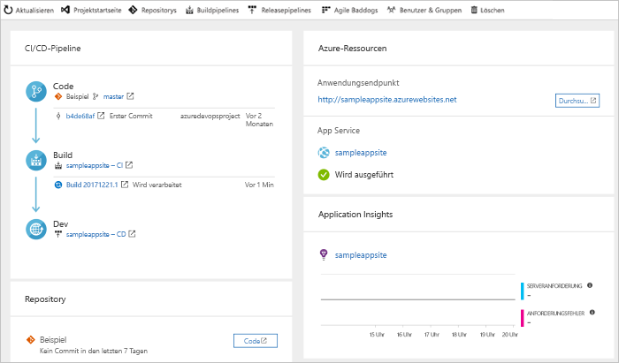

# Erstellen einer CI/CD-Pipeline für Ruby on Rails mit Azure DevOps Projects

Konfigurieren Sie mit Azure DevOps Projects Continuous Integration (CI) und Continuous Delivery (CD) für Ihre Ruby on Rails-App. DevOps Projects erleichtert die Erstkonfiguration einer Build- und Releasepipeline für Azure DevOps.

Wenn Sie kein Azure-Abonnement haben, erhalten Sie über [Visual Studio Dev Essentials](https://visualstudio.microsoft.com/dev-essentials/) ein kostenloses Abonnement.

## Melden Sie sich auf dem Azure-Portal an.

Mit Azure DevOps Projects wird eine CI/CD-Pipeline in Azure Repos erstellt. Sie können eine neue Azure DevOps-Organisation erstellen oder eine bestehende Organisation verwenden. Ferner werden mit DevOps Projects Azure-Ressourcen im Azure-Abonnement Ihrer Wahl erstellt.

1. Melden Sie sich beim [Azure-Portal](https://portal.azure.com) an.

1. Wählen Sie im linken Bereich **Ressource erstellen**.

1. Geben Sie in das Suchfeld **DevOps Projects** ein, und wählen sie dann **Erstellen** aus.

    

## Auswählen einer Beispiel-App und eines Azure-Diensts

1. Wählen Sie die **Ruby**-Beispiel-App aus.

1. Wählen Sie das **Ruby on Rails**-Anwendungsframework aus. Klicken Sie auf **Weiter**, wenn Sie fertig sind.

1. **Web App on Linux** ist das Standardziel für die Bereitstellung.  
    Optional können Sie **Web-App für Container** auswählen. Das Anwendungsframework, das Sie zuvor ausgewählt haben, bestimmt den Typ des hier verfügbaren Bereitstellungsziels für den Azure-Dienst. 
    
1. Wählen Sie den gewünschten Zieldienst und anschließend **Weiter** aus.

## Konfigurieren von Azure DevOps und eines Azure-Abonnements 

1. Sie können eine neue kostenlose Azure DevOps-Organisation erstellen oder eine bestehende Organisation auswählen. 

1. Geben Sie einen Namen für Ihr Azure DevOps-Projekt ein. 

1. Wählen Sie Ihr Azure-Abonnement und den Standort aus, geben Sie einen Namen für Ihre App ein, und wählen Sie dann **Fertig** aus.  
    Nach wenigen Minuten wird das DevOps Projects-Dashboard im Azure-Portal angezeigt. Eine Beispiel-App wird in einem Repository in Ihrer Azure DevOps-Organisation eingerichtet, ein Build wird ausgeführt, und Ihre App wird in Azure bereitgestellt. 
    
    Dieses Dashboard bietet Einblick in Ihr Coderepository, in Ihre CI/CD-Pipeline und in Ihre App in Azure. Wählen Sie auf der rechten Seite **Durchsuchen** aus, um Ihre ausgeführte App anzuzeigen.

     

## Committen Ihrer Codeänderungen und Ausführen von CI/CD

Azure DevOps Projects erstellt ein Git-Repository in Azure Pipelines oder GitHub. Gehen Sie wie folgt vor, um das Repository anzuzeigen und Codeänderungen an der App vorzunehmen:

1. Wählen Sie auf der linken Seite des DevOps Projects-Dashboards den Link für Ihren Masterbranch aus.  
    Über den Link wird eine Ansicht des neu erstellten Git-Repositorys geöffnet.

1. Wählen Sie zum Anzeigen der Repository-Klon-URL oben rechts **Klonen** aus.  
    Sie können Ihr Git-Repository in Ihrer bevorzugten IDE klonen. Bei den nächsten Schritten können Sie den Webbrowser verwenden, um Codeänderungen direkt am Masterbranch vorzunehmen und für Codeänderungen einen Commit auszuführen.

1. Navigieren Sie links zur Datei *app/views/pages/home.html.erb*, und wählen Sie dann **Bearbeiten** aus.

1. Nehmen Sie eine Änderung an der Datei vor. Ändern Sie beispielsweise Text in einem der div-Tags.

1. Wählen Sie **Commit** aus, und speichern Sie anschließend die Änderungen.

1. Navigieren Sie in Ihrem Browser zum DevOps Projects-Dashboard.  
    Ein Build sollte gerade in Bearbeitung sein. Die von Ihnen vorgenommenen Änderungen werden automatisch erstellt und über eine CI/CD-Pipeline bereitgestellt.

## Überprüfen der CI/CD-Pipeline in Azure Pipelines

Mit Azure DevOps Projects wird automatisch eine vollständige CI/CD-Pipeline in Ihrer Azure DevOps-Organisation konfiguriert. Untersuchen Sie die Pipeline, und passen Sie sie bei Bedarf an. Gehen Sie wie folgt vor, um sich mit den Build- und Releasepipelines von Azure DevOps vertraut zu machen:

1. Navigieren Sie zum DevOps Projects-Dashboard.

1. Wählen Sie im oberen Bereich **Buildpipelines** aus.  
    Auf einer Browserregisterkarte wird die Buildpipeline für Ihr neues Projekt angezeigt.

1. Zeigen Sie auf das Feld **Status**, und wählen Sie dann die Auslassungspunkte (...) aus.  
    In einem Menü werden verschiedene Optionen angezeigt, etwa zum Einreihen eines neuen Builds in die Warteschlange, zum Anhalten eines Builds und zum Bearbeiten der Buildpipeline.

1. Wählen Sie **Bearbeiten** aus.

1. In diesem Bereich können Sie sich die verschiedenen Aufgaben ansehen, die Sie für Ihre Buildpipeline ausführen können.  
    Vom Build werden verschiedene Aufgaben durchgeführt. Beispielsweise werden Quellen aus dem Git-Repository abgerufen, Abhängigkeiten wiederhergestellt und für Bereitstellungen verwendete Ausgaben veröffentlicht.

1. Wählen Sie oben in der Buildpipeline den Buildpipelinenamen aus.

1. Ersetzen Sie den Namen Ihrer Buildpipeline durch einen aussagekräftigeren Namen, und wählen Sie **Speichern und in Warteschlange einreihen** und dann **Speichern** aus.

1. Wählen Sie unter dem Buildpipelinenamen **Verlauf** aus.  
    In diesem Bereich wird ein Überwachungsprotokoll mit den letzten Änderungen für den Build angezeigt. An der Buildpipeline vorgenommene Änderungen werden von Azure DevOps nachverfolgt, sodass Sie verschiedene Versionen vergleichen können.

1. Wählen Sie **Trigger** aus.  
    Mit DevOps Projects wird automatisch ein CI-Trigger erstellt, und mit jedem für das Repository ausgeführten Commit wird ein neuer Build gestartet. Optional können Sie Branches in den CI-Prozess einbeziehen oder davon ausschließen.

1. Wählen Sie **Aufbewahrung** aus.  
    Abhängig vom Szenario können Sie Richtlinien zum Aufbewahren oder Entfernen einer bestimmten Anzahl von Builds festlegen.

1. Wählen Sie **Build und Release** und anschließend **Releases** aus.  
    DevOps Projects erstellt eine Releasepipeline zum Verwalten von Bereitstellungen in Azure.

1. Wählen Sie neben Ihrer Releasepipeline die Auslassungspunkte (...) und anschließend **Bearbeiten** aus.  
    Die Releasepipeline enthält eine *Pipeline*, die den Releaseprozess definiert.

1. Wählen Sie unter **Artefakte** die Option **Ablegen** aus.  
    Die zuvor untersuchte Buildpipeline erzeugt die für das Artefakt verwendete Ausgabe. 

1. Wählen Sie rechts neben dem Symbol **Ablegen** die Option **Continuous Deployment-Trigger** aus.  
    Diese Releasepipeline enthält einen aktivierten CD-Trigger. Jedes Mal, wenn ein neues Buildartefakt verfügbar ist, wird von diesem CD-Trigger eine Bereitstellung ausgeführt. Optional können Sie den Trigger deaktivieren, sodass Ihre Bereitstellungen manuell ausgeführt werden müssen. 

1. Wählen Sie auf der linken Seite **Aufgaben** aus.  
    Bei den Aufgaben handelt es sich um die Aktivitäten, die beim Bereitstellungsprozess ausgeführt werden. In diesem Beispiel wurde für die Bereitstellung in Azure App Service eine Aufgabe erstellt.

1. Wählen Sie auf der rechten Seite **Releases anzeigen** aus, um einen Releaseverlauf anzuzeigen.

1. Wählen Sie neben einem Release die Auslassungspunkte (...) und anschließend **Öffnen** aus.  
    Sie können sich verschiedene Menüs ansehen, etwa eine Releasezusammenfassung, zugeordnete Arbeitsaufgaben und Tests.

1. Wählen Sie **Commits** aus.  
    In dieser Ansicht werden die dieser Bereitstellung zugeordneten Codecommits angezeigt. 

1. Wählen Sie **Protokolle** aus.  
    Die Protokolle enthalten nützliche Informationen zum Bereitstellungsprozess. Sie können während und nach Bereitstellungen angezeigt werden.

## Bereinigen von Ressourcen

Sie können die in dieser Schnellstartanleitung erstellte Azure App Service-Instanz und zugehörige Ressourcen löschen, wenn Sie sie nicht mehr benötigen. Verwenden Sie dazu die Funktion **Löschen** auf dem DevOps Projects-Dashboard.

## Nächste Schritte

Weitere Informationen zum Anpassen der Build- und Releasepipelines an die Anforderungen Ihres Teams finden Sie in folgendem Tutorial:

> [!div class="nextstepaction"]
> [Define your multi-stage continuous deployment (CD) pipeline](https://docs.microsoft.com/azure/devops/pipelines/release/define-multistage-release-process?view=vsts) (Festlegen Ihrer mehrstufigen CD-Pipeline (Continuous Deployment))
