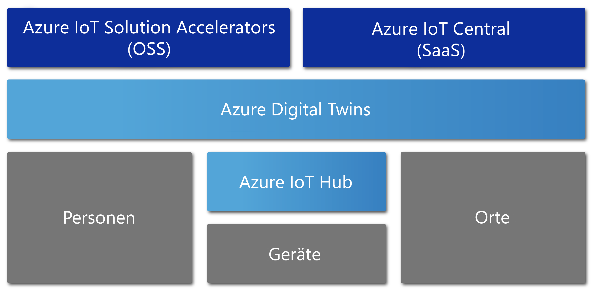

# Übersicht über Azure Digital Twins

Azure Digital Twins ist ein Azure IoT-Dienst zur Erstellung umfassender Modelle der physischen Umgebung. Er kann Raumintelligenzgraphen erstellen, um die Beziehungen und Interaktionen zwischen Personen, Bereichen und Geräten zu modellieren.

Mit Azure Digital Twins lassen sich Daten aus einem physischen Bereich abfragen anstatt von vielen verschiedenen Sensoren. Dieser Dienst hilft Ihnen bei der Erstellung wiederverwendbarer, hochgradig skalierbarer und raumbezogener Umgebungen, die Streamingdaten aus der digitalen und der physischen Welt miteinander verknüpfen. Ihre Apps werden durch diese äußerst relevanten kontextbezogenen Features noch besser. Azure Digital Twins kann für die folgenden Beispielaufgaben zu folgenden Zwecken genutzt werden:

- Vorhersagen des Wartungsbedarfs für eine Fabrik
- Analysieren des Energiebedarfs für ein Stromnetz in Echtzeit
- Optimieren der Verwendung der verfügbaren Fläche für ein Büro

Der Anwendungsbereich von Azure Digital Twins umfasst alle Arten von Umgebungen. Lagerhäuser, Büros, Schulen, Krankenhäuser und Banken sind nur einige Beispiele. Der Dienst kann sogar für Stadien, Fabriken, Parkplätze, Parks, intelligente Stromnetze und Städte verwendet werden. Azure Digital Twins kann in den folgenden Beispielszenarien zu folgenden Zwecken genutzt werden:
 
- Nachverfolgung der Tagestemperatur in mehreren Bundesländern 
- Überwachung intensiv genutzter Drohnenpfade
- Erkennung autonomer Fahrzeuge 
- Analyse der Raumbelegung eines Gebäudes 
- Ermittlung der am stärksten ausgelasteten Kasse in einem Ladengeschäft 

Über Azure Digital Twins kann für jedes geschäftliche Szenario eine entsprechende digitale Instanz bereitgestellt werden.

Im folgenden Video wird Azure Digital Twins genauer betrachtet.

> [!VIDEO https://www.youtube.com/embed/TvN_NxpgyzQ]

## Wichtige Funktionen

Azure Digital Twins verfügt über die folgenden wichtigen Funktionen.

### Raumintelligenzgraph

Der [*Raumintelligenzgraph*](./concepts-objectmodel-spatialgraph.md) oder *Raumgraph* ist eine virtuelle Darstellung der physischen Umgebung. Sie können ihn zum Modellieren der Beziehungen zwischen Personen, Orten und Geräten zu modellieren.

Stellen Sie sich eine intelligente Versorger-App vor, die zahlreiche Stromzähler eines Viertels umfasst. Das Versorgungsunternehmen muss den Stromverbrauch und die Abrechnung präzise überwachen und prognostizieren. Jedes Gerät und jeder Sensor muss im Kontext des Orts und des Kunden, der die Abrechnung erhält, modelliert werden. Solche komplexen Beziehungen können mithilfe des Raumintelligenzgraphen modelliert werden.

### Objektmodelle für digitale Zwillinge

[Objektmodelle für digitale Zwillinge](./concepts-objectmodel-spatialgraph.md) sind vordefinierte Geräteprotokolle und ein Datenschema. Sie stimmen die domänenspezifischen Anforderungen Ihrer Lösung ab, um die Entwicklung zu beschleunigen und zu vereinfachen.

So kann beispielsweise eine Raumbelegungsanwendung vordefinierte Bereichstypen wie Campus, Gebäude, Etage, Raum usw. verwenden.

### Mehrere und geschachtelte Mandanten

Sie können Lösungen erstellen, die sicher skaliert und für mehrere Mandanten wiederverwendet werden können. Darüber hinaus können Sie mehrere Untermandanten erstellen, die isoliert und sicher genutzt werden können.

Ein Beispiel dafür ist eine App für Speicherauslastung, die für das Isolieren der Daten eines Mandanten von Daten eines anderen Mandanten innerhalb eines Gebäudes konfiguriert ist. Die App kann auch zum Kombinieren von Daten für einen einzelnen Mandanten mit zahlreichen Gebäude verwendet werden.

### Erweiterte Computefunktionen

Mit [benutzerdefinierten Funktionen](./concepts-user-defined-functions.md) können Sie angepasste Funktionen für eingehende [Gerätedaten](./concepts-device-ingress.md) definieren und ausführen, um Signale an vordefinierte Endpunkte zu senden. Diese erweiterte Funktion verbessert die Anpassung und Automatisierung von Geräteaufgaben.

Ein Beispiel dafür ist etwa eine intelligente Anwendung für die Landwirtschaft mit einer benutzerdefinierten Funktion zur Auswertung der Messwerte von Bodenfeuchtigkeitssensoren und der Wettervorhersage. Die App sendet dann Signale zum Bewässerungsbedarf.

### Integrierte Zugriffssteuerung

Durch die Verwendung von Zugriffs- und Identitätsverwaltungsfeatures wie [rollenbasierte Zugriffssteuerung](./security-role-based-access-control.md) und [Azure Active Directory](./security-authenticating-apis.md) können Sie den Zugriff für Personen und Geräte sicher steuern.

Ein Beispiel dafür ist eine Gebäudeverwaltungs-App, die so konfiguriert ist, dass Bewohner die Raumtemperatur nur innerhalb eines bestimmten Bereichs regeln können. Facility-Manager dagegen können die Temperatur in jedem Raum auf einen beliebigen Wert festlegen.

### Ökosystem

Sie können eine Azure Digital Twins-Instanz mit zahlreichen leistungsstarken Azure-Diensten verbinden. Zu diesen Diensten gehören Azure Stream Analytics, Azure AI und Azure Storage. Sie umfassen außerdem Azure Maps, Microsoft Mixed Reality, Dynamics 365 und Office 365.

Ein Beispiel ist eine intelligente Bürogebäudeanwendung, die mithilfe von Azure Digital Twins Teams und Geräte auf verschiedenen Stockwerken darstellen kann. Die Livedaten, die Geräte an die bereitgestellte Digital Twins-Instanz streamen, werden von Stream Analytics verarbeitet, um wichtige praxisrelevante Erkenntnisse zu gewinnen. Die Daten werden in Azure Storage gespeichert und in ein freigabefähiges Dateiformat konvertiert. Die Datei wird mithilfe von Office 365 in der gesamten Organisation verteilt.

## Lösungen, die von Azure Digital Twins profitieren

Azure Digital Twins eignet sich für die Darstellung der realen Welt und der vielen Beziehungen darin. Der Dienst vereinfacht die Modellierung, Datenverarbeitung, Ereignisbehandlung und Gerätenachverfolgung für IoT. Im Anschluss finden Sie eine kleine Auswahl von Szenarien aus verschiedenen Branchen. Dabei wird Azure Digital Twins genutzt für:

* Veranschaulichung der Belegungsentwicklung eines Bereichs zur Ermittlung der optimalen Konfiguration des Bürogebäudes einer Immobilienverwaltung
* Auslösung von Arbeitsauftragstickets für eine mobile App Entsendung von Wachpersonal und Planung von Hausmeisterdiensten und anderen Diensten im Einzelhandel oder an einer Sportstätte
* Anzeige der belegten Räume eines Gebäudes in Echtzeit für einen Interessenten und Unterstützung des Interessenten beim Reservieren geeigneter Arbeitsbereiche
* Nachverfolgung des Orts, an dem sich Ressourcen innerhalb eines Bereichs befinden
* Optimierung der Aufladung von Elektrofahrzeugen durch Modellierung von Benutzerpräferenzen und Einschränkungen des Stromnetzes

## Azure Digital Twins im Kontext anderer IoT-Dienste

Azure Digital Twins nutzt Azure IoT Hub, um eine Verbindung mit den IoT-Geräten und Sensoren herzustellen, die jeweils aktuelle Daten aus der physischen Welt liefern. Das folgende Diagramm veranschaulicht die Beziehung zwischen Azure Digital Twins und anderen Azure IoT-Diensten.

Weitere Informationen zu IoT finden Sie unter [Azure IoT-Technologien und -Lösungen](https://docs.microsoft.com/azure/iot-fundamentals/iot-services-and-technologies).

## Nächste Schritte

Sehen Sie sich eine kurze Demo zu Azure Digital Twins an:

> [!div class="nextstepaction"]
> [Schnellstart: Suchen nach verfügbaren Räumen mithilfe von Azure Digital Twins](./quickstart-view-occupancy-dotnet.md)

Machen Sie sich ausführlich mit einer Gebäudeverwaltungsanwendung vertraut, die Azure Digital Twins nutzt:

> [!div class="nextstepaction"]
> [Tutorial: Bereitstellen von Azure Digital Twins und Konfigurieren eines Raumgraphen](./tutorial-facilities-setup.md)

Machen Sie sich mit zentralen Aspekten von Azure Digital Twins vertraut:

> [!div class="nextstepaction"]
> [Grundlegendes zum Digital Twins-Objektmodell und zum Raumintelligenzgraphen](./concepts-objectmodel-spatialgraph.md)
