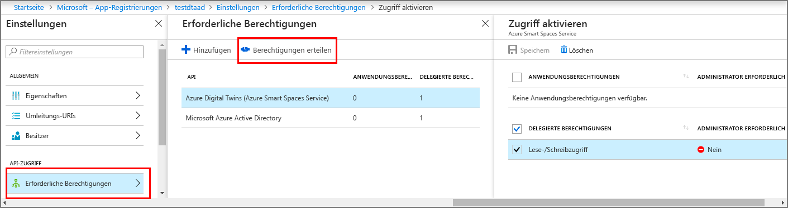

# <a name="how-to-configure-postman-for-azure-digital-twins"></a>Vorgehensweise: Konfigurieren von Postman für Azure Digital Twins

Dieser Artikel beschreibt, wie Sie den Postman-REST-Client für die Interaktion mit den Azure Digital Twins-Verwaltungs-APIs und das Testen dieser APIs konfigurieren. Insbesondere wird Folgendes beschrieben:

* Konfigurieren einer Azure Active Directory-Anwendung für die Verwendung der impliziten OAuth 2.0-Genehmigung
* Verwenden des Postman-REST-Clients, um HTTP-Anforderungen mit Token an Ihre Verwaltungs-APIs zu stellen
* Verwenden von Postman, um mehrteilige POST-Anforderungen an Ihre Verwaltungs-APIs zu stellen

## <a name="postman-summary"></a>Postman: Zusammenfassung

Führen Sie erste Schritte mit Azure Digital Twins aus, indem Sie ein REST-Clienttool wie [Postman](https://www.getpostman.com/) verwenden, um Ihre lokale Testumgebung vorzubereiten. Der Postman-Client unterstützt die schnelle Erstellung komplexer HTTP-Anforderungen. Laden Sie die Desktopversion des Postman-Clients herunter, indem Sie zu [www.getpostman.com/apps](https://www.getpostman.com/apps) navigieren.

[Postman](https://www.getpostman.com/) ist ein REST-Testtool, das wichtige HTTP-Anforderungsfunktionen in einer nützlichen desktop- und plugin-basierten grafischen Benutzeroberfläche ermittelt. 

Über den Postman-Client können Lösungsentwickler die Art der HTTP-Anforderung (*POST*, *GET*, *UPDATE*, *PATCH* und *DELETE*), den aufzurufenden API-Endpunkt und die Verwendung von SSL angeben. Postman unterstützt außerdem das Hinzufügen von HTTP-Anforderungsheadern, Parametern, Formulardaten und Textkörpern.

## <a name="configure-azure-active-directory-to-use-the-oauth-20-implicit-grant-flow"></a>Konfigurieren von Azure Active Directory für die Verwendung der impliziten OAuth 2.0-Gewährung

Konfigurieren Ihrer Azure Active Directory-App für die Verwendung der impliziten OAuth 2.0-Gewährung

1. Führen Sie die Schritte in [diesem Schnellstart](https://docs.microsoft.com/azure/active-directory/develop/quickstart-v1-integrate-apps-with-azure-ad) aus, um eine Azure AD-Anwendung vom Typ „Nativ“ zu erstellen. Alternativ können Sie eine vorhandene App-Registrierung vom Typ „Nativ“ wiederverwenden.

1. Wählen Sie unter **Erforderliche Berechtigungen** den Befehl **Hinzufügen** aus, und geben Sie unter **API-Zugriff hinzufügen** den Wert **Azure Digital Twins** ein. Wenn die API damit nicht gefunden wird, suchen Sie stattdessen nach **Azure Smart Spaces**. Wählen Sie dann **Berechtigungen erteilen > Delegierte Berechtigungen** und **Fertig** aus.

    

1. Klicken Sie auf **Manifest**, um das Anwendungsmanifest für Ihre App zu öffnen. Legen Sie *oauth2AllowImplicitFlow* auf `true` fest.

      ![Implizierter Azure Active Directory-Flow][1]

1. Konfigurieren Sie eine **Antwort-URL** zu `https://www.getpostman.com/oauth2/callback`.

      ![Azure Active Directory-Antwort-URL][2]

1. Kopieren Sie die **Anwendungs-ID** Ihrer Azure Active Directory-App, und bewahren Sie sie auf. Sie wird in den folgenden Schritten verwendet.

## <a name="obtain-an-oauth-20-token"></a>Abrufen eines OAuth 2.0-Tokens

Richten Sie als Nächstes Postman ein, und konfigurieren Sie das Tool so, dass ein Azure Active Directory-Token abgerufen wird. Geben Sie anschließend unter Verwendung des abgerufenen Tokens eine authentifizierte HTTP-Anforderung an Azure Digital Twins aus:

1. Navigieren Sie zu [www.getpostman.com](https://www.getpostman.com/), um die App herunterzuladen.
1. Überprüfen Sie, ob Ihre **Autorisierungs-URL** richtig ist. Sie sollte das folgende Format aufweisen:

    ```plaintext
    https://login.microsoftonline.com/YOUR_AZURE_TENANT.onmicrosoft.com/oauth2/authorize?resource=0b07f429-9f4b-4714-9392-cc5e8e80c8b0
    ```

    | NAME  | Ersetzen durch | Beispiel |
    |---------|---------|---------|
    | IHR_AZURE_MANDANT | Der Name Ihres Mandanten oder Ihrer Organisation | `microsoft` |

1. Wählen Sie die Registerkarte **Authorization** (Autorisierung) und anschließend **OAuth 2.0** und **Get New Access Token** (Neues Zugriffstoken abrufen) aus.

    | Feld  | Wert |
    |---------|---------|
    | Gewährungstyp | `Implicit` |
    | Rückruf-URL | `https://www.getpostman.com/oauth2/callback` |
    | Authentifizierungs-URL | Verwenden Sie die **Autorisierungs-URL** aus Schritt 2. |
    | Client-ID | Verwenden Sie die **Anwendungs-ID** für die Azure Active Directory-App, die im vorherigen Abschnitt erstellt bzw. anderweitig eingesetzt wurde. |
    | `Scope` | Nicht ausfüllen |
    | Zustand | Nicht ausfüllen |
    | Clientauthentifizierung | `Send as Basic Auth header` |

1. Der Client sollte jetzt folgendermaßen aussehen:

   ![Postman-Clientbeispiel][3]

1. Wählen Sie **Request Token** (Token anfordern) aus.

    >[!TIP]
    >Versuchen Sie Folgendes, wenn Sie die Fehlermeldung „OAuth2 couldn’t be completed“ (OAuth2 konnte nicht abgeschlossen werden) erhalten:
    > * Schließen Sie Postman, und öffnen Sie das Tool dann erneut, um den Vorgang zu wiederholen.
  
1. Scrollen Sie nach unten, und wählen Sie **Use Token** (Token verwenden) aus.

<div id="multi"></div>

## <a name="make-a-multipart-post-request"></a>Stellen einer mehrteiligen POST-Anforderung

Nach Abschluss der vorherigen Schritte konfigurieren Sie Postman, um eine authentifizierte mehrteilige HTTP-POST-Anforderung zu stellen:

1. Fügen Sie auf der Registerkarte **Header** einen **Content-Type**-Schlüssel für den HTTP-Anforderungsheader mit dem Wert `multipart/mixed` hinzu.

   ![Inhaltstyp „multipart/mixed“][4]

1. Serialisieren Sie Nicht-Textdaten in Dateien. JSON-Daten werden als JSON-Datei gespeichert.
1. Fügen Sie auf der Registerkarte **Haupttext** jede Datei hinzu, indem Sie einen **Schlüssel**-Namen zuweisen und `file` oder `text` auswählen.
1. Wählen Sie dann jede Datei über die Schaltfläche **Datei auswählen** aus.

   ![Postman-Clientbeispiel][5]

   >[!NOTE]
   > * Für den Postman-Client ist es nicht erforderlich, dass mehrteilige Blöcke einen manuell zugewiesenen **Content-Type** oder **Content-Disposition**-Schlüssel haben.
   > * Sie müssen diese Header nicht für jedes Teile angeben.
   > * Sie müssen `multipart/mixed` oder einen anderen geeigneten **Content-Type** für die gesamte Anforderung auswählen.

1. Klicken Sie schließlich auf **Senden**, um die mehrteilige HTTP-POST-Anforderung zu übermitteln.

## <a name="next-steps"></a>Nächste Schritte

- Informationen zu den Digital Twins-Verwaltungs-APIs und ihrer Verwendung finden Sie unter [Verwenden der Azure Digital Twins-Verwaltungs-APIs](how-to-navigate-apis.md).

- Verwenden von mehrteiligen Anforderungen, um [Blobs zu Objekten in Azure Digital Twins hinzuzufügen](./how-to-add-blobs.md).

- Informationen dazu, wie die Authentifizierung mit den Verwaltungs-APIs erfolgt, finden Sie unter [Authentifizieren mit APIs](./security-authenticating-apis.md).

<!-- Images -->
[1]: media/how-to-configure-postman/implicit-flow.png
[2]: media/how-to-configure-postman/reply-url.png
[3]: media/how-to-configure-postman/postman-oauth-token.png
[4]: media/how-to-configure-postman/content-type.png
[5]: media/how-to-configure-postman/form-body.png