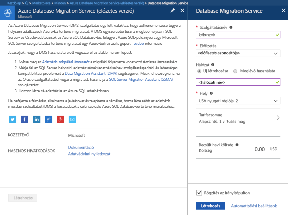
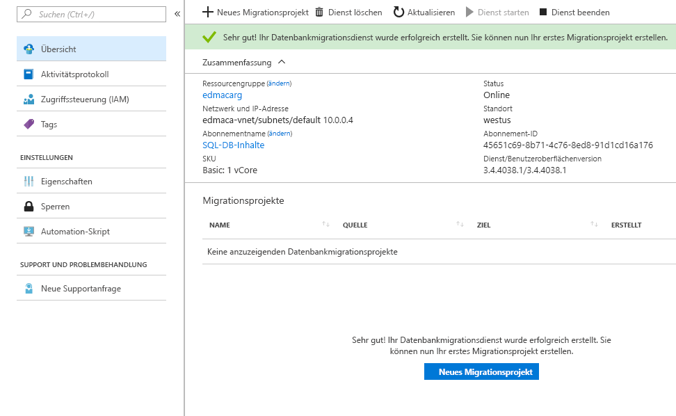

# Erstellen einer Azure Database Migration Service-Instanz mithilfe des Azure-Portals
In diesem Schnellstart verwenden Sie das Azure-Portal, um eine Instanz von Azure Database Migration Service zu erstellen.  Nachdem Sie den Dienst erstellt haben, können Sie ihn zum Migrieren von Daten aus einer lokalen SQL Server-Instanz zu einer Azure SQL-Datenbank verwenden.

Wenn Sie kein Azure-Abonnement besitzen, können Sie ein [kostenloses Konto](https://azure.microsoft.com/free/) erstellen, bevor Sie beginnen.

## Anmelden beim Azure-Portal
Öffnen Sie Ihren Webbrowser, und navigieren Sie zum [Microsoft Azure-Portal](https://portal.azure.com/). Geben Sie Ihre Anmeldeinformationen ein, um sich beim Portal anzumelden. Die Standardansicht ist Ihr Dienstdashboard.

## Erstellen einer Instanz von Azure Database Migration Service
1. Klicken Sie auf **+**, um einen neuen Dienst zu erstellen.  Database Migration Service ist noch in der Vorschauversion.  

1. Suchen Sie im Marketplace nach „Migration“, wählen Sie „Database Migration Service (Vorschau)“, und klicken Sie dann auf **Erstellen**.

    

    - Wählen Sie einen **Dienstnamen** aus, der einprägsam und in Ihrer Azure Database Migration Service-Instanz eindeutig ist.
    - Wählen Sie Ihr **Azure-Abonnement** aus, in dem die Database Migration Service-Instanz erstellt werden soll.
    - Erstellen Sie ein neues **Netzwerk** mit einem eindeutigen Namen.
    - Wählen Sie den **Ort** aus, der die geringste Entfernung zum Quell- oder Zielserver aufweist.
    - Wählen Sie als **Tarif** „Basic: 1 vCore“ aus.

1. Klicken Sie auf **Erstellen**.

Nach einigen Augenblicken wird die Azure Database Migration Service-Instanz erstellt, und sie kann verwendet werden.  Die Database Migration Service-Instanz wird wie in der Abbildung angezeigt.

## Bereinigen von Ressourcen
Sie können alle im Schnellstart erstellten Ressourcen bereinigen, indem Sie die [Azure-Ressourcengruppe](../azure-resource-manager/resource-group-overview.md) löschen.  Um die Ressourcengruppe zu löschen, wechseln Sie zu der Database Migration Service-Instanz, die Sie erstellt haben, klicken Sie auf den Namen der **Ressourcengruppe**, und wählen Sie dann **Ressourcengruppe löschen** aus.  Durch diese Aktion werden alle Ressourcen in der Ressourcengruppe sowie die Gruppe selbst gelöscht.

## Nächste Schritte
> [!div class="nextstepaction"]
> [Migrate SQL Server to Azure SQL Database](tutorial-sql-server-to-azure-sql.md) (Migrieren von SQL Server zu Azure SQL-Datenbank, in englischer Sprache)