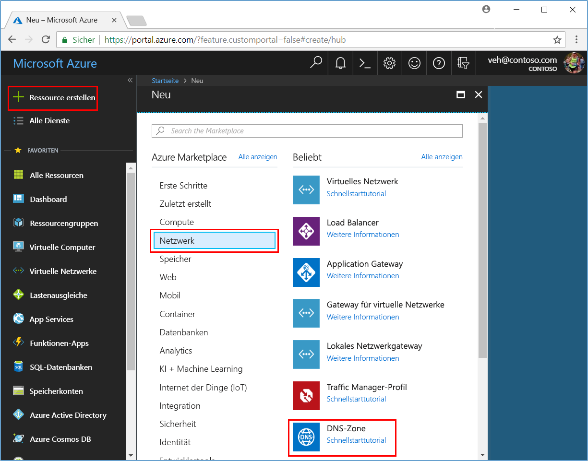
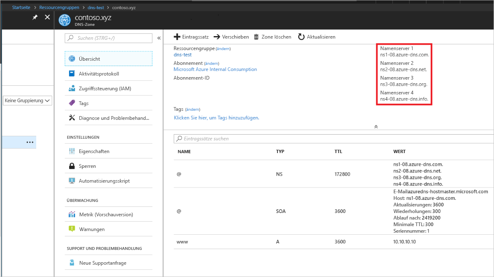

# <a name="quickstart-configure-azure-dns-for-name-resolution-using-the-azure-portal"></a>Schnellstart: Konfigurieren von Azure DNS für die Namensauflösung über das Azure-Portal

 Sie können Azure DNS zum Auflösen der Hostnamen in Ihrer öffentlichen Domäne konfigurieren. Wenn Sie beispielsweise den Domänennamen „contoso.com“ von einer Domänennamen-Registrierungsstelle erworben haben, können Sie Azure DNS zum Hosten der Domäne „contoso.com“ und zum Auflösen von „www.contoso.com“ in die IP-Adresse für Ihren Webserver oder Ihre Web-App konfigurieren.

In dieser Schnellstartanleitung erstellen Sie eine Testdomäne und anschließend einen Adresseintrag mit dem Namen „www“, der in die IP-Adresse 10.10.10.10 aufgelöst wird.

Es ist wichtig zu wissen, dass alle in dieser Schnellstartanleitung verwendeten Namen und IP-Adressen lediglich Beispiele sind und kein reales Szenario darstellen. Allerdings werden ggf. auch reale Szenarien beschrieben.

<!---
You can also perform these steps using [Azure PowerShell](dns-getstarted-powershell.md) or the cross-platform [Azure CLI](dns-getstarted-cli.md).
--->

Eine DNS-Zone wird die DNS-Einträge für eine bestimmte Domäne enthalten. Wenn Sie eine Domäne in Azure DNS hosten möchten, müssen Sie eine DNS-Zone für diesen Domänennamen erstellen. Jeder DNS-Eintrag für Ihre Domäne wird dann in dieser DNS-Zone erstellt. Die folgenden Schritte veranschaulichen die Vorgehensweise.

Wenn Sie kein Azure-Abonnement besitzen, können Sie ein [kostenloses Konto](https://azure.microsoft.com/free/?WT.mc_id=A261C142F) erstellen, bevor Sie beginnen.

## <a name="create-a-dns-zone"></a>Erstellen einer DNS-Zone

1. Melden Sie sich beim Azure-Portal an.
2. Klicken Sie oben links auf **+ Ressource erstellen** und anschließend auf **Netzwerk**. Klicken Sie dann auf **DNS-Zone**, um die Seite **DNS-Zone erstellen** zu öffnen.

    

4. Geben Sie auf der Seite **DNS-Zone erstellen** die folgenden Werte ein, und klicken Sie anschließend auf **Erstellen**:


   | **Einstellung** | **Wert** | **Details** |
   |---|---|---|
   |**Name**|contoso.xyz|Der Name der DNS-Zone für dieses Beispiel. Sie können einen beliebigen Wert für diese Schnellstartanleitung verwenden, sofern er nicht bereits auf den Azure DNS-Servern konfiguriert ist. Ein realer Wert ist eine Domäne, die Sie von einer Domänennamen-Registrierungsstelle erworben haben.|
   |**Abonnement**|[Ihr Abonnement]|Wählen Sie ein Abonnement aus, in dem die DNS-Zone erstellt werden soll.|
   |**Ressourcengruppe**|**Neu erstellen:** dns-test|Erstellen Sie eine Ressourcengruppe. Der Name der Ressourcengruppe muss innerhalb des ausgewählten Abonnements eindeutig sein. |
   |**Location**|USA (Ost)||

Die Erstellung der Zone kann einige Minuten dauern.

## <a name="create-a-dns-record"></a>Erstellen eines DNS-Eintrags

Erstellen Sie nun einen neuen Adresseintrag (A-Eintrag). A-Einträge werden zum Auflösen eines Hostnamens in eine IPv4-Adresse verwendet.

1. Klicken Sie im Azure-Portal im Bereich **Favoriten** auf **Alle Ressourcen**. Klicken Sie auf der Seite „Alle Ressourcen“ auf die DNS-Zone **contoso.xyz**. Falls das ausgewählte Abonnement bereits mehrere Ressourcen enthält, können Sie **contoso.xyz** in das Feld **Nach Name filtern...** eingeben und komfortabel auf die DNS-Zone zugreifen.

1. Wählen Sie oben auf der Seite **DNS-Zone** die Option **+ Datensatzgruppe** aus, um die Seite **Datensatzgruppe hinzufügen** zu öffnen.

1. Geben Sie auf der Seite **Datensatzgruppe hinzufügen** die folgenden Werte ein, und klicken Sie anschließend auf **OK**. In diesem Beispiel erstellen Sie einen A-Eintrag.

   |**Einstellung** | **Wert** | **Details** |
   |---|---|---|
   |**Name**|www|Der Name des Eintrags. Dies ist der für den Host zu verwendende Name, den Sie in eine IP-Adresse auflösen möchten.|
   |**Typ**|Eine Datei| Typ des zu erstellenden DNS-Eintrags. A-Einträge sind am gängigsten. Es gibt jedoch weitere Eintragstypen für E-Mail-Server (MX), IPv6-Adressen (AAAA) usw. |
   |**TTL**|1|Die Gültigkeitsdauer (Time To Live, TTL) der DNS-Anforderung. Gibt an, wie lange DNS-Server und -Clients eine Antwort zwischenspeichern können.|
   |**TTL-Einheit**|hours|Die Zeiteinheit für den TTL-Wert.|
   |**IP-Adresse**|10.10.10.10| Bei diesem Wert handelt es sich um die IP-Adresse, in die der A-Eintrag aufgelöst wird. Dies ist nur ein Testwert für diese Schnellstartanleitung. Bei einem realen Beispiel geben Sie die öffentliche IP-Adresse für Ihren Webserver ein.|


In dieser Schnellstartanleitung erwerben Sie nicht tatsächlich einen echten Domänennamen, daher müssen Sie Azure DNS nicht als Namenserver bei Ihrer Domänenname-Registrierungsstelle konfigurieren. In einem realen Szenario soll jedoch jeder Benutzer im Internet Ihren Hostnamen auflösen können, um eine Verbindung mit Ihrem Webserver oder Ihrer Web-App herzustellen. Weitere Informationen zu diesem realen Szenario finden Sie unter [Delegieren von Domänen an Azure DNS](dns-delegate-domain-azure-dns.md).


## <a name="test-the-name-resolution"></a>Testen der Namensauflösung

Sie besitzen nun eine Testzone mit einem A-Testeintrag darin und können die Namensauflösung mit einem Tool namens nslookup testen. 

1. Zunächst müssen Sie die Azure DNS-Namenserver für die Verwendung mit nslookup notieren. 

   Die Namenserver für Ihre Zone sind auf der Seite **Übersicht** für die DNS-Zone aufgeführt. Kopieren Sie den Namen von einem der Namenserver:

   

2. Öffnen Sie nun eine Eingabeaufforderung, und führen Sie den folgenden Befehl aus:

   ```
   nslookup <host name> <name server>
   
   For example:

   nslookup www.contoso.xyz ns1-08.azure-dns.com
   ```

Das angezeigte Ergebnis sollte ähnlich wie der folgende Screenshot aussehen:


Dadurch wird bestätigt, dass die Namensauflösung ordnungsgemäß funktioniert. www.contoso.xyz wird gemäß Ihrer Konfiguration in 10.10.10.10 aufgelöst.

## <a name="clean-up-resources"></a>Bereinigen von Ressourcen

Löschen Sie die Ressourcengruppe **dns-test**, wenn Sie sie nicht mehr benötigen, um die in dieser Schnellstartanleitung erstellten Ressourcen zu löschen. Klicken Sie dazu auf die Ressourcengruppe **dns-test** und dann auf **Ressourcengruppe löschen**.


## <a name="next-steps"></a>Nächste Schritte

> [!div class="nextstepaction"]
> [Erstellen von DNS-Einträgen für eine Web-App in einer benutzerdefinierten Domäne](./dns-web-sites-custom-domain.md)