# <a name="create-and-route-blob-storage-events-with-the-azure-portal-and-event-grid"></a>Erstellen und Weiterleiten von Blob Storage-Ereignissen mit dem Azure-Portal und Event Grid

Azure Event Grid ist ein Ereignisdienst für die Cloud. In diesem Artikel verwenden Sie das Azure-Portal, um ein Blob Storage-Konto zu erstellen, Ereignisse für diesen Blobspeicher zu abonnieren und ein Ereignis zum Anzeigen des Ergebnisses auszulösen. Üblicherweise senden Sie Ereignisse an einen Endpunkt, der die Ereignisdaten verarbeitet und entsprechende Aktionen ausführt. Der Einfachheit halber senden Sie die Ereignisse in diesem Artikel allerdings an eine Web-App, die die Nachrichten sammelt und anzeigt.

[!INCLUDE [quickstarts-free-trial-note.md](../../includes/quickstarts-free-trial-note.md)]

Am Ende sehen Sie, dass die Ereignisdaten an die Web-App gesendet wurden.

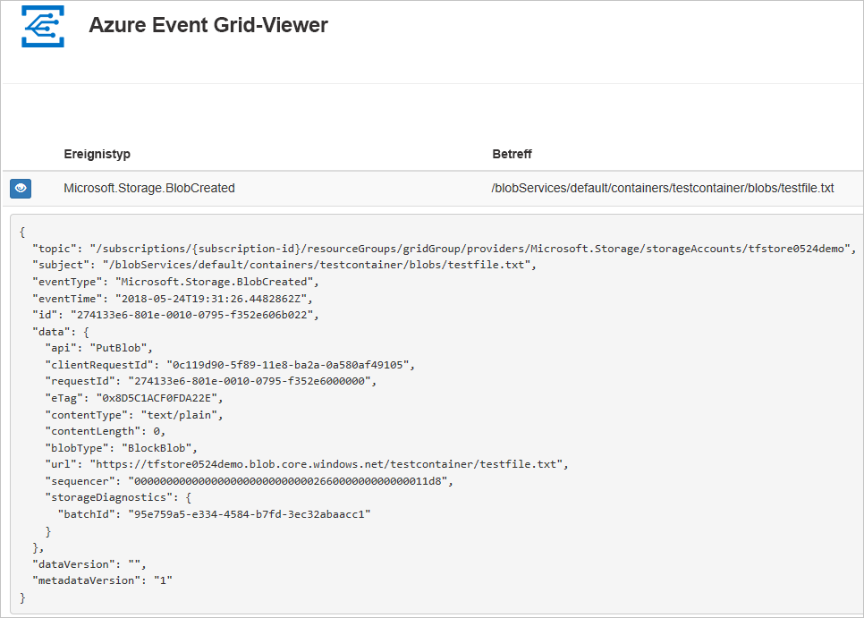

## <a name="create-a-storage-account"></a>Speicherkonto erstellen

Zur Verwendung von Blob Storage-Ereignissen benötigen Sie ein [Blob Storage-Konto](../storage/common/storage-create-storage-account.md?toc=%2fazure%2fstorage%2fblobs%2ftoc.json#blob-storage-accounts) oder ein [Speicherkonto des Typs „General Purpose v2“](../storage/common/storage-account-options.md#general-purpose-v2-accounts). Bei **General Purpose v2 (GPv2)** handelt es sich um Speicherkonten, die alle Features für alle Speicherdienste unterstützen, z.B. Blobs, Files, Queues und Tables. **Blob Storage-Konten** sind spezielle Speicherkonten und dienen dazu, unstrukturierte Daten als Blobs (Objekte) in Azure Storage zu speichern. BLOB-Speicherkonten sind wie allgemeine Speicherkonten und besitzen die gleichen Haltbarkeits-, Verfügbarkeits-, Skalierbarkeits- und Leistungseigenschaften, die Sie schon heute verwenden – einschließlich vollständiger API-Konsistenz für Blockblobs und Anfügeblobs. Bei Anwendungen, die nur Block- oder Anfügeblobspeicher benötigen, empfiehlt sich die Verwendung von BLOB-Speicherkonten. 

1. Melden Sie sich beim [Azure-Portal](https://portal.azure.com/)an.

1. Wählen Sie zum Erstellen eines Blobspeichers die Option **Ressource erstellen**. 

   

1. Wählen Sie **Speicher**, um die verfügbaren Optionen zu filtern, und wählen Sie anschließend **Speicherkonto – Blob, Datei, Tabelle, Warteschlange**.

   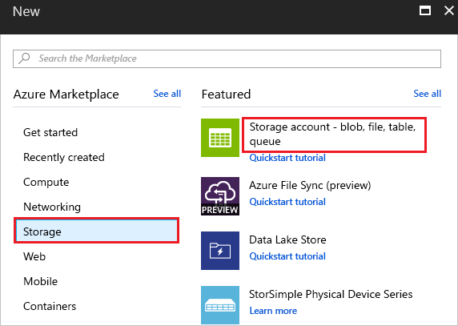

1. Stellen Sie Werte für den Blobspeicher bereit, einschließlich eines eindeutigen Namens für das Konto. Wählen Sie als Kontotyp **BLOB-Speicher** aus. Wählen Sie als Standort einen der [Standorte](overview.md) aus, für die Event Grid unterstützt wird. Wenn Sie mit dem Angeben der Werte fertig sind, können Sie **Erstellen** wählen.

   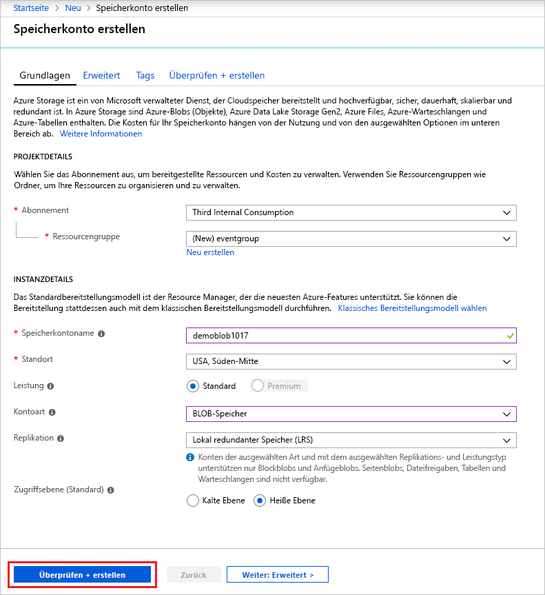

## <a name="create-a-message-endpoint"></a>Erstellen eines Nachrichtenendpunkts

Vor dem Abonnieren der Ereignisse für den Blobspeicher erstellen wir zunächst den Endpunkt für die Ereignisnachricht. Der Endpunkt führt in der Regel Aktionen auf der Grundlage der Ereignisdaten aus. Der Einfachheit halber stellen Sie in dieser Schnellstartanleitung eine [vorgefertigte Web-App](https://github.com/dbarkol/azure-event-grid-viewer) bereit, die die Ereignisnachrichten anzeigt. Die bereitgestellte Lösung umfasst einen App Service-Plan, eine App Service-Web-App und Quellcode von GitHub.

1. Wählen Sie **Deploy to Azure** (In Azure bereitstellen), um die Lösung für Ihr Abonnement bereitzustellen. Geben Sie im Azure-Portal Werte für die Parameter an.

   <a href="https://portal.azure.com/#create/Microsoft.Template/uri/https%3A%2F%2Fraw.githubusercontent.com%2Fdbarkol%2Fazure-event-grid-viewer%2Fmaster%2Fazuredeploy.json" target="_blank"></a>

1. Die Bereitstellung kann einige Minuten dauern. Nach erfolgreichem Abschluss der Bereitstellung können Sie Ihre Web-App anzeigen und sich vergewissern, dass sie ausgeführt wird. Navigieren Sie hierzu in einem Webbrowser zu `https://<your-site-name>.azurewebsites.net`.

1. Die Website wird angezeigt, aber es wurden noch keine Ereignisse bereitgestellt.

   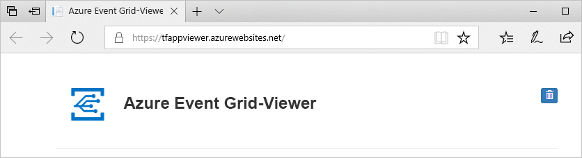

[!INCLUDE [event-grid-register-provider-portal.md](../../includes/event-grid-register-provider-portal.md)]

## <a name="subscribe-to-the-blob-storage"></a>Abonnieren des Blobspeichers

Sie abonnieren ein Thema, um Event Grid mitzuteilen, welche Ereignisse Sie nachverfolgen möchten und wohin diese gesendet werden sollen.

1. Wählen Sie im Portal Ihren Blobspeicher und dann die Option **Ereignisse**.

   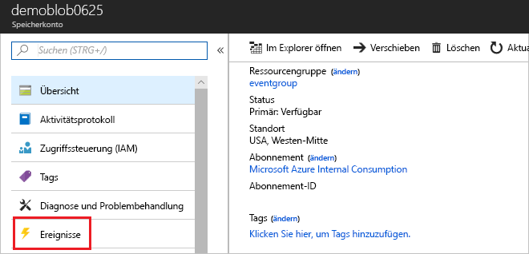

1. Verwenden Sie zum Senden von Ereignissen an Ihre Viewer-App einen Webhook für den Endpunkt. Wählen Sie **Weitere Optionen** und dann **Webhook**.

   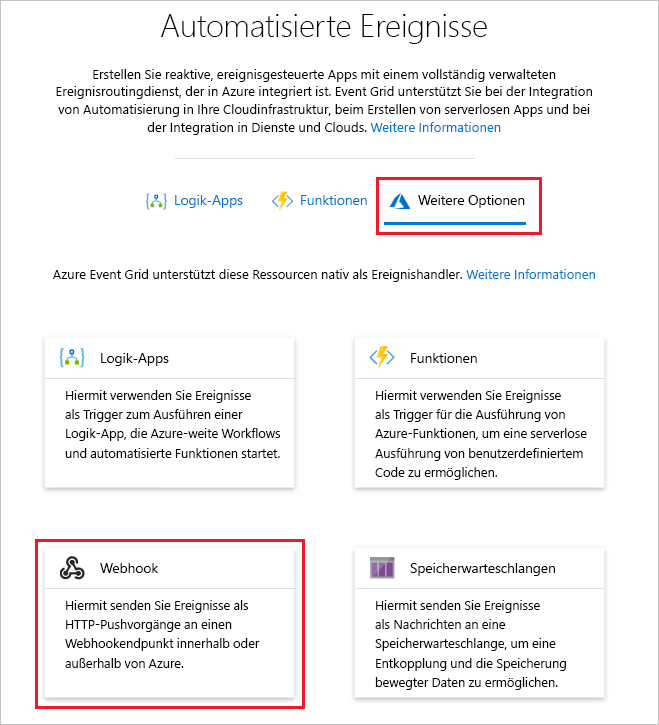

1. In das Ereignisabonnement wurden die Werte für Ihren Blobspeicher bereits eingefügt. Geben Sie für den Webhookendpunkt die URL Ihrer Web-App an, und fügen Sie `api/updates` der URL der Startseite hinzu. Geben Sie Ihrem Abonnement einen Namen. Wählen Sie abschließend die Option **Erstellen**.

   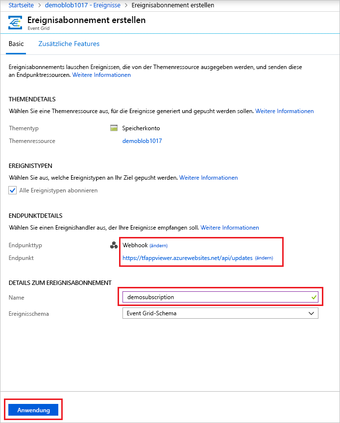

1. Zeigen Sie wieder Ihre Web-App an. Wie Sie sehen, wurde ein Abonnementüberprüfungsereignis an sie gesendet. Klicken Sie auf das Augensymbol, um die Ereignisdaten zu erweitern. Event Grid sendet das Überprüfungsereignis, damit der Endpunkt bestätigen kann, dass er Ereignisdaten empfangen möchte. Die Web-App enthält Code zur Überprüfung des Abonnements.

   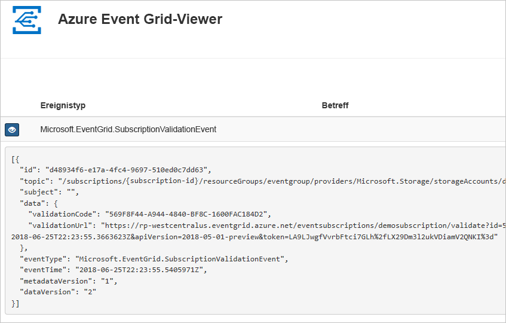

Als Nächstes lösen wir ein Ereignis aus, um zu sehen, wie Event Grid die Nachricht an Ihren Endpunkt weiterleitet.

## <a name="send-an-event-to-your-endpoint"></a>Senden eines Ereignisses an Ihren Endpunkt

Sie lösen ein Ereignis für den Blobspeicher aus, indem Sie eine Datei hochladen. Für die Datei ist kein spezifischer Inhalt erforderlich. In den Artikeln wird davon ausgegangen, dass Sie über eine Datei mit dem Namen „testfile.txt“ verfügen, aber Sie können eine beliebige Datei verwenden.

1. Wählen Sie für Ihren Blobspeicher die Option **Blobs**.

   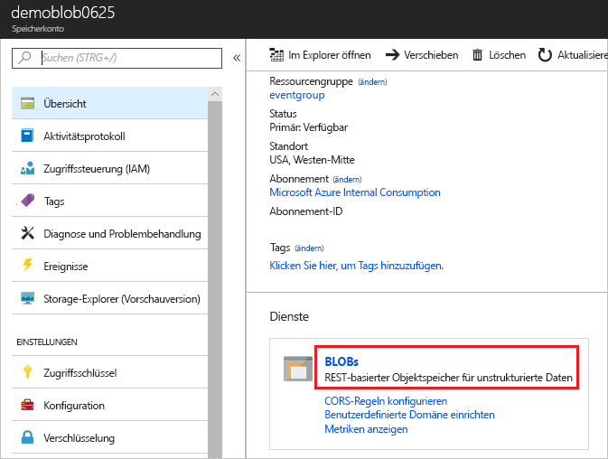

1. Wählen Sie **+ Container** aus. Geben Sie Ihrem Container einen Namen, und verwenden Sie eine beliebige Zugriffsebene.

   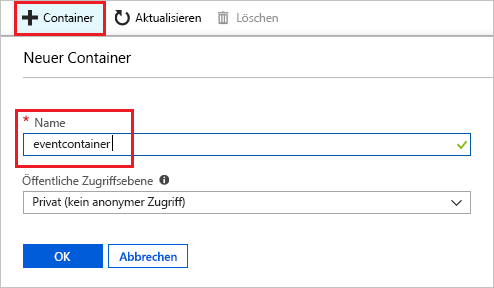

1. Wählen Sie Ihren neuen Container aus.

   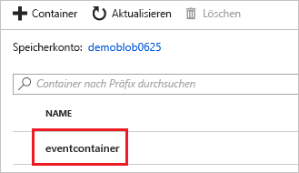

1. Wählen Sie die Option **Hochladen**, um eine Datei hochzuladen.

   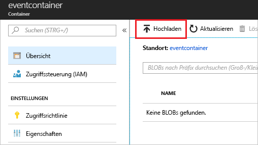

1. Navigieren Sie zu Ihrer Testdatei, und laden Sie sie hoch.

1. Sie haben das Ereignis ausgelöst, und Event Grid hat die Nachricht an den Endpunkt gesendet, den Sie beim Abonnieren konfiguriert haben. Zeigen Sie Ihre Web-App an, und verfolgen Sie, wie ein von einem Blob erstelltes Ereignis empfangen wird. 

  ```json
  {
    "topic": "/subscriptions/{subscription-id}/resourceGroups/eventgroup/providers/Microsoft.Storage/storageAccounts/demoblob0625",
    "subject": "/blobServices/default/containers/eventcontainer/blobs/testfile.txt",
    "eventType": "Microsoft.Storage.BlobCreated",
    "eventTime": "2018-06-25T22:50:41.1823131Z",
    "id": "89a2f9da-c01e-00bb-13d6-0c599506e4e3",
    "data": {
      "api": "PutBlockList",
      "clientRequestId": "41341a9b-e977-4a91-9000-c64125039047",
      "requestId": "89a2f9da-c01e-00bb-13d6-0c5995000000",
      "eTag": "0x8D5DAEE13C8F9ED",
      "contentType": "text/plain",
      "contentLength": 4,
      "blobType": "BlockBlob",
      "url": "https://demoblob0625.blob.core.windows.net/eventcontainer/testfile.txt",
      "sequencer": "00000000000000000000000000001C24000000000004712b",
      "storageDiagnostics": {
        "batchId": "ef633252-32fd-464b-8f5a-0d10d68885e6"
      }
    },
    "dataVersion": "",
    "metadataVersion": "1"
  }
  ```

## <a name="clean-up-resources"></a>Bereinigen von Ressourcen

Wenn Sie dieses Ereignis weiterverwenden möchten, können Sie die Bereinigung der in diesem Artikel erstellten Ressourcen überspringen. Löschen Sie andernfalls die Ressourcen, die Sie in diesem Artikel erstellt haben.

Wählen Sie die Ressourcengruppe aus, und klicken Sie auf **Ressourcengruppe löschen**.

## <a name="next-steps"></a>Nächste Schritte

Sie haben gelernt, wie Sie benutzerdefinierte Themen und Ereignisabonnements erstellen. Nun können Sie sich ausführlicher darüber informieren, welche Möglichkeiten Event Grid bietet:

- [Einführung in Azure Event Grid](overview.md)
- [Weiterleiten von Blob Storage-Ereignissen an einen benutzerdefinierten Webendpunkt](../storage/blobs/storage-blob-event-quickstart.md?toc=%2fazure%2fevent-grid%2ftoc.json)
- [Überwachen von Änderungen an virtuellen Computern mit Azure Event Grid und Logic Apps](monitor-virtual-machine-changes-event-grid-logic-app.md)
- [Streamen von Big Data in ein Data Warehouse](event-grid-event-hubs-integration.md)
