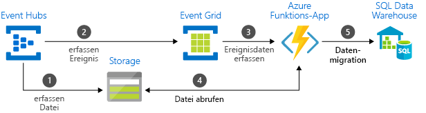

# Wählen zwischen Azure-Diensten für die Nachrichtenübermittlung

Azure bietet drei Dienste, die Sie bei der Übermittlung von Ereignisnachrichten innerhalb einer Lösung unterstützen. Folgende Dienste stehen zur Verfügung:

* [Event Grid](/azure/event-grid/)
* [Event Hubs](/azure/event-hubs/)
* [Service Bus](/azure/service-bus-messaging/)

Trotz einiger Gemeinsamkeiten ist jeder dieser Dienste für bestimmte Szenarien konzipiert. Dieser Artikel beschreibt die Unterschiede zwischen den Diensten und unterstützt Sie bei der Wahl eines passenden Diensts für Ihre Anwendung. In vielen Fällen ergänzen sich die Messagingdienste gegenseitig und können zusammen verwendet werden.

## Gegenüberstellung von Ereignis- und Nachrichtendiensten

Zwischen Diensten, die ein Ereignis übermitteln, und Diensten, die eine Nachricht übermitteln, besteht ein wichtiger Unterschied.

### Ereignis

Ein Ereignis ist eine einfache Benachrichtigung über eine Bedingung oder eine Zustandsänderung. Der Verleger des Ereignisses hat keine Erwartungen hinsichtlich der Behandlung des Ereignisses. Der Consumer des Ereignisses entscheidet, was mit der Benachrichtigung getan wird. Ereignisse können eigenständige Einheiten oder Teil einer Reihe sein.

Eigenständige Ereignisse geben Statusänderungen an und erfordern Aktionen. Um den nächsten Schritt zu machen, muss der Consumer nur zu wissen, dass etwas passiert ist. Die Ereignisdaten geben Aufschluss darüber, was geschehen ist, enthalten aber nicht die Daten, die das Ereignis ausgelöst haben. Ein Ereignis kann beispielsweise Consumer darüber informieren, dass eine Datei erstellt wurde. Das Ereignis kann allgemeine Informationen zu der Datei enthalten, aber nicht die eigentliche Datei. Eigenständige Ereignisse eignen sich ideal für serverlose Lösungen, die skaliert werden müssen.

Reihenereignisse geben eine Bedingung an und können analysiert werden. Die Ereignisse sind nach Zeit sortiert und voneinander abhängig. Der Consumer benötigt die sortierte Reihe von Ereignissen, um zu analysieren, was passiert ist.

### Message

Bei einer Nachricht handelt es sich um Rohdaten, die von einem Dienst erzeugt wurden und für die Nutzung oder Speicherung an anderer Stelle vorgesehen sind. Die Nachricht enthält die Daten, die die Nachrichtenpipeline ausgelöst haben. Der Verleger der Nachricht hat eine Erwartung dazu, wie der Consumer die Nachricht verarbeitet. Ein Vertrag besteht zwischen den beiden Seiten. Beispiel: Der Verleger sendet eine Nachricht mit den Rohdaten und erwartet, dass der Consumer eine Datei aus den Daten erstellt und eine Antwort sendet, wenn die Arbeit abgeschlossen ist.

## Vergleich von Diensten

| Dienst | Zweck | Typ | Einsatzgebiete |
| ------- | ------- | ---- | ----------- |
| Event Grid | Reaktive Programmierung | Ereignisverteilung (eigenständig) | Reagieren auf Statusänderungen |
| Event Hubs | Big Data-Pipeline | Ereignisstreaming (Reihe) | Streamen von Telemetriedaten und verteilten Daten |
| Service Bus | Hochwertiges Unternehmensmessaging | Message | Auftragsverarbeitung und Finanztransaktionen |

### Event Grid

Event Grid ist ein Ereignisbackplane, das ereignisgesteuerte, reaktive Programmierung ermöglicht. Es verwendet ein Veröffentlichen-Abonnieren-Modell. Verleger geben Ereignisse aus, haben aber keinen Einfluss darauf, welche Ereignisse behandelt werden. Abonnenten entscheiden, welche Ereignisse sie behandeln möchten.

Event Grid ist tief in Azure-Dienste integriert und kann in Drittanbieterdienste integriert werden. Es vereinfacht die Nutzung von Ereignissen und senkt Kosten, da nicht ständig Abfragen durchgeführt werden müssen. Event Grid leitet effizient und zuverlässig Ereignisse von Azure-eigenen und Azure-fremden Ressourcen weiter. Die Ereignisse werden an registrierte Abonnentenendpunkte verteilt. Die Ereignismeldung enthält die Informationen, die Sie benötigen, um auf Änderungen in Diensten und Anwendungen zu reagieren. Event Grid ist keine Datenpipeline und übermittelt nicht das eigentliche Objekt, das aktualisiert wurde.

Merkmale:

* Dynamisch skalierbar
* Geringe Kosten
* Serverlos

### Event Hubs

Azure Event Hubs ist eine Big Data-Pipeline. Es vereinfacht die Erfassung, Aufbewahrung und Wiedergabe von Telemetrie- und Ereignisdatenstromdaten. Die Daten können aus vielen parallelen Quellen stammen. Mit Event Hubs können Telemetrie- und Ereignisdaten für eine Vielzahl von datenstromverarbeitenden Infrastrukturen und Analysediensten verfügbar gemacht werden. Die Daten sind entweder als Datenströme oder als gebündelte Ereignisbatches verfügbar. Dieser Dienst bietet eine Einzellösung zum schnellen Abrufen von Daten für die Verarbeitung in Echtzeit sowie für die wiederholte Wiedergabe gespeicherter Rohdaten. Er kann die Streamingdaten zur Verarbeitung und Analyse in einer Datei erfassen.

Merkmale:

* Geringe Wartezeit
* Empfang und Verarbeitung von Millionen von Ereignissen pro Sekunde möglich

### Service Bus

Service Bus ist für traditionelle Unternehmensanwendungen konzipiert. Für diese Unternehmensanwendungen werden Transaktionen, Sortierfunktionen, Duplikaterkennung und umgehende Konsistenz benötigt. Mit Service Bus können native Cloudanwendungen eine zuverlässige Zustandsübergangsverwaltung für Geschäftsprozesse bereitstellen. Nutzen Sie Azure Service Bus bei Verwendung wichtiger Nachrichten, die nicht verloren gehen oder dupliziert werden dürfen. Service Bus ermöglicht auch eine äußerst sichere Kommunikation über Hybrid Cloud-Lösungen hinweg und kann vorhandene lokale Systeme mit Cloudlösungen verbinden.

Service Bus ist ein System für Brokermessaging. Es speichert Nachrichten in einem „Broker“ (z. B. in einer Warteschlange), bis die Empfängerseite für den Empfang der Nachrichten bereit ist.

Merkmale:

* Zuverlässige asynchrone Nachrichtenübermittlung (abfragebasiertes Enterprise Messaging-as-a-Service)
* Erweiterte Messagingfeatures wie FIFO, Batchverarbeitung/Sitzungen, Transaktionen, unzustellbare Nachrichten, zeitliche Steuerung, Routing und Filterung sowie Duplikaterkennung

## Gemeinsame Verwendung der Dienste

In manchen Fällen werden Dienste parallel verwendet, um bestimmte Rollen zu erfüllen. Eine E-Commerce-Website kann beispielsweise mit Service Bus Bestellungen verarbeiten, mit Event Hubs Telemetriedaten der Website erfassen und mit Event Grid auf Ereignisse wie etwa den Versand eines Artikels reagieren.

In anderen Fällen können die Dienste zu einer Ereignis- und Datenpipeline verknüpft werden. Event Grid wird verwendet, um auf Ereignisse in den anderen Diensten zu reagieren. Ein Beispiel, bei dem Daten mithilfe von Event Grid und Event Hubs in ein Data Warehouse migriert werden, finden Sie unter [Streamen von Big Data in ein Data Warehouse](event-grid-event-hubs-integration.md). Die folgende Abbildung zeigt den Workflow zum Streamen der Daten:

## Nächste Schritte

* Weitere Informationen zu den Azure-Messagingdiensten finden Sie im Blogbeitrag [Events, Data Points, and Messages - Choosing the right Azure messaging service for your data](https://azure.microsoft.com/blog/events-data-points-and-messages-choosing-the-right-azure-messaging-service-for-your-data/) (Ereignisse, Datenpunkte und Nachrichten: Der passende Azure-Messagingdienst für Ihre Daten).
* Eine Einführung in Event Grid finden Sie unter [Informationen zu Event Grid](overview.md).
* Informationen zu den ersten Schritten mit Event Grid finden Sie unter [Erstellen und Weiterleiten benutzerdefinierter Ereignisse mit Azure CLI und Event Grid](custom-event-quickstart.md).
* Informationen zu den ersten Schritten mit Event Hubs finden Sie unter [Erstellen eines Event Hubs-Namespace und eines Event Hubs mithilfe des Azure-Portals](../event-hubs/event-hubs-create.md).
* Informationen zu den ersten Schritten mit Service Bus finden Sie unter [Erstellen eines Service Bus-Namespace mithilfe des Azure-Portals](../service-bus-messaging/service-bus-create-namespace-portal.md).