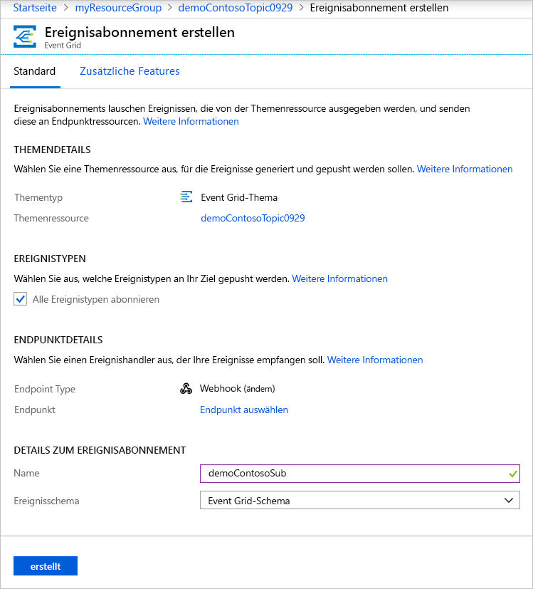

# <a name="create-and-route-custom-events-with-the-azure-portal-and-event-grid"></a>Erstellen und Weiterleiten benutzerdefinierter Ereignisse mit dem Azure Portal und Event Grid

Azure Event Grid ist ein Ereignisdienst für die Cloud. In diesem Artikel erstellen Sie über das Azure-Portal ein benutzerdefiniertes Thema, abonnieren dieses Thema und lösen das Ereignis aus, um das Ergebnis anzuzeigen. Ereignisse werden üblicherweise an einen Endpunkt gesendet, der auf das Ereignis reagiert (beispielsweise ein Webhook oder eine Azure-Funktion). Der Einfachheit halber senden wir die Ereignisse in diesem Artikel allerdings an eine URL, die die Nachrichten lediglich sammelt. Diese URL wird mithilfe eines Open Source-Drittanbietertools namens [RequestBin](https://requestb.in/) erstellt.

>[!NOTE]
>**RequestBin** ist ein Open-Source-Tool, das nicht für hohen Durchsatz konzipiert ist. Die Verwendung des Tools dient lediglich zur Veranschaulichung. Wenn Sie gleichzeitig mehrere Ereignisse pushen, werden möglicherweise nicht alle Ereignisse im Tool angezeigt.

Nach Abschluss des Vorgangs sehen Sie, dass die Ereignisdaten an einen Endpunkt gesendet wurden.


[!INCLUDE [quickstarts-free-trial-note.md](../../includes/quickstarts-free-trial-note.md)]

## <a name="create-a-resource-group"></a>Erstellen einer Ressourcengruppe

Event Grid-Themen sind Azure-Ressourcen und müssen in einer Azure-Ressourcengruppe platziert werden. Die Azure-Ressourcengruppe ist eine logische Sammlung, in der Azure-Ressourcen bereitgestellt und verwaltet werden.

1. Klicken Sie im linken Navigationsbereich auf **Ressourcengruppen**. Klicken Sie anschließend auf **Hinzufügen**.

   

1. Legen Sie den Namen der Ressourcengruppe auf *gridResourceGroup* und den Standort auf *westus2* fest. Klicken Sie auf **Erstellen**.

   

## <a name="create-a-custom-topic"></a>Erstellen eines benutzerdefinierten Themas

Ein Thema bietet einen benutzerdefinierten Endpunkt für die Veröffentlichung Ihrer Ereignisse. 

1. Klicken Sie zum Erstellen eines Themas in der Ressourcengruppe auf **Weitere Dienste**, und suchen Sie nach *Event Grid*. Wählen Sie die Option **Event Grid-Themen** aus.

   

1. Wählen Sie **Hinzufügen**.

   

1. Geben Sie einen Namen für das Thema an. Der Name des Themas muss eindeutig sein, da er durch einen DNS-Eintrag dargestellt wird. In der Vorschauversion unterstützt Event Grid die Standorte **westus2** und **westcentralus**. Wählen Sie die Ressourcengruppe aus, die Sie zuvor erstellt haben. Klicken Sie auf **Erstellen**.

   

1. Klicken Sie nach Erstellung des Themas auf **Aktualisieren**, damit das Thema angezeigt wird.

   

## <a name="create-a-message-endpoint"></a>Erstellen eines Nachrichtenendpunkts

Vor dem Abonnieren des Themas erstellen wir zunächst den Endpunkt für die Ereignisnachricht. Wir schreiben allerdings keinen Code, um eine Reaktion auf das Ereignis auszulösen, sondern erstellen einen Endpunkt, der die Nachrichten sammelt, damit Sie sie anzeigen können. RequestBin ist ein Open Source-Drittanbietertool, mit dem Sie einen Endpunkt erstellen und Anforderungen anzeigen können, die an ihn gesendet werden. Wechseln Sie zu [RequestBin](https://requestb.in/), und klicken Sie auf **Create a RequestBin** (RequestBin erstellen).  Kopieren Sie die Bin-URL. Sie wird zum Abonnieren des Themas benötigt.

## <a name="subscribe-to-a-topic"></a>Abonnieren eines Themas

Sie abonnieren ein Thema, um Event Grid mitzuteilen, welche Ereignisse Sie nachverfolgen möchten. 

1. Klicken Sie zum Erstellen eines Event Grid-Abonnements erneut auf **Weitere Dienste**, und suchen Sie nach *Event Grid*. Wählen Sie die Option **Event Grid-Abonnements** aus.

   

1. Klicken Sie auf **+ Ereignisabonnement**.

   

1. Geben Sie einen eindeutigen Namen für Ihr Ereignisabonnement an. Wählen Sie für den Thementyp die Option **Event Grid-Themen** aus. Wählen Sie für diese Instanz das benutzerdefinierte Thema aus, das Sie erstellt haben. Geben Sie als Endpunkt für die Ereignisbenachrichtigung die URL aus RequestBin an. Klicken Sie nach Angabe der Werte auf **OK**.

   

Als Nächstes lösen wir ein Ereignis aus, um zu sehen, wie Event Grid die Nachricht an Ihren Endpunkt weiterleitet. Verwenden Sie zur Vereinfachung dieses Artikels Cloud Shell, um Beispielereignisdaten an das Thema zu senden. Üblicherweise werden die Ereignisdaten von einer Anwendung oder einem Azure-Dienst gesendet.

[!INCLUDE [cloud-shell-try-it.md](../../includes/cloud-shell-try-it.md)]

## <a name="send-an-event-to-your-topic"></a>Senden eines Ereignisses an Ihr Thema

Zunächst rufen wir die URL und den Schlüssel für das Thema ab. Verwenden Sie Ihren Themennamen für `<topic_name>`.

```azurecli-interactive
endpoint=$(az eventgrid topic show --name <topic_name> -g gridResourceGroup --query "endpoint" --output tsv)
key=$(az eventgrid topic key list --name <topic_name> -g gridResourceGroup --query "key1" --output tsv)
```

Im folgenden Beispiel werden Beispielereignisdaten abgerufen:

```azurecli-interactive
body=$(eval echo "'$(curl https://raw.githubusercontent.com/Azure/azure-docs-json-samples/master/event-grid/customevent.json)'")
```

Mithilfe von `echo "$body"` können Sie das vollständige Ereignis anzeigen. Bei dem `data`-Element des JSON-Codes handelt es sich um die Nutzlast Ihres Ereignisses. Für dieses Feld kann ein beliebiger wohlgeformter JSON-Code verwendet werden. Sie können auch das Betrefffeld zur erweiterten Weiterleitung und Filterung verwenden.

CURL ist ein Hilfsprogramm zum Ausführen von HTTP-Anforderungen. In diesem Artikel verwenden wir CURL, um das Ereignis an unser Thema zu senden. 

```azurecli-interactive
curl -X POST -H "aeg-sas-key: $key" -d "$body" $endpoint
```

Sie haben das Ereignis ausgelöst, und Event Grid hat die Nachricht an den Endpunkt gesendet, den Sie beim Abonnieren konfiguriert haben. Navigieren Sie zu der zuvor erstellten RequestBin-URL. Oder klicken Sie im geöffneten RequestBin-Browser auf die Option zum Aktualisieren. Das soeben gesendete Ereignis wird angezeigt.

```json
[{
  "id": "1807",
  "eventType": "recordInserted",
  "subject": "myapp/vehicles/motorcycles",
  "eventTime": "2017-08-10T21:03:07+00:00",
  "data": {
    "make": "Ducati",
    "model": "Monster"
  },
  "topic": "/subscriptions/{subscription-id}/resourceGroups/{resource-group}/providers/Microsoft.EventGrid/topics/{topic}"
}]
```

## <a name="clean-up-resources"></a>Bereinigen von Ressourcen

Wenn Sie dieses Ereignis weiterverwenden möchten, überspringen Sie die Bereinigung der in diesem Artikel erstellten Ressourcen. Löschen Sie andernfalls die in diesem Artikel erstellten Ressourcen.

Wählen Sie die Ressourcengruppe aus, und klicken Sie auf **Ressourcengruppe löschen**.

## <a name="next-steps"></a>Nächste Schritte

Sie haben gelernt, wie Sie Themen und Ereignisabonnements erstellen. Nun können Sie sich ausführlicher darüber informieren, welche Möglichkeiten Event Grid bietet:

- [An introduction to Azure Event Grid](overview.md) (Einführung in Azure Event Grid)
- [Weiterleiten von Blob Storage-Ereignissen an einen benutzerdefinierten Webendpunkt](../storage/blobs/storage-blob-event-quickstart.md?toc=%2fazure%2fevent-grid%2ftoc.json)
- [Monitor virtual machine changes with Azure Event Grid and Logic Apps](monitor-virtual-machine-changes-event-grid-logic-app.md) (Überwachen von Änderungen an virtuellen Computer mit Azure Event Grid und Logic Apps)
- [Streamen von Big Data in ein Data Warehouse](event-grid-event-hubs-integration.md)
