# <a name="create-and-route-custom-events-with-the-azure-portal-and-event-grid"></a>Erstellen und Weiterleiten benutzerdefinierter Ereignisse mit dem Azure Portal und Event Grid

Azure Event Grid ist ein Ereignisdienst für die Cloud. In diesem Artikel erstellen Sie über das Azure-Portal ein benutzerdefiniertes Thema, abonnieren dieses Thema und lösen das Ereignis aus, um das Ergebnis anzuzeigen. Sie senden das Ereignis an eine Azure-Funktion, mit der die Ereignisdaten protokolliert werden. Nach Abschluss des Vorgangs sehen Sie, dass die Ereignisdaten an einen Endpunkt gesendet und protokolliert wurden.

[!INCLUDE [quickstarts-free-trial-note.md](../../includes/quickstarts-free-trial-note.md)]

## <a name="create-a-custom-topic"></a>Erstellen eines benutzerdefinierten Themas

Ein Event Grid-Thema verfügt über einen benutzerdefinierten Endpunkt für die Veröffentlichung Ihrer Ereignisse. 

1. Melden Sie sich beim [Azure-Portal](https://portal.azure.com/) an.

1. Wählen Sie zum Erstellen eines benutzerdefinierten Themas die Option **Ressource erstellen**. 

   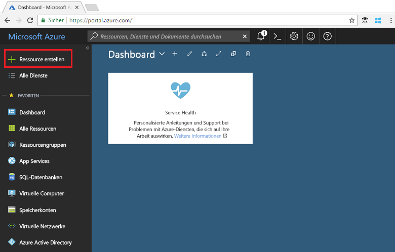

1. Suchen Sie nach *Event Grid-Thema*, und wählen Sie diese Option aus den verfügbaren Optionen aus.

   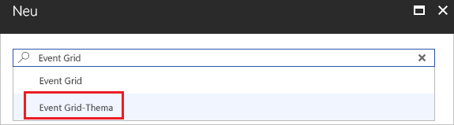

1. Klicken Sie auf **Erstellen**.

   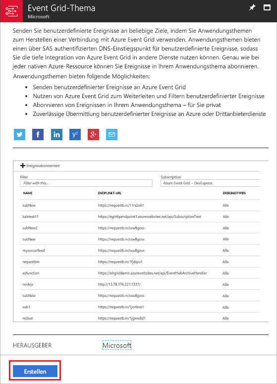

1. Geben Sie einen eindeutigen Namen für das benutzerdefinierte Thema an. Der Name des Themas muss eindeutig sein, da er durch einen DNS-Eintrag dargestellt wird. Verwenden Sie nicht den Namen, der in der Abbildung zu sehen ist. Erstellen Sie stattdessen einen eigenen Namen. Wählen Sie eine der [unterstützten Regionen](overview.md) aus. Geben Sie einen Namen für die Ressourcengruppe an. Klicken Sie auf **Erstellen**.

   

1. Nachdem das benutzerdefinierte Thema erstellt wurde, erhalten Sie eine entsprechende Benachrichtigung.

   

   Falls die Bereitstellung nicht erfolgreich war, können Sie die Ursache des Fehlers ermitteln. Wählen Sie **Fehler bei der Bereitstellung**.

   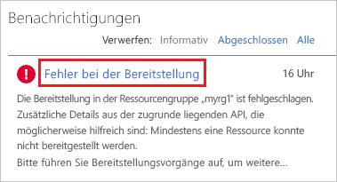

   Wählen Sie die Fehlermeldung aus.

   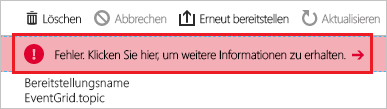

   In der folgenden Abbildung ist eine Bereitstellung dargestellt, die fehlgeschlagen ist, weil der Name für das benutzerdefinierte Thema bereits verwendet wird. Wenn dieser Fehler angezeigt wird, sollten Sie versuchen, die Bereitstellung mit einem anderen Namen erneut durchzuführen.

   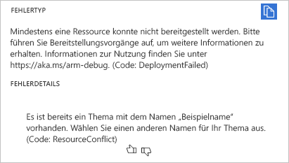

## <a name="create-an-azure-function"></a>Erstellen einer Azure Function

Vor dem Abonnieren des Themas erstellen wir zunächst den Endpunkt für die Ereignisnachricht. In diesem Artikel verwenden Sie Azure Functions, um eine Funktions-App für den Endpunkt zu erstellen.

1. Wählen Sie zum Erstellen einer Funktion die Option **Ressource erstellen**.

   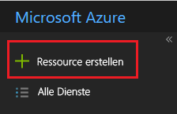

1. Wählen Sie **Compute** und dann **Funktionen-App**.

   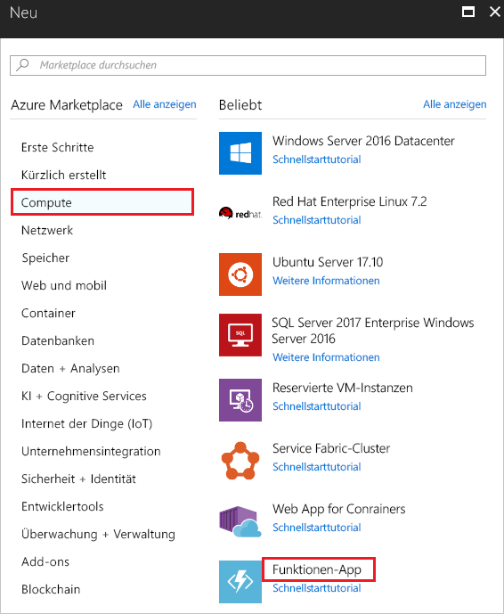

1. Geben Sie einen eindeutigen Namen für die Azure-Funktion an. Verwenden Sie nicht den Namen, der in der Abbildung zu sehen ist. Wählen Sie die Ressourcengruppe aus, die Sie in diesem Artikel erstellt haben. Verwenden Sie als Hostingplan die Option **Verbrauchstarif**. Verwenden Sie das vorgeschlagene neue Speicherkonto. Sie können Application Insights abschalten. Wählen Sie nach dem Angeben der Werte die Option **Erstellen**.

   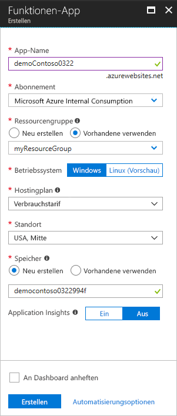

1. Wählen Sie nach Abschluss der Bereitstellung die Option **Zu Ressource wechseln**.

   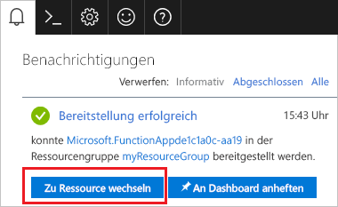

1. Wählen Sie neben **Funktionen** das Pluszeichen (**+**).

   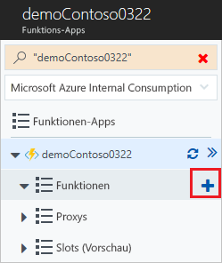

1. Wählen Sie aus den verfügbaren Optionen die Option **Benutzerdefinierte Funktion**.

   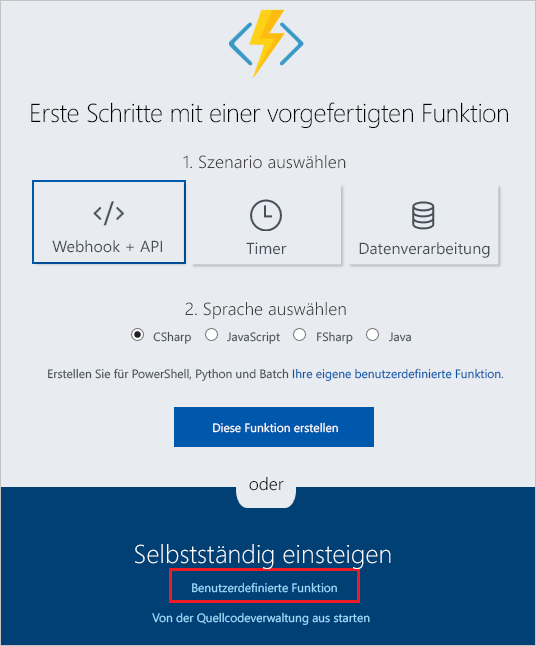

1. Scrollen Sie nach unten bis zu **Event Grid-Trigger**. Wählen Sie **C#**.

   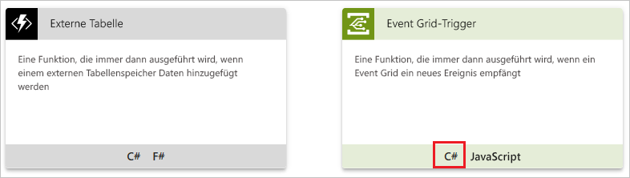

1. Übernehmen Sie die Standardwerte, und wählen Sie **Erstellen**.

   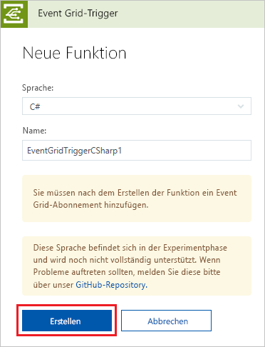

Die Funktion ist jetzt bereit zum Empfangen von Ereignissen.

## <a name="subscribe-to-a-topic"></a>Abonnieren eines Themas

Sie abonnieren ein Thema, um Event Grid mitzuteilen, welche Ereignisse Sie nachverfolgen möchten und wohin diese gesendet werden sollen.

1. Wählen Sie in Ihrer Azure-Funktion die Option **Event Grid-Abonnement hinzufügen**.

   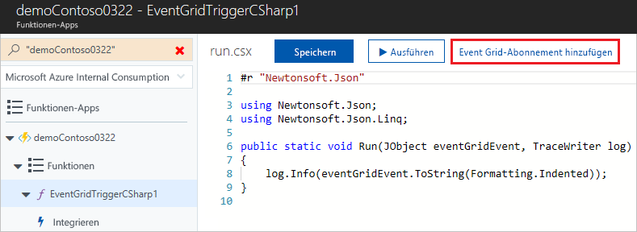

1. Geben Sie Werte für das Abonnement an. Wählen Sie als Thementyp die Option **Event Grid-Themen**. Wählen Sie als Abonnement und Ressourcengruppe das Abonnement und die Ressourcengruppe aus, die Sie beim Erstellen Ihres benutzerdefinierten Themas verwendet haben. Wählen Sie beispielsweise den Namen Ihres benutzerdefinierten Themas aus. Für den Abonnentenendpunkt ist die URL für die Funktion bereits angegeben.

   

1. Öffnen Sie vor dem Auslösen des Ereignisses die Protokolle für die Funktion, damit Sie die Ereignisdaten sehen, wenn diese gesendet werden. Wählen Sie unten in Ihrer Azure-Funktion die Option **Protokolle**.

   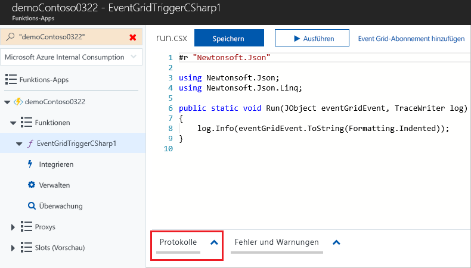

Als Nächstes lösen wir ein Ereignis aus, um zu sehen, wie Event Grid die Nachricht an Ihren Endpunkt weiterleitet. Verwenden Sie zur Vereinfachung dieses Artikels Cloud Shell, um Beispielereignisdaten an das benutzerdefinierte Thema zu senden. Üblicherweise werden die Ereignisdaten von einer Anwendung oder einem Azure-Dienst gesendet.

[!INCLUDE [cloud-shell-try-it.md](../../includes/cloud-shell-try-it.md)]

## <a name="send-an-event-to-your-topic"></a>Senden eines Ereignisses an Ihr Thema

Verwenden Sie die Azure-Befehlszeilenschnittstelle oder PowerShell, um ein Testereignis an Ihr benutzerdefiniertes Thema zu senden.

Im ersten Beispiel wird die Azure-Befehlszeilenschnittstelle verwendet. Es ruft die URL und den Schlüssel für das Thema sowie Beispielereignisdaten ab. Verwenden Sie Ihren Themennamen für `<topic_name>`. Verwenden Sie `echo "$body"`, um das vollständige Ereignis anzuzeigen. Bei dem `data`-Element des JSON-Codes handelt es sich um die Nutzlast Ihres Ereignisses. Für dieses Feld kann ein beliebiger wohlgeformter JSON-Code verwendet werden. Sie können auch das Betrefffeld zur erweiterten Weiterleitung und Filterung verwenden. CURL ist ein Hilfsprogramm zum Senden von HTTP-Anforderungen.

```azurecli-interactive
endpoint=$(az eventgrid topic show --name <topic_name> -g myResourceGroup --query "endpoint" --output tsv)
key=$(az eventgrid topic key list --name <topic_name> -g myResourceGroup --query "key1" --output tsv)

body=$(eval echo "'$(curl https://raw.githubusercontent.com/Azure/azure-docs-json-samples/master/event-grid/customevent.json)'")

curl -X POST -H "aeg-sas-key: $key" -d "$body" $endpoint
```

Im zweiten Beispiel werden ähnliche Schritte mit PowerShell ausgeführt.

```azurepowershell-interactive
$endpoint = (Get-AzureRmEventGridTopic -ResourceGroupName gridResourceGroup -Name <topic-name>).Endpoint
$keys = Get-AzureRmEventGridTopicKey -ResourceGroupName gridResourceGroup -Name <topic-name>

$eventID = Get-Random 99999

#Date format should be SortableDateTimePattern (ISO 8601)
$eventDate = Get-Date -Format s

#Construct body using Hashtable
$htbody = @{
    id= $eventID
    eventType="recordInserted"
    subject="myapp/vehicles/motorcycles"
    eventTime= $eventDate   
    data= @{
        make="Ducati"
        model="Monster"
    }
    dataVersion="1.0"
}

#Use ConvertTo-Json to convert event body from Hashtable to JSON Object
#Append square brackets to the converted JSON payload since they are expected in the event's JSON payload syntax
$body = "["+(ConvertTo-Json $htbody)+"]"

Invoke-WebRequest -Uri $endpoint -Method POST -Body $body -Headers @{"aeg-sas-key" = $keys.Key1}
```

Sie haben das Ereignis ausgelöst, und Event Grid hat die Nachricht an den Endpunkt gesendet, den Sie beim Abonnieren konfiguriert haben. Sehen Sie sich die Protokolle an, um die Ereignisdaten anzuzeigen.

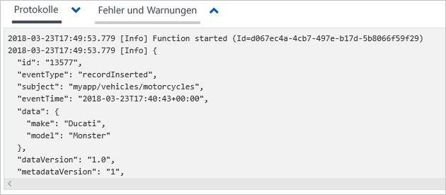

## <a name="clean-up-resources"></a>Bereinigen von Ressourcen

Wenn Sie dieses Ereignis weiterverwenden möchten, können Sie die Bereinigung der in diesem Artikel erstellten Ressourcen überspringen. Löschen Sie andernfalls die Ressourcen, die Sie in diesem Artikel erstellt haben.

Wählen Sie die Ressourcengruppe aus, und klicken Sie auf **Ressourcengruppe löschen**.

## <a name="next-steps"></a>Nächste Schritte

Sie haben gelernt, wie Sie benutzerdefinierte Themen und Ereignisabonnements erstellen. Nun können Sie sich ausführlicher darüber informieren, welche Möglichkeiten Event Grid bietet:

- [An introduction to Azure Event Grid](overview.md) (Einführung in Azure Event Grid)
- [Weiterleiten von Blob Storage-Ereignissen an einen benutzerdefinierten Webendpunkt](../storage/blobs/storage-blob-event-quickstart.md?toc=%2fazure%2fevent-grid%2ftoc.json)
- [Monitor virtual machine changes with Azure Event Grid and Logic Apps](monitor-virtual-machine-changes-event-grid-logic-app.md) (Überwachen von Änderungen an virtuellen Computer mit Azure Event Grid und Logic Apps)
- [Streamen von Big Data in ein Data Warehouse](event-grid-event-hubs-integration.md)
