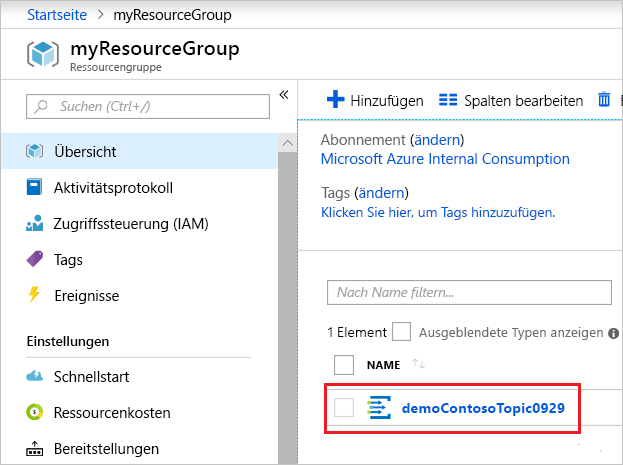

# <a name="quickstart-route-custom-events-to-web-endpoint-with-the-azure-portal-and-event-grid"></a>Schnellstart: Weiterleiten benutzerdefinierter Ereignisse an einen Webendpunkt mit dem Azure Portal und Event Grid

Azure Event Grid ist ein Ereignisdienst für die Cloud. In diesem Artikel erstellen Sie über das Azure-Portal ein benutzerdefiniertes Thema, abonnieren dieses benutzerdefinierte Thema und lösen das Ereignis zum Anzeigen des Ergebnisses aus. Üblicherweise senden Sie Ereignisse an einen Endpunkt, der die Ereignisdaten verarbeitet und entsprechende Aktionen ausführt. Der Einfachheit halber senden Sie die Ereignisse in diesem Artikel allerdings an eine Web-App, die die Nachrichten sammelt und anzeigt.

Am Ende sehen Sie, dass die Ereignisdaten an die Web-App gesendet wurden.


[!INCLUDE [quickstarts-free-trial-note.md](../../includes/quickstarts-free-trial-note.md)]

[!INCLUDE [event-grid-register-provider-portal.md](../../includes/event-grid-register-provider-portal.md)]

## <a name="create-a-custom-topic"></a>Erstellen eines benutzerdefinierten Themas

Ein Event Grid-Thema verfügt über einen benutzerdefinierten Endpunkt für die Veröffentlichung Ihrer Ereignisse. 

1. Melden Sie sich beim [Azure-Portal](https://portal.azure.com/)an.

1. Wählen Sie zum Erstellen eines benutzerdefinierten Themas die Option **Ressource erstellen**. 

   

1. Suchen Sie nach *Event Grid-Thema*, und wählen Sie diese Option aus den verfügbaren Optionen aus.

   

1. Klicken Sie auf **Erstellen**.

   

1. Geben Sie einen eindeutigen Namen für das benutzerdefinierte Thema an. Der Name des Themas muss eindeutig sein, da er durch einen DNS-Eintrag dargestellt wird. Verwenden Sie nicht den Namen, der in der Abbildung zu sehen ist. Erstellen Sie stattdessen einen eigenen Namen. Dieser muss zwischen drei und 50 Zeichen lang sein und darf nur folgende Zeichen enthalten: a–z, A–Z, 0–9 und Bindestriche (-). Geben Sie einen Namen für die Ressourcengruppe an. Klicken Sie auf **Erstellen**.

   

1. Nachdem das benutzerdefinierte Thema erstellt wurde, erhalten Sie eine entsprechende Benachrichtigung.

   

   Falls die Bereitstellung nicht erfolgreich war, können Sie die Ursache des Fehlers ermitteln. Wählen Sie **Fehler bei der Bereitstellung**.

   

   Wählen Sie die Fehlermeldung aus.

   

   In der folgenden Abbildung ist eine Bereitstellung dargestellt, die fehlgeschlagen ist, weil der Name für das benutzerdefinierte Thema bereits verwendet wird. Wenn dieser Fehler angezeigt wird, sollten Sie versuchen, die Bereitstellung mit einem anderen Namen erneut durchzuführen.

   

## <a name="create-a-message-endpoint"></a>Erstellen eines Nachrichtenendpunkts

Vor dem Abonnieren des benutzerdefinierten Themas erstellen wir zunächst den Endpunkt für die Ereignisnachricht. Der Endpunkt führt in der Regel Aktionen auf der Grundlage der Ereignisdaten aus. Der Einfachheit halber stellen Sie in dieser Schnellstartanleitung eine [vorgefertigte Web-App](https://github.com/Azure-Samples/azure-event-grid-viewer) bereit, die die Ereignisnachrichten anzeigt. Die bereitgestellte Lösung umfasst einen App Service-Plan, eine App Service-Web-App und Quellcode von GitHub.

1. Wählen Sie **Deploy to Azure** (In Azure bereitstellen), um die Lösung für Ihr Abonnement bereitzustellen. Geben Sie im Azure-Portal Werte für die Parameter an.

   <a href="https://portal.azure.com/#create/Microsoft.Template/uri/https%3A%2F%2Fraw.githubusercontent.com%2FAzure-Samples%2Fazure-event-grid-viewer%2Fmaster%2Fazuredeploy.json" target="_blank"></a>

1. Die Bereitstellung kann einige Minuten dauern. Nach erfolgreichem Abschluss der Bereitstellung können Sie Ihre Web-App anzeigen und sich vergewissern, dass sie ausgeführt wird. Navigieren Sie hierzu in einem Webbrowser zu `https://<your-site-name>.azurewebsites.net`.

1. Die Website wird angezeigt, aber es wurden noch keine Ereignisse bereitgestellt.

   

## <a name="subscribe-to-custom-topic"></a>Abonnieren eines benutzerdefinierten Themas

Sie abonnieren ein Event Grid-Thema, um Event Grid mitzuteilen, welche Ereignisse Sie nachverfolgen möchten und wohin diese gesendet werden sollen.

1. Wählen Sie im Portal Ihr benutzerdefiniertes Thema aus.

   

1. Klicken Sie auf **+ Ereignisabonnement**.

   

1. Wählen Sie als Endpunkttyp die Option **Webhook** aus. Geben Sie einen Namen für das Ereignisabonnement an.

   

1. Klicken Sie auf **Endpunkt auswählen**. 

1. Geben Sie für den Webhookendpunkt die URL Ihrer Web-App an, und fügen Sie `api/updates` der URL der Startseite hinzu. Klicken Sie auf **Auswahl bestätigen**.

   

1. Wenn Sie alle Werte für das Ereignisabonnement angegeben haben, klicken Sie auf **Erstellen**.

Zeigen Sie wieder Ihre Web-App an. Wie Sie sehen, wurde ein Abonnementüberprüfungsereignis an sie gesendet. Klicken Sie auf das Augensymbol, um die Ereignisdaten zu erweitern. Event Grid sendet das Überprüfungsereignis, damit der Endpunkt bestätigen kann, dass er Ereignisdaten empfangen möchte. Die Web-App enthält Code zur Überprüfung des Abonnements.


## <a name="send-an-event-to-your-topic"></a>Senden eines Ereignisses an Ihr Thema

Als Nächstes lösen wir ein Ereignis aus, um zu sehen, wie Event Grid die Nachricht an Ihren Endpunkt weiterleitet. Verwenden Sie die Azure-Befehlszeilenschnittstelle oder PowerShell, um ein Testereignis an Ihr benutzerdefiniertes Thema zu senden. Üblicherweise werden die Ereignisdaten von einer Anwendung oder einem Azure-Dienst gesendet.

Im ersten Beispiel wird die Azure-Befehlszeilenschnittstelle verwendet. Es ruft die URL und den Schlüssel für das benutzerdefinierte Thema sowie Beispielereignisdaten ab. Verwenden Sie für `<topic_name>` den Namen Ihres benutzerdefinierten Themas. Es werden Beispielereignisdaten erstellt. Bei dem `data`-Element des JSON-Codes handelt es sich um die Nutzlast Ihres Ereignisses. Für dieses Feld kann ein beliebiger wohlgeformter JSON-Code verwendet werden. Sie können auch das Betrefffeld zur erweiterten Weiterleitung und Filterung verwenden. CURL ist ein Hilfsprogramm zum Senden von HTTP-Anforderungen.

```azurecli-interactive
endpoint=$(az eventgrid topic show --name <topic_name> -g myResourceGroup --query "endpoint" --output tsv)
key=$(az eventgrid topic key list --name <topic_name> -g myResourceGroup --query "key1" --output tsv)

event='[ {"id": "'"$RANDOM"'", "eventType": "recordInserted", "subject": "myapp/vehicles/motorcycles", "eventTime": "'`date +%Y-%m-%dT%H:%M:%S%z`'", "data":{ "make": "Ducati", "model": "Monster"},"dataVersion": "1.0"} ]'

curl -X POST -H "aeg-sas-key: $key" -d "$event" $endpoint
```

Im zweiten Beispiel werden ähnliche Schritte mit PowerShell ausgeführt.

```azurepowershell-interactive
$endpoint = (Get-AzureRmEventGridTopic -ResourceGroupName gridResourceGroup -Name <topic-name>).Endpoint
$keys = Get-AzureRmEventGridTopicKey -ResourceGroupName gridResourceGroup -Name <topic-name>

$eventID = Get-Random 99999

#Date format should be SortableDateTimePattern (ISO 8601)
$eventDate = Get-Date -Format s

#Construct body using Hashtable
$htbody = @{
    id= $eventID
    eventType="recordInserted"
    subject="myapp/vehicles/motorcycles"
    eventTime= $eventDate   
    data= @{
        make="Ducati"
        model="Monster"
    }
    dataVersion="1.0"
}

#Use ConvertTo-Json to convert event body from Hashtable to JSON Object
#Append square brackets to the converted JSON payload since they are expected in the event's JSON payload syntax
$body = "["+(ConvertTo-Json $htbody)+"]"

Invoke-WebRequest -Uri $endpoint -Method POST -Body $body -Headers @{"aeg-sas-key" = $keys.Key1}
```

Sie haben das Ereignis ausgelöst, und Event Grid hat die Nachricht an den Endpunkt gesendet, den Sie beim Abonnieren konfiguriert haben. Zeigen Sie Ihre Web-App an, um das soeben gesendete Ereignis anzuzeigen.

```json
[{
  "id": "1807",
  "eventType": "recordInserted",
  "subject": "myapp/vehicles/motorcycles",
  "eventTime": "2017-08-10T21:03:07+00:00",
  "data": {
    "make": "Ducati",
    "model": "Monster"
  },
  "dataVersion": "1.0",
  "metadataVersion": "1",
  "topic": "/subscriptions/{subscription-id}/resourceGroups/{resource-group}/providers/Microsoft.EventGrid/topics/{topic}"
}]
```


## <a name="clean-up-resources"></a>Bereinigen von Ressourcen

Wenn Sie dieses Ereignis weiterverwenden möchten, können Sie die Bereinigung der in diesem Artikel erstellten Ressourcen überspringen. Löschen Sie andernfalls die Ressourcen, die Sie in diesem Artikel erstellt haben.

Wählen Sie die Ressourcengruppe aus, und klicken Sie auf **Ressourcengruppe löschen**.

## <a name="next-steps"></a>Nächste Schritte

Sie haben gelernt, wie Sie benutzerdefinierte Themen und Ereignisabonnements erstellen. Nun können Sie sich ausführlicher darüber informieren, welche Möglichkeiten Event Grid bietet:

- [Einführung in Azure Event Grid](overview.md)
- [Weiterleiten von Blob Storage-Ereignissen an einen benutzerdefinierten Webendpunkt](../storage/blobs/storage-blob-event-quickstart.md?toc=%2fazure%2fevent-grid%2ftoc.json)
- [Überwachen von Änderungen an virtuellen Computern mit Azure Event Grid und Logic Apps](monitor-virtual-machine-changes-event-grid-logic-app.md)
- [Streamen von Big Data in ein Data Warehouse](event-grid-event-hubs-integration.md)
