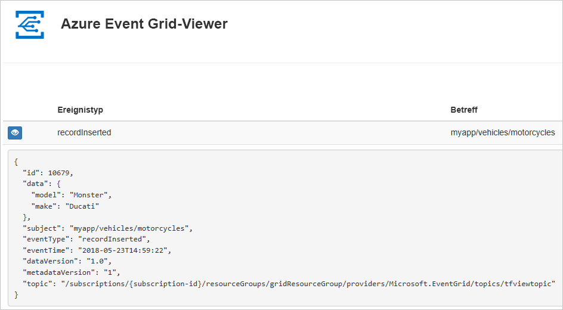
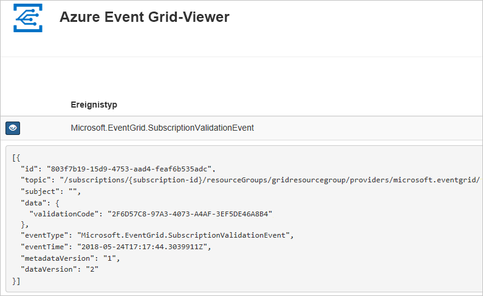

# <a name="quickstart-route-custom-events-to-web-endpoint-with-azure-cli-and-event-grid"></a>Schnellstart: Weiterleiten benutzerdefinierter Ereignisse an einen Webendpunkt mit Azure CLI und Event Grid

Azure Event Grid ist ein Ereignisdienst für die Cloud. In diesem Artikel erstellen Sie mithilfe der Azure-Befehlszeilenschnittstelle ein benutzerdefiniertes Thema, abonnieren dieses benutzerdefinierte Thema und lösen das Ereignis zum Anzeigen des Ergebnisses aus. Üblicherweise senden Sie Ereignisse an einen Endpunkt, der die Ereignisdaten verarbeitet und entsprechende Aktionen ausführt. Der Einfachheit halber senden Sie die Ereignisse in diesem Artikel allerdings an eine Web-App, die die Nachrichten sammelt und anzeigt.

Am Ende sehen Sie, dass die Ereignisdaten an die Web-App gesendet wurden.



[!INCLUDE [quickstarts-free-trial-note.md](../../includes/quickstarts-free-trial-note.md)]

[!INCLUDE [cloud-shell-try-it.md](../../includes/cloud-shell-try-it.md)]

Wenn Sie die Befehlszeilenschnittstelle lokal installieren und verwenden, müssen Sie für diesen Artikel mindestens die Version 2.0.24 der Azure-Befehlszeilenschnittstelle ausführen. Führen Sie `az --version` aus, um die Version zu finden. Informationen zum Durchführen einer Installation oder eines Upgrades finden Sei bei Bedarf unter [Installieren der Azure CLI](/cli/azure/install-azure-cli).

Falls Sie nicht Cloud Shell verwenden, müssen Sie sich zuerst mithilfe von `az login` anmelden.

## <a name="create-a-resource-group"></a>Erstellen einer Ressourcengruppe

Event Grid-Themen sind Azure-Ressourcen und müssen in einer Azure-Ressourcengruppe platziert werden. Die Azure-Ressourcengruppe ist eine logische Sammlung, in der Azure-Ressourcen bereitgestellt und verwaltet werden.

Erstellen Sie mit dem Befehl [az group create](/cli/azure/group#az-group-create) eine Ressourcengruppe. 

Das folgende Beispiel erstellt eine Ressourcengruppe namens *gridResourceGroup* am Standort *westus2*.

```azurecli-interactive
az group create --name gridResourceGroup --location westus2
```

[!INCLUDE [event-grid-register-provider-cli.md](../../includes/event-grid-register-provider-cli.md)]

## <a name="create-a-custom-topic"></a>Erstellen eines benutzerdefinierten Themas

Ein Event Grid-Thema verfügt über einen benutzerdefinierten Endpunkt für die Veröffentlichung Ihrer Ereignisse. Im folgenden Beispiel wird das benutzerdefinierte Thema in Ihrer Ressourcengruppe erstellt. Ersetzen Sie `<your-topic-name>` durch einen eindeutigen Namen für Ihr Thema. Der Name des benutzerdefinierten Themas muss eindeutig sein, da er Teil des DNS-Eintrags ist. Außerdem muss er zwischen 3 und 50 Zeichen lang sein und darf nur die folgenden Zeichen enthalten: a - z, A - Z, 0 - 9 und „-“.

```azurecli-interactive
topicname=<your-topic-name>

az eventgrid topic create --name $topicname -l westus2 -g gridResourceGroup
```

## <a name="create-a-message-endpoint"></a>Erstellen eines Nachrichtenendpunkts

Vor dem Abonnieren des benutzerdefinierten Themas erstellen wir zunächst den Endpunkt für die Ereignisnachricht. Der Endpunkt führt in der Regel Aktionen auf der Grundlage der Ereignisdaten aus. Der Einfachheit halber stellen Sie in dieser Schnellstartanleitung eine [vorgefertigte Web-App](https://github.com/Azure-Samples/azure-event-grid-viewer) bereit, die die Ereignisnachrichten anzeigt. Die bereitgestellte Lösung umfasst einen App Service-Plan, eine App Service-Web-App und Quellcode von GitHub.

Ersetzen Sie `<your-site-name>` durch einen eindeutigen Namen für Ihre Web-App. Der Name der Web-App muss eindeutig sein, da er Teil des DNS-Eintrags ist.

```azurecli-interactive
sitename=<your-site-name>

az group deployment create \
  --resource-group gridResourceGroup \
  --template-uri "https://raw.githubusercontent.com/Azure-Samples/azure-event-grid-viewer/master/azuredeploy.json" \
  --parameters siteName=$sitename hostingPlanName=viewerhost
```

Die Bereitstellung kann einige Minuten dauern. Nach erfolgreichem Abschluss der Bereitstellung können Sie Ihre Web-App anzeigen und sich vergewissern, dass sie ausgeführt wird. Navigieren Sie hierzu in einem Webbrowser zu `https://<your-site-name>.azurewebsites.net`.

Die Website sollte angezeigt werden, und es sollten momentan keine Nachrichten vorliegen.

## <a name="subscribe-to-a-custom-topic"></a>Abonnieren eines benutzerdefinierten Themas

Sie abonnieren ein Event Grid-Thema, um Event Grid mitzuteilen, welche Ereignisse Sie nachverfolgen möchten und wohin diese gesendet werden sollen. Im folgenden Beispiel wird das von Ihnen erstellte benutzerdefinierte Thema abonniert. Außerdem wird die URL Ihrer Web-App als Endpunkt für Ereignisbenachrichtigungen übergeben.

Der Endpunkt für Ihre Web-App muss das Suffix `/api/updates/` enthalten.

```azurecli-interactive
endpoint=https://$sitename.azurewebsites.net/api/updates

az eventgrid event-subscription create \
  -g gridResourceGroup \
  --topic-name $topicname \
  --name demoViewerSub \
  --endpoint $endpoint
```

Zeigen Sie wieder Ihre Web-App an. Wie Sie sehen, wurde ein Abonnementüberprüfungsereignis an sie gesendet. Klicken Sie auf das Augensymbol, um die Ereignisdaten zu erweitern. Event Grid sendet das Überprüfungsereignis, damit der Endpunkt bestätigen kann, dass er Ereignisdaten empfangen möchte. Die Web-App enthält Code zur Überprüfung des Abonnements.



## <a name="send-an-event-to-your-custom-topic"></a>Senden eines Ereignisses an Ihr benutzerdefiniertes Thema

Nun wird ein Ereignis ausgelöst, um zu sehen, wie Event Grid die Nachricht an Ihren Endpunkt weiterleitet. Zunächst rufen wir die URL und den Schlüssel für das benutzerdefinierte Thema ab.

```azurecli-interactive
endpoint=$(az eventgrid topic show --name $topicname -g gridResourceGroup --query "endpoint" --output tsv)
key=$(az eventgrid topic key list --name $topicname -g gridResourceGroup --query "key1" --output tsv)
```

Zur Vereinfachung dieses Artikels verwenden Sie Beispielereignisdaten, die an das benutzerdefinierte Thema gesendet werden können. Üblicherweise werden die Ereignisdaten von einer Anwendung oder einem Azure-Dienst gesendet. Im folgenden Beispiel werden Beispielereignisdaten erstellt:

```azurecli-interactive
event='[ {"id": "'"$RANDOM"'", "eventType": "recordInserted", "subject": "myapp/vehicles/motorcycles", "eventTime": "'`date +%Y-%m-%dT%H:%M:%S%z`'", "data":{ "make": "Ducati", "model": "Monster"},"dataVersion": "1.0"} ]'
```

Bei dem `data`-Element des JSON-Codes handelt es sich um die Nutzlast Ihres Ereignisses. Für dieses Feld kann ein beliebiger wohlgeformter JSON-Code verwendet werden. Sie können auch das Betrefffeld zur erweiterten Weiterleitung und Filterung verwenden.

CURL ist ein Hilfsprogramm zum Senden von HTTP-Anforderungen. In diesem Artikel wird CURL verwendet, um das Ereignis an das Thema zu senden. 

```azurecli-interactive
curl -X POST -H "aeg-sas-key: $key" -d "$event" $endpoint
```

Sie haben das Ereignis ausgelöst, und Event Grid hat die Nachricht an den Endpunkt gesendet, den Sie beim Abonnieren konfiguriert haben. Zeigen Sie Ihre Web-App an, um das soeben gesendete Ereignis anzuzeigen.

```json
[{
  "id": "1807",
  "eventType": "recordInserted",
  "subject": "myapp/vehicles/motorcycles",
  "eventTime": "2017-08-10T21:03:07+00:00",
  "data": {
    "make": "Ducati",
    "model": "Monster"
  },
  "dataVersion": "1.0",
  "metadataVersion": "1",
  "topic": "/subscriptions/{subscription-id}/resourceGroups/{resource-group}/providers/Microsoft.EventGrid/topics/{topic}"
}]
```

## <a name="clean-up-resources"></a>Bereinigen von Ressourcen
Wenn Sie dieses Ereignis oder die Ereignisanzeige-App weiterverwenden möchten, können Sie die Bereinigung der in diesem Artikel erstellten Ressourcen überspringen. Verwenden Sie andernfalls den folgenden Befehl, um die in diesem Artikel erstellten Ressourcen zu löschen.

```azurecli-interactive
az group delete --name gridResourceGroup
```

## <a name="next-steps"></a>Nächste Schritte

Sie haben gelernt, wie Sie Themen und Ereignisabonnements erstellen. Nun können Sie sich ausführlicher darüber informieren, welche Möglichkeiten Event Grid bietet:

- [Einführung in Azure Event Grid](overview.md)
- [Weiterleiten von Blob Storage-Ereignissen an einen benutzerdefinierten Webendpunkt](../storage/blobs/storage-blob-event-quickstart.md?toc=%2fazure%2fevent-grid%2ftoc.json)
- [Überwachen von Änderungen an virtuellen Computern mit Azure Event Grid und Logic Apps](monitor-virtual-machine-changes-event-grid-logic-app.md)
- [Streamen von Big Data in ein Data Warehouse](event-grid-event-hubs-integration.md)
