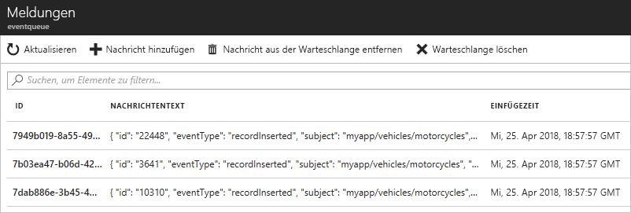

# <a name="route-custom-events-to-azure-queue-storage-with-azure-cli-and-event-grid"></a>Weiterleiten benutzerdefinierter Ereignisse an Azure Queue Storage mit Azure-CLI und Event Grid

Azure Event Grid ist ein Ereignisdienst für die Cloud. Azure Queue Storage ist einer der unterstützten Ereignishandler. In diesem Artikel erstellen Sie mithilfe der Azure-Befehlszeilenschnittstelle ein benutzerdefiniertes Thema, abonnieren dieses Thema und lösen das Ereignis aus, um das Ergebnis anzuzeigen. Sie senden die Ereignisse an die Queue Storage-Instanz.

[!INCLUDE [quickstarts-free-trial-note.md](../../includes/quickstarts-free-trial-note.md)]

[!INCLUDE [event-grid-preview-feature-note.md](../../includes/event-grid-preview-feature-note.md)]

## <a name="create-a-resource-group"></a>Erstellen einer Ressourcengruppe

Event Grid-Themen sind Azure-Ressourcen und müssen in einer Azure-Ressourcengruppe platziert werden. Die Azure-Ressourcengruppe ist eine logische Sammlung, in der Azure-Ressourcen bereitgestellt und verwaltet werden.

Erstellen Sie mit dem Befehl [az group create](/cli/azure/group#az_group_create) eine Ressourcengruppe. 

Das folgende Beispiel erstellt eine Ressourcengruppe namens *gridResourceGroup* am Standort *westus2*.

```azurecli-interactive
az group create --name gridResourceGroup --location westus2
```

[!INCLUDE [event-grid-register-provider-cli.md](../../includes/event-grid-register-provider-cli.md)]

## <a name="create-a-custom-topic"></a>Erstellen eines benutzerdefinierten Themas

Ein Event Grid-Thema verfügt über einen benutzerdefinierten Endpunkt für die Veröffentlichung Ihrer Ereignisse. Im folgenden Beispiel wird das benutzerdefinierte Thema in Ihrer Ressourcengruppe erstellt. Ersetzen Sie `<topic_name>` durch einen eindeutigen Namen für Ihr Thema. Der Name des Themas muss eindeutig sein, da er durch einen DNS-Eintrag dargestellt wird.

```azurecli-interactive
# if you have not already installed the extension, do it now.
# This extension is required for preview features.
az extension add --name eventgrid

az eventgrid topic create --name <topic_name> -l westus2 -g gridResourceGroup
```

## <a name="create-queue-storage"></a>Erstellen einer Queue Storage-Instanz

Vor dem Abonnieren des Themas erstellen wir zunächst den Endpunkt für die Ereignisnachricht. Sie erstellen eine Queue Storage-Instanz zum Sammeln der Ereignisse.

```azurecli-interactive
storagename="<unique-storage-name>"
queuename="eventqueue"

az storage account create -n $storagename -g gridResourceGroup -l westus2 --sku Standard_LRS
az storage queue create --name $queuename --account-name $storagename
```

## <a name="subscribe-to-a-topic"></a>Abonnieren eines Themas

Sie abonnieren ein Thema, um Event Grid mitzuteilen, welche Ereignisse Sie nachverfolgen möchten. Im folgenden Beispiel wird das von Ihnen erstellte Thema abonniert. Außerdem wird die Ressourcen-ID der Queue Storage-Instanz für den Endpunkt übergeben. Mit Azure CLI übergeben Sie die Warteschlangenspeicher-ID als Endpunkt. Der Endpunkt weist folgendes Format auf:

`/subscriptions/<subscription-id>/resourcegroups/<resource-group-name>/providers/Microsoft.Storage/storageAccounts/<storage-name>/queueservices/default/queues/<queue-name>`

Das folgende Skript ruft die Ressourcen-ID des Speicherkontos für die Warteschlange ab. Es erstellt die ID für die Queue Storage-Instanz und abonniert ein Event Grid-Thema. Es legt den Endpunkttyp auf `storagequeue` fest und verwendet die Queue Storage-ID für den Endpunkt.

```azurecli-interactive
storageid=$(az storage account show --name $storagename --resource-group gridResourceGroup --query id --output tsv)
queueid="$storageid/queueservices/default/queues/$queuename"

az eventgrid event-subscription create \
  --topic-name <topic_name> \
  -g gridResourceGroup \
  --name <event_subscription_name> \
  --endpoint-type storagequeue \
  --endpoint $queueid
```

Wenn Sie die REST-API zum Erstellen des Abonnements verwenden, übergeben Sie die ID des Speicherkontos und den Namen der Warteschlange als separaten Parameter.

```json
"destination": {
  "endpointType": "storagequeue",
  "properties": {
    "queueName":"eventqueue",
    "resourceId": "/subscriptions/<subscription-id>/resourcegroups/<resource-group-name>/providers/Microsoft.Storage/storageAccounts/<storage-name>"
  }
  ...
```

## <a name="send-an-event-to-your-topic"></a>Senden eines Ereignisses an Ihr Thema

Wir lösen nun ein Ereignis aus, um zu sehen, wie Event Grid die Nachricht an Ihren Endpunkt weiterleitet. Zunächst rufen wir die URL und den Schlüssel für das benutzerdefinierte Thema ab. Verwenden Sie auch hier wieder Ihren Themanamen für `<topic_name>`.

```azurecli-interactive
endpoint=$(az eventgrid topic show --name <topic_name> -g gridResourceGroup --query "endpoint" --output tsv)
key=$(az eventgrid topic key list --name <topic_name> -g gridResourceGroup --query "key1" --output tsv)
```

Zur Vereinfachung dieses Artikels verwenden Sie Beispielereignisdaten, die an das Thema gesendet werden können. Üblicherweise werden die Ereignisdaten von einer Anwendung oder einem Azure-Dienst gesendet. CURL ist ein Hilfsprogramm zum Senden von HTTP-Anforderungen. In diesem Artikel wird CURL verwendet, um das Ereignis an das Thema zu senden.  Das folgende Beispiel sendet drei Ereignisse an das Event Grid-Thema:

```azurecli-interactive
for i in 1 2 3
do
   body=$(eval echo "'$(curl https://raw.githubusercontent.com/Azure/azure-docs-json-samples/master/event-grid/customevent.json)'")
   curl -X POST -H "aeg-sas-key: $key" -d "$body" $endpoint
done
```

Navigieren Sie zur Queue Storage-Instanz im Portal, und beachten Sie, dass Event Grid diese drei Ereignisse an die Warteschlange gesendet hat.




## <a name="clean-up-resources"></a>Bereinigen von Ressourcen
Wenn Sie dieses Ereignis weiterverwenden möchten, können Sie die Bereinigung der in diesem Artikel erstellten Ressourcen überspringen. Verwenden Sie andernfalls den folgenden Befehl, um die in diesem Artikel erstellten Ressourcen zu löschen.

```azurecli-interactive
az group delete --name gridResourceGroup
```

## <a name="next-steps"></a>Nächste Schritte

Sie haben gelernt, wie Sie Themen und Ereignisabonnements erstellen. Nun können Sie sich ausführlicher darüber informieren, welche Möglichkeiten Event Grid bietet:

- [An introduction to Azure Event Grid](overview.md) (Einführung in Azure Event Grid)
- [Weiterleiten von Blob Storage-Ereignissen an einen benutzerdefinierten Webendpunkt](../storage/blobs/storage-blob-event-quickstart.md?toc=%2fazure%2fevent-grid%2ftoc.json)
- [Monitor virtual machine changes with Azure Event Grid and Logic Apps](monitor-virtual-machine-changes-event-grid-logic-app.md) (Überwachen von Änderungen an virtuellen Computer mit Azure Event Grid und Logic Apps)
- [Streamen von Big Data in ein Data Warehouse](event-grid-event-hubs-integration.md)
