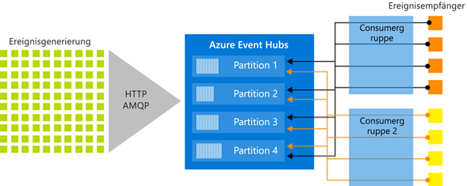

# Azure Event Hubs: Big Data-Streamingplattform und Ereigniserfassungsdienst
Bei Azure Event Hubs handelt es sich um eine Big Data-Streamingplattform und einen Ereigniserfassungsdienst. Mit diesem Dienst können Millionen von Ereignissen pro Sekunde empfangen und verarbeitet werden. An einen Event Hub gesendete Daten können transformiert und mit einem beliebigen Echtzeitanalyse-Anbieter oder Batchverarbeitungs-/Speicheradapter gespeichert werden.

Event Hubs kann beispielsweise in den folgenden Szenarien verwendet werden:

- Anomalieerkennung (Betrug/Ausreißer)
- Anwendungsprotokollierung
- Analyse-Pipelines, z.B. Clickstreams
- Dashboards in Echtzeit
- Archivierung von Daten
- Transaktionsverarbeitung
- Verarbeitung der Benutzertelemetrie
- Streaming der Gerätetelemetrie 

## Vorteile von Event Hubs

Daten sind nur wertvoll, wenn es eine einfache Möglichkeit für die Verarbeitung und das Abrufen frühzeitiger Einblicke von Datenquellen gibt. Event Hubs stellt eine verteilte Verarbeitungsplattform für Datenströme mit kurzer Wartezeit und nahtloser Integration sowie Daten und Analysediensten innerhalb und außerhalb von Azure bereit, um eine vollständige Big Data-Pipeline zu erstellen.

Event Hubs stellt die „Vordertür“ für eine Ereignispipeline dar. Dies wird in Lösungsarchitekturen oft als *Ereignisingestor* bezeichnet. Ein Ereigniserfasser ist eine Komponente oder ein Dienst zwischen Ereignisherausgeber und Ereignisverarbeitung zum Entkoppeln der Erzeugung eines Ereignisdatenstroms von der Verarbeitung dieser Ereignisse. Event Hubs bietet eine einheitliche Streamingplattform mit einem Aufbewahrungspuffer, durch den die Ereignisersteller von den Ereignisconsumern entkoppelt werden. 

In den folgenden Abschnitten werden die wichtigsten Features des Azure Event Hubs-Diensts beschrieben: 

## Vollständig verwaltete PaaS 

Event Hubs ist eine vollständig verwaltete PaaS (Platform-as-a-Service) mit geringfügigem Konfigurations- oder Verwaltungsaufwand, sodass Sie sich auf Ihre Unternehmenslösungen konzentrieren können. [Event Hubs für Apache Kafka-Ökosysteme](event-hubs-for-kafka-ecosystem-overview.md) bietet Ihnen die Funktionen von PaaS-Kafka, ohne dass Sie Cluster verwalten, konfigurieren oder ausführen müssen.

## Unterstützung für Echtzeit- und Batchverarbeitung

Erfassen, puffern, speichern und verarbeiten Sie Ihren Datenstrom in Echtzeit, um verwertbare Einblicke zu erhalten. Event Hubs verwendet ein [partitioniertes Consumermodell](event-hubs-features.md#partitions), sodass mehrere Anwendungen den Datenstrom gleichzeitig verarbeiten und Sie die Verarbeitungsgeschwindigkeit steuern können.

Erfassen Sie Ihre Daten mit [Capture](event-hubs-capture-overview.md) nahezu in Echtzeit in [Azure Blob Storage](https://azure.microsoft.com/services/storage/blobs/) oder [Azure Data Lake Storage](https://azure.microsoft.com/services/data-lake-store/) für die Langzeitaufbewahrung oder die Microbatch-Verarbeitung. Sie können dieses Verhalten für den gleichen Datenstrom erreichen, den Sie zum Ableiten von Echtzeitanalysen verwenden. Das Einrichten der Erfassung von Ereignisdaten geht schnell. Für das Ausführen fallen keine Verwaltungskosten an, und die Skalierung erfolgt automatisch mit den  [Event Hub-Durchsatzeinheiten](event-hubs-features.md#throughput-units). Mit Event Hubs können Sie sich anstelle auf die Datenerfassung auf die Datenverarbeitung konzentrieren.

Azure Event Hubs lässt sich für eine serverlose Architektur auch mit [Azure Functions](/azure/azure-functions/) integrieren.

## Skalierbar 

Mit Event Hubs können Sie mit Datenströmen in Megabytes anfangen und zu Gigabytes oder Terabytes erweitern. Das Feature für die [automatische Vergrößerung](event-hubs-auto-inflate.md) ist eine von vielen verfügbaren Optionen zum Skalieren der Anzahl von Durchsatzeinheiten, um Ihren Nutzungsanforderungen gerecht zu werden. 

## Umfangreiches Ökosystem

Mit [Event Hubs für Apache Kafka-Ökosysteme](event-hubs-for-kafka-ecosystem-overview.md) können [Apache Kafka-Clients und -Anwendungen (1.0 und höher)](https://kafka.apache.org/) mit Event Hubs kommunizieren. Sie müssen keine eigenen Kafka-Cluster einrichten, konfigurieren und verwalten.
 
Mit einem umfassenden Ökosystem in verschiedenen [Sprachen (.NET, Java, Python, Go, Node.js)](https://github.com/Azure/azure-event-hubs) können Sie über Event Hubs problemlos mit der Verarbeitung Ihrer Datenströme beginnen. Mit allen unterstützten Clientsprachen wird tiefgreifende Integration gewährleistet. Das Ökosystem ermöglicht darüber hinaus die nahtlose Integration in Azure-Dienste wie Azure Stream Analytics und Azure Functions und damit die Erstellung serverloser Architekturen.

## Wichtige Komponenten der Architektur
Event Hubs enthält die folgenden [Schlüsselkomponenten](event-hubs-features.md):

- **Ereignisersteller:** Jede Entität, die Daten an einen Event Hub sendet. Ereignisherausgeber können Ereignisse über HTTPS, AMQP 1.0 oder Apache Kafka (1.0 und höher) veröffentlichen.
- **Partitionen:** Jeder Consumer liest nur eine bestimmte Teilmenge oder Partition des Nachrichtendatenstroms.
- **Consumergruppen:** Eine Ansicht (Zustand, Position oder Offset) eines gesamten Event Hubs. Mithilfe von Consumergruppen können verarbeitende Anwendungen jeweils über eine separate Ansicht des Ereignisdatenstroms verfügen. Sie können den Datenstrom unabhängig voneinander im eigenen Tempo und mit eigenen Offsets lesen.
- **Durchsatzeinheiten:** Vorab erworbene Kapazitätseinheiten, die die Durchsatzkapazität von Event Hubs steuern.
- **Ereignisempfänger:** Jede Entität, die Ereignisdaten aus einem Event Hub liest. Alle Event Hubs-Consumer stellen eine Verbindung über die AMQP 1.0-Sitzung her. Der Event Hubs-Dienst stellt Ereignisse über eine Sitzung bereit, sobald diese verfügbar werden. Alle Kafka-Consumer verwenden zur Verbindungsherstellung mindestens das Kafka-Protokoll 1.0.

Die folgende Abbildung zeigt die Datenstromverarbeitungsarchitektur von Event Hubs:

## Nächste Schritte

Lesen Sie zum Einstieg in die Verwendung von Event Hubs die Tutorials zum **Senden und Empfangen von Ereignissen**: 

- [.NET Core](event-hubs-dotnet-standard-getstarted-send.md)
- [.NET Framework](event-hubs-dotnet-framework-getstarted-send.md)
- [Java](event-hubs-java-get-started-send.md)
- [Python](event-hubs-python-get-started-send.md)
- [Node.js](event-hubs-node-get-started-send.md)
- [Go](event-hubs-go-get-started-send.md)
- [C (nur senden)](event-hubs-c-getstarted-send.md)
- [Apache Storm (nur empfangen)](event-hubs-storm-getstarted-receive.md)

Weitere Informationen zu Event Hubs finden Sie in den folgenden Artikeln:

- [Event Hubs-Features im Überblick](event-hubs-features.md)
- [Häufig gestellte Fragen zu Event Hubs](event-hubs-faq.md)

