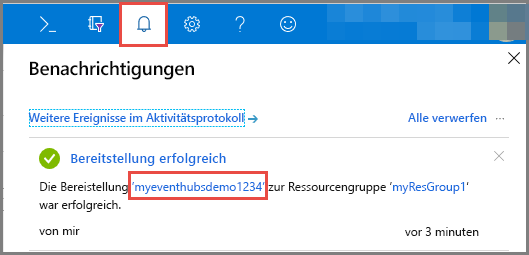
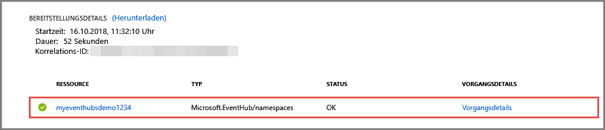

# Schnellstart: Erstellen eines Event Hubs mithilfe des Azure-Portals
Azure Event Hubs ist eine Big Data-Streamingplattform und ein Ereigniserfassungsdienst, der pro Sekunde Millionen von Ereignissen empfangen und verarbeiten kann. Event Hubs kann Ereignisse, Daten oder Telemetriedaten, die von verteilter Software und verteilten Geräten erzeugt wurden, verarbeiten und speichern. An einen Event Hub gesendete Daten können transformiert und mit einem beliebigen Echtzeitanalyse-Anbieter oder Batchverarbeitungs-/Speicheradapter gespeichert werden. Eine ausführliche Übersicht über Event Hubs finden Sie unter [Was ist Azure Event Hubs?](event-hubs-about.md) und [Event Hubs-Features im Überblick](event-hubs-features.md).

In dieser Schnellstartanleitung erstellen Sie einen Event Hub mit dem [Azure-Portal](https://portal.azure.com).

## Voraussetzungen

Stellen Sie für diese Schnellstartanleitung sicher, dass Sie über Folgendes verfügen:

- Azure-Abonnement. Falls Sie kein Abonnement besitzen, können Sie ein [kostenloses Konto erstellen](https://azure.microsoft.com/free/), bevor Sie beginnen.
- [Visual Studio 2017 Update 3 (Version 15.3, 26730.01)](https://www.visualstudio.com/vs) oder höher
- [.NET Standard SDK](https://www.microsoft.com/net/download/windows), Version 2.0 oder höher.

## Erstellen einer Ressourcengruppe

Eine Ressourcengruppe ist eine logische Sammlung mit Azure-Ressourcen. Alle Ressourcen werden in einer Ressourcengruppe bereitgestellt und verwaltet. Gehen Sie wie folgt vor, um eine Ressourcengruppe zu erstellen:

1. Melden Sie sich beim [Azure-Portal](https://portal.azure.com) an.
2. Klicken Sie im linken Navigationsbereich auf **Ressourcengruppen**. Klicken Sie anschließend auf **Hinzufügen**.

   

2. Geben Sie einen eindeutigen Namen für die Ressourcengruppe ein. Das System überprüft sofort, ob der Name im derzeit ausgewählten Azure-Abonnement verfügbar ist.

3. Klicken Sie unter **Abonnement** auf den Namen des Azure-Abonnements, in dem Sie die Ressourcengruppe erstellen möchten.

4. Wählen Sie einen geografischen Standort für die Ressourcengruppe aus.

5. Klicken Sie auf **Create**.

   

## Erstellen eines Event Hubs-Namespace

Ein Event Hubs-Namespace stellt einen eindeutigen Bereichscontainer bereit, auf den über den vollqualifizierten Domänennamen verwiesen wird und in dem Sie mindestens einen Event Hub erstellen. Führen Sie die folgenden Schritte aus, um mit dem Portal einen Namespace in Ihrer Ressourcengruppe zu erstellen:

1. Klicken Sie im Azure-Portal oben links auf **Ressource erstellen**.

2. Klicken Sie auf **Internet der Dinge**, und klicken Sie dann auf **Event Hubs**.

3. Geben Sie unter **Namespace erstellen** einen Namen für den Namespace ein. Das System überprüft sofort, ob dieser Name verfügbar ist.

   

4. Ist der Name verfügbar, wählen Sie den Tarif („Basic“ oder „Standard“) aus. Wählen Sie außerdem ein Azure-Abonnement, eine Ressourcengruppe und einen Standort, an dem die Ressource erstellt werden soll.
 
5. Klicken Sie auf **Erstellen** , um den Namespace zu erstellen. Möglicherweise müssen Sie ein paar Minuten warten, bis das System die Ressourcen vollständig bereitgestellt hat.
6. Wählen Sie **Warnungen** und dann die **Bereitstellung** mit dem gleichen Namen der Event Hub-Namespace aus. 

   
6. Wählen Sie Ihren Event Hub-Namespace aus der Liste der in der Bereitstellung erstellten Ressourcen aus. 

   
7. Wählen Sie auf der Seite **Event Hubs-Namespace** die Option **SAS-Richtlinien** aus, und klicken Sie dann auf **RootManageSharedAccessKey**.
    
8. Klicken Sie auf die Kopierschaltfläche, um die Verbindungszeichenfolge **RootManageSharedAccessKey** in die Zwischenablage zu kopieren. Speichern Sie diese Verbindungszeichenfolge zur späteren Verwendung in einem temporären Speicherort, z.B. in Editor.
    
## Erstellen eines Ereignis-Hubs

Führen Sie die folgenden Schritte aus, um im Namespace einen Event Hub zu erstellen:

1. Klicken Sie auf der Seite „Event Hubs-Namespaces“ auf **Event Hubs**.
   
    

1. Klicken Sie oben im Fenster auf **+ Event Hub**.
   
    
1. Geben Sie einen Namen für den Event Hub ein, und klicken Sie auf **Erstellen**.
   
    

Glückwunsch! Sie haben das Portal verwendet, um einen Event Hubs-Namespace und einen darin enthaltenen Event Hub zu erstellen. 

## Nächste Schritte

In diesem Artikel haben Sie eine Ressourcengruppe, einen Event Hubs-Namespace und einen Event Hub erstellt. Schritt-für-Schritt-Anleitungen zum Senden von Ereignissen an oder Empfangen von Ereignissen von einem Event Hub finden Sie in den folgenden Tutorials:  

- **Senden von Ereignissen an einen Event Hub**: [.NET Standard](event-hubs-dotnet-standard-getstarted-send.md), [.NET Framework](event-hubs-dotnet-framework-getstarted-send.md), [Java](event-hubs-java-get-started-send.md), [Python](event-hubs-python-get-started-send.md), [Node.js](event-hubs-node-get-started-send.md), [Go](event-hubs-go-get-started-send.md), [C](event-hubs-c-getstarted-send.md)
- **Empfangen von Ereignissen von einem Event Hub**: [.NET Standard](event-hubs-dotnet-standard-getstarted-receive-eph.md), [.NET Framework](event-hubs-dotnet-framework-getstarted-receive-eph.md), [Java](event-hubs-java-get-started-receive-eph.md), [Python](event-hubs-python-get-started-receive.md), [Node.js](event-hubs-node-get-started-receive.md), [Go](event-hubs-go-get-started-receive-eph.md), [Apache Storm](event-hubs-storm-getstarted-receive.md)

[Azure portal]: https://portal.azure.com/
[3]: ./media/event-hubs-quickstart-portal/sender1.png
[4]: ./media/event-hubs-quickstart-portal/receiver1.png
