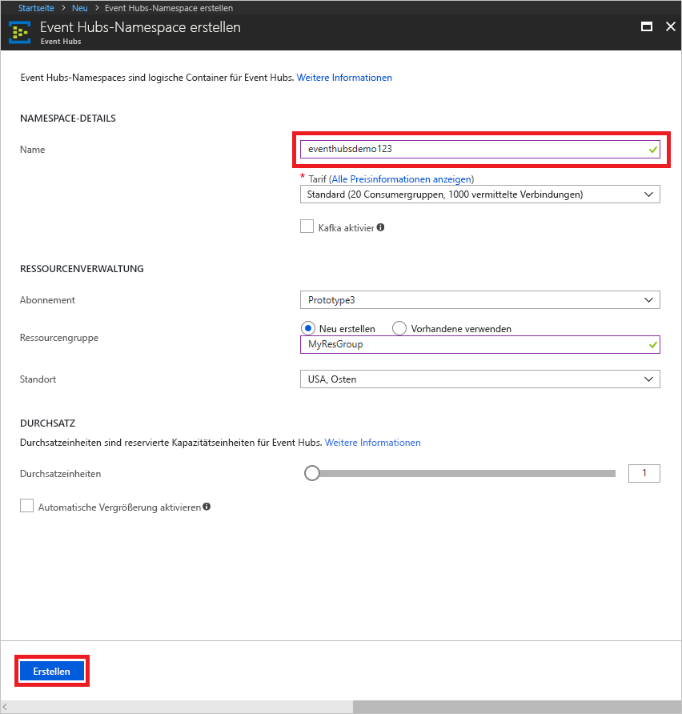

# Erstellen eines Event Hubs-Namespace und eines Event Hubs mithilfe des Azure-Portals

## Erstellen eines Event Hubs-Namespace
1. Melden Sie sich beim [Azure-Portal][Azure portal] an, und klicken Sie links oben auf dem Bildschirm auf **Ressource erstellen**.
1. Klicken Sie auf **Internet der Dinge**, und klicken Sie dann auf **Event Hubs**.
   
    
1. Geben Sie unter **Namespace erstellen** einen Namen für den Namespace ein. Das System überprüft sofort, ob dieser Name verfügbar ist.
   
    
1. Ist der Name verfügbar, wählen Sie den Tarif („Basic“ oder „Standard“) aus. Wählen Sie außerdem ein Azure-Abonnement, eine Ressourcengruppe und einen Standort, an dem die Ressource erstellt werden soll. 
1. Klicken Sie auf **Erstellen** , um den Namespace zu erstellen. Möglicherweise müssen Sie ein paar Minuten warten, bis das System die Ressourcen vollständig bereitgestellt hat.
2. Klicken Sie in der Portalliste mit den Namespaces auf den neu erstellten Namespace.
2. Klicken Sie auf **SAS-Richtlinien** und dann auf **RootManageSharedAccessKey**.
    
    

3. Klicken Sie auf die Kopierschaltfläche, um die Verbindungszeichenfolge **RootManageSharedAccessKey** in die Zwischenablage zu kopieren. Speichern Sie diese Verbindungszeichenfolge zur späteren Verwendung in einem temporären Speicherort, z.B. in Editor.
    
    

## Erstellen eines Ereignis-Hubs

1. Klicken Sie in der Liste der Event Hubs-Namespaces auf den neu erstellten Namespace.      
   
     

2. Klicken Sie auf dem Blatt mit den Namespaces auf **Event Hubs**.
   
    

1. Klicken Sie oben auf dem Blatt auf **Event Hub hinzufügen**.
   
    
1. Geben Sie einen Namen für den Event Hub ein, und klicken Sie auf **Erstellen**.
   
    

Ihr Event Hub wird jetzt erstellt, und Sie verfügen über die zum Senden und Empfangen von Ereignissen erforderlichen Verbindungszeichenfolgen.

## Nächste Schritte
Weitere Informationen zu Event Hubs finden Sie unter diesen Links:

* [Übersicht über Event Hubs](event-hubs-what-is-event-hubs.md)
* [Übersicht über die Event Hubs-API](event-hubs-api-overview.md)

[Azure portal]: https://portal.azure.com/