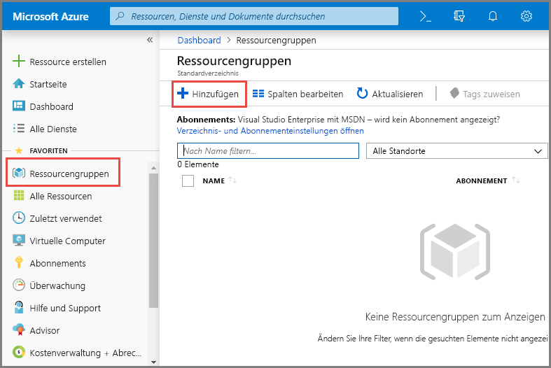
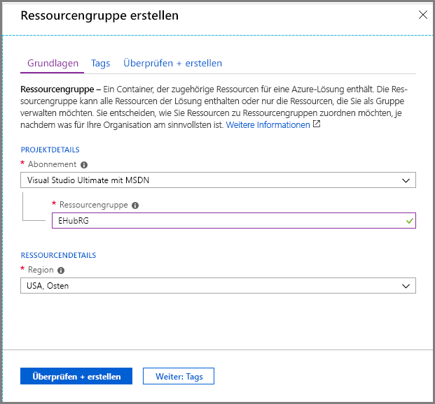
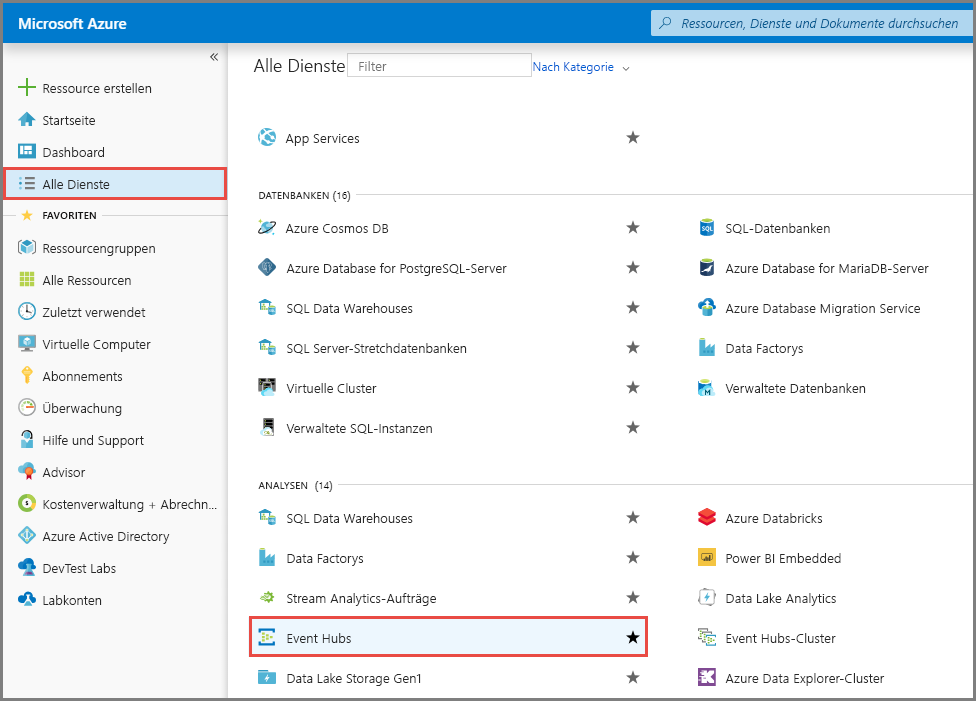
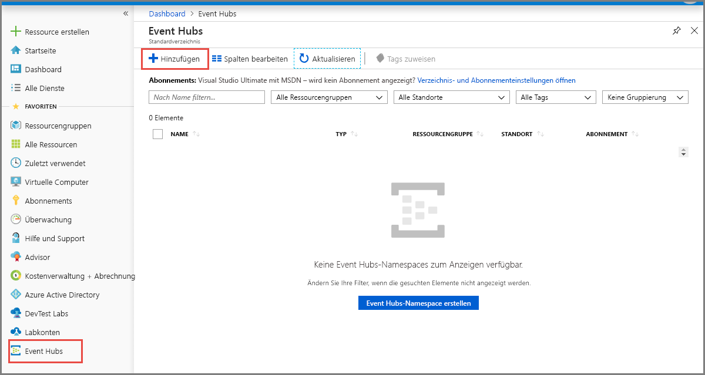
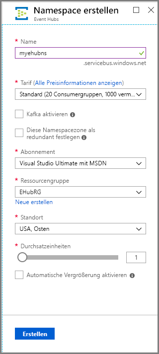
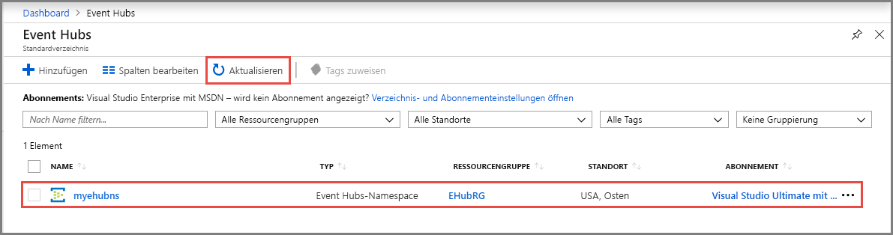
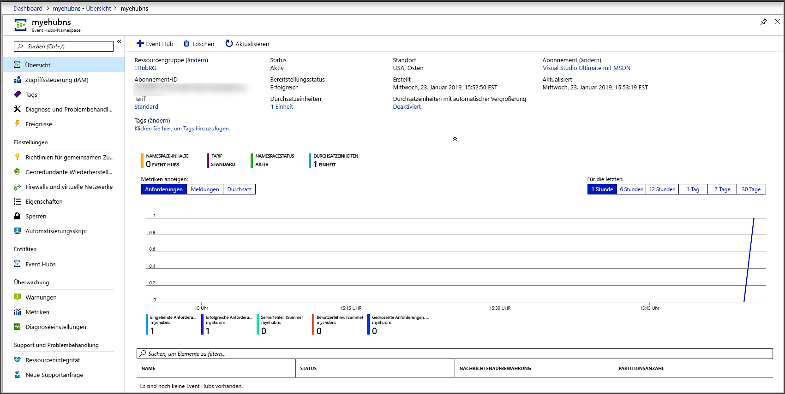
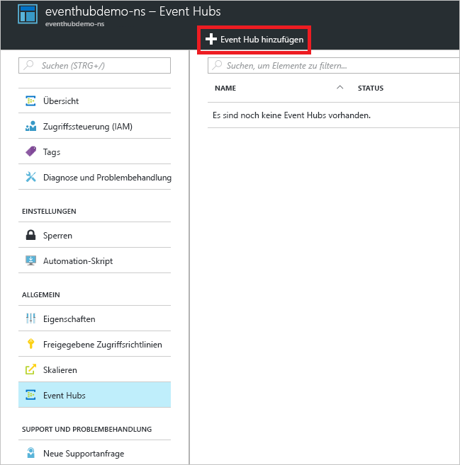
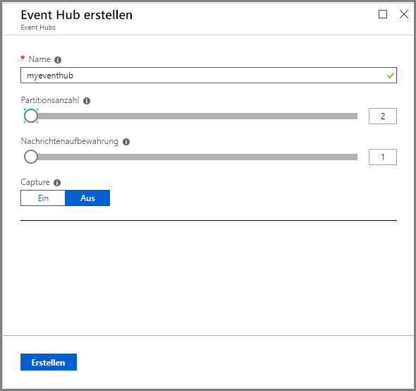
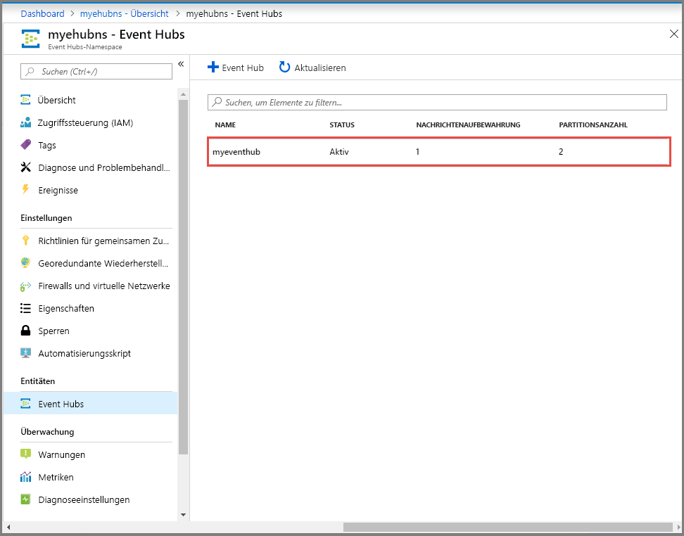

# Schnellstart: Erstellen eines Event Hubs mithilfe des Azure-Portals
Azure Event Hubs ist eine Big Data-Streamingplattform und ein Ereigniserfassungsdienst, der pro Sekunde Millionen von Ereignissen empfangen und verarbeiten kann. Event Hubs kann Ereignisse, Daten oder Telemetriedaten, die von verteilter Software und verteilten Geräten erzeugt wurden, verarbeiten und speichern. An einen Event Hub gesendete Daten können transformiert und mit einem beliebigen Echtzeitanalyse-Anbieter oder Batchverarbeitungs-/Speicheradapter gespeichert werden. Eine ausführliche Übersicht über Event Hubs finden Sie unter [Was ist Azure Event Hubs?](event-hubs-about.md) und [Event Hubs-Features im Überblick](event-hubs-features.md).

In dieser Schnellstartanleitung erstellen Sie einen Event Hub mit dem [Azure-Portal](https://portal.azure.com).

## Voraussetzungen

Stellen Sie für diese Schnellstartanleitung sicher, dass Sie über Folgendes verfügen:

- Azure-Abonnement. Falls Sie kein Abonnement besitzen, können Sie ein [kostenloses Konto erstellen](https://azure.microsoft.com/free/), bevor Sie beginnen.
- [Visual Studio 2019](https://www.visualstudio.com/vs) oder höher.
- [.NET Standard SDK](https://www.microsoft.com/net/download/windows), Version 2.0 oder höher.

## Erstellen einer Ressourcengruppe

Eine Ressourcengruppe ist eine logische Sammlung mit Azure-Ressourcen. Alle Ressourcen werden in einer Ressourcengruppe bereitgestellt und verwaltet. So erstellen Sie eine Ressourcengruppe:

1. Melden Sie sich beim [Azure-Portal](https://portal.azure.com) an.
2. Klicken Sie im linken Navigationsbereich auf **Ressourcengruppen**. Klicken Sie anschließend auf **Hinzufügen**.

   

2. Wählen Sie unter **Abonnement** den Namen des Azure-Abonnements aus, in dem Sie die Ressourcengruppe erstellen möchten.
3. Geben Sie einen eindeutigen **Namen für die Ressourcengruppe** ein. Das System überprüft sofort, ob der Name im derzeit ausgewählten Azure-Abonnement verfügbar ist.
4. Wählen Sie eine **Region** für die Ressourcengruppe aus.
5. Klicken Sie auf **Überprüfen + erstellen**.

   
6. Wählen Sie auf der Seite **Bewerten + erstellen** die Option **Erstellen**. 

## Erstellen eines Event Hubs-Namespace

Ein Event Hubs-Namespace stellt einen eindeutigen Bereichscontainer bereit, auf den über den vollqualifizierten Domänennamen verwiesen wird und in dem Sie mindestens einen Event Hub erstellen. Führen Sie die folgenden Schritte aus, um mit dem Portal einen Namespace in Ihrer Ressourcengruppe zu erstellen:

1. Klicken Sie im Azure-Portal oben links auf **Ressource erstellen**.
2. Wählen Sie im linken Menü **Alle Dienste** aus. Wählen Sie dann in der Kategorie **Analyse** neben **Event Hubs** den **Stern (`*`)** aus. Überprüfen Sie, ob **Event Hubs** im linken Navigationsmenü zu **FAVORITEN** hinzugefügt wurde. 
    
   
3. Wählen Sie im linken Navigationsmenü unter **FAVORITEN** die Option **Event Hubs**. Wählen Sie anschließend auf der Symbolleiste die Option **Hinzufügen** aus.

   
4. Gehen Sie auf der Seite **Namespace erstellen** wie folgt vor:
    1. Geben Sie einen Namen für den Namespace ein. Das System überprüft sofort, ob dieser Name verfügbar ist.
    2. Wählen Sie den Tarif (Basic oder Standard) aus.
    3. Wählen Sie das **Abonnement** aus, in dem Sie den Namespace erstellen möchten.
    4. Wählen Sie einen **Standort** für den Namespace aus.
    5. Klicken Sie auf **Erstellen**. Möglicherweise müssen Sie ein paar Minuten warten, bis das System die Ressourcen vollständig bereitgestellt hat.

       
5. Aktualisieren Sie die Seite **Event Hubs**, damit der Event Hub-Namespace angezeigt wird. Sie können den Status der Event Hub-Erstellung in den Warnungen überprüfen. 

    
6. Wählen Sie den Namespace aus. Die Startseite für Ihren **Event Hubs-Namespace** wird im Portal angezeigt. 

   
    
## Erstellen eines Ereignis-Hubs

Führen Sie die folgenden Schritte aus, um im Namespace einen Event Hub zu erstellen:

1. Wählen Sie auf der Seite „Event Hubs-Namespace“ im linken Menü **Event Hubs** aus.
1. Klicken Sie oben im Fenster auf **+ Event Hub**.
   
    
1. Geben Sie einen Namen für den Event Hub ein, und klicken Sie auf **Erstellen**.
   
    
4. Sie können den Status der Event Hub-Erstellung in den Warnungen überprüfen. Nachdem der Event Hub erstellt wurde, wird er in der Liste der Event Hubs angezeigt, wie in der folgenden Abbildung dargestellt:

    

Glückwunsch! Sie haben das Portal verwendet, um einen Event Hubs-Namespace und einen darin enthaltenen Event Hub zu erstellen. 

## Nächste Schritte

In diesem Artikel haben Sie eine Ressourcengruppe, einen Event Hubs-Namespace und einen Event Hub erstellt. Schritt-für-Schritt-Anleitungen zum Senden von Ereignissen an einen Event Hub oder Empfangen von Ereignissen von einem Event Hub finden Sie in den Tutorials zum **Senden und Empfangen von Ereignissen**: 

- [.NET Core](event-hubs-dotnet-standard-getstarted-send.md)
- [.NET Framework](event-hubs-dotnet-framework-getstarted-send.md)
- [Java](event-hubs-java-get-started-send.md)
- [Python](event-hubs-python-get-started-send.md)
- [Node.js](event-hubs-node-get-started-send.md)
- [Go](event-hubs-go-get-started-send.md)
- [C (nur senden)](event-hubs-c-getstarted-send.md)
- [Apache Storm (nur empfangen)](event-hubs-storm-getstarted-receive.md)

[Azure portal]: https://portal.azure.com/
[3]: ./media/event-hubs-quickstart-portal/sender1.png
[4]: ./media/event-hubs-quickstart-portal/receiver1.png
