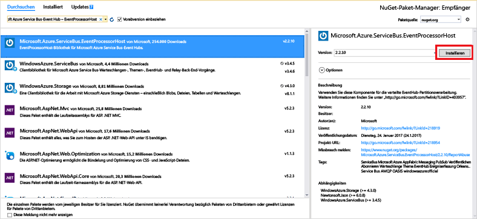

# <a name="receive-events-from-azure-event-hubs-using-the-net-framework"></a>Empfangen von Ereignissen von Azure Event Hubs mithilfe von .NET Framework

## <a name="introduction"></a>Einführung

Event Hubs ist ein Dienst, der große Mengen von Ereignisdaten (Telemetriedaten) von verbundenen Geräten und Anwendungen verarbeiten kann. Nach dem Sammeln von Daten auf Ereignis-Hubs können die Daten mithilfe eines Speicherclusters gespeichert oder mit einem Echtzeitanalyse-Anbieter transformiert werden. Diese umfangreiche Ereignissammlung und -verarbeitung ist eine wichtige Komponente moderner Anwendungsarchitekturen. Hierzu zählt auch das Internet der Dinge (Internet of Things, IoT). Eine ausführliche Übersicht über Event Hubs finden Sie unter [Was ist Azure Event Hubs?](event-hubs-about.md) und [Event Hubs-Features im Überblick](event-hubs-features.md).

In diesem Tutorial lernen Sie, eine .NET Framework-Konsolenanwendung zum Empfangen von Nachrichten von einem Event Hub mithilfe des [Ereignisprozessorhosts](event-hubs-event-processor-host.md) zu schreiben. Der [Ereignisprozessorhost](event-hubs-event-processor-host.md) ist eine .NET-Klasse, die das Empfangen von Ereignissen von Event Hubs durch die Verwaltung von permanenten Prüfpunkten und parallelen Empfangsvorgängen von diesen Event Hubs vereinfacht. Mit dem Ereignisprozessorhost können Sie Ereignisse selbst dann auf mehrere Empfänger aufteilen, wenn sie in verschiedenen Knoten gehostet werden. Dieses Beispiel zeigt, wie der Ereignisprozessorhost für einen einzelnen Empfänger verwendet wird. Das Beispiel [Skalieren der Ereignisverarbeitung][Scale out Event Processing with Event Hubs] veranschaulicht, wie der Ereignisprozessorhost mit mehreren Empfängern verwendet wird.

## <a name="prerequisites"></a>Voraussetzungen

Zum Durchführen dieses Tutorials benötigen Sie Folgendes:

* [Microsoft Visual Studio 2017 oder höher](https://visualstudio.com)

## <a name="create-an-event-hubs-namespace-and-an-event-hub"></a>Erstellen eines Event Hubs-Namespace und eines Event Hubs
Verwenden Sie zunächst das [Azure-Portal](https://portal.azure.com), um einen Namespace vom Typ „Event Hubs“ zu erstellen, und beschaffen Sie die Verwaltungsanmeldeinformationen, die Ihre Anwendung für die Kommunikation mit dem Event Hub benötigt. Folgen Sie dem Ablauf in [diesem Artikel](event-hubs-create.md), um einen Namespace und einen Event Hub zu erstellen, und fahren Sie dann mit den folgenden Schritten in diesem Tutorial fort.

[!INCLUDE [event-hubs-create-storage](../../includes/event-hubs-create-storage.md)]

## <a name="create-a-console-application"></a>Erstellen einer Konsolenanwendung

Erstellen Sie in Visual Studio mithilfe der Projektvorlage **Konsolenanwendung** ein neues Visual C#-Desktopanwendungsprojekt. Geben Sie dem Projekt den Namen **Receiver**.
   


## <a name="add-the-event-hubs-nuget-package"></a>Hinzufügen des Event Hubs-NuGet-Pakets

1. Klicken Sie im Projektmappen-Explorer mit der rechten Maustaste auf das **Receiver**-Projekt, und klicken Sie dann auf **NuGet-Pakete für Projektmappe verwalten**.
2. Klicken Sie auf die Registerkarte **Durchsuchen**, und suchen Sie nach `Microsoft Azure Service Bus Event Hub - EventProcessorHost`. Klicken Sie auf **Installieren**, und akzeptieren Sie die Nutzungsbedingungen.
   
    
   
    Visual Studio lädt das NuGet-Paket [Azure Service Bus Event Hub – EventProcessorHost](https://www.nuget.org/packages/Microsoft.Azure.ServiceBus.EventProcessorHost)mit allen Abhängigkeiten herunter, installiert es und fügt dem Projekt einen Verweis auf das Paket hinzu.

## <a name="implement-the-ieventprocessor-interface"></a>Implementieren der IEventProcessor-Schnittstelle

1. Klicken Sie mit der rechten Maustaste auf das Projekt **Receiver**, klicken Sie auf **Hinzufügen** und dann auf **Klasse**. Geben Sie der neuen Klasse den Namen **SimpleEventProcessor**, und klicken Sie auf **Hinzufügen**, um die Klasse zu erstellen.
   
    
2. Fügen Sie die folgenden Anweisungen am Anfang der Datei "SimpleEventProcessor.cs" hinzu:
    
      ```csharp
      using Microsoft.ServiceBus.Messaging;
      using System.Diagnostics;
      ```
    
3. Ersetzen Sie den Text der Klasse durch folgenden Code:
    
      ```csharp
      class SimpleEventProcessor : IEventProcessor
      {
        Stopwatch checkpointStopWatch;
        
        async Task IEventProcessor.CloseAsync(PartitionContext context, CloseReason reason)
        {
            Console.WriteLine("Processor Shutting Down. Partition '{0}', Reason: '{1}'.", context.Lease.PartitionId, reason);
            if (reason == CloseReason.Shutdown)
            {
                await context.CheckpointAsync();
            }
        }
        
        Task IEventProcessor.OpenAsync(PartitionContext context)
        {
            Console.WriteLine("SimpleEventProcessor initialized.  Partition: '{0}', Offset: '{1}'", context.Lease.PartitionId, context.Lease.Offset);
            this.checkpointStopWatch = new Stopwatch();
            this.checkpointStopWatch.Start();
            return Task.FromResult<object>(null);
        }
        
        async Task IEventProcessor.ProcessEventsAsync(PartitionContext context, IEnumerable<EventData> messages)
        {
            foreach (EventData eventData in messages)
            {
                string data = Encoding.UTF8.GetString(eventData.GetBytes());
        
                Console.WriteLine(string.Format("Message received.  Partition: '{0}', Data: '{1}'",
                    context.Lease.PartitionId, data));
            }
        
            //Call checkpoint every 5 minutes, so that worker can resume processing from 5 minutes back if it restarts.
            if (this.checkpointStopWatch.Elapsed > TimeSpan.FromMinutes(5))
            {
                await context.CheckpointAsync();
                this.checkpointStopWatch.Restart();
            }
        }
      }
      ```
    
      Diese Klasse wird von **EventProcessorHost** zur Verarbeitung der vom Event Hub empfangenen Ereignisse aufgerufen. Die `SimpleEventProcessor`-Klasse verwendet eine Stoppuhr, um in regelmäßigen Abständen die „checkpoint“-Methode für den **EventProcessorHost**-Kontext aufzurufen. Dadurch wird sichergestellt, dass der Empfänger bei einem Neustart maximal nur die Daten verlieren kann, die in den letzten fünf Minuten verarbeitet wurden.

## <a name="update-the-main-method-to-use-simpleeventprocessor"></a>Aktualisieren der Main-Methode zur Verwendung von „SimpleEventProcessor“

1. Fügen Sie in der **Program**-Klasse die folgende `using`-Anweisungen am Anfang der Datei hinzu:
    
      ```csharp
      using Microsoft.ServiceBus.Messaging;
      ```
    
2. Überschreiben Sie die `Main`-Methode in der `Program`-Klasse mit dem folgenden Code. Ersetzen Sie dabei den Event Hub-Namen und die zuvor gespeicherte Verbindungszeichenfolge auf Namespace-Ebene sowie das Speicherkonto und den Speicherschlüssel, die Sie in den vorherigen Abschnitten kopiert haben. 
    
      ```csharp
      static void Main(string[] args)
      {
        string eventHubConnectionString = "{Event Hubs namespace connection string}";
        string eventHubName = "{Event Hub name}";
        string storageAccountName = "{storage account name}";
        string storageAccountKey = "{storage account key}";
        string storageConnectionString = string.Format("DefaultEndpointsProtocol=https;AccountName={0};AccountKey={1}", storageAccountName, storageAccountKey);
        
        string eventProcessorHostName = Guid.NewGuid().ToString();
        EventProcessorHost eventProcessorHost = new EventProcessorHost(eventProcessorHostName, eventHubName, EventHubConsumerGroup.DefaultGroupName, eventHubConnectionString, storageConnectionString);
        Console.WriteLine("Registering EventProcessor...");
        var options = new EventProcessorOptions();
        options.ExceptionReceived += (sender, e) => { Console.WriteLine(e.Exception); };
        eventProcessorHost.RegisterEventProcessorAsync<SimpleEventProcessor>(options).Wait();
        
        Console.WriteLine("Receiving. Press enter key to stop worker.");
        Console.ReadLine();
        eventProcessorHost.UnregisterEventProcessorAsync().Wait();
      }
      ```
    
3. Führen Sie das Programm aus, und stellen Sie sicher, dass keine Fehler auftreten.
  
Glückwunsch! Soeben haben Sie mithilfe eines Ereignisprozessorhosts Nachrichten von einem Event Hub erhalten.


> [!NOTE]
> In diesem Tutorial wird eine einzelne Instanz von [EventProcessorHost](event-hubs-event-processor-host.md)verwendet. Zur Erhöhung des Durchsatzes empfiehlt es sich, mehrere Instanzen von [EventProcessorHost](event-hubs-event-processor-host.md) auszuführen, wie im Beispiel zum [horizontalen Hochskalieren der Ereignisverarbeitung](https://code.msdn.microsoft.com/Service-Bus-Event-Hub-45f43fc3) gezeigt. In diesen Fällen koordinieren sich die verschiedenen Instanzen automatisch untereinander, um die Last der empfangenen Ereignisse ausgeglichen zu verteilen. 

## <a name="next-steps"></a>Nächste Schritte
In dieser Schnellstartanleitung haben Sie eine .NET Framework-Anwendung erstellt, die Nachrichten von einem Event Hub empfangen hat. Informationen dazu, wie Sie Ereignisse unter Verwendung von .NET Framework an einen Event Hub senden, finden Sie unter [Erste Schritte beim Senden von Nachrichten an Azure Event Hubs in .NET Framework](event-hubs-dotnet-framework-getstarted-send.md).

<!-- Images. -->
[19]: ./media/event-hubs-csharp-ephcs-getstarted/create-eh-proj1.png
[20]: ./media/event-hubs-csharp-ephcs-getstarted/create-eh-proj2.png
[21]: ./media/event-hubs-csharp-ephcs-getstarted/run-csharp-ephcs1.png
[22]: ./media/event-hubs-csharp-ephcs-getstarted/run-csharp-ephcs2.png

<!-- Links -->
[EventProcessorHost]: /dotnet/api/microsoft.servicebus.messaging.eventprocessorhost
[Event Hubs overview]: event-hubs-about.md
[Scale out Event Processing with Event Hubs]: https://code.msdn.microsoft.com/Service-Bus-Event-Hub-45f43fc3
[Event Hubs Programming Guide]: event-hubs-programming-guide.md
[Azure Storage account]:../storage/common/storage-create-storage-account.md
[Event Processor Host]: event-hubs-event-processor-host.md
[Azure portal]: https://portal.azure.com
